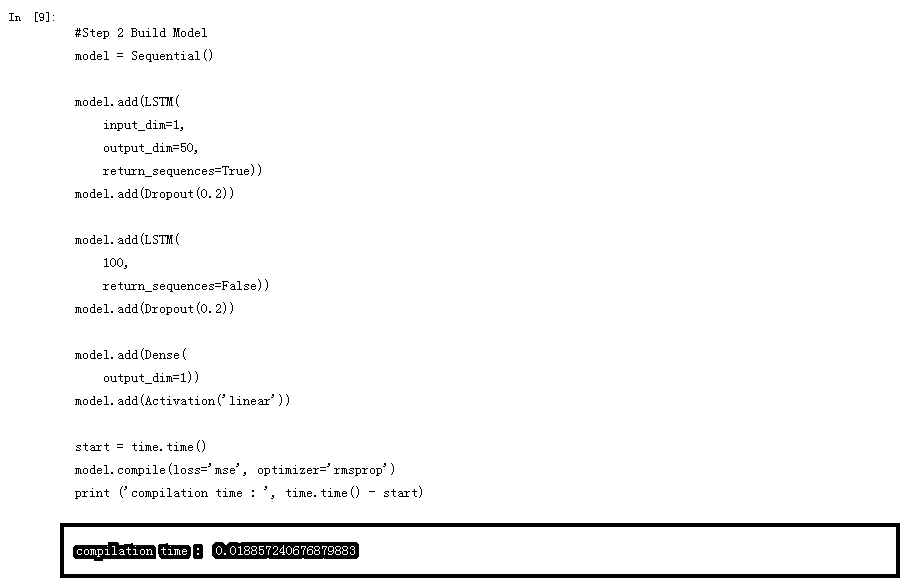
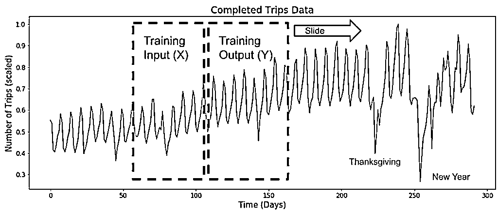
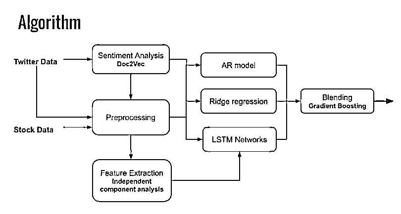
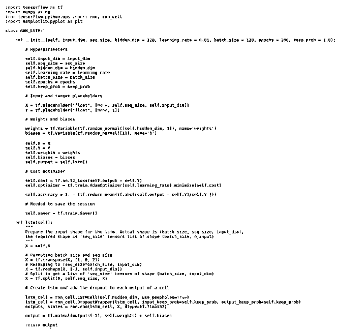
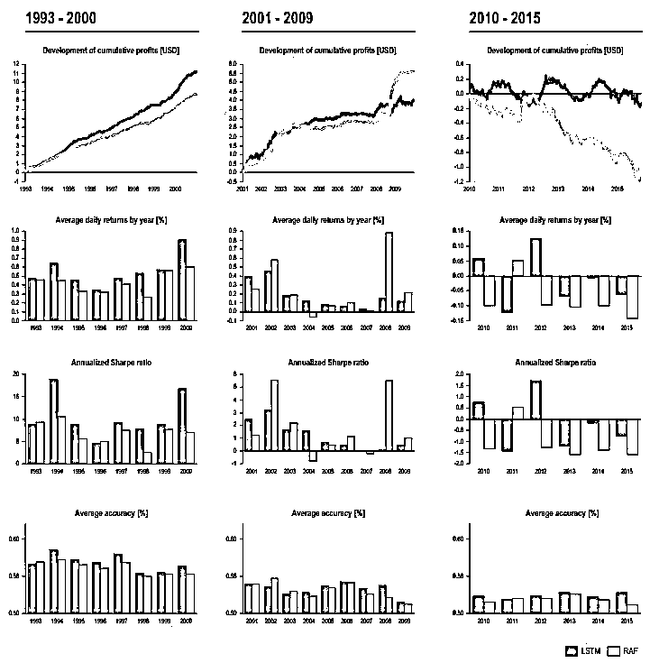
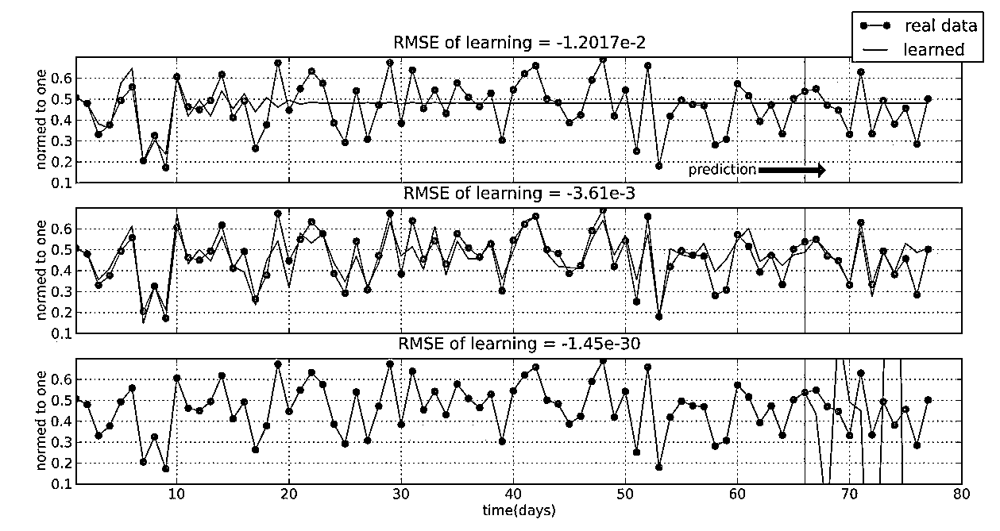
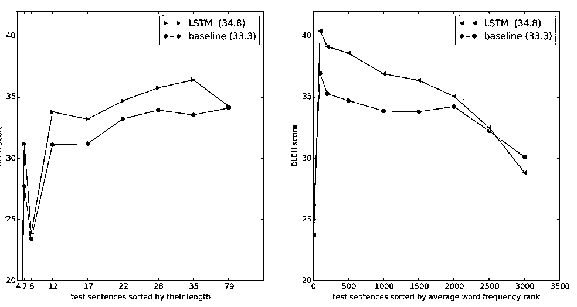

# 【代码+论文】最全 LSTM 在量化交易中的应用汇总（第五期免费赠书活动来啦！）

> 原文：[`mp.weixin.qq.com/s?__biz=MzAxNTc0Mjg0Mg==&mid=2653286702&idx=1&sn=e4416e23c8b5ab7955a258e1077153e3&chksm=802e333bb759ba2dea0b46da08d0d7b6268090033d6af98b2f72b14909e2935c1e7fbe4bec69&scene=27#wechat_redirect`](http://mp.weixin.qq.com/s?__biz=MzAxNTc0Mjg0Mg==&mid=2653286702&idx=1&sn=e4416e23c8b5ab7955a258e1077153e3&chksm=802e333bb759ba2dea0b46da08d0d7b6268090033d6af98b2f72b14909e2935c1e7fbe4bec69&scene=27#wechat_redirect)

**编辑部**

微信公众号

**关键字**全网搜索最新排名

**『量化投资』：排名第一**

**『量       化』：排名第一**

**『机器学习』：排名第三**

我们会再接再厉

成为全网**优质的**金融、技术类公众号

**我们的论坛社区上线啦！**

**https://bbs.mlqi.org**

希望大家多去逛逛，学习交流，共享智慧。这个社区就是为大家解答、学习、交流在量化投资和机器学习方面的一个论坛。

今天，我们继续推出机器学习在量化投资中的应用系列——**LSTM 在量化交易中的应用汇总（代码+论文）**。希望大家可以学习到很多知识。

这些资料是我们花了很长时间整理的。**我们会一直秉承无偿分享的精神**。给大家带来轻松的学习氛围。**努力为中国的量化投资事业贡献一份力量！**

**网站资源**

## Stock Clusters

**https://github.com/vsmolyakov/experiments_with_python/tree/master/chp04**

Identifying stock clusters helps discover similar companies which can be useful for comparable analysis or pairs trading strategy. We can find similar clusters by estimating the inverse covariance (precision) matrix which can be used to construct a graph network of dependencies. The difference between opening and closing daily price was used to compute empirical covariance used to fit graph lasso algorithm to estimate sparse precision matrix. Affinity propagation was used to compute the stock clusters and a linear embedding was used to display high dimensional data in 2D.

## Big Deep Neural Stock Market Prediction | RNN | LSTM | Ajay Jatav

**https://www.youtube.com/watch?v=B87MzddF4Tw**

## Plain Stock Close price Prediction via LSTM

**https://isaacchanghau.github.io/2017/07/26/Plain-Stock-Close-Price-Prediction-via-LSTM-Initial-Exploration/**

This is a practice of using LSTM to do the one day ahead prediction of the stock close price. The dataset I used here is the New York Stock Exchange from Kaggle, which consists of following files:

*   prices.csv: raw, as-is daily prices. Most of data spans from 2010 to the end 2016, for companies new on stock market date range is shorter. There have been approx. 140 stock splits in that time, this set doesn’t account for that.

*   prices-split-adjusted.csv: same as prices, but there have been added adjustments for splits.

*   securities.csv: general description of each company with division on sectors

*   fundamentals.csv: metrics extracted from annual SEC 10K fillings (2012-2016), should be enough to derive most of popular fundamental indicators.

## US Stock Market Prediction by LSTM

**https://github.com/christsaizyt/US-Stock-Market-Prediction-by-LSTM**

In this repo, I would like to share some of my works using LSTM to predict stock prices. LSTM is long-short term memory network. I'm not going to the details on how LSTM works. For this, here is a fantastic article made by Colah, http://colah.github.io/posts/2015-08-Understanding-LSTMs/.

LSTM is a very great choice to handle with time-series data rather than traditional Recurrent Neural Network (RNN). In RNN, there is a so-called gradient vanishing/exploding problem, and the problem comes from updating the weights by only multiplications. To solve the problem, LSTM considers another way to updating the weights not only by multiplications but also by additions.

In my work, I used two ways to do the predictions. One is stateless LSTM model and another one is stateful LSTM model. I'm still working on stateful LSTM model. I will update this part in the future.

## Prediction Stock Volume with LSTM

# **https://sflscientific.com/data-science-blog/2017/2/10/predicting-stock-volume-with-lstm**

Much of the hype surrounding neural networks is about image-based applications. However, Recurrent Neural Networks (RNNs) have been successfully used in recent years to predict future events in time series as well. RNNs have contributed to breakthroughs in a wide variety of fieldscentered around predicting sequences of events. In this piece, however, we'll demonstrate how one type of RNN, the Long Short-Term Memory (LSTM) network, can be used to predict even financial time series data—perhaps the most chaotic and difficult of all time series.

For the sake of illustration, we’ll specifically focus on predicting trends in Coca Cola's stock (KO) volume from this past year (see below). Volume is an important financial metric because changes in volume often precede price changes. As a result, predicting volume can be a useful tool for making informed decisions about stocks.

## Prediction Stock prices with LSTM

# **https://www.kaggle.com/pablocastilla/predict-stock-prices-with-lstm**

based on 

https://github.com/llSourcell/How-to-Predict-Stock-Prices-Easily-Demo 

and

http://machinelearningmastery.com/time-series-prediction-lstm-recurrent-neural-networks-python-keras/

I just want to predict if a stock will rise based on previous information

##  LSTM networks for the prediction stocks prices

# **https://www.linkedin.com/pulse/lstm-networks-prediction-stock-prices-apple-serhii-ovsiienko**

In this article, I want to show you an algorithm for predicting stock prices. This is a simple quick approach, which can be a starting point for a deeper analysis.

## Stock prediction by RNN LSTM 

# **https://github.com/blockchain99/stock-predict-by-RNN-LSTM**

High Frequency Trading Price Prediction using LSTM Recursive Neural Networks.

In this project we try to use recurrent neural network with long short term memory to predict prices in high frequency stock exchange. This program implements such a solution on data from NYSE OpenBook history which allows to recreate the limit order book for any given time. Everything is described in our paper: project.pdf

Project done for course of Computational Intelligence in Business Applications at Warsaw University of Technology - Department of Mathematics and Computer Science Karol Dzitkowski 's result is as follow.(High Frequency Trading Price Prediction using LSTM Recursive Neural Networks, Karol Dzitkowski) RNN avg err = 0 . 5 6 7 3 0 0 7 2 4 6 3 8 epsilon = 0.5, SGD optimizer

## Sequence prediction using recurrent neural networks(LSTM) with TensorFlow

# **http://mourafiq.com/2016/05/15/predicting-sequences-using-rnn-in-tensorflow.html**

This post tries to demonstrates how to approximate a sequence of vectors using a recurrent neural networks, in particular I will be using the LSTM architecture, The complete code used for this post could be found here. Most of the examples I found in the internet apply the LSTM architecture to natural language processing problems, and I couldn’t find an example where this architecture could be used to predict continuous values.

## Engineering extreme event forecasting at uber with RNN

# **https://eng.uber.com/neural-networks/**

At Uber, event forecasting enables us to future-proof our services based on anticipated user demand. The goal is to accurately predict where, when, and how many ride requests Uber will receive at any given time.

Extreme events—peak travel times such as holidays, concerts, inclement weather, and sporting events—only heighten the importance of forecasting for operations planning. Calculating demand time series forecasting during extreme events is a critical component of anomaly detection, optimal resource allocation, and budgeting.

Although extreme event forecasting is a crucial piece of Uber operations, data sparsity makes accurate prediction challenging. Consider New Year’s Eve (NYE), one of the busiest dates for Uber. We only have a handful of NYEs to work with, and each instance might have a different cohort of users. In addition to historical data, extreme event prediction also depends on numerous external factors, including weather, population growth, and marketing changes such as driver incentives.1

A combination of classical time series models, such as those found in the standard R forecast package, and machine learning methods are often used to forecast special events.2,3 These approaches, however, are neither flexible nor scalable enough for Uber.

In this article, we introduce an Uber forecasting model that combines historical data and external factors to more precisely predict extreme events, highlighting its new architecture and how it compares to our previous model.

## Prediction Stock prices with LSTM

# **https://www.kaggle.com/pablocastilla/predict-stock-prices-with-lstm**

## Prediction Stock prices with LSTM

# **https://mapr.com/ebook/microservices-and-containers/?source=top-banner-internal-promo&cid=top-banner-microcontainers-ebook**

Time series analysis has significance in econometrics and financial analytics but can be utilized in any field, where understanding trends is important to decision making and reacting to changes in behavioral patterns. For example, a MapR Converged Data Platform customer, who is a major oil and gas provider, places sensors on wells, sending data to MapR Streams that is then used for trend monitoring well conditions, such as volume and temperature. In finance, time series analytics is used for financial forecasting for stock prices, assets, and commodities. Econometricians have long leveraged “autoregressive integrated moving average” (ARIMA) models to perform univariate forecasts.

ARIMA models have been used for decades and are well understood. However, with the rise of machine learning and, more recently, deep learning, other models are being explored and utilized, either to support ARIMA results or replace them.

Deep learning (DL) is a branch of machine learning based on a set of algorithms that attempts to model high-level abstractions in data by using artificial neural network (ANN) architectures composed of multiple non-linear transformations. One of the more popular DL deep neural networks is the Recurrent Neural Network (RNN). RNNs are a class of neural networks that depend on the sequential nature of their input. Such inputs could be text, speech, time series, and anything else in which the occurrence of an element in the sequence is dependent on the elements that appeared before it. For example, the next word in a sentence, if someone writes “the grocery…” is most likely to be “store” instead of “school.” In this case, given this sequence, an RNN would likely predict store rather than school.

## A Short term machine learning system

# **http://www.financial-hacker.com/build-better-strategies-part-5-developing-a-machine-learning-system/**

It’s time for the 5th and final part of the Build Better Strategies series. In part 3we’ve discussed the development process of a model-based system, and consequently we’ll conclude the series with developing a data-mining system. The principles of data mining and machine learning have been the topic of part 4\. For our short-term trading example we’ll use a deep learning algorithm, a stacked autoencoder, but it will work in the same way with many other machine learning algorithms. With today’s software tools, only about 20 lines of code are needed for a machine learning strategy. I’ll try to explain all steps in detail. 

## Can we predict GBPUSD Flash Crash with GRU$LSTM MODEL

# **https://www.doubledoji.com/can-we-predict-gbpusd-flash-crash-with-gru-lstm-model/**

In this post we are going to construct first a Gated Recurrent Unit (GRU) neural network using Python. Then we will construct a Long Short Term Memory (LSTM) neural network and try to make predictions. We will use GBPUSD daily data. The last observation is the GBPUSD Flash Crash in which GBPUSD fell more than 1000 pips then recovered. We will see if GRU or LSTM can predict GBPUSD Flash Crash just one day before it happened. So we will make predictions and then check if we have good predictions. If we get good predictions and the time to train the GRU or LSTM is fast then we can also build an intraday trading system using a GRU or a LTSM NN. In the past few years extensive research has been done in neural network and deep learning by the big companies like Google, Facebook, Amazon, Apple etc. Join our Million Dollar Trading Challenge today and trade forex with us daily.

## Prediction Stock Returns wirh sentiment analysis and LSTM

# **https://yujingma.com/2016/11/27/predicting-stock-returns-with-sentiment-analysis-and-lstm/**

This project inspired by a recent acquisition activity is Bass Pro to acquire Cabela’s. I would like to look at the revenues and the market share of Cabela’s and one of its competitors, Dick’s Sporting Goods, prior to acquisition and see if there are any features/signals that can be seen in the last few months prior to acquisition. To test this effect with anterior data,  I used both stock market and social media datasets to predict stock returns for Cabela’s and its main competitors. The test RMSE for my model is around 0.019.

## Prediction sequences of vector in Keras using RNN-LSTM

# **http://danielhnyk.cz/predicting-sequences-vectors-keras-using-rnn-lstm/**

This article become quite popular, probably because it's just one of few on the internet (even thought it's getting better). Please read the comments where some readers highlights potential problems of my approach. Furthermore I am afraid I can't help you with your specific cases, since I don't work with LSTM any more. And, to be honest, I don't really feel very confident about my understanding to LSTM to give advices. This is just what worked for me.

My task was to predict sequences of real numbers vectors based on the previous ones. This task is made for RNN. As you can read in my other post Choosing framework for building Neural Networks (mainly RRN - LSTM), I decided to use Keras framework for this job.

**论文资料**

> **A deep learning framework for financial time series using stacked autoencoders and long short term memory**

The application of deep learning approaches to finance has received a great deal of attention from both investors and researchers. This study presents a novel deep learning framework where wavelet transforms (WT), stacked autoencoders (SAEs) and long-short termmemory (LSTM) are combined for stock price forecasting. The SAEs for hierarchicallyextracted deep features is introduced into stock price forecasting for the first time. The deeplearning framework comprises three stages. First, the stock price time series is decomposed by WT to eliminate noise. Second, SAEs is applied to generate deep high-level features forpredicting the stock price. Third, high-level denoising features are fed into LSTM to forecastthe next day’s closing price. Six market indices and their corresponding index futures arechosen to examine the performance of the proposed model. Results show that the proposedmodel outperforms other similar models in both predictive accuracy and profitabilityperformance.

> **A Deep Learning Model to Forecast Financial Time-Series**

> **deep learning for stock prediction using numerical and textual information**

This paper proposes a novel application of deep learning models, Paragraph Vector, and Long Short-Term Memory (LSTM), to financial time series forecasting. Investors
make decisions according to various factors, including consumer price index, price-earnings ratio, and miscellaneous events reported in newspapers. In order to assist their decisions in a timely manner, many automatic ways to analyze those information have been proposed in the last decade. However, many of them used either numerical or textual information, but not both for a single company. In this paper, we propose an approach that converts newspaper articles into their distributed representations via Paragraph Vector and models the temporal effects of past events on opening prices about multiple companies with LSTM. The performance of the proposed approach is demonstrated on real-world data of fifty companies listed on Tokyo Stock Exchange.

> **Deep learning with long short-term memory networks for financial market predictions**

Long short-term memory (LSTM) networks are a state-of-the-art technique for sequence learning. They are less commonly applied to financial time series predictions, yet inherently suitable for this domain. We deploy LSTM networks for predicting out-of-sample directional movements for the constituent stocks of the S&P 500 from 1992 until 2015\. With daily returns of 0.46 percent and a Sharpe Ratio of 5.8 prior to transaction costs, we find LSTM networks to outperform memoryfree classification methods, i.e., a random forest (RAF), a deep neural net (DNN), and a logistic regression classifier (LOG). We unveil sources of profitability, thereby shedding light into the black box of artificial neural networks. Specifically, we find one common pattern among the stocks selected for trading - they exhibit high volatility and a short-term reversal return profile. Leveraging these findings, we are able to formalize a rules-based short-term reversal strategy that is able to explain a portion of the returns of the LSTM.

> **Investigation Into The Effectiveness Of Long Short Term Memory Networks For Stock Price Prediction**

The effectiveness of long short term memory networks trained by backpropagation through time for stock price prediction is explored in this paper. A range of different architecture LSTM networks are constructed trained and tested.

> **Investigation of financial market prediction by recurrent neural network**

Recurrent neural networks as fundamentally different neural network from feed-forward architectures was investigated for modelling of non linear behaviour of financial markets. Recurrent neural networks could be configured with the correct choice of parameters such as the number of neurons, the number of epochs, the amount of data and their relationship with the training data for predictions of financial markets. By exploring of learning and forecasting of the recurrent neural networks is observed the same effect: better learning, which often is described by the root mean square error does not guarantee a better prediction. There are such a recurrent neural networks settings where the best results of non linear time series forecasting could be obtained. New method of orthogonal input data was proposed, which improve process of EVOLINO RNN learning and forecasting

> **On stock return prediction with LSTM networks**

Artificial neural networks are, again, on the rise. The decreasing costs of computing power and the availability of big data together with advancements of neural network theory have made this possible. In this thesis, LSTM (long short-term memory) recurrent neural networks are used in order to perform financial time series forecasting on return data of three stock indices. The indices are S&P 500 in the US, Bovespa 50 in Brazil and OMX 30 in Sweden. The results show that the outputs of the LSTM networks are very similar to those of a conventional time series model, namely an ARMA(1,1)-GJRGARCH(1,1), when a regression approach is taken. However, they outperform the time series model with regards to direction of change classification. The thesis shows significant results for direction of change classification for the small Swedish market,
and insignificant results for the large US market and the emerging Brazilian market. When a trading strategy is implemented based on the direction of change, a deep LSTM network vastly outperforms the time series model.

> **Sequence to Sequence Learning with Neural Networks**

Deep Neural Networks (DNNs) are powerful models that have achieved excellent performance on difficult learning tasks. Although DNNs work well whenever large labeled training sets are available, they cannot be used to map sequences to sequences. In this paper, we present a general end-to-end approach to sequence learning that makes minimal assumptions on the sequence structure. Our method uses a multilayered Long Short-Term Memory (LSTM) to map the input sequence to a vector of a fixed dimensionality, and then another deep LSTM to decode the target sequence from the vector. Our main result is that on an English to French translation task from the WMT-14 dataset, the translations produced by the LSTM achieve a BLEU score of 34.8 on the entire test set, where the LSTM’s BLEU score was penalized on out-of-vocabulary words. Additionally, the LSTM did not have difficulty on long sentences. For comparison, a phrase-based SMT system achieves a BLEU score of 33.3 on the same dataset. When we used the LSTM to rerank the 1000 hypotheses produced by the aforementioned SMT system, its BLEU score increases to 36.5, which is close to the previous state of the art. The LSTM also learned sensible phrase and sentence representations that are sensitive to word order and are relatively invariant to the active and the passive voice. Finally, we found that reversing the order of the words in all source sentences (but not target sentences) improved the LSTM’s performance markedly, because doing so introduced many short term dependencies between the source and the target sentence which made the optimization problem easier.

> **Recurrent neural networks approach to the financial forecast of Google assets**

A huge quantity of learning tasks have to deal with sequential data, where either input or out-put data can have sequential nature. This is the case,e.g., of time series forecasting, speech recognition,video analysis, music generation, etc., since they all require algorithms able to model sequences. Duringrecent years, recurrent neural networks (RNNs) architectures have been successfully used in one as well as for multidimensional sequence learning tasks, quickly constituting the state of the art option for extracting patterns from temporal data. Concerning financial applications, one of
from the most important examples of sequential data analysis problems is related to the forecasting the dynamic in time of structured financial products. To this end, we compare
different RNNs architectures. In particular we consider the basic multi-layer RNN, long-short term memory (LSTM) and gated recurrent unit (GRU) performances on forecasting
Google stock price movements. The latter will be done on different time horizons, mainly to explain associated hidden dynamics. In particular, we show that our approach allows to deal with long sequences, as in the case of LSTM. Moreover the obtained performances turn out to be of high level even on different time horizons. Indeed, we are able to obtain up to 72% of accuracy

> **STOCK MARKET FORECASTING USING RECURRENT NEURAL NETWORK**

In this research, we study the problem of stock market forecasting using Recurrent Neural Network(RNN) with Long Short-Term Memory (LSTM). The purpose of this research is to examine the feasibility and performance of LSTM in stock market forecasting. We optimize the LSTM model by testing different configurations, i.e., the number of neurons in hidden layers and number of samples in sequence. Instead of using daily stock price data, we collect hourly stock data from the IQFEED database in order to train our model with relatively low noise samples. Nevertheless, based on the prediction results of LSTM model, we build up a stock database with six U.S market stocks from five different industries. The average test accuracy of these six stocks is 54.83%, where the highest accuracy is at 59.5% while the lowest is at 49.75%. We then develop a trade simulator to evaluate the performance of our model by investing the portfolio within a period of 400 hours, the total profit gained by the model is $413,233.33 with $6,000,000 initial investment

> **Using Artificial Neural Networks and Sentiment Analysis to Predict Upward Movements in Stock Price**

For this project, we explored the use of text mining, clustering, and machine learning models to develop a system that combines technical and sentiment analysis to determine the movement of a stock. The final result of our project is a system comprised of a novel sentiment analysis used as input for the larger recurrent neural networks, each trained on a cluster of stocks from the S&P 100\. Experimental results show that our system can predict upward movements in stock price over a 65-minute period with up to 77% accuracy for a specific cluster compared to 52% of randomly guessing for the same cluster.

**获取以上论文**

**请在后台回复**

**LSTM / lstm**

**即可获取**

**赠书活动**

量化投资与机器学习公众号联合博文视点 Broadview 送出**5 本**《Python 金融衍生品大数据分析：建模、模拟、校准与对冲》

> 作者 Yves Hilpsch 是 Python Quants（德国）股份有限公司的创始人和任事股东，也是 Python Quants（纽约）有限责任公司的共同创办人。该集团提供基于 Python 的金融和衍生品分析软件以及与 Python 及金融相关的咨询、开发和培训服务。Yves Hilpsch 还是 Python for Finance（《Python 金融大数据分析》）一书的作者。

**截止 2017.11.25 12:00**

大家在本篇推文【写留言】处发表留言，**获得点赞数前五的读者，即可免费获赠此书**。届时，工作人员会联系五位读者，寄出此书。

