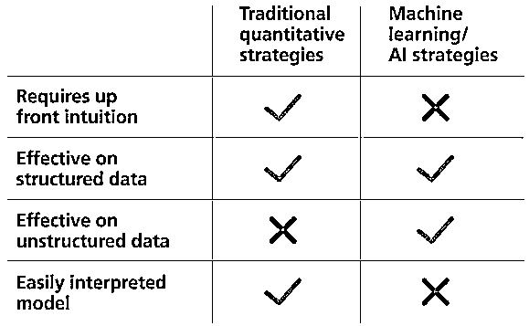
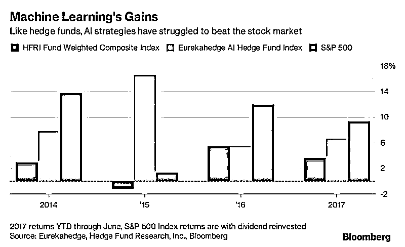
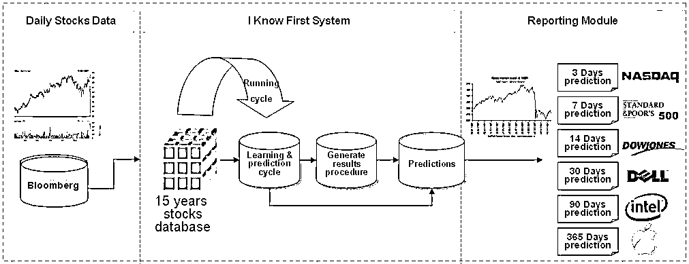
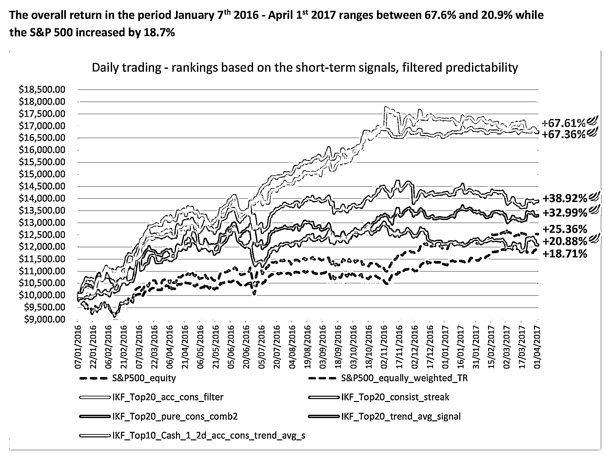

# 老铁，邀请你来免费学习人工智能！！！

> 原文：[`mp.weixin.qq.com/s?__biz=MzAxNTc0Mjg0Mg==&mid=2653286614&idx=1&sn=91626967e7c92cff10f231331de577e6&chksm=802e32c3b759bbd582139cd827ffe0d5dba01a28db7eb75594524cd6adf289e48de3d6fc424c&scene=27#wechat_redirect`](http://mp.weixin.qq.com/s?__biz=MzAxNTc0Mjg0Mg==&mid=2653286614&idx=1&sn=91626967e7c92cff10f231331de577e6&chksm=802e32c3b759bbd582139cd827ffe0d5dba01a28db7eb75594524cd6adf289e48de3d6fc424c&scene=27#wechat_redirect)

从去年的 AlphaGo 到今年**人工智能（Artificial Intelligence），**英文缩写为**AI，**首次写进**政府工作报告**，人工智能正在席卷全球，引发第 4 次工业革命，而 AI 的核心技术是**机器学习**和**深度学习**。 

目前，机器学习已广泛应用于数据挖掘、自动驾驶、计算机视觉、自然语言处理、搜索引擎、语音和人脸识别、医学诊断、量化金融、以及电商的搜索和推荐当中，人工智能正在迎来巨大爆发点。

**AI 在量化投资的应用**也是不断显现活力。

We Know First predicts a growing universe of over 3,000 securities for the short, medium and long term horizons daily by applying Artificial Intelligence and Machine Learning techniques to search for patterns and relationships in large sets of historical stock market data.

We Know First is among 5 start-ups, who showcased their solutions in Payments, Finance Management, Security and other specialties according to Israel Economic Mission in the USA.

Through its self-learning ability and flexible multi-layered neural networks structure, the algorithm is able to learn from, adapt to and evolve together with continuously changing markets. It offers an independent, objective and unique perspective on the financial markets and doesn’t rely on any human derived assumptions or traditional theories and models that often do not hold (anymore).

Moreover, we Know First develops and back-tests systematic trading strategies which are used in partnerships with hedge funds and other asset managing entities. These strategies are rules-based and utilize algorithmic forecasting indicators mentioned above in order to rank and select the trades as well as the time the execution. The type of strategies varies, including mean-reversion logic and more trend focused approaches, all generating high positive alpha while keeping beta in the  0.3-0.8 range, yielding overall high risk-adjusted returns. The strategies can be used in partnership with I Know First to launch hedge funds, mutual funds or other investment vehicles.

鉴于此，推荐一位**非常牛逼的机器学习科学家**：陈梦翔，花名：浩颠。清华大学计算机博士，数据科学家，主要研究方向为：机器学习、模式识别、深度学习。曾任职于 Google、Facebook、百度等人工智能实验室。

2013 年-2015 年在意大利举办的国际在线指纹识别竞赛中获得**冠军**，先后于 IEEE  TPAMI、IJCB2014 等国际顶级期刊发表多篇论文，拥有 5 个中国专利和 1 个美国专利，是推荐系统、NLP、点击率预估、图像识别领域实战派专家。

他现在在做机器学习培训，对机器学习感兴趣的可以加他助理了解，扫一扫下面的二维码添加，注明来自：**公众号**。可以免费体验 5 次机器学习 VIP 课程，价值 1980 元，以及获得 VIP 课的视频，先到先得！还可以上**每周一次**的大型线上公开课，部分公开课主题如下：

> 【第 1 期】SVM 车牌识别系统
> 
> 【第 2 期】GANs 对抗生成网络诗歌生成器
> 
> 【第 3 期】用 CNN 构建简易版 AlphaGo 围棋 AI
> 
> 【第 4 期】朴素贝叶斯决策的 OCR 字符识别
> 
> 【第 5 期】基于 zero-shot 学习的多语言翻译系统
> 
> 【第 6 期】构建深度学习无人车驾驶系统

      。。。。。持续更新。。。。。

**长按即可添加**