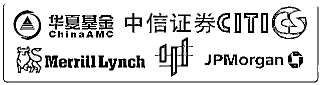
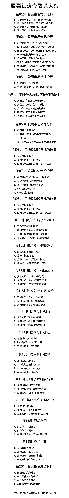
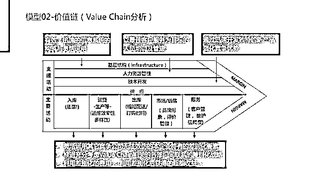
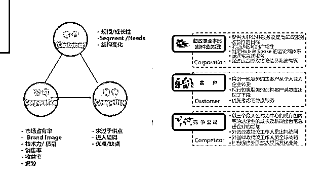
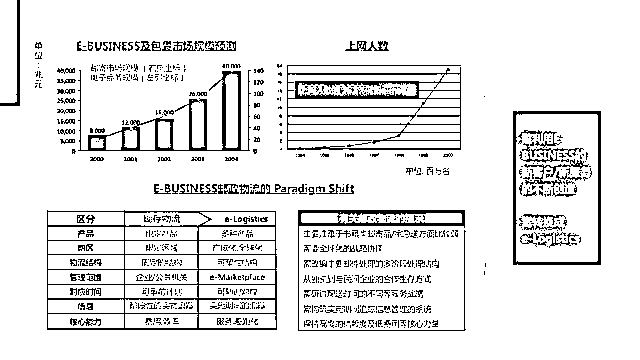

# 年薪百万的的基金经理比普通股民，到底优秀在哪里？

> 原文：[`mp.weixin.qq.com/s?__biz=MzAxNTc0Mjg0Mg==&mid=2653286584&idx=1&sn=ef33e5efbe0681594c448b424cb9bbd0&chksm=802e32adb759bbbbf0e31f4d6e4da965298cd6e3e8e2fa84ee1e908f704e73fae46798381ac2&scene=27#wechat_redirect`](http://mp.weixin.qq.com/s?__biz=MzAxNTc0Mjg0Mg==&mid=2653286584&idx=1&sn=ef33e5efbe0681594c448b424cb9bbd0&chksm=802e32adb759bbbbf0e31f4d6e4da965298cd6e3e8e2fa84ee1e908f704e73fae46798381ac2&scene=27#wechat_redirect)

**驱动力分析/竞争力分析/财务估值分析**

**基本面分析、技术分析、演化分析.****..**

这些股票投资的专业知识你懂多少呢

基于基本面分析的价值投资

无疑是公募私募等基金经理所推崇的

宏观经济对市场/对行业/对个股/的影响

经济运行/指标波动/经济周期/经济政策..

如何影响？如何传导？

关于这些问题普通股民们究竟了解多少呢

另外， 

如何判断不同行业的发展潜力及投资时点

如何分析公司的潜在价值

如何通过不同的策略投资不同类型的股票

如何进行投资股票池建设以及做好仓位资金管理

这些都是提高投资成功率的必备知识

当然，江湖上还有一派系

建立在技术分析上的投资逻辑

道氏理论/波浪理论/江恩理论/缠论等等

以及那些常见于江湖的技术分析工具

均线/K 线/MACD/布林轨道...

还有建立在技术之上的上层建筑

交易体系与交易心理

这些都是作为专业股票投资者

必须了解和学习的必修课

 好公司的股票才赚钱

那如何识别上市公司的好坏呢？

为什么有些行业，躺着也能赚到钱

不同行业的公司，该如何分析估值

不同的技术理论适用于不同的投资环境

那什么时候用什么理论指导具体的投资？

今天，我们邀请了

**华夏基金、摩根大通等**

**顶级基金的基金经理们**

研发了一套系统的股票投资课程

带你听懂宏观环境，看懂行业发展

读懂公司年报，吃懂个股走势

从定性分析到定量分析

全面帮你发现投资机会

**从基本面角度了解公司基本情况**

**再从技术面的角度抓住投资节点**

**基金经理亲自授课**

通过系统且专业的培训

让投资不再靠感觉、凭运气

让你具备专业系统的投资分析能力

怀揣底气的进行投资决策

**其实，投资圈山寨与专业的区别很明显**

或许你已经入市多年了

但是依旧沦落杂牌

没有套路没有章法没有攻略

**如何从屌丝股民晋升为投资的正****规军**

本档股票投资专题课将全程助你进阶

应对中国当下复杂的资本市场环境

投资者需要培养正确的分析方法与投资思维

如此才能练就属于自己的投资心法 

屏蔽各类不必要的市场干扰

在投资路上步步为赢

我们邀请的**顶级基金经理们**

将从基本面分析到技术分析

从市场环境分析到投资系统建设

以及交易实务中常见情景操作

共计两大专题，**20 节大课**

全面深度解析股票投资那些事

让你和成功的投资者，更近一步

**这一次，你的股票投资能力怎能不飞跃？！**

**明星导师介绍**

> 为了保证课程质量，我们邀请**国内顶级股票投资团队，他们都毕业于知名高校，来自于国内外顶级金融机构，从事股票投资工作超过 8 年**，拥有优秀且稳定的股票投资业绩。

> **Hunter**

- 北京大学理学硕士，加州伯克利金融学博士，历任花旗银行外汇交易中心高级投资经理，**摩根大通交易总监**，冠恒资本控股有限公司海外投资委员会主席。在股票投资，外汇交易，技术分析等方面拥有丰富实战经验。连续三年基金投资收益率超过 26%，业绩优秀且稳定。

> **Stephan**

- 北京大学金融学硕士，现任职于某百亿规模私募基金担任基金经理，曾任职于**华夏基金**投资研究部，历任基金研究员行业组长，基金经理助理。长期从事二级市场行业投资与研究，具有丰富的买方行研分析经验，擅长专业的行业研究报告撰写及股票基本面投资分析。

> **Mike**

- 中国科学院理学博士，历任鲁证期货研究总监，北京海川天地投资管理有限公司基金经理，冠恒大华投资管理有限公司**基金经理**。长期从事二级市场股票投资交易，是**基本面分析**的推崇者，累计管理资产规模超过 20 亿元。具有较长时间的股票交易投资实践经验，国内早期高频交易实践者。

**//  内容框架  //**

**//  课件示例  //**

**//  赠送大礼包  //**

**//  你将收获  //**

> 1\. 系统的股票投资分析方法
> 
> 2\. 掌握如何进行基本面与技术分析技能
> 
> 3\. 学习各行业股票投资研究分析的要点
> 
> 4\. 掌握专业股票投资的套路技能
> 
> 5\. 学会股票分析常用工具与软件

**//  适合人群  //**

> 1\. 对股票投资感兴趣的人士
> 
> 2.金融在职人士或其他行业想学习股票投资的人士
> 
> 3\. 未来想从事于金融行业的大学生
> 
> 4\. 有志于从事公募券商自营私募行业的人士
> 
> 5\. 有志于从事投资咨询行业人士或在职人士

**//  课程详情  //**

开课时间：**11 月 27 日-12 月 18 日**

课程价格：**599 元**

课程形式：**直播授课& 课后答疑 & **社群互动****

****参与方式：**长按文章底部二维码支付报名，支付成功后添加**课程小助手**并**发送截图**让她拉你进入班级群，加入班级群后按照班主任提示等待正式开课即可**

**所有课程都是线上直播课程，通过在线平台可以参与，**课程结束后会有答疑环节。****

****//  Q&A  //****

****Q：请问有事错过或者可以看回放吗？****

**A：这个不用担心，本次课程为直播+录播形式，课程视频会留存供复习使用，如果您有事错过，一年内可随时复习观看。**

****Q：请问可以和导师互动交流答疑吗？****

**A：当然可以，导师会在直播答疑时间与大家在线互动交流，如果平时学习有问题，可将问题发至助教，导师会做出书面回复与解答。** 

****Q：请问课程的课件可以提供吗？****

**A：可以提供，本次课程的课件均为导师制作并提供至学员，但是一律不得外泄，仅供内部学员使用。导师直播答疑录音，也会整理后提供给大家复习回顾。** 

****Q：如果我是非金融专业学生或股票投资零基础学生，可以报名学习本次课程吗？****

**A：当然可以，本次课程从基本面分析到技术分析全面解析，涉及股票投资的方方面面，课程系统完整。如果在学习过程中有任何疑问，将问题发至助教，导师会做出书面答复。**

****//  团购优惠 //****

**如果你带着你的小伙伴一起报名**

**3 人团购：每人将获得 30 元返现**

**5 人团购：每人将获得 50 元返现**

****团购学员请联系课程小助手微信****

**微信号：gxs_1990**

**讲完，欢迎报名及扩散**

****//  报名方式  //****

****本次课程通过此二维码直接付款****

****付款后添加课程小助手入群****

**↓↓↓戳此码报名↓↓↓**

****

**↑↑↑戳此码报名↑↑↑**

**课程小助手微信号：wss100988(可联系咨询)**

**注：可开具发票，如有需求请在上课时与助教沟通**

***以上产品最终解释权归华尔街学堂所有**