# 【深入研究】使用 RNN 预测股票价格系列一（第四期免费赠书活动来啦！）

> 原文：[`mp.weixin.qq.com/s?__biz=MzAxNTc0Mjg0Mg==&mid=2653286558&idx=1&sn=25441578341bde783cf8190e877c55f1&chksm=802e328bb759bb9d28e420d783a61944adc1369c6371962d5ba55d7de13df1272ef7232313ec&scene=27#wechat_redirect`](http://mp.weixin.qq.com/s?__biz=MzAxNTc0Mjg0Mg==&mid=2653286558&idx=1&sn=25441578341bde783cf8190e877c55f1&chksm=802e328bb759bb9d28e420d783a61944adc1369c6371962d5ba55d7de13df1272ef7232313ec&scene=27#wechat_redirect)


**编辑部**

微信公众号

**关键字**全网搜索最新排名

**『量化投资』：排名第一**

**『量       化』：排名第一**

**『机器学习』：排名第三**

我们会再接再厉

成为全网**优质的**金融、技术类公众号

今天编辑部推出一期基于 Tensorflow 建立循环神经网络来预测股票市场价格的教程。 第一部分着重于预测标准普尔 500 指数（大家可以自行换成国内指数就好）。

**概述**

我们将解释如何建立一个有 LSTM 单元的 RNN 模型来预测 S＆P500 指数的价格。 数据集可以从 Yahoo!下载。 在例子中，使用了从 1950 年 1 月 3 日（Yahoo! Finance 可以追溯到的最大日期）的 S＆P 500 数据到 2017 年 6 月 23 日。 为了简单起见，我们只使用每日收盘价进行预测。 同时，我将演示如何使用 TensorBoard 轻松调试和模型跟踪。

**关于 RNN 和 LSTM**

### RNN 的目的使用来处理序列数据。在传统的神经网络模型中，是从输入层到隐含层再到输出层，层与层之间是全连接的，每层之间的节点是无连接的。但是这种普通的神经网络对于很多问题却无能无力。例如，你要预测句子的下一个单词是什么，一般需要用到前面的单词，因为一个句子中前后单词并不是独立的。RNN 之所以称为循环神经网路，即一个序列当前的输出与前面的输出也有关。具体的表现形式为网络会对前面的信息进行记忆并应用于当前输出的计算中，即隐藏层之间的节点不再无连接而是有连接的，并且隐藏层的输入不仅包括输入层的输出还包括上一时刻隐藏层的输出。理论上，RNN 能够对任何长度的序列数据进行处理。 

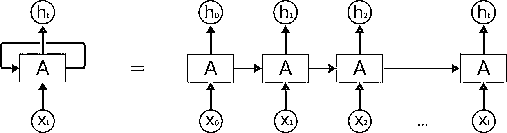

### Long Short Term 网络，一般就叫做 LSTM，是一种 RNN 特殊的类型，LSTM 区别于 RNN 的地方，主要就在于它在算法中加入了一个判断信息有用与否的“处理器”，这个处理器作用的结构被称为 cell。一个 cell 当中被放置了三扇门，分别叫做输入门、遗忘门和输出门。一个信息进入 LSTM 的网络当中，可以根据规则来判断是否有用。只有符合算法认证的信息才会留下，不符的信息则通过遗忘门被遗忘。说起来无非就是一进二出的工作原理，却可以在反复运算下解决神经网络中长期存在的大问题。目前已经证明，LSTM 是解决长序依赖问题的有效技术，并且这种技术的普适性非常高，导致带来的可能性变化非常多。各研究者根据 LSTM 纷纷提出了自己的变量版本，这就让 LSTM 可以处理千变万化的垂直问题。

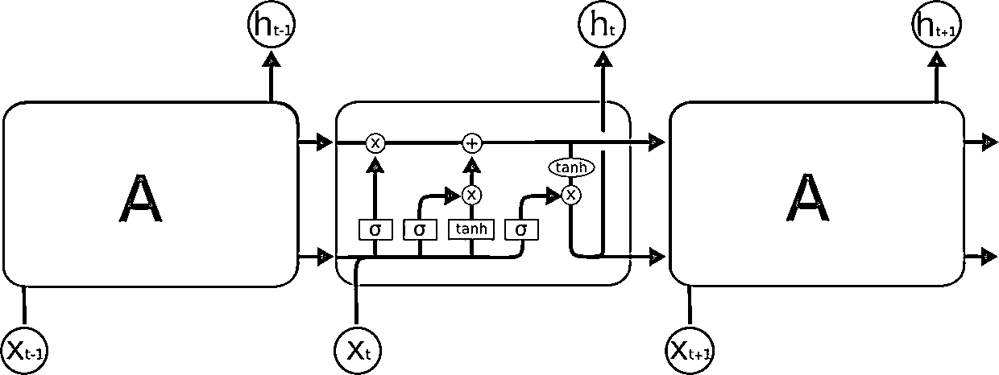

**数据准备**

股票价格是长度为 NN，定义为 p0，p1，...，pN-1，其中 pi 是第 i 天的收盘价，0≤i<N。 我们有一个大小固定的移动窗口 w（后面我们将其称为 input_size），每次我们将窗口向右移动 w 个单位，以使所有移动窗口中的数据之间没有重叠。

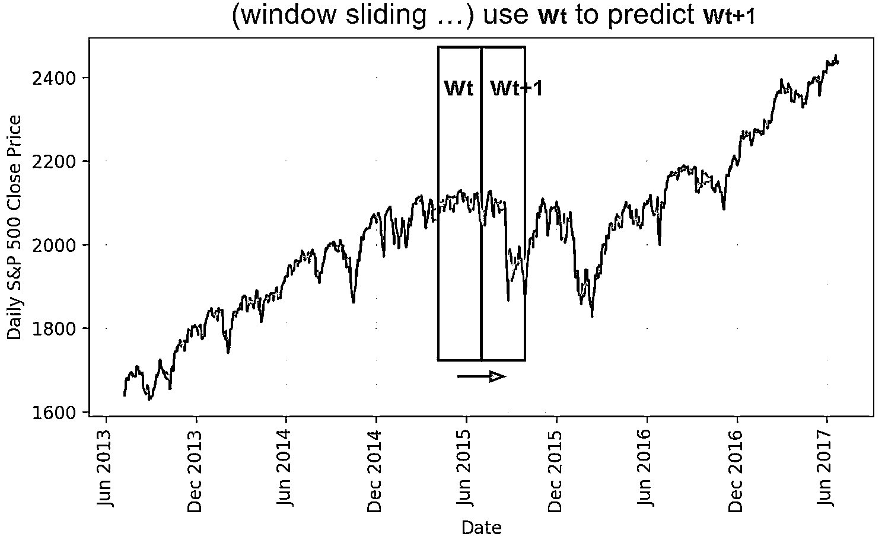

我们使用一个移动窗口中的内容来预测下一个，而在两个连续的窗口之间没有重叠。

我们将建立 RNN 模型将 LSTM 单元作为基本的隐藏单元。 我们使用此值从时间 t 内将第一个移动窗口 W0 移动到窗口 Wt：

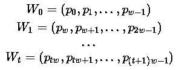

预测价格在下一个窗口在 Wt+1

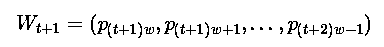

我们试图学习一个近似函数，

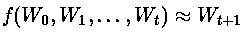

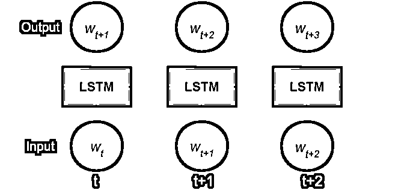

展开的 RNN

考虑反向传播（BPTT）是如何工作的，我们通常将 RNN 训练成一个“unrolled”的样式，这样我们就不需要做太多的传播计算，而且可以节省训练的复杂性。

以下是关于 Tensorflow 教程中 input_size 的解释：

> *By design, the output of a recurrent neural network (RNN) depends on arbitrarily distant inputs. Unfortunately, this makes backpropagation computation difficult. In order to make the learning process tractable, it is common practice to create an “unrolled” version of the network, which contains a fixed number (num_steps) of LSTM inputs and outputs. The model is then trained on this finite approximation of the RNN. This can be implemented by feeding inputs of length num_steps at a time and performing a backward pass after each such input block.*

价格的顺序首先被分成不重叠的小窗口。 每个窗口都包含 input_size 数字，每个数字被视为一个独立的输入元素。 然后，任何 num_steps 连续的输入元素被分配到一个训练输入中，形成一个训练在 Tensorfow 上的“unrolled”版本的 RNN。 相应的标签就是它们后面的输入元素。

例如，如果 input_size = 3 和 num_steps = 2，我们的第一批的训练样例如下所示：

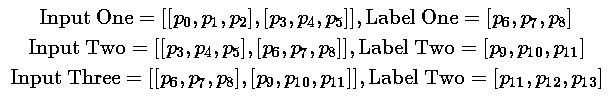

以下是数据格式化的关键部分：**（用手可以滑动代码）**

```py
seq = [np.array(seq[i * self.input_size: (i + 1) * self.input_size]) 
       for i in range(len(seq) // self.input_size)]

# Split into groups of `num_steps`
X = np.array([seq[i: i + self.num_steps] for i in range(len(seq) - self.num_steps)])
y = np.array([seq[i + self.num_steps] for i in range(len(seq) - self.num_steps)])
```

**培训/测试拆分**

由于我们总是想预测未来，我们以最新的 10％的数据作为测试数据。

**正则化**

标准普尔 500 指数随着时间的推移而增加，导致测试集中大部分数值超出训练集的范围，因此模型必须预测一些以前从未见过的数字。 但这却不是很理想。

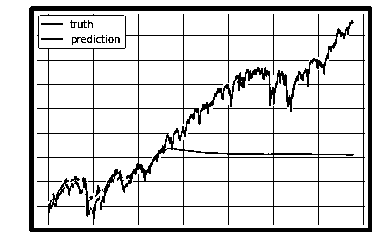

为了解决样本外的问题，我们在每个移动窗口中对价格进行了标准化。 任务变成预测相对变化率而不是绝对值。 在 t 时刻的标准化滑动窗口 W't 中，所有的值除以最后一个未知价格 Wt-1 中的最后一个价格：

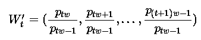

**建立模型**

**定义**

*   lstm_size：一个 LSTM 图层中的单元数。

*   num_layers：堆叠的 LSTM 层的数量。

*   keep_prob：单元格在 dropout 操作中保留的百分比。

*   init_learning_rate：开始学习的速率。

*   learning_rate_decay：后期训练时期的衰减率。

*   init_epoch：使用常量 init_learning_rate 的时期数。

*   max_epoch：训练次数在训练中的总数

*   input_size：移动窗口的大小/一个训练数据点

*   batch_size：在一个小批量中使用的数据点的数量。

> ‍‍*The LSTM model has num_layers stacked LSTM layer(s) and each layer contains lstm_sizenumber of LSTM cells. Then a dropout mask with keep probability keep_prob is applied to the output of every LSTM cell. The goal of dropout is to remove the potential strong dependency on one dimension so as to prevent overfitting.*
> 
> *The training requires max_epoch epochs in total; an epoch is a single full pass of all the training data points. In one epoch, the training data points are split into mini-batches of size batch_size. We send one mini-batch to the model for one BPTT learning. The learning rate is set to init_learning_rate during the first init_epoch epochs and then decay by learning_rate_decay during every succeeding epoch.‍‍‍*

**（用手可以滑动代码）**

```py
# Configuration is wrapped in one object for easy tracking and passing.
class RNNConfig():
    input_size=1
    num_steps=30
    lstm_size=128
    num_layers=1
    keep_prob=0.8
    batch_size = 64
    init_learning_rate = 0.001
    learning_rate_decay = 0.99
    init_epoch = 5
    max_epoch = 50

config = RNNConfig()
```

**定义图形**

(1) Initialize a new graph first.**（用手可以滑动代码）**

```py
import tensorflow as tf
tf.reset_default_graph()
lstm_graph = tf.Graph()
```

(2) How the graph works should be defined within its scope.**（用手可以滑动代码）**

```py
with lstm_graph.as_default():
```

(3) Define the data required for computation. Here we need three input variables, all defined as tf.placeholder because we don’t know what they are at the graph construction stage.

*   inputs: the training data X, a tensor of shape (# data examples, num_steps, input_size); the number of data examples is unknown, so it is None. In our case, it would be batch_sizein training session. Check the input format example if confused.

*   targets: the training label y, a tensor of shape (# data examples, input_size).

*   learning_rate: a simple float.

**（用手可以滑动代码）**

```py
# Dimension = (
    #     number of data examples, 
    #     number of input in one computation step, 
    #     number of numbers in one input
    # )
    # We don't know the number of examples beforehand, so it is None.
    inputs = tf.placeholder(tf.float32, [None, config.num_steps, config.input_size])
    targets = tf.placeholder(tf.float32, [None, config.input_size])
    learning_rate = tf.placeholder(tf.float32, None)
```

(4) This function returns one LSTMCell with or without dropout operation.**（用手可以滑动代码）**

```py
def _create_one_cell():
    return tf.contrib.rnn.LSTMCell(config.lstm_size, state_is_tuple=True)
    if config.keep_prob < 1.0:
            return tf.contrib.rnn.DropoutWrapper(lstm_cell, output_keep_prob=config.keep_prob)
```

(5) Let’s stack the cells into multiple layers if needed. MultiRNNCell helps connect sequentially multiple simple cells to compose one cell.**（用手可以滑动代码）**

```py
cell = tf.contrib.rnn.MultiRNNCell(
        [_create_one_cell() for _ in range(config.num_layers)], 
        state_is_tuple=True
    ) if config.num_layers > 1 else _create_one_cell()
```

(6) tf.nn.dynamic_rnn constructs a recurrent neural network specified by cell (RNNCell). It returns a pair of (model outpus, state), where the outputs val is of size (batch_size, num_steps, lstm_size) by default. The state refers to the current state of the LSTM cell, not consumed here.**（用手可以滑动代码）**

```py
val, _ = tf.nn.dynamic_rnn(cell, inputs, dtype=tf.float32)
```

(7) tf.transpose converts the outputs from the dimension (batch_size, num_steps, lstm_size) to (num_steps, batch_size, lstm_size). Then the last output is picked.**（用手可以滑动代码）**

```py
# Before transpose, val.get_shape() = (batch_size, num_steps, lstm_size)
# After transpose, val.get_shape() = (num_steps, batch_size, lstm_size)
val = tf.transpose(val, [1, 0, 2])
# last.get_shape() = (batch_size, lstm_size)
ast = tf.gather(val, int(val.get_shape()[0]) - 1, name="last_lstm_output")
```

(8) Define weights and biases between the hidden and output layers.**（用手可以滑动代码）**

```py
weight = tf.Variable(tf.truncated_normal([config.lstm_size, config.input_size]))
bias = tf.Variable(tf.constant(0.1, shape=[targets_width]))
prediction = tf.matmul(last, weight) + bias
```

(9) We use mean square error as the loss metric and the RMSPropOptimizer algorithm for gradient descent optimization.**（用手可以滑动代码）**

```py
loss = tf.reduce_mean(tf.square(prediction - targets))
optimizer = tf.train.RMSPropOptimizer(learning_rate)
minimize = optimizer.minimize(loss)
```

**开始训练过程**

(1) To start training the graph with real data, we need to start a tf.session first.**（用手可以滑动代码）**

```py
with tf.Session(graph=lstm_graph) as sess:
```

(2) Initialize the variables as defined.**（用手可以滑动代码）**

```py
tf.global_variables_initializer().run()
```

(0) The learning rates for training epochs should have been precomputed beforehand. The index refers to the epoch index.**（用手可以滑动代码）**

```py
learning_rates_to_use = [
    config.init_learning_rate * (
        config.learning_rate_decay ** max(float(i + 1 - config.init_epoch), 0.0)
    ) for i in range(config.max_epoch)]
```

(3) Each loop below completes one epoch training.**（用手可以滑动代码）**

```py
for epoch_step in range(config.max_epoch):
    current_lr = learning_rates_to_use[epoch_step]

    # Check https://github.com/lilianweng/stock-rnn/blob/master/data_wrapper.py
    # if you are curious to know what is StockDataSet and how generate_one_epoch() 
    # is implemented.
    for batch_X, batch_y in stock_dataset.generate_one_epoch(config.batch_size):
        train_data_feed = {
            nputs: batch_X, 
            targets: batch_y, 
            learning_rate: current_lr
        }
        train_loss, _ = sess.run([loss, minimize], train_data_feed)
```

(4) Don’t forget to save your trained model at the end.**（用手可以滑动代码）**

```py
saver = tf.train.Saver()
saver.save(sess, "your_awesome_model_path_and_name", global_step=max_epoch_step)
```

**使用 TensorBoard**

在没有可视化的情况下构建图形就像在黑暗中绘制，非常模糊和容易出错。 Tensorboard 提供了图形结构和学习过程的简单可视化。 看看下面这个案例，非常实用：

**Brief Summary**

*   Use with [tf.name_scope](https://www.tensorflow.org/api_docs/python/tf/name_scope)("your_awesome_module_name"): to wrap elements working on the similar goal together.

*   Many tf.* methods accepts name= argument. Assigning a customized name can make your life much easier when reading the graph.

*   Methods like tf.summary.scalar and tf.summary.histogram help track the values of variables in the graph during iterations.

*   In the training session, define a log file using tf.summary.FileWriter.

```py
with tf.Session(graph=lstm_graph) as sess:
    merged_summary = tf.summary.merge_all()
    writer = tf.summary.FileWriter("location_for_keeping_your_log_files", sess.graph)
    writer.add_graph(sess.graph)
```

Later, write the training progress and summary results into the file.**（用手可以滑动代码）**

```py
_summary = sess.run([merged_summary], test_data_feed)
writer.add_summary(_summary, global_step=epoch_step)  # epoch_step in range(config.max_epoch)
```

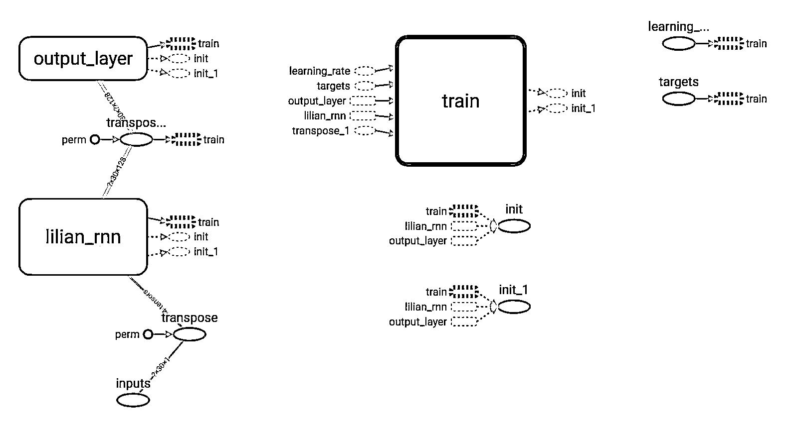

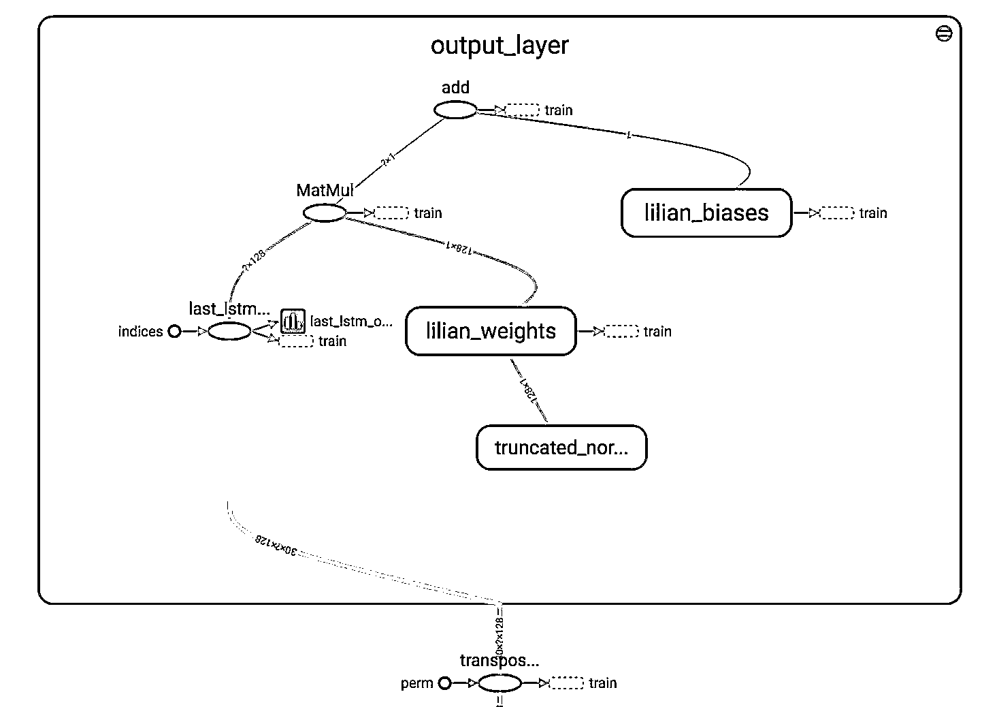

**结果**

我们在例子中使用了以下配置。

```py
num_layers=1
keep_prob=0.8
batch_size = 64
init_learning_rate = 0.001
learning_rate_decay = 0.99
init_epoch = 5
max_epoch = 100
num_steps=30
```

**总的来说预测股价并不是一件容易的事情。 特别是在正则化后，价格趋势看起来非常嘈杂。**

> 测试数据中最近 200 天的预测结果。 模型是用 input_size= 1 和 lstm_size= 32 来训练的。

**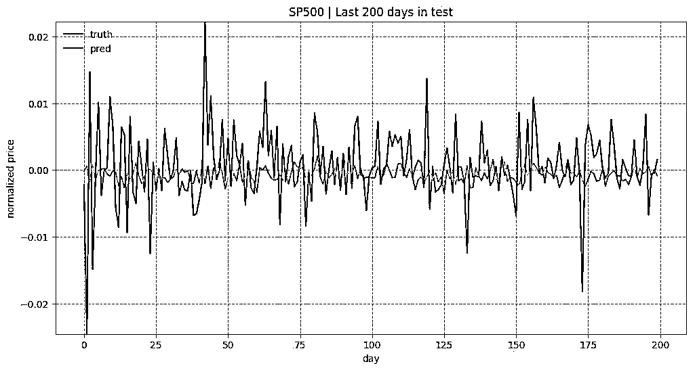**

> 测试数据中最近 200 天的预测结果。 模型是用 input_size= 1 和 lstm_size= 128 来训练的。

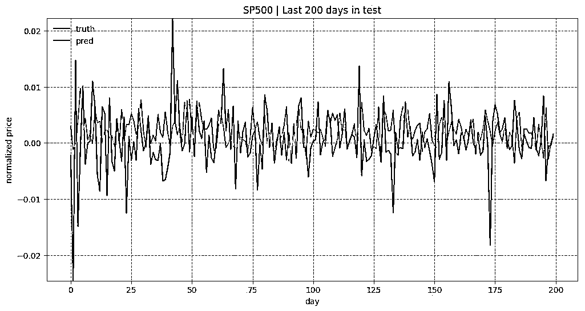

> 测试数据中最近 200 天的预测结果。 模型是用 input_size= 5 和 lstm_size= 128 来训练的。

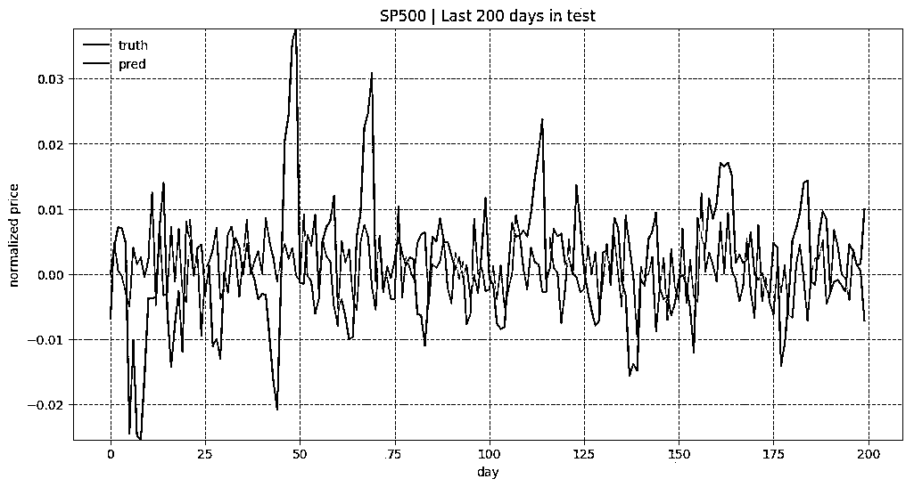

**代码：stock-rnn/main.py**（用手可以滑动代码）****

```py
import os
import pandas as pd
import pprint

import tensorflow as tf
import tensorflow.contrib.slim as slim

from data_model import StockDataSet
from model_rnn import LstmRNN

flags = tf.app.flags
flags.DEFINE_integer("stock_count", 100, "Stock count [100]")
flags.DEFINE_integer("input_size", 5, "Input size [5]")
flags.DEFINE_integer("num_steps", 30, "Num of steps [30]")
flags.DEFINE_integer("num_layers", 1, "Num of layer [1]")
flags.DEFINE_integer("lstm_size", 128, "Size of one LSTM cell [128]")
flags.DEFINE_integer("batch_size", 64, "The size of batch images [64]")
flags.DEFINE_float("keep_prob", 0.8, "Keep probability of dropout layer. [0.8]")
flags.DEFINE_float("init_learning_rate", 0.001, "Initial learning rate at early stage. [0.001]")
flags.DEFINE_float("learning_rate_decay", 0.99, "Decay rate of learning rate. [0.99]")
flags.DEFINE_integer("init_epoch", 5, "Num. of epoches considered as early stage. [5]")
flags.DEFINE_integer("max_epoch", 50, "Total training epoches. [50]")
flags.DEFINE_integer("embed_size", None, "If provided, use embedding vector of this size. [None]")
flags.DEFINE_string("stock_symbol", None, "Target stock symbol [None]")
flags.DEFINE_integer("sample_size", 4, "Number of stocks to plot during training. [4]")
flags.DEFINE_boolean("train", False, "True for training, False for testing [False]")

FLAGS = flags.FLAGS

pp = pprint.PrettyPrinter()

if not os.path.exists("logs"):
    os.mkdir("logs")

def show_all_variables():
    model_vars = tf.trainable_variables()
    slim.model_analyzer.analyze_vars(model_vars, print_info=True)

def load_sp500(input_size, num_steps, k=None, target_symbol=None, test_ratio=0.05):
    if target_symbol is not None:
        return [
            StockDataSet(
                target_symbol,
                input_size=input_size,
                num_steps=num_steps,
                test_ratio=test_ratio)
        ]

    # Load metadata of s & p 500 stocks
    info = pd.read_csv("data/constituents-financials.csv")
    info = info.rename(columns={col: col.lower().replace(' ', '_') for col in info.columns})
    info['file_exists'] = info['symbol'].map(lambda x: os.path.exists("data/{}.csv".format(x)))
    print info['file_exists'].value_counts().to_dict()

    info = info[info['file_exists'] == True].reset_index(drop=True)
    info = info.sort('market_cap', ascending=False).reset_index(drop=True)

    if k is not None:
        info = info.head(k)

    print "Head of S&P 500 info:\n", info.head()

    # Generate embedding meta file
    info[['symbol', 'sector']].to_csv(os.path.join("logs/metadata.tsv"), sep='\t', index=False)

    return [
        StockDataSet(row['symbol'],
                     input_size=input_size,
                     num_steps=num_steps,
                     test_ratio=0.05)
        for _, row in info.iterrows()]

def main(_):
    pp.pprint(flags.FLAGS.__flags)

    # gpu_options = tf.GPUOptions(per_process_gpu_memory_fraction=0.333)
    run_config = tf.ConfigProto()
    run_config.gpu_options.allow_growth = True

    with tf.Session(config=run_config) as sess:
        rnn_model = LstmRNN(
            sess,
            FLAGS.stock_count,
            lstm_size=FLAGS.lstm_size,
            num_layers=FLAGS.num_layers,
            num_steps=FLAGS.num_steps,
            input_size=FLAGS.input_size,
            keep_prob=FLAGS.keep_prob,
            embed_size=FLAGS.embed_size,
        )

        show_all_variables()

        stock_data_list = load_sp500(
            FLAGS.input_size,
            FLAGS.num_steps,
            k=FLAGS.stock_count,
            target_symbol=FLAGS.stock_symbol,
        )

        if FLAGS.train:
            rnn_model.train(stock_data_list, FLAGS)
        else:
            if not rnn_model.load()[0]:
                raise Exception("[!] Train a model first, then run test mode")

if __name__ == '__main__':
    tf.app.run()
```

> 来自：https://lilianweng.github.io/lil-log/2017/07/08/predict-stock-prices-using-RNN-part-1.html

**赠书活动**

**量化投资与机器学习公众号**联合**博文视点 Broadview**送出**5 本**《深度学习入门之 PyTorch》

> 深度学习如今已经成为了科技领域炙手可热的技术，在本书中，我们将帮助你入门深度学习的领域。本书将从人工智能的介绍入手，了解机器学习和深度学习的基础理论，并学习如何用 PyTorch 框架对模型进行搭建。通过阅读本书，你将会学习到机器学习中的线性回归和 logistic 回归，深度学习的优化方法，多层全连接神经网络，卷积神经网络，循环神经网络以及生成对抗网络，同时从零开始对 PyTorch 进行学习，了解 PyTorch 基础及如何用其进行模型的搭建，然后通过实战了解前沿的研究成果和 PyTorch 在实际项目中的应用。

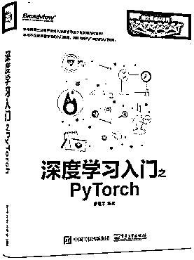

**截止 2017.11.10 12:00**

大家在本篇推文【写留言】处发表留言，**获得点赞数前五的读者，即可免费获赠此书**。届时，工作人员会联系五位读者，寄出此书。

