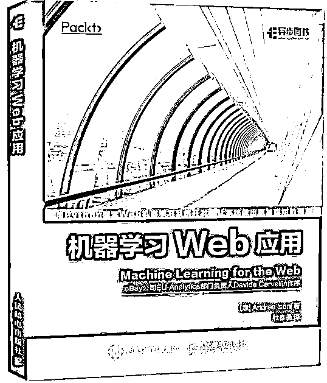
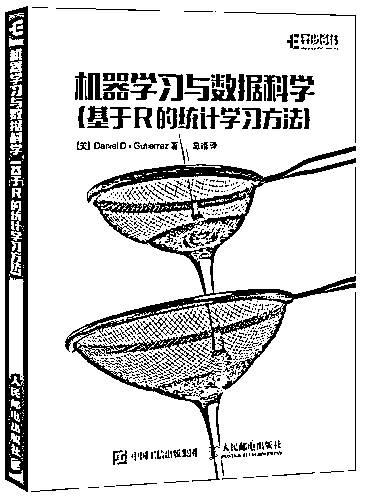
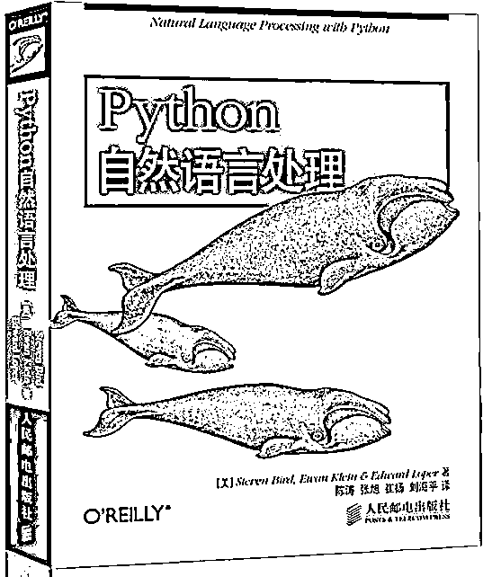

# 【精选】AI 正当时——机器学习、深度学习必备书单！

> 原文：[`mp.weixin.qq.com/s?__biz=MzAxNTc0Mjg0Mg==&mid=2653286545&idx=1&sn=f91bb0fddb28c49305349850ba99cb55&chksm=802e3284b759bb9256db53ceac2fba56ea1fc91cbfd9009e91ecc38e814fa171712a97ac6617&scene=27#wechat_redirect`](http://mp.weixin.qq.com/s?__biz=MzAxNTc0Mjg0Mg==&mid=2653286545&idx=1&sn=f91bb0fddb28c49305349850ba99cb55&chksm=802e3284b759bb9256db53ceac2fba56ea1fc91cbfd9009e91ecc38e814fa171712a97ac6617&scene=27#wechat_redirect)

**编辑部**

微信公众号

**关键字**全网搜索最新排名

**『量化投资』：排名第一**

**『量       化』：排名第一**

**『机器学习』：排名第三**

我们会再接再厉

成为全网**优质的**金融、技术类公众号

近年来，机器学习领域受到越来越多的关注，相关的机器学习算法开始成为热点，知乎上同类问题同样不少，如机器学习该怎么入门？机器学习、数据挖掘 如何进阶成为大神？普通程序员如何向人工智能靠拢？学习人工智能该看什么书？ 

机器学习是一门多领域交叉学科，涉及概率论、统计学、逼近论、凸分析、算法复杂度等多门学科，专门研究计算机怎样模拟或实现人类的学习行为。机器学习是人工智能的核心，是使计算机具有智能的根本途径。 

今天小编整理了畅销榜上机器学习、深度学习、人工智能相关图书，希望可以帮助领域内或者即将入门的伙伴们，涉及到的关键词如：深度学习、TensorFlow、机器学习、python、算法、概率编程、贝叶斯。

**深度学习是机器学习的一个分支，它能够使计算机通过层次概念来学习经验和理解世界。**

**1.《深度学习》**

本书适合各类读者阅读，包括相关专业的大学生或研究生，以及不具有机器学习或统计背景、但是想要快速补充深度学习知识，以便在实际产品或平台中应用的软件工程师。

本书由全球知名的三位专家 Ian Goodfellow、Yoshua Bengio 和 Aaron Courville 撰写，是深度学习领域奠基性的经典图书。

AI 圣经！深度学习领域奠基性的经典畅销书！长期位居美国亚马逊 AI 和机器学习类图书榜首！所有数据科学家和机器学习从业者的必读图书！特斯拉 CEO 埃隆•马斯克等国内外众多专家推荐！ 本书会介绍深度学习领域的许多主题。

2\. 深度学习精要（基于 R 语言）

本书适合了解机器学习概念和 R 语言并想要使用 R 提供的包来探索深度学习应用的读者学习参考。

本书结合 R 语言介绍深度学习软件包 H2O，帮助读者理解深度学习的概念。本书从在 R 中设置可获取的重要深度学习包开始，接着转向建立神经网络、预测和深度预测等模型，所有这些模型都由实际案例的辅助来实现。成功安装了 H2O 软件包后，你将学习预测算法。随后本书会解释诸如过拟合数据、异常数据以及深度预测模型等概念。最后，本书会介绍设计调参和优化模型的概念。 本书适合那些胸怀大志的数据科学家，他们精通 R 语言数据科学概念，并希望可以使用 R 中的包进一步探索深度学习范式

本书重点介绍如何将 R 语言和深度学习模型或深度神经网络结合起来，解决实际的应用需求。全书共 6 章，分别介绍了深度这习基础知识、训练预测模型、如何防止过拟合、识别异常数据、训练深度预测模型以及调节和优化模型等内容。

**TensorFlow 是深度学习的最流行的框架之一，极适合新手入门。谷歌公司正致力于建立一个相关软件和机器学习模型的开源生态系统，这是人工智能发展的技术风口。 **

3\. 《TensorFlow 技术解析与实战》

本书深入浅出，理论联系实际，实战案例新颖，适合对 TensorFlow 感兴趣的各层次读者阅读。

机器学习深度学习领域参考书

包揽 TensorFlow1.1 的新特性

人脸识别 语音识别 图像和语音相结合等热点一应俱全

李航 余凯等人工智能领域专家倾力推荐

本书基于 TensorFlow1.1 版本，深入 TensorFlow 基础原理、设计理念、编程模型、源码分析和模型构建、工业界应用、大规模数据训练等。全书分为基础篇、实战篇和提高篇三部分。 “基础篇” 

•人工智能入门，学习深度学习的方法。 

•  TensorFlow 基础原理、设计架构和编程模型。 

•  常用 API、批标准化、模型的存储与加载、队列及线程、实现一个自定义 OP。

•  TensorBorad 可视化的全面解析。 

•  源码分析。 

•  神经网络（CNN 和 RNN）的发展演化以及如何用 TensorFlow 实现这些网络。 

•  第三方上层框架 Keras 和 TFLearn 的应用。 

“实战篇” 

•  用 TensorFlow 实现第 1 个神经网络。 

•  用 TensorFlow 实现 CNN、RNN、LSTM 和自动编码器的各种示例。 

•  TensorFlow 在人脸识别、语音识别、智能机器人、语音和图像相结合以及生成式对抗网络（GAN）等领域的实际应用。 

“提高篇” 

•  TensorFlow 的分布式原理、架构和模式。

•  移动端开发（Android、iOS 和树莓派）。

•  TensorFlow 的新特性，线性代数编程框架 XLA、调试器 Debugger、动态图 Fold、生产环境 Serving。

 • TensorFlow 和 Kubernetes 相结合。 

•  TensorFlowOnSpark。 

•  硬件计算加速。

•  机器学习的评测体系。 

**4\. Python 机器学习实践指南**

本书适合 Python 程序员、数据分析人员、对算法感兴趣的读者、机器学习领域的从业 人员及科研人员阅读。

机器学习是近年来渐趋热门的一个领域，同时 Python 语言经过一段时间的发展也已逐渐成为主流的编程语言之一。本书结合了机器学习和 Python 语言两个热门的领域，通过利用两种核心的机器学习算法来将 Python 语言在数据分析方面的优势发挥到极致。 全书共有 10 章。第一章讲解了 Python 机器学习的生态系统，剩余 9 章介绍了众多与机器学习相关的算法，包括各类分类算法、数据可视化技术、推荐引擎等，主要包括机器学习在公寓、机票、IPO 市场、新闻源、内容推广、股票市场、图像、聊天机器人和推荐引擎等方面的应用。

**5\. Python 机器学习——预测分析核心算法**

本书主要针对想提高机器学习技能的 Python 开发人员，帮助他们解决某一特定的项目或是提升相关的技能。

在学习和研究机器学习的时候，面临令人眼花缭乱的算法，机器学习新手往往会不知 所措。本书从算法和 Python 语言实现的角度，帮助读者认识机器学习。 本书专注于两类核心的“算法族”，即惩罚线性回归和集成方法，并通过代码实例来 展示所讨论的算法的使用原则。全书共分为 7 章，详细讨论了预测模型的两类核心算法、预测模型的构建、惩罚线性回归和集成方法的具体应用和实现。

机器学习关注于预测，其核心是一种基于数学和算法的技术，要掌握该技术，需要对数学及统计概念有深入理解，能够熟练使用 R 语言或者其他编程语言。 本书通过集中介绍两类可以进行有效预测的机器学习算法，展示了如何使用 Python 编程语言完成机器学习任务，从而降低机器学习难度，使机器学习能够被更广泛的人群掌握。 作者利用多年的机器学习经验带领读者设计、构建并实现自己的机器学习方案。本书尽可能地用简单的术语来介绍算法，避免复杂的数学推导，同时提供了示例代码帮助读者迅速上手。读者会很快深入了解模型构建背后的原理，不论简单问题还是复杂问题，读者都可以学会如何找到问题的解决算法。书中详细的示例，给出了具体的可修改的代码，展示了机器学习机理，涵盖了线性回归和集成方法，帮助理解使用机器学习方法的基本流程。 

**自然语言处理（NLP）属于人工智能与计算机语言学的交叉领域，处理的是计算机与人类语言之间的交互问题。随着人机交互需求的日益增长，计算机具备处理当前主要自然语言的能力已经成为了一个必然趋势，NLTK 库是当前自然语言处理（NLP）领域最为流行、使用最为广泛的库之一, 同时 Python 语言经过一段时间的发展也已逐渐成为主流的编程语言之一。 **

**6.NLTK 基础教程——用 NLTK 和 Python 库构建机器学习应用**

本书适合 NLP 和机器学习领域的爱好者、对文本处理感兴趣的读者、想要快速学习 NLTK 的资深 Python 程序员以及机器学习领域的研究人员阅读。

本书主要介绍如何通过 NLTK 库与一些 Python 库的结合从而实现复杂的 NLP 任务和机器学习应用。全书共分为 10 章。第一章对 NLP 进行了简单介绍。第二章、第三章和第四章主要介绍一些通用的预处理技术、专属于 NLP 领域的预处理技术以及命名实体识别技术等。第五章之后的内容侧重于介绍如何构建一些 NLP 应用，涉及文本分类、数据科学和数据处理、社交媒体挖掘和大规模文本挖掘等方面。 

**7\. 实用机器学习**

本书适合需要应用机器学习算法解决实际问题的工程技术人员阅读，也可作为相关专业高年级本科生或研究生的入门教材或课外读物。

●作者在学术界和工业界工作多年，书中介绍的都是非常实用的算法。 

●本书涵盖实际中常用的各种算法，包括回归、分类、推荐系统、排序等，能够引导读者从原始数据出发到形成最终的解决方案。

●通过 R 语言来引导读者使用算法，使读者能够简单上手，得到算法的第 1 手使用经验。 机器学习是一个热门而又高深的话题。多年来，符号学习、统计学习、深度学习等一系列高高在上的名词使得大众对机器学习敬而远之，大数据时代，机器学习的广泛成功应用再次引爆了大众对机器学习的关注。 机器学习能够解决什么样的问题？如何使用机器学习解决实际问题？应该怎样选择算法？本书从实践出发回答这些问题。书中首先通过实际应用场景引出机器学习中的几类典型问题，然后着重介绍解决各类问题的实用算法，并利用 R 语言和相关的软件包来引导读者实际使用这些算法。 

●不懂机器学习？没有关系。本书不仅介绍了机器学习的基本概念和算法原理，还提供了完整的程序代码，助读者轻松上手、快速入门。 

●数学基础不够？没有关系。本书一方面突出了对概念和原理的理解，尽可能淡化了对数学背景的要求；另一方面也介绍了需要具备的数学知识，便于读者查阅。 

●不会使用 R 语言？没有关系。本书介绍了 R 语言的基本知识及常用 R 软件包，两位作者更是亲手绘制了全书 90%以上的插图，手把手教读者用 R 语言分析数据和展现结果。 掌握本书介绍的算法和对应的 R 软件包后，读者可以顺利地针对新问题、新数据选择和使用机器学习算法，在实践中获得更大收获。 

本书围绕实际数据分析的流程展开，着重介绍数据探索、数据预处理和常用的机器学习算法模型。本书从解决实际问题的角度出发，介绍回归算法、分类算法、推荐算法、排序算法和集成学习算法。在介绍每种机器学习算法模型时，书中不但阐述基本原理，而且讨论模型的评价与选择。为方便读者学习各种算法，本书介绍了 R 语言中相应的软件包并给出了示例程序。 本书的一大特色就是贴近工程实践。首先，本书仅侧重介绍当前工业界常用的机器学习算法，而不追求知识内容的覆盖面；其次，本书在介绍每类机器学习算法时，力求通俗易懂地阐述算法思想，而不追求理论的深度，让读者借助代码获得直观的体验。 

**8\. 机器学习 Web 应用**

本书适合有志于成为或刚刚成为数据科学家的读者学习，也适合对机器学习、Web 数据挖掘等技术实践感兴趣的读者参考阅读。

Python 是一门通用型编程语言，也是一门相对容易学习的语言。因此，数据科学家在为中小规模的数据集制作原型、实现可视化和分析数据时，经常选择使用 Python。 本书填补了机器学习和 Web 开发之间的鸿沟。本书重点讲解在 Web 应用中实现预测分析功能的难点，重点介绍 Python 语言及相关框架、工具和库，展示了如何搭建机器学习系统。你将从本书学到机器学习的核心概念，学习如何将数据部署到用 Django 框架开发的 Web 应用；还将学到如何挖掘 Web、文档和服务器端数据以及如何搭建推荐引擎。 随后，你将进一步探索功能强大的 Django 框架，学习搭建一个简单、具备现代感的影评情感分析应用，它可是用机器学习算法驱动的！ 本书是写给正努力成为数据科学家的读者以及新晋的数据科学家的。读者应该具备一些机器学习经验。如果你对开发智能（具备预测功能的）Web 应用感兴趣，或正在从事相关开发工作，本书非常适合你。掌握一定的 Django 知识，学习本书将会更加轻松。

**9\. 机器学习实践应用**

本书适合任何有一定数据功底和编程基础的读者阅读。通过阅读本书，读者不仅可以了解机器学习的理论基础，也可以参照一些典型的应用案例拓展自己的专业技能。同时，本书也适合计算机相关专业的学生以及对人工智能和机器学习感兴趣的读者阅读。

这是一本难得的面向机器学习爱好者的入门级教程，本书涉及机器学习的基础理论和深度学习等相关内容，内容深入浅出。更加难能可贵的是，本书基于阿里云机器学习平台，针对 7 个具体的业务场景，搭建了完整的解决方案，给读者带来第 1 手的实战演练经验。 机器学习算法正在逐渐渗透到数据化运营的各个方面，算法和业务数据相结合可以大幅度地提高业务效率、降低成本。本书以算法的业务应用作为切入点，包含大量的案例说明，非常适合读者快速入门。

本书通过对机器学习的背景知识、算法流程、相关工具、实践案例以及知识图谱等内容的讲解，全面介绍了机器学习的理论基础和实践应用。书中涉及机器学习领域的多个典型算法，并详细给出了机器学习的算法流程。 本书适合任何有一定数据功底和编程基础的读者阅读。通过阅读本书，读者不仅可以了解机器学习的理论基础，也可以参照一些典型的应用案例拓展自己的专业技能。

**10\. 机器学习项目开发实战**

编辑推荐

本书向读者展示了，如何利用简单的算法和技术，从数据中学习，构建更聪明的.NET 应用，以解决现实世界中更广泛的问题。读者将在熟悉的 Visual Studio 环境中编码各个项目，使用.NET 环境中适合于机器学习的 F#语言开发机器学习项目。如果你对 F#还很陌生，本书将教会你入门所需的知识。如果你已经熟悉了 F#，本书将是你在机器学习领域实践该语言的新的机会。

在一系列令人着迷的项目中，读者将学到：

* 从头开始构建一个光学字符识别（OCR）系统

* 编写一个通过例子学习的垃圾邮件过滤器

* 使用 F#强大的类型提供程序与外部资源接口（在本书中是来自 R 语言的数据分析工具）

* 将数据转换为信息量更大的特征，并用它们作出精准的预测

* 在不知道目标的情况下找出数据中的模式

* 用回归模型预测数值

内容简介

本书通过一系列有趣的实例，由浅入深地介绍了机器学习这一炙手可热的新领域，并且详细介绍了适合机器学习开发的 Microsoft F#语言和函数式编程，引领读者深入了解机器学习的基本概念、核心思想和常用算法。书中的例子既通俗易懂，同时又十分实用，可以作为许多开发问题的起点。通过对本书的阅读，读者无须接触枯燥的数学知识，便可快速上手，为日后的开发工作打下坚实的基础。本书适合对机器学习感兴趣的.NET 开发人员阅读，也适合其他读者作为机器学习的入门参考书。

**11.机器学习与数据科学**

数据科学家提供 bibei 工具和技巧 使用 R 统计环境，快速上手实践

编辑推荐

从业者使用的工具是决定他的工作能否成功的重要因素之一。本书为数据科学家提供了一些在统计学习领域会用到的工具和技巧，为他们在数据科学领域的长期职业生涯提供了所需的一套基本工具。针对处理重要的数据科学问题的高级技能，本书也给出了学习的建议。 本书包括以下内容： 机器学习概述 监督机器学习 数据连接 非监督机器学习 数据处理 模型评估 探索性数据分析 本书选用 R 统计环境。R 在全世界范围内应用越来越广泛，很多数据科学家只使用 R 就能进行项目工作。本书的所有代码示例都是用 R 语言写的。除此之外，书中还使用了很多流行的 R 包和数据集。 

内容简介

当前，机器学习和数据科学都是很重要和热门的相关学科，需要深入地研究学习才能精通。 本书试图指导读者掌握如何完成涉及机器学习的数据科学项目。本书将为数据科学家提供一些在统计学习领域会用到的工具和技巧，涉及数据连接、数据处理、探索性数据分析、监督机器学习、非监督机器学习和模型评估。本书选用的是 R 统计环境，书中所有代码示例都是用 R 语言编写的，涉及众多流行的 R 包和数据集。 本书适合数据科学家、数据分析师、软件开发者以及需要了解数据科学和机器学习方法的科研人员阅读参考。

**12\. Microsoft Azure 机器学习和预测分析**

了解新的微软 Azure Machine Learning 服务 掌握高效构建和部署预测模型的实用技能

本书是数据科学和机器学习领域的实用教程，专注于构建和部署预测模型，力图帮助你学习如何使用新的微软 Azure Machine Learning 快速构建和部署复杂的预测模型。 本书全面介绍 2015 年发布的微软 Azure Machine Learning 服务，包含构建推荐器、倾向模型以及流失和预见性维护模型的实用指南。本书使用面向任务的描述和具体的端到端示例，确保读者能够快速上手。本书讲述了 Azure Machine Learning 的各个方面，从数据入口到应用机器学习、评估模型以及把它们部署成 Web 服务。 

书中新增以下精彩内容 ● Cortana 分析套件；

 ● Python 整合；

 ● 数据准备和特征选择；

 ● 使用 Power BI 的数据可视化； 

● 推荐引擎； 

● 在 Azure 市场上销售你的模型。

 通过阅读本书，你将能够 

● 系统地了解数据科学及其 zui 佳实践； 

● 了解新的微软 Azure Machine Learning 服务，掌握高效构建和部署预测模型的实用技能，例如， 如何解决倾向建模、流失分析、产品推荐和使用 Power BI 进行可视化等典型预测分析问题； 

● 在 Azure 市场上销售你的预测模型的实用指南。 

 本书专门介绍了有关机器学习的内容，全书共分 3 部分：第 1 部分是数据科学和 Microsoft Azure Machine Learning 导论，介绍了数据科学和 Microsoft Azure Machine Learning 的基本知识以及需要用到的语言的基本知识；第二部分是统计学和机器学习算法，系统地讲解了统计学和机器学习的相关算法；第三部分是实用应用程序，这一部分介绍了新的微软 Azure 机器学习服务，讲解如何高效构建和部署预测模型，还讲解了如何解决倾向建模、产品推荐等实用技能。

**13\. 神经网络算法与实现——基于 Java 语言**

 本书非常适合对神经网络技术感兴趣的开发人员和业余读者阅读，读者无需具备 Java 编程知识，也无需提前了解神经网络的相关概念。本书将从零开始为读者进行由浅入深地讲解。

用 Java 代码释放神经网络无穷力量 深入浅出掌握神经网络与深度学习 机器学习从业者阅读书目

神经网络已成为从大量原始的，看似无关的数据中提取有用知识的强大技术。 Java 语言是用于实现神经网络的 zui 合适的工具之一，也是现阶段非常流行的编程语言之一，包含多种有助于开发的 API 和包，具有“一次编写，随处运行”的可移植性。 本书完整地演示了使用 Java 开发神经网络的过程，既有非常基础的实例也有高级实例。首先，你将学习神经网络的基础知识、感知机及其特征。 然后，你将使用学到的概念来实现自组织映射网络。 此外，你还会了解一些应用，如天气预报、疾病诊断、客户特征分析和光学字符识别（OCR）等。 zui 后，你将学习实时优化和自适应神经网络的方法。 首先，你将学习神经网络的基础知识和它们的学习过程。 然后我们关注感知机及其特征。 接下来，您将使用您学到的概念实现自组织映射。 此外，您将了解一些应用，如天气预报，疾病诊断，客户特征分析和光学字符识别（OCR）。 zui 后，您将学习优化和适应实时神经网络的方法。 本书所有的示例都提供了说明性的源代码，这些源代码综合了面向对象编程（OOP）概念和神经网络特性，以帮助你更好的学习。

本书通过 9 章内容，并结合 Java 编程语言，由浅入深地介绍了神经网络算法的应用。书中涉及神经网络的构建、神经网络的结构、神经网络的学习、感知机、自组织映射等核心概念，并将天气预测、疾病诊断、客户特征聚类、模式识别、神经网络优化与自适应等经典案例囊括其中。本书在附录中详细地指导读者进行开发环境的配置，帮助读者更加顺利地进行程序开发。 

**14\. 自己动手写神经网络**

AlphaGo 战胜李世石，标志着新一轮人工智能的浪潮已经来袭。 而你是否已经做好迎接新的人工智能技术的准备？ 《自己动手写神经网络》将带你一探作为 AlphaGo 基石的人工神经网络。 《自己动手写神经网络》不局限于纸上谈兵，我们用代码诠释一切。 《自己动手写神经网络》可能改变你对人工智能的态度。 深入讲解人工神经网络的工作原理，并且能够动手实践人工神经网络 书力求通俗易懂，使用尽可能简单的语言描述人工神经网络的原理与理论。 《自己动手写神经网络》力求以具体实现与应用为导向，除了理论介绍外，每一章节的应用和实践都有具体的实现详解。 全书使用 Java 作为主要语言，与 Matlab 等语言不同的是：Java 语言是目前企业级软件开发 zui 为流行的语言，因此，使用 Java 实现的神经网络具备更强的系统集成能力与实践能力。由于 Java 语言本身通俗易懂，在基本语法上与 C/C 类似，因此，本书同样适合没有 Java 基础的程序员。 

**15\. OpenCV 和 Visual Studio 图像识别应用开发**

无人驾驶人脸识别基础技术 用 OpenCV 实现图像处理应用 计算机视觉编程实战手册

你是否对智能机器人、无人驾驶、人脸识别等技术感兴趣呢？其实，这些技术都离不开图像识别。图像识别技术除了包括静态文本的 OCR 扫描，还包括动态识别技术，如环境空间探测、动态物体追踪、视频比对分析等，这些技术可以在智能感应家电、自动化设备、家庭安保系统等各种环境中应用。 本书从基本原理入手，通过充分的实例来介绍各种图像处理应用的开发。程序代码使用 Visual Studio 并结合 C/C 语言，帮助读者掌握真正的应用场景和开发技能。 本书适合对于图像识别和处理技术感兴趣并且想要学习 OpenCV 的应用和编程的读者阅读和参考。 

OpenCV 是可以在多平台下运行、并提供了多语言接口的一个库，实现了图像处理和计算机视觉方面的很多通用算法。 本书是介绍 OpenCV 结合 Visual Studio 进行图像识别和处理的编程指南。全书共 11 章，介绍了 OpenCV 和 Visual Studio 的安装设置，以及 Core、HighGUI、ImgProc、Calib3d、Feature2d、Video、Objdetect、ML、Contrib 等模块，涉及文字处理、照片处理、图像识别、OpenGL 整合、硬件设备结合使用等众多方面的功能，*后还给出了综合应用的实例。 本书适合对于图像识别和处理技术感兴趣，并且想要学习 OpenCV 的应用和编程的读者阅读和参考。

16 精通 Python 自然语言处理

用 Python 开发令人惊讶的 NLP 项目 自然语言处理任务 掌握利用 Python 设计和构建给予 NLP 的应用的实践

编辑推荐

自然语言处理（NLP）是有关计算语言学与人工智能的研究领域之一。NLP 主要关注人机交互，它提供了计算机和人类之间的无缝交互，使得计算机在机器学习的帮助下理解人类语言。 本书详细介绍如何使用 Python 执行各种自然语言处理（NLP）任务，并帮助读者掌握利用 Python 设计和构建基于 NLP 的应用的 zui 佳实践。本书引导读者应用机器学习工具来开发各种各样的模型。对于训练数据的创建和主要 NLP 应用的实现，例如命名实体识别、问答系统、语篇分析、词义消歧、信息检索、情感分析、文本摘要以及指代消解等，本书都进行了清晰的介绍。本书有助于读者使用 NLTK 创建 NLP 项目并成为相关领域的专家。 通过阅读本书，你将能够: ● 实现字符串匹配算法以及标准化技术； ● 实现统计语言建模技术； ● 深刻理解词干提取器、词形还原器、形态分析器以及形态生成器的开发； ● 开发搜索引擎并实现词性标注和统计建模（包含 n-gram 方法）等相关概念； ● 熟悉诸如树型库建设、CFG 建设、CYK 以及 Earley 线图解析算法等相关概念； ● 开发基于 NER 的系统并理解和应用情感分析的相关概念； ● 理解并实现信息检索和文本摘要等相关概念； ● 开发语篇分析系统以及基于指代消解的系统。 

内容简介

自然语言处理是计算语言学和人工智能之中与人机交互相关的领域之一。 本书是学习自然语言处理的一本综合学习指南，介绍了如何用 Python 实现各种 NLP 任务，以帮助读者创建基于真实生活应用的项目。全书共 10 章，分别涉及字符串操作、统计语言建模、形态学、词性标注、语法解析、语义分析、情感分析、信息检索、语篇分析和 NLP 系统评估等主题。 本书适合熟悉 Python 语言并对自然语言处理开发有一定了解和兴趣的读者阅读参考。

17\. Python 自然语言处理

编辑推荐

Python 自然语言处理方面的权威之作

快速了解一些概念及基本工作原理的必读

提供丰富英文语料库和代码，方便练习

从输入法联想提示（predictive text）、email 过滤到自动文本汇总、机器翻译，大量的语言相关的技术都离不开自然语言处理的支持，而这本书提供了自然语言处理的入门指南。通过本书，你将学到如何编写能处理大量非结构化文本的 Python 程序。你可以访问具有丰富标注的、涵盖了语言学各种数据结构的数据集，而且你将学习分析书面文档的内容以及结构的主要算法。

通过大量的例子和练习，本书将帮助你：

从非结构化文本中提取信息，无论是猜测主题还是识别“命名实体”；

分析文本的语言学结构，包括语法和语义分析；

访问流行的语言学数据集，包括 WordNet 和 treebanks；

整合从语言学到人工智能等多个领域的技术。

通过使用 Python 程序设计语言和自然语言工具包（NTLK）的开源库，本书将帮助你增加自然语言处理的实际经验。如果你对开发 Web 应用、分析多语言的新闻源或编制濒危语言感兴趣，或者只是想要从程序员的视角看人类语言如何运作，你将发现本书不仅有趣而且极其有用。

内容简介

自然语言处理(Natural Language Processing，NLP)是计算机科学领域与人工智能领域中的一个重要方向。它研究能够实现人与计算机之间用自然语言进行有效通信的各种理论和方法，涉及所有用计算机对自然语言进行的操作。

《Python 自然语言处理》是自然语言处理领域的一本实用入门指南，旨在帮助读者学习如何编写程序来分析书面语言。《Python 自然语言处理》基于 Python 编程语言以及一个名为 NLTK 的自然语言工具包的开源库，但并不要求读者有 Python 编程的经验。全书共 11 章，按照难易程度顺序编排。第一章到第三章介绍了语言处理的基础，讲述如何使用小的 Python 程序分析感兴趣的文本信息。第四章讨论结构化程序设计，以巩固前面几章中介绍的编程要点。第五章到第七章介绍语言处理的基本原理，包括标注、分类和信息提取等。第八章到第十章介绍了句子解析、句法结构识别和句意表达方法。第十一章介绍了如何有效管理语言数据。后记部分简要讨论了 NLP 领域的过去和未来。

《Python 自然语言处理》的实践性很强，包括上百个实际可用的例子和分级练习。《Python 自然语言处理》可供读者用于自学，也可以作为自然语言处理或计算语言学课程的教科书，还可以作为人工智能、文本挖掘、语料库语言学等课程的补充读物。

**18.贝叶斯方法：概率编程与贝叶斯推断**

机器学习 人工智能 数据分析从业者的技能基础 国际杰出机器学习专家余凯博士 腾讯专家研究员岳亚丁博士推荐 下一个十年 掌握贝叶斯方法 就像今天掌握 C C++ Python 一样重要 全彩印刷

编辑推荐

•国际杰出机器学习专家、地平线机器人技术创始人和 CEO、前百度研究院执行院长余凯博士，腾讯专家研究员岳亚丁博士推荐、审校 •内容涉及 Python 语言库 PyMC，以及相关的工具，包括 NumPy\SciPy\Matplotlib，无需复杂的数学分析，通过实例、从编程的角度介绍贝叶斯分析方法，大多数程序员都可以入门并掌握。 本书的内容特色： •学习贝叶斯思维方式 •理解计算机如何进行贝叶斯推断 •利用 PyMC Python 库进行编程来实现贝叶斯分析 •利用 PyMC 建模以及调试 •测试模型的拟合优度 •打开马尔科夫链蒙特卡洛算法的黑盒子，看看它如何工作 •利用大数定律的力量 •掌握聚类、收敛、自相关、细化等关键概念 •根据目标和预期的结果，利用损失函数来推断缺陷 •选择合理的先验，并理解其如何随着样本量的大小而变化 •克服“研发与开发”的困境：判断是否已经足够好了 •利用贝叶斯推断改良 A B 测试 •在可用数据量小的情况下，解决数据科学的问题 

内容简介

《贝叶斯方法 概率编程与贝叶斯推断》基于 PyMC 语言以及一系列常用的 Python 数据分析框架，如 NumPy、SciPy 和 Matplotlib，通过概率编程的方式，讲解了贝叶斯推断的原理和实现方法。该方法常常可以在避免引入大量数学分析的前提下，有效地解决问题。书中使用的案例往往是工作中遇到的实际问题，有趣并且实用。作者的阐述也尽量避免冗长的数学分析，而让读者可以动手解决一个个的具体问题。通过对本书的学习，读者可以对贝叶斯思维、概率编程有较为深入的了解，为将来从事机器学习、数据分析相关的工作打下基础。本书适用于机器学习、贝叶斯推断、概率编程等相关领域的从业者和爱好者，也适合普通开发人员了解贝叶斯统计而使用。

19\. 贝叶斯思维：统计建模的 Python 学习法

机器学习 人工智能 数据分析从业者大数据时代的技能基础 Think Stats 和 Think Python 图书作者重磅出击 数据分析师 数据工程师 数据科学家案头常备

编辑推荐

贝叶斯方法正在变得越来越常见与重要，但是却没有太多可以借鉴的资料来帮助初学者。基于 Allen Downey 在大学讲授的本科课程，本书的计算方法能帮助你获得一个良好的开端。

　　使用已有的编程技巧学习和理解贝叶斯统计

　　处理估计、预测、决策分析、假设的证据、假设检验等问题

　　从简单的例子开始，包括硬币问题、M&Ms 豆问题、《龙与地下城》勇士投骰子问题、彩弹游戏和冰球比赛问题

　　学习计算方法，解决诸如 SAT 分数含义、模拟肾肿瘤和人体微生物建模问题 

内容简介

这本书帮助那些希望用数学工具解决实际问题的人们，仅有的要求可能就是懂一点概率知识和程序设计。而贝叶斯方法是一种常见的利用概率学知识去解决不确定性问题的数学方法，对于一个计算机专业的人士，应当熟悉其应用在诸如机器翻译，语音识别，垃圾邮件检测等常见的计算机问题领域。

　　可是本书实际上会远远扩大你的视野，即使不是一个计算机专业的人士，你也可以看到在战争环境下（二战德军坦克问题），法律问题上（肾肿瘤的假设验证），体育博彩领域（*队和加人队 NFL 比赛问题）贝叶斯方法的威力。怎么从有限的信息判断德军装甲部队的规模，你所支持的球队有多大可能赢得冠军，在《龙与地下城》勇士中，你应当对游戏角色属性的*值有什么样的期望，甚至在普通的彩弹射击游戏中，拥有一些贝叶斯思维也能帮助到你提高游戏水平。

除此以外，本书在共计 15 章的篇幅中讨论了怎样解决十几个现实生活中的实际问题。在这些问题的解决过程中，作者还潜移默化的帮助读者形成了建模决策的方法论，建模误差和数值误差怎么取舍，怎样为具体问题建立数学模型，如何抓住问题中的主要矛盾（模型中的关键参数），再一步一步的优化或者验证模型的有效性或者局限性。在这个意义上，这本书又是一本关于数学建模的成功样本。

20 概率编程实战

人工智能领域的先驱、美国加州大学伯克利分校教授 Stuart Russell 作序推荐！一本不可思议的 Scala 概率编程实战书籍！

编辑推荐

概率推理是机器学习的核心方法之一，本书旨在向程序员，特别是 Scala 开发人员揭开概率建模的神秘面纱，以帮助程序员们高效地使用概率编程系统。 借助概率编程系统，通过应用特定的算法，你的程序可以确定不同结论的概率。这意味着你可以预测未来事件，如销售趋势、计算机系统故障、试验结果和其他许多重要的关注点。 

本书的主要内容 ● 概率建模入门 ● 用 Figaro 编写概率程序 ● 构建贝叶斯网络 ● 预测产品生命周期 ● 决策算法 本书使用的 Figaro 概率编程语言是 Scala 库，这使得概率编程模型更容易与 Java 虚拟机应用集成。同时，Figaro 具备了目前概率编程系统中非常广泛的表现特征和推理算法。Figaro 还是一个开源 GitHub 项目，全新版本号为 3.3。

内容简介

概率推理是不确定性条件下做出决策的重要方法，在许多领域都已经得到了广泛的应用。概率编程充分结合了概率推理模型和现代计算机编程语言，使这一方法的实施更加简便，现已在许多领域（包括炙手可热的机器学习）中崭露头角，各种概率编程系统也如雨后春笋般出现。 本书的作者 Avi Pfeffer 正是主流概率编程系统 Figaro 的首席开发者，他以详尽的实例、清晰易懂的解说引领读者进入这一过去令人望而生畏的领域。通读本书，可以发现概率编程并非“疯狂科学家”们的专利，无需艰深的数学知识，就可以构思出解决许多实际问题的概率模型，进而利用现代概率编程系统的强大功能解题。 本书既可以作为概率编程的入门读物，也可以帮助已经有一定基础的读者熟悉 Figaro 这一概率编程利器。

21\. 趣学算法

50 多个实例循展示算法的设计、实现、复杂性分析及优化过程 培养算法思维 带您感受算法之美

编辑推荐

本书从算法之美娓娓道来，没有高深的原理，也没有枯燥的公式，通过趣味故事引出算法问题，包含 50 多个实例及完美图解，结合学生提问，分析算法本质，并给出代码实现的详细过程和运行结果。 

本书的特色和价值： （1）实例丰富，通俗易懂 （2）完美图解，简单有趣 （3）深入浅出，透析本质 （4）实战演练，循序渐进 （5）网络资源，技术支持 

内容简介

本书内容按照算法策略分为 7 章。第一章从算法之美、简单小问题、趣味故事引入算法概念、时间复杂度、空间复杂度的概念和计算方法，以及算法设计的爆炸性增量问题，使读者体验算法的奥妙。第 2～7 章介绍经典算法的设计策略、实战演练、算法分析及优化拓展，分别讲解贪心算法、分治算法、动态规划、回溯法、分支限界法、线性规划和网络流。每一种算法都有 4～10 个实例，共 50 个大型实例，包括经典的构造实例和实际应用实例，按照问题分析、算法设计、完美图解、伪代码详解、实战演练、算法解析及优化拓展的流程，讲解清楚且通俗易懂。附录介绍常见的数据结构及算法改进用到的相关知识，包括 sort 函数、优先队列、邻接表、并查集、四边不等式、排列树、贝尔曼规则、增广路复杂性计算、zui 大流 zui 小割定理等内容。 本书可作为程序员的学习用书，也适合从未有过编程经验但又对算法有强烈兴趣的初学者使用，同时也可作为高等院校计算机、数学及相关专业的师生用书和培训学校的教材。

