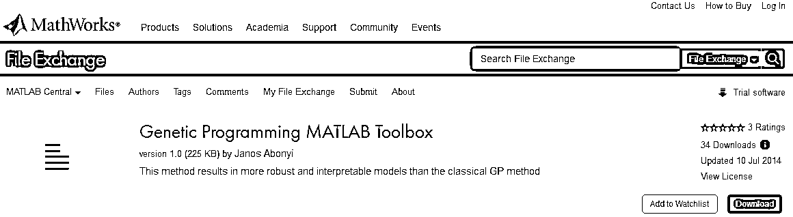

# 【解读】遗传基因程序二元机器代码自动归纳合成算法（第三期免费赠书活动来啦！）

> 原文：[`mp.weixin.qq.com/s?__biz=MzAxNTc0Mjg0Mg==&mid=2653286533&idx=1&sn=ac6f751a3e23f832dbe3bcaf064d7cce&chksm=802e3290b759bb86001cb3dc351ff9df347254372c28ec143a96f718f630c767e9ba7b6c9018&scene=27#wechat_redirect`](http://mp.weixin.qq.com/s?__biz=MzAxNTc0Mjg0Mg==&mid=2653286533&idx=1&sn=ac6f751a3e23f832dbe3bcaf064d7cce&chksm=802e3290b759bb86001cb3dc351ff9df347254372c28ec143a96f718f630c767e9ba7b6c9018&scene=27#wechat_redirect)

**编辑部**

微信公众号

**关键字**全网搜索最新排名

**『量化投资』：排名第一**

**『量       化』：排名第一**

**『机器学习』：排名第三**

我们会再接再厉

成为全网**优质的**金融、技术类公众号

可能这个算法出来已经一段时间了，今天在一个策略网站上偶然发现，觉得很有意思，因此，查阅了一些资料进行学习。

**遗传基因程序二元机器代码自动归纳合成算法**（Automatic Induction of Machine Code with Genetic Programming），简称 AIM-GP。是 Trading System Lab (TSL)公司的一款软件的一个系统。

**下文来自李明：TSL 大中华区产品产品顾问**

遗传基因程序(Genetic Programming, GP)是演化算法(Evolution Algorithm)的其中一种。研究者们，例如瑞典科学家彼特·诺丁(Peter Nordin)博士和美国科学家约翰·R·科赞(John R. Koza)博士等人工智能学者，在 90 年代初便开始积极地开发这种算法的理论和应用。在短短几年之间，多达数百篇计算机学术论文应运而生（1992-98 年，200 多位学者发表超过 800 篇相关 GP 的论文），都是围绕着遗传基因程序这个题目来做的研究，可见科学家们对它寄予厚望。沃尔夫冈·班茨哈夫(Wolfgang Banzhaf)博士在 2013 年发表的论文《遗传基因程序与自然发生现象》(Genetic Programming and Emergence)中更指出，天地万物之中的的自然发生现象(Emergence)在遗传基因程序这种算法本质中客观存在。对很多略懂老子或达尔文的读者来说，这个论证可能使人振奋，因为计算机不再是一般人心目中生硬的软件指令和冷冰冰的硬件在运行一些索然无味的重复性操作！中华文化遗产中老子的道法自然可谓自然发生论(Emergentism)的鼻祖。遗传基因程序更是引用了达尔文理论中的归纳法，通过一群电脑程序不断的进化演变做机器学习(Machine Learning, ML)，帮助预定义的问题寻优解。更浅白地说，遗传基因程序有能力好像天地万物一样，自然地（自动化地）生成懂得解决问题的计算机程序。

二元机器代码自动归纳合成(Automatic Induction of Machine Code, AIM)指的是遗传基因程序算法在计算机最底层，将指令符用二元机器码存储，直接在中央处理器中进行操作，免除了一般程序都需要的程序编译器或复杂的存储记忆体操作，极大地增进了运算速度。事实上，在过去的几十年里，尽管科技日新月异，计算机硬件速度提升迅猛，但是人们要利用计算机来挖掘数据，寻觅稳健交易策略，仍依然需要耗费几月，有时甚至是几年才有机会修成正果。

这里 AIM-GP 的 GP 是采用了遗传基因程序中其中一种程序排列方法——"线性排列式遗传基因程序" Linear Genetic Programming (LGP)。线性排列式遗传基因程序 LGP 有别于"树状排列式遗传基因程序" Tree-based Genetic Programming (TGP)。我们可以理解线性排列式遗传基因程序 LGP 是启发自命令式编程 (Imperative Programming)；树状排列式遗传基因程序 TGP 启发自函数式编程 (Functional Programming)。命令式编程包含一些会影响状态(state)的指令，例如委派变量的数值。大多数商业用编程程序都是命令式编程，例如 C++，Pascal 和 Fortran。很多研究者甚至索性将树状结构下的分支看待成命令式，而不是函数式，因为很多应用程序，用线性排列式处理显得更为自然。

这个算法小编大概看了一下，还是有些复杂，但是，通过介绍。小编找打了关于此算法的一些文献资料。分享出来，方便大家查阅。

**1、MATLAB 关于 Genetic Programming 的工具箱**

> **http://cn.mathworks.com/matlabcentral/fileexchange/47197-genetic-programming-matlab-toolbox**

**2、Python 关于 Genetic Programming 的工具箱**

> **http://deap.readthedocs.io/en/master/tutorials/advanced/gp.html#tree-size-limit-and-bloat-control**

**3、MATLAB 关于 Genetic Programming 的又一个工具箱**

> **http://gplab.sourceforge.net/features.html**

**4、GoldMiner: A Genetic Programming based algorithm applied to Brazilian Stock Market**

**5、GENETIC ALGORITHMS AND GENETIC PROGRAMMING IN COMPUTATIONAL FINANCE**

**6、 Genetic Algorithms with python**

**7、GENETIC PROGRAMMING –NEW APPROACHES ANDSUCCESSFUL APPLICATIONS**

**8、Linear Genetic Programming**

**9、Massively Parallel Evolutionary Computation on GPGPUs**

> **http://www.doc88.com/p-6601990962941.html**

**10、异步 GP 的分析**

> **http://www.doc88.com/p-6408752860729.html**

**11、 GP 如何被想出来**

> **http://www.stumptown.com/diss/chapter1.html**

**12、2014 年，TSL 图文 PPT 介绍 (中)：**

**13、2014 年，TSL 公司 CEO Mike Barna 视频总结 TSL (英)**

**没有附链接的书籍和资料**

**请在后台回复**

**TSL**

**进行获取**

**赠书活动**

**量化投资与机器学习公众号**联合**人民邮电出版社**送出 3**本**《深度学习》

**公众号真心推荐此书**

**圣经啊！！！**

> AI 圣经！深度学习领域奠基性的经典畅销书！长期位居美国亚马逊 AI 和机器学习类图书榜首！所有数据科学家和机器学习从业者的必读图书！特斯拉 CEO 埃隆·马斯克等国内外众多专家推荐！ 深度学习是机器学习的一个分支，它能够使计算机通过层次概念来学习经验和理解世界。因为计算机能够从经验中获取知识，所以不需要人类来形式化地定义计算机需要的所有知识。层次概念允许计算机通过构造简单的概念来学习复杂的概念，而这些分层的图结构将具有很深的层次。本书会介绍深度学习领域的许多主题。 《深度学习》这本书既可以被本科生或研究生用于规划其学术界或工业界生涯，也适用于希望在各种产品或平台上开始使用深度学习技术的软件工程师。

**截止 2017.11.06 12:00**

大家在本篇推文【写留言】处发表留言，**获得点赞数前三的读者，即可免费获赠此书**。届时，工作人员会联系三位读者，寄出此书。

