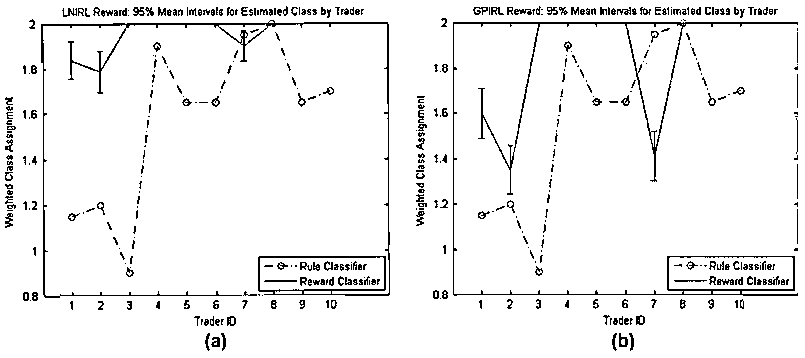

# 【干货】Quantitative Finance 杂志关于量化交易领域排名前十的文章（文末有第二期免费赠书活动）

> 原文：[`mp.weixin.qq.com/s?__biz=MzAxNTc0Mjg0Mg==&mid=2653286500&idx=1&sn=106e28d25e413c816193005ef64c479d&chksm=802e3271b759bb67f5088e176153a51dc945abb373d7eabc5c089adb2ecdd207138bfb667631&scene=27#wechat_redirect`](http://mp.weixin.qq.com/s?__biz=MzAxNTc0Mjg0Mg==&mid=2653286500&idx=1&sn=106e28d25e413c816193005ef64c479d&chksm=802e3271b759bb67f5088e176153a51dc945abb373d7eabc5c089adb2ecdd207138bfb667631&scene=27#wechat_redirect)

**编辑部**

微信公众号

**关键字**全网搜索最新排名

**『量化投资』：排名第一**

**『量       化』：排名第一**

**『机器学习』：排名第三**

我们会再接再厉

成为全网**优质的**金融、技术类公众号

**通告**

从今往后，编辑部会倾向于对国外的 QI&ML 领域做更多的介绍和研究。因此，后续大家看到公众号发布的文章都是以国外为主，尤其在 QI 方面，国内的内容我们会穿插进行，但是会减少许多。我们希望把更多有用的知识分享给大家。后面我们会不定期的在**全网发布公众号独家的电子杂志**，宁缺毋滥，敬请期待！

今天小编为大家分享来自《Quantitative Finance》杂志阅读量排名前十的 10 篇量化金融论文。每一篇都很经典！每一篇都回味无穷，翻看数次！

**所有文章在文章末尾****进行获取**

1Automatic one two three

**介绍：**在本文中，我们展示了如何使用停止和反向过程从市场价格中自动计算市场技术趋势。基本工具是一个所谓的 minmax 过程，表明所有相关的最小值和最大值。 对于 minmax 过程的存在，我们给出了构造性的证明。 根据这个 1-2-3 趋势指标，可以自动实现几个成功的趋势跟踪交易策略。

2Gaussian process-based algorithmic trading strategy identification

**关键字：****逆向强化学习、高斯过程、高频交易、算法贸易、行为金融、马尔科夫决定过程、支持向量机**

**介绍：**In this paper, we consider the basic problems of categorizing and recognizing traders (or, equivalently, trading algorithms) on the basis of observed limit orders.These problems are of interest to regulators engaged in strategy identification for the purposes of fraud detection and policy development. Methods have been suggested in the literature for describing trader behaviour using classification rules defined over a feature space consisting of summary trading statistics of volume and inventory, along with derived variables that reflect the consistency of buying or selling behaviour. Our principal contribution is to suggest an entirely different feature space that is constructed by inferring key parameters of a sequential optimization model that we take as a surrogate for the decision-making process of the traders. In particular, we model trader
behaviour in terms of a Markov decision process. We infer the reward (or objective) function for this process from observations of trading actions using a process from machine learning known as inverse reinforcement learning (IRL). The reward functions learned through IRL then constitute a feature space that can be the basis for supervised learning (for classification or recognition of traders) or unsupervised learning (for categorization of traders). Making use of a real-world data-set from the E-Mini futures contract, we compare two principal IRL variants, linear IRL and Gaussian Process IRL, against a method based on summary trading statistics. Results suggest that IRL-based feature spaces support accurate classification and meaningful clustering. Further, we argue that, because they attempt to learn traders’ underlying value propositions under different market conditions, the IRL methods are more informative and robust than the summary statistic-based approach and are well suited for discovering new behaviour patterns of market participants.

3Empirical properties of asset returns: stylized facts and statistical issues

**介绍：**我们提供一组从统计数据出发的风格化的实证事实分析各类金融市场的价格变动。 我们第一讨论财务时间所有统计研究共同的一些一般问题系列。 然后描述资产回报的各种统计属性：分布特性，尾部特性和极端波动时间和跨越的规律性，线性和非线性回报股票。 我们的描述强调各种各样的属性市场和工具。 然后我们将显示这些统计属性使许多用于研究财务的常见统计方法无效数据集，并检查每一个遇到的一些统计问题案件。

4PAIRS TRADING

**介绍：**经典的不能再经典的论文。本文提出了在高斯噪声中观察到的扩散均值回波高斯马尔可夫链模型。然后将来自校准模型的预测与随后的差价观察值进行比较，以确定适当的投资决策。该方法具有潜在的应用，可以从金融市场的任何数量产生财富，这些数据被视为失衡。

5Statistical Arbitrage in the U.S. Equities Market

**介绍：**经典的不能再经典的论文。本文提出了在高斯噪声中观察到的扩散均值回波高斯马尔可夫链模型。然后将来自校准模型的预测与随后的差价观察值进行比较，以确定适当的投资决策。该方法具有潜在的应用，可以从金融市场的任何数量产生财富，这些数据被视为失衡。

6Optimal leverage from non-ergodicity

7High-frequency trading in a limit order book

**介绍：**We study a stock dealer’s strategy for submitting bid and ask quotes in a limit order book. The agent faces an inventory risk due to the diffusive nature of the stock’s mid-price and a transactions risk due to a Poisson arrival of market buy and sell orders. After setting up the agent’s problem in a maximal expected utility framework, we derive the solution in a two step procedure. First, the dealer computes a personal indifference valuation for the stock, given his current inventory. Second, he calibrates his bid and ask quotes to the market’s limit order book. We compare this ”inventory-based” strategy to a ”naive” best bid/best ask strategy by simulating stock price paths and displaying the P&L profiles of both strategies. We find that our strategy has a P&L profile that has both a higher return and lower variance than the benchmark strategy.

8Risk premia: asymmetric tail risks and excess returns

9Portfolio Selection with Higher Moments

**介绍：**We build on the Markowitz portfolio selection process by incorporating higher order moments of the assets, as well as utility functions based on predictive asset returns. We propose the use of the skew normal distribution as a characterization of the asset returns. We show that this distribution has many attractive features when it comesto modeling multivariate returns. Preference over portfolios is framed in terms of expected utility maximization. We discuss estimation and optimal portfolio selection using Bayesian methods. These methods allow for a comparison to other optimization approaches where parameter uncertainty is either ignored or accommodated in a non traditional manner. Our results suggest that it is important to incorporate higher order moments in portfolio selection. Further, we show that our approach leads to higher expected utility than the resampling methods common in the practice of finance.

10WHAT GOOD IS A VOLATILITY MODEL?

**介绍：**A volatility model must be able to forecast volatility; this is the central requirement in almost all financial applications. In this paper we outline some stylised facts about volatility that should be incorporated in a model; pronounced persistence and meanreversion, asymmetry such that the sign of an innovation also affects volatility and the possibility of exogenous or pre-determined variables influencing volatility. We use data on the Dow Jones Industrial index to illustrate these stylised facts, and the ability of GARCH-type models to capture these features. We conclude with some challenges for future research in this area.

**所有文章****后台回复**

**前 10**

**进行获取**

**赠书活动**

**量化投资与机器学习公众号**联合**机械工业出版社**送出**4 本**《量化交易之路用 Python 做股票量化分析》

**公众号真心推荐此书**

> 作者在百度互联网证券、百度金融等互联网金融公司多年从业经验的总结；涵盖从传统的趋势跟踪技术及统计套利技术，树立对量化交易的正确认识，搭建交易技术与量化技术之间的稳固纽带；给出完整的量化交易知识体系，所有实例均采用真实的交易进行讲解；详解量化基础知识，以及 Python、NumPy、pandas、可视化和数学等量化工具及实例；详解量化择时、选股、资金管理、度量、参数等技术及交易实例；详解机器学习技术在量化交易领域的应用，并给出交易实例。

**截止 2017.11.02 12:00**

大家在本篇推文【写留言】处发表的留言，**获得点赞数前四的读者，即可免费获赠此书**。届时，工作人员会联系四位读者的微信，寄出此书。

