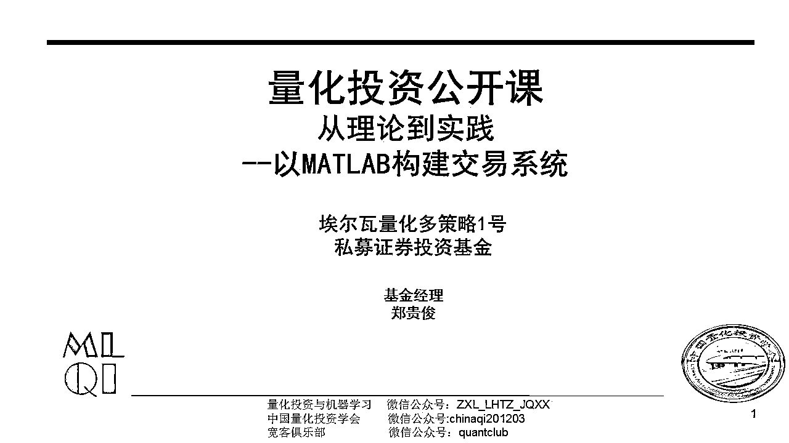
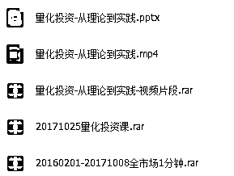
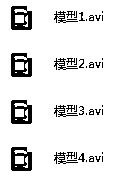
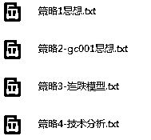
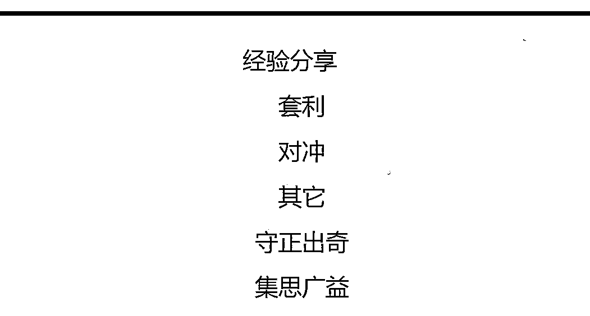

# 【量化投资公开课】从理论到实践——以 MATLAB 构建交易系统

> 原文：[`mp.weixin.qq.com/s?__biz=MzAxNTc0Mjg0Mg==&mid=2653286481&idx=1&sn=2169355f55a4b7c341a5c710eb51e064&chksm=802e3244b759bb524a18bc65106395d9c2490e52777c0a67303f376d83965b67deaea7e06a3c&scene=27#wechat_redirect`](http://mp.weixin.qq.com/s?__biz=MzAxNTc0Mjg0Mg==&mid=2653286481&idx=1&sn=2169355f55a4b7c341a5c710eb51e064&chksm=802e3244b759bb524a18bc65106395d9c2490e52777c0a67303f376d83965b67deaea7e06a3c&scene=27#wechat_redirect)

**编辑部**

微信公众号

**关键字**全网搜索最新排名

**『量化投资』：排名第一**

**『量       化』：排名第一**

**『机器学习』：排名第三**

我们会再接再厉

成为全网**优质的**金融、技术类公众号

**前言**

> 这是公众号特约特约主编郑贵俊同学为大家自制的一个量化投资在线公开课，以**视频+实例**的形式为大家带来郑贵俊同学在量化投资领域的一些投资策略和感悟。
> 
> **公众号特别推荐，希望大家可以学习到一些有关量化投资方面的知识。**

下面是郑贵俊同学为大家写的一段话

**大家好！**

**光阴荏苒，上次发布量化分享的视频还在大学二年级，现在都升学读到研究生二年级了。 

不知这么几年下来，朋友们，同学们是否还继续坚持在这块领域深耕呢？

古语有云，“天下大事必做于细，天下难事必做于易”不管起初的兴趣是源于什么都好，如果坚持走下去了，请相信这句古语。千里之行始于足下，慢慢做，总是会把量化这块学好学到。 

那时候大学给大家做的分享，其实现在回过头来，真的很基础很基础，当时没有管过太多的资产，现在重新发布的视频，融汇了我自身在这块领域这几年的许多想法，许多总结，亲身经历，以及掉过的许许多多火坑得出来的感悟，希望能给每一位同学都多一个经验可以参考，帮助大家学习。

如果有哪些想法想交流，请发送邮件至我的邮箱：***zgjune@mail.ustc.edu.cn***** 

******个人简介******

****郑贵俊****

****中国科学技术大学研究生二年级****

****注册金融风险管理师 FRM®****

****埃尔瓦量化多策略 1 号基金经理****

****中国量化投资学会专家组成员****

****曾任 MATLAB 技术论坛量化投资版主****

****历任多家私募基金金融工程研究员****

****量化投资与机器学习公众号特约主编****

******视频介绍：******

 ******[`v.qq.com/iframe/preview.html?vid=a0565636uc9&width=500&height=375&auto=0`](https://v.qq.com/iframe/preview.html?vid=a0565636uc9&width=500&height=375&auto=0)****** 

******视频分为：******

********

********

********

******经验分享：******

********

******点击****阅读原文******

******即可获取所有课件资料******

******无偿分享！！！******

********