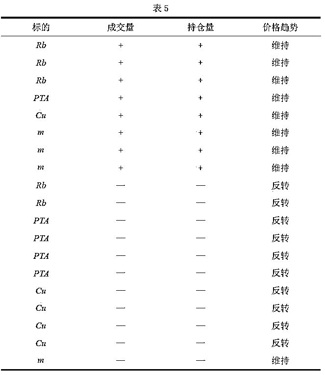
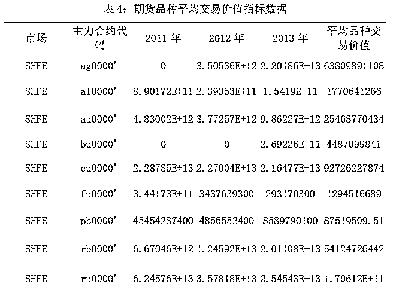

# 【Matlab 量化投资】海龟策略在商品期货市场资金流策略中的应用

> 原文：[`mp.weixin.qq.com/s?__biz=MzAxNTc0Mjg0Mg==&mid=2653286466&idx=1&sn=74f5b4110054b557905e3e3fed6dc432&chksm=802e3257b759bb41961d1b483a47193ce5434a16c84319997ab46db7849bb130204f5dace288&scene=27#wechat_redirect`](http://mp.weixin.qq.com/s?__biz=MzAxNTc0Mjg0Mg==&mid=2653286466&idx=1&sn=74f5b4110054b557905e3e3fed6dc432&chksm=802e3257b759bb41961d1b483a47193ce5434a16c84319997ab46db7849bb130204f5dace288&scene=27#wechat_redirect)

**编辑部**

微信公众号

**关键字**全网搜索最新排名

**『量化投资』：排名第一**

**『量       化』：排名第一**

**『机器学习』：排名第三**

我们会再接再厉

成为全网**优质的**金融、技术类公众号

**挖掘目标**

运用日级 K 线数据对 2011-2013 年数据刻画资金流向，发现资金流向对未来期货的影响，并使用持仓量、成交量和价格结合进行量化选标的，最后将选择的标的运用于量化策略中。

**总体流程**

**资金流向**

**数据预处理** 

对不同标的的 2011-2013 年日级 K 线数据进行分析，将未上市的标的数据进行去空操作。

**期货市场中价格与成交量、持仓量关系研究**

在股票市场中，资金流向(Money Flow)是一个可以反映市场中某个股票的超额需求或供给的标准的技术指标，由于每个买单会有一个对应的卖单，于是真实的资金流向无法确切计算，只能通过其他替代方法来刻画资金的流入和流出，通过高频数据分析，当股票价格上涨时，确定为资金流入，相反，当价格下跌时，确定为资金流出，但是由于期货市场中有做空机制，只根据价格的变化不一定能刻画出资金流入或流出，于是，我们需要对期货市场中价格与成交量、持仓量的关系进行研究。通过对国内外量价关系的文献研究，国外 Clark(1973)提出混合分布假设认为当市场信息发生变动时价格和成交量同时对该信息作出反应，成交量的信息有助于对价格波动的预测，Bessembinder 和 Seguin 对期货市场研究表示，成交量和持仓量对价格波动均有显著影响，华仁海和仲伟俊使用 GARCH 模型验证出成交量与绝对价格波动正相关，但不同期货种类影响不同[2]，白东辉和杨栓军使用 GARCH 模型和 ECM 模型对我国上海铜期货价格成交量与持仓量之间的动态关系进行研究，并利用协整检验和，得到相同结论，即铜期货价格与成交量、持仓量之间存在显著的相关关系。当同时对期货价格施加成交量和持仓量这两个影响因素时，对于铜期货其持仓量和价格波动之间的关系表现为负相关，即持仓量和价格同时增长时，价格波动较小，反之，价格波动较大[3]，本文运用实例就不同标的的情况进行实例分析。

**不同标的的实例分析**

由于 12 至 13 年较 14 年更为相近，本文使用 12-13 年的日级 K 线数据，采取 5 日均线刻画成交量与持仓量的走势，使用收盘价刻画价格的涨跌。对期货标的可分为四类，本文选取了化工品板块中的 PTA 数据，金属板块中的沪铜数据，农产品板块中的豆粕数据，黑色系板块中的螺纹钢数据，使用 Matlab 对不同板块中的不同标的数据画出走势图并选取图中升降势较明显的几个点进行分析。

（1）2013 年 Rb 的成交量、持仓量与价格走势图

根据图 1，在第一根竖线位置时，可看出成交量和持仓量明显下降，此时价格曲线由升势变为跌势，价格波动大。在第二根竖线位置时，成交量及持仓量稳步上升，此时价格维持跌势不变，价格波动率小。在第三根竖线位置时，成交量及持仓量剧烈上升，价格保持跌势不变，价格波动小。在第四根竖线位置时，成交量与持仓量为上升状态，价格稳步上升，其波动率小。在第五根竖线位置时，成交量及持仓量逐步下跌，而价格由跌势变为涨势逆转。

由以上几处分析结果如表所示（以下成交量及持仓量上升由+表示，下降由—表示），

（2）2013 年 PTA 的成交量、持仓量与价格走势图

根据图 2，在第一根竖线位置时，成交量和持仓量明显下跌，价格由升势变为跌势，价格波动率大。在第二根竖线位置时，成交量和持仓量都急剧上升，此时价格顺应原趋势下跌。在第三根竖线位置时成交量和持仓量同时下降，价格曲线由升变降，波动大。在第四根竖线位置时，成交量和持仓量稳步下跌，价格由升至降发生变动，波动大。在第五根竖线位置时成交量和持仓量一起下跌，价格趋势由降变升即波动大。

（3）2013 年 Cu 的成交量、持仓量与价格走势图

根据图 3，可以得知在第一根竖线位置时，成交量和持仓量同时上升，此时价格保持下跌，波动性小。在第二根竖线位置时，成交量及持仓量稳步上升，此时价格由升势变为跌势，价格波动率大。在第三根竖线位置时，成交量及持仓量同时下降，价格又升变跌，价格波动大。在第四根竖线位置时，成交量与持仓量为下降状态，价格由升势变为跌势，其波动率大。在第五根竖线位置时，成交量及持仓量逐步下跌，而价格由涨势变为跌势逆转。

（4）2012 年 m 的成交量、持仓量与价格走势图

根据图 4，在第一根竖线位置时，成交量和持仓量共同上升，价格持续上升，价格波动率小。在第二根竖线位置时，成交量和持仓量都急剧上升，此时价格顺应原趋势上升。在第三根竖线位置时成交量和持仓量同时下降，价格曲线仍保持下降趋势，波动小。在第四根竖线位置时成交量和持仓量保持上升，价格趋势保持上升即波动小。

**资金流向分析**

根据以上不同标的分析，我们发现 Rb 、PTA 、Cu 、m 的成交量、持仓量及其价格趋势如表 5 所示，

通过上表可得不同板块中的 5 个标的在成交量和持仓量同时上升时，价格趋势维持原来状态，波动小，相反，在成交量和持仓量同时下降时，价格趋势进行反转，波动大。价格都是由供求关系所决定的，因而在描述资金流向时，我们将供求关系放于首位，并用持仓量和成交量进行刻画，我们可以由此刻画出资金流向规律，如下所示：

但在农产品板块选取的标的 m 中出现了成交量和持仓量同时下跌价格却维持，说明此规律在农产品板块中不能的到很好的体现，但可以运用于金属、黑色系、化工品板块中，并且资金流向具有连续性，可以用于预测未来价格的涨跌，从而得到收益。

**资金流向策略分析**

海龟策略为在择时入场上，设计一个唐奇安通道，当收盘价突破 50 个交易日里胡盘中最高价，即上轨，发出多头信号；当收盘价低于 20 个交易日里的盘中最低价，即突破下轨，为空头信号。该策略在择时入场十分灵敏。得出结果如图 5 所示，本文使用 2012-2013 年螺纹钢 K 线数据，运用量化社区中的海归策略对资金流向进行分析，

图中可观测到 2012 年 1 月 20 日开始做第一次交易，买入 231 手做多单，即价格已突破上轨，预测此处该涨，但是由图中可以清晰看出此时价格下跌，本文分析此时成交量的变化，使用该日成交量与该日前 4 日的平均成交量进行比较，得出该日成交量小于前四日成交量的平均，即成交量下降，由持仓量曲线可看出持仓量在持续下跌，根据资金流向模型，价格上升时，成交量和持仓量同时下跌，则趋势反转，价格应下跌，从而印证在期货市场中，仅靠价格并不能很好地判断趋势，应结合资金流向。

**投资交易品种的组合**

随着期货市场上市品种的日益丰富，投资者必会面临投资品种的选择问题，而商品投资传统的投资组合理论告诉我们，不能把所有的鸡蛋都放在一个篮子里面，这意味着投资组合中商品数量越多，对于分散风险越有效。因此，当众多的交易品种同时出现交易机会的时候，交易品种的组合和配比显得尤其重要。

**选取期货市场交易组合品种的相关指标**

（1）价格波动率

对于期货的投资者而言，价格的变动情况能够反映市场对于新行情的反应情况，标的价格波动的剧烈程度，能够在一定程度上反映出资金流向的变化幅度越大，并且若价格波动性越大意味着投资者的盈利机会也越大。因此，我们选择价格波动率为选取条件之一。

首先获取 2011-2013 年四个交易所不同品种的各交易日 T 以及对应收盘价，通过计算出每个交易日收盘价 Pi 的对数值与前一交易日的收盘价 Pi-1 的对数值之差 Xi.。并且得出这些对数值的标准值 ，再乘上一年中包含的各个品种对应交易日数量 T 的平方根，得到价格波动率 HV 。具体公式如下:

其中，Pi 是交易所某品种第 i 个交易日得收盘价，Pi-1 是交易所某品种第 i-1 个交易日得收盘价，T 为交易所某品种在一段时间内的交易日数量。

（2）活跃度

由于标的换手率越高意味着背后的交易越活跃，而期货换手率是通过成交量和持仓量综合得出的结果，其中持仓量是期货市场行情发展的内在动力,增仓说明多空双方对当前集中成交价位的看法有重大分歧，表着一段行情的开始减仓，代表着一段行情的结束，反映多空双方对当前集中成交价位除以其对应交易日数量，减少由于新品种上市等原因带来的误差，以更好的刻画该品种的活跃度 HS。

（3）成交量

道氏理论中明确强调成交量在确定趋势中的重要作用，考虑到成交量是推动行情发展非常重要的指标，通过成交量对于市场决策得配合分析，本文基于“量”的配合角度将成交量作为选取交易组合品种重要指标。

（4）交易价值

由于合约的价值直接关系到期货市场的流动性、安全性和效率，并且合约乘数对于投资者的交易风险起到关键性，而交易标的的价格波动所带来的合约价值变化越大，市场交易风险也越大，本文为降低选取的标的组合进行投资时产生的风险性，将交易价值作为重要指标。

交易价值=每日收盘价*合约乘数*每日成交量

综上所述，本文是通过上述价格波动性的描述，市场交易活跃度体现的资金流动情况，从量价配合角度选取的成交量指标，以及为降低所选标的风险性考虑到的标的交易价值指标综合评价不同交易所的交易品种。

**基于秩和比的投资组合模型**

**（1）模型建立**

1）将分别计算出每年所有主力合约的价格波动性、活跃度、成交量，交易价值四个指标值，对各年所得的结果进行求和再除以各交易品种对应的交易日数量 T，得出所有指标值的平均值。

2）考虑上市时间等因素，再次筛选部分品种，不纳入秩和比排序品种。

3）将各品种得出的 4 个指标通过秩转换，等权重处理，获得无量纲统计量 RSR 综合排名。下面为秩和比的投资组合的基本步骤：

基本步骤如下：

Step1:编秩。将 n 个交易品种的价格波动性、活跃度、成交量、交易价值 4 个指标排列成 n 行 4 列的原始数据表。编出各交易品种各个指标的秩。其中效益型指标按从小到大编秩，成本型指标从大到小编秩，其余类型指标数据编平均秩，得到

Step2:计算秩和比（RSR）。根据公式：

得出各交易品种综合多指标的秩和比（RSR）排序。

**（2）模型求解**

1.品种及数据选取与预处理

由于每个期货品种的主力合约已做成统一连续的标准合约，并且其主力合约即为当日持仓量最大的合约，因此，本文初步选取上海期货交易所、郑州商品交易所、大连商品交易所、中国金融期货交易所四大交易所 2011 年 1 月 1 日-2013 年 12 月 31 日 54 个品种的主力合约。

2.模型的求解

将分别计算出每年所有主力合约的价格波动性、活跃度、成交量，交易价值四个指标值，进行 3 年求和再除以各交易品种对应的交易日数量 T，得出 2011 年-2013 年指标值的平均值。由于数据表明 3 年内某些品种的没有交易记录，所以本文剔除 ni、sn、CS、PP、S、IC、TH、CG、T、LR、MA、SF、ZC、hc 这部分无效值，最后得出如下表 1 至表 4 各指标数据。

根据表 1 至表 4 中各指标的数据信息，本文利用 RSR 综合排序法对四个指标的结果得出各品种排名。考虑到不同品种的上市时间不同，因此，本轮筛选过滤 2013 年新上市品种国债期货、动力煤、石油沥青、铁矿石、鸡蛋期货和粳稻期货，纤维板期货、胶合板期货，由于铁矿石在综合排序中排第 5 位，排名靠前，所以将铁矿石留下，并选取前二十名，再将不满足资金流向的农产品筛选掉，仅留下白银、橡胶、玻璃、沪深 300 指数股指期货、焦煤、燃料油、线材、LLDPE、PTA、黄金和螺纹钢品种。经过上述筛选后，根据所出的品种以及按照 A 题附件中板块说明中的分类划分可得下表， 

本文在对余下的品种进行筛选时，结合秩和比排名的同时尽量在不同的交易所与不同的板块中选取，最终选取了郑州商品交易所的 PTA 品种，上海商品期货交易所的螺纹钢，大连商品期货交易所的铁矿石和焦炭。

**基于资金流向的动量/反转策略**

**基于资金流向的动量/反转策略理论**

反转效应是市场中较为常见的情况，在股票市场中反转效应是指前一段时间跌的股票，未来一段时间将变为涨的趋势，而在商品期货市场中，由于做空机制的存在，无论是涨或者跌都可以盈利机会，而反转效应是指前一段时间做多（做空）趋势改变为做空（多）。

本文中的投资策略的主要论据是针对于投资者保守心理和信心不足时的心理，当投资者在期货市场亏损到一定程度后，容易收到“恐惧”心理的影响，从而进行“追跌杀涨”行为。当投资者盈利到一定价格时，投资者会进入观望状态，等待合适的入场时机。

再结合前文已验证资金流向规律中成交量、持仓量和价格之间明确的关系，由于成交量和持仓量在判断资金流向以及在市场趋势判断中的不同作用，我们在这三个关系的基础上进行验证入场因子的准确性，若验证结果说明信号信号准确，则利用价格运动过程中的惯性进行交易，若信号不准确则与信号提供的信息反向交易。

基于资金流向规律所得出的动量/反转策略是根据投资心理学原理，利用成交量和持仓量，判断价格运动的趋势和方向是否原趋势一致，可能则继续按原趋势操作，不可能则立即发生逆转，从而跟随价格趋势将获得显著的超额收益。

**策略说明：**

入场：若第一次入市，半仓建仓。根据所选标的组合往年趋势分析，各品种总体趋势偏于做空，若无重大突发情况，价格由于惯性作用，故第一次入市可以做空

建仓

若非第一次入市，成交量上升，持仓量下降，趋势将尽，反手操作；否则按原趋势操作。

止损：当做多头时，价格跌 A%时，则平仓再满仓开空仓，进行止损；当做空头时，价格涨 A%时，则平仓再满仓开多仓，进行止损。

止盈：当做多头时，价格涨 B%时，则平仓止盈；当做空头时，价格跌 B%时，则平仓止盈。

离场后记录当前价格，以此作为之后入场交易价格的基准，进入观望状态，等待进场时机。

资金管理：等权重分配

基于前面筛选出的期货组合，基于资金流向的动量/反转策略理论是一种趋势跟踪系统。属于隔夜交易策略。此策略结合持仓量、成交量、价格三者之间的规律与动量投资策略的理论基础，分别从择时入场、止盈止损、资金管理这几个角度分析。其主要内容为：

（1）刻画持仓量与成交量的涨跌：

期货交易中，除价格外，但成交量和持仓量是刻画资金流向的重要指标。通过观察成交量水平，人们能够更好地估量市场运动背后买入或卖出的压力，若成交量上涨说明市场对上涨的强度和迫切性更高，因而，可以利用成交量来验证价格运动作为识别价格变化可靠与否的重要指标。持仓量反映市场流向情况。持仓量增加，表明资金在流入市场，如果持仓量减少，则表明资金在流失。与成交量一样，可以利用它来验证价格运动的强度，作为识别价格变化是否可靠。因此，本策略对成交量与持仓量的涨幅进行如下刻画：

计算前 T 日的成交量均值，若当前的成交量大>前 T 日成交量均线，则记为成交量上涨，

计算前 T 日的成交量均值，若当前的成交量大<前 T 日成交量均线，则记为成交量下降。

计算前 T 日的持仓量均值，若当前的持仓量大>前 T 日持仓量均线，则记为持仓量上涨，

计算前 T 日的持仓量均值，若当前的持仓量大<前 T 日持仓量均线，则记为持仓量下降。

（2）择时入场：

若第一次入市，则半仓建仓。由于市场趋势不可能常年上涨或者下跌，一般情况下，盈利时多数人满仓主要是由于贪婪，其后果是吃套；当出现亏损时，不少人空仓会恐惧最后踏空。所以，投资者会考虑到期货市场的风险不会轻易满仓操作而会留出部分资金以防不备之需，而半仓操作者，心态十分平衡，在克服了贪婪之心和恐惧之心的同时，并且规避了吃套和踏空的风险。

若非第一次入市，当价格按离场后记录的价格为基准涨到一定值时，初步判定做多信号，通过资金流向规律对应情况验证做多信号的准确性，当成交量上升，持仓量下降时，意味原来的趋势将尽，视为反转趋势，则反手操作，其余情况则表示支持此趋势继续操作；当价格按离场后记录的价格为基准降时，初步判定做空信号，同样遇到成交量上升，持仓量下降时判定反转，其余按照原趋势入场做空或做多。

（3）离场设计：

止损：当做多头时, 价格跌 A%时，则平仓再满仓开空仓，进行止损；当做空头时，价格涨 A%时，则平仓再满仓开多仓，进行止损。

止盈：当做多头时，价格涨 B%时，则平仓止盈；当做空头时，价格跌 B%时，则平仓止盈。

离场后记录当前价格，以此作为之后入场交易价格的基准，进入观望状态，等待进场时机。

（4）资金管理：为了使合理的资金配置对于收益能够稳定提升，此策略中采用的是等权重分配。

**实例验证**

本文的策略研究时间选择从 2014 年 1 月 1 日到 2015 年 12 月 31 日，由 RSR 综合选择方法，对各个品种的波动率、换手率、成交量以及交易价值指标进行筛选。选取铜、螺纹钢、焦炭、铁矿石、PTA 作为研究品种。由于期货合约具有一定的到期时间，到期后便“交割”，而不同时间段内期货主力连续合约也会不同，因此，我们在提取出 Auto-trader 交易平台的各期货合约的主力连续合约进行操作。

1、交易策略简述说明：

入场：若第一次入市，做空半仓建仓。根据所选标的组合往年趋势分析，各品种总体趋势偏于做空，若无重大突发情况，价格由于惯性作用，故第一次入市可以做空建仓若非第一次入市，成交量上升，持仓量下降，趋势将尽，反手操作；否则按原趋势操作。

止损：当做多头时，价格跌约 5%时，则平仓再满仓开空仓，进行止损；当做空头时，价格涨约 5%时，则平仓再满仓开多仓，进行止损。

止盈：当做多头时，价格涨约 9%时，则平仓止盈；当做空头时，价格跌约 9%时，则平仓止盈。

离场后记录当前价格，以此作为之后入场交易价格的基准，进入观望状态，等待

进场时机。

资金管理：等权重分配

**策略开发平台**：**AT 量能策略研究平台**基于 MATLAB，支持股票、期货、期权等全市场品种的策略研究和自动化交易，目前已经有超过 300 家高校的数学背景的学生、近万名专业量化用户。

2、绩效分析

通过平台测试出的分析结果来看，取得的交易品种组合得出的详细权益曲线有着可观且相对稳定的收益，整体收益曲线是处于平滑向上的趋势。即本策略与基准相比收益是较好的并且较稳定。

虽然策略得出的最大回撤率不是非常小，但夏普比是调整风险收益的重要指标，它为正值说明可获得的报酬率是大于波动风险的，反之，负值则说明风险大于收益。Sortino 比率与夏普比率类似，用于投资组合偏离其平均跌幅的程度，数值越大，说明承担同样下跌风险的情况下可以获得更多的超额收益。通过观察结果得出的夏普比率和 Sortino 比率已远远超过 1，并且比例越高，意味着这个投资组合越佳，；Calmar 比率描述的是收益和最大回撤之间的关系，Calmar 比率数值越大，说明本文策略表现越好。另外，净利/最大潜在亏损，手续费/净利指标结果远远超过在[-1,1]的上界之外，综上可知本文策略风险调整后的收益能力非常好。并且，一般而言，策略的规则越多，模型的参数越多，就越有可能发生数据迁就偏差，而本策略所选的参数少，资金风险控制相对较好，防止过度优化之后呈现数据模式偏离真实性。

