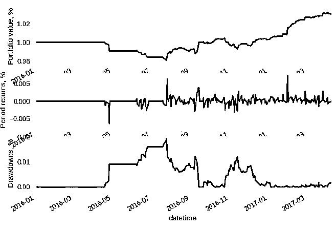

# 【精选】神经网络应用于算法交易（文末有免费赠书活动）

> 原文：[`mp.weixin.qq.com/s?__biz=MzAxNTc0Mjg0Mg==&mid=2653286459&idx=1&sn=bade18dce9aeecf2815fc9d3000c39f1&chksm=802e322eb759bb380d7cba1d27a09d8aba096cfa9e972f4e2a68b4b44ec4a9537ba1393479cc&scene=27#wechat_redirect`](http://mp.weixin.qq.com/s?__biz=MzAxNTc0Mjg0Mg==&mid=2653286459&idx=1&sn=bade18dce9aeecf2815fc9d3000c39f1&chksm=802e322eb759bb380d7cba1d27a09d8aba096cfa9e972f4e2a68b4b44ec4a9537ba1393479cc&scene=27#wechat_redirect)

**编辑部**

微信公众号

**关键字**全网搜索最新排名

**『量化投资』：排名第一**

**『量       化』：排名第一**

**『机器学习』：排名第三**

我们会再接再厉

成为全网**优质的**金融、技术类公众号

作者：Alex Honchar

编译：编辑部

https://medium.com/@alexrachnog?source=post_header_lockup

今天编辑部带来关于在基于金融时间序列的预测模型案例，我们将通过神经网络来增强一个经典的移动平均策略，并表明它真的是有所改善相对原策略。

**基于技术分析的投资策略**

但这种交易策略有一个主要的缺陷：在震荡行情中，策略没有过多的触及信号并交易，这样我们也很难赚到钱。

**那我们怎么应用机器学习去改善呢？**

我们来看下面的策略假设：在移动平均线金发生叉死叉的时刻，我们会对某些特征的变化做出预测，如果我们真的期望这个交叉点是可行的，我们便选择相信这个交易信号。 否则我们会跳过。 

作为预测目标，我想用偏度来衡量分布的不对称性。 让我们假设，如果我们预测分布的变化，这意味着我们目前的趋势将来也会发生变化。

**输入数据**

在这里，我们将使用 pandans 和**PyTi**生成更多的指标。 我们将使用 MACD，Ichimocku  cloud，RSI 等指标。 所有这些指标算出来的值将形成多变量时间序列，用 flatten 函数处理后，使用在 MLP 或继续使用再 CNN 或 RNN 中。

**PyTi**（https://github.com/kylejusticemagnuson/pyti）

获得的指标特征连接到 OHLCV 元组以产生最终向量。

**网络结构**

在这里我们展示一个如何训练正则化 MLP 进行时间序列预测的例子：

这里的““Novel”是增加小的噪声给单层神经网络的输入和输出。它非常类似于 L2 正则化，数学解释如下：（http://www.deeplearningbook.org/）

我们在 2012 年至 2016 年间以 AAPL 的价格训练我们的网络，在 2016-2017 年进行样本外测试。

训练网络后，我们绘制收盘价，均线和垂直线的交叉点：红色线和橙色线代表我们要交易的点。绿色线代表我们不去交易的点。

**神经网络结果**

[(‘Total Return’, ‘1.66%’),

(‘Sharpe Ratio’, ‘16.27’),

(‘Max Drawdown’, ‘2.28%’),

(‘Drawdown Duration’, ‘204’)]

Signals: 9

Orders: 9

Fills: 9

我们将如何使用“红色”和“橙色”交易信号，并跳过绿色。 我们可以看到，策略减少了 2 次交易，并帮助我们减少了第一个 drawdown，最终提高了几乎两倍的回报！

[(‘Total Return’, ‘3.07%’),

(‘Sharpe Ratio’, ‘27.99’),

(‘Max Drawdown’, ‘1.91%’),

(‘Drawdown Duration’, ‘102’)]

Signals: 7

Orders: 7

Fills: 7

**部分代码**

**总结**

通过这篇文章，我们可以使用神经网络来完成（至少一段时间）有关金融时间序列预测的一些研究。 但是，我们不能直接用它来预测价格知否涨跌。 我们必须考虑不同的数据源和目标值，认真对待处理过拟合和超参数优化，那么我们可以得出什么结论呢？

1、注意过拟合！ 你会在 99％的情况下做到这一点，不要完全相信你的回测曲线，它一定是有问题的。

2、除了收盘价，波动收益率，偏度等，尝试着预测其他特征。

3、如果有不同的数据源，请使用多模态学习。

4、不要忘记找到正确的超参数！

5、编写一个可以混合一些经典机器学习的策略！

**赠书活动**

**量化投资与机器学习公众号**联合**机械工业出版社**送出 3 本《深度学习与计算机视觉》

> 西门子高级研究员田疆博士作序力荐！Google 软件工程师吕佳楠力、英伟达高级工程师华远志、理光软件研究院研究员钟诚博士力荐！本书全面介绍了深度学习及计算机视觉中*基础的知识，并结合*常见的应用场景和大量实例，带领读者进入丰富多彩的计算机视觉领域。作为一本“原理 实践”教程，本书在讲解原理的基础上，通过有趣的实例带领读者一步步亲自动手，不断提高动手能力，而不是枯燥和深奥原理的堆砌。本书适合对人工智能、机器学习、深度学习和计算机视觉感兴趣的读者阅读。阅读本书要求读者具备一定的数学基础和基本的编程能力，并需要读者了解 Linux 的基本使用。

**截止 2017.10.24 12:00**

大家在本篇推文【写留言】处发表的留言，**获得点赞数前三的读者，即可免费获赠此书**。届时，工作人员会联系三位读者的微信，寄出此书。

