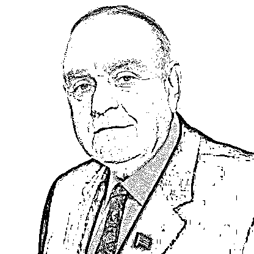

# 【重磅】2017 福布斯全球亿万富豪榜——对冲基金榜

> 原文：[`mp.weixin.qq.com/s?__biz=MzAxNTc0Mjg0Mg==&mid=2653286426&idx=1&sn=d0a952b6465d5dbee852d395686f6634&chksm=802e320fb759bb197d2b29d13bbbbd4ecb5bf6cf472e761a980c1c4d72796579b11c059a4de8&scene=27#wechat_redirect`](http://mp.weixin.qq.com/s?__biz=MzAxNTc0Mjg0Mg==&mid=2653286426&idx=1&sn=d0a952b6465d5dbee852d395686f6634&chksm=802e320fb759bb197d2b29d13bbbbd4ecb5bf6cf472e761a980c1c4d72796579b11c059a4de8&scene=27#wechat_redirect)

**编辑部**

微信公众号

**关键字**全网搜索最新排名

**『量化投资』：排名第一**

**『量       化』：排名第一**

**『机器学习』：排名第三**

我们会再接再厉

成为全网**优质的**金融、技术类公众号

据华尔街日报报道，福布斯在日前发布了 2017 年富豪榜单，在 400 人的榜单中，今年进入榜单的最低门槛是 20 亿美元，高于去年的 17 亿美元，再创记录新高。所有上榜者的财富总净值从 2.4 万亿美元，攀升至 2.7 万亿美元，平均净值从 60 亿美元上升至 67 亿美元。

今天小编和大家一起看看榜单中有哪些大佬是在对冲基金界中驰骋江湖的。

**01****福布斯******沃伦巴菲特****

**在最低价格时买进股票，然后就耐心等待。别指望做大生意，如果价格低廉，即使中等生意也能获利颇丰。**

**02****福布斯****乔治·索罗斯**

# **“****人之所以犯错误，不是因为他们不懂，而是因为他们自以为什么都懂。****”**

**03****福布斯******詹姆斯·西蒙斯****

**“我是模型先生，不想进行基本面分析，模型的优势之一是可以降低风险。而依靠个人判断选股，你可能一夜暴富，也可能在第二天又输得精光。”  **

**04****福布斯****雷伊****·****达里奥**

**“**对错误做出反思，从中获取经验教训。**”**

**05****福布斯****史蒂夫·科恩**

**“我关注风险，关注交易本身，但我不考虑金钱。玩牌，在我学习承受风险的过程中起了决定性作用。”**

**06****福布斯****大卫·泰珀**

**有人评价说,“和他在一起做投资感觉像在飞一样,有几个小时无聊透顶,然后就是一阵子心惊肉跳”。**

**07****福布斯****肯格********·********里芬**

**对冲基金界最年轻的基金经理。不仅一手创建了美国城堡投资集团(Citadel Investment Group)，而且将其打造成为全球最大且最成功的对冲基金之一。**

**08****福布斯****约翰·保尔森**

**“下跌是让人沮丧的，但你不能只看着过去，也要想想将来。”**

**09****福布斯**** 大卫·肖**

**个学霸？一个科学家？ 一个金融巨头？**

**10****福布斯****伊斯雷尔·英格兰德**

**对冲基金界算是个异类，他被称为对冲基金纯粹主义者。**

**11****福布斯****布鲁斯·柯夫纳**

## **全世界最成功交易员之一**

**12****福布斯****约翰·欧文德克**

## **人类投资经理再也无法击败电脑的时代终将到来了**

**13****福布斯****大卫·西格尔**

**数学天才**

**14****福布斯****斯但菜·德鲁肯米勒**

**全球最成功的宏观对冲****基金****经理之一。是索罗斯为“量子基金”所选的第十位也是最成功的接班人。**

**15****福布斯****保罗·都铎·琼斯二世**

**一代宗师**

**16****福布斯****朱利安‧罗伯逊**

**朱利安·罗伯逊是唯一一个能与乔治索罗斯并提的人物，与索罗斯不同，他专注于股票市场，并且以善于购买“传统价值型”的股票而纵横华尔街，只是偶尔参与一下债券与外汇市场，交易市场很少有常胜将军，他也是因“价值投资”而失败。**

**17****福布斯****约翰·阿诺德**

**天才交易人**

**18****福布斯****丹尼尔·齐夫**

# **师出高盛的“生猛对冲者”**

**19****福布斯****Daniel Loeb**

**从 300 万到 175 亿**

**20****福布斯****利昂·库珀曼**

**对冲基金****巨头、欧米加顾问公司掌门人。在美国对冲基金界，利昂·库珀曼(Leon Cooperman)享受“传奇投资者”的声誉。他于 1991 年创立的****对冲基金****——欧米茄顾问公司(Omega Advisors)，曾与****朱利安·罗伯逊****的****老虎基金****、****乔治·索罗斯****的****量子基金****以及梅里韦瑟的****长期资本管理公司****并称国际四大对冲基金。**

**21****福布斯****克里夫·阿斯内斯**

**克里夫·阿斯内斯曾师从诺贝尔经济学奖得住尤金·法玛，此后年纪轻轻便成为了风云华尔街的高盛量化神童，其创建的 AQR 资本管理公司亦被认为是华尔街表现最突出的量化对冲基金之一。**

**22****福布斯****保罗·辛格尔**

**将对冲基金大佬 Paul Singer 形容为“秃鹫般的冷血猎手”可能并不为过。****Paul Singer 对投资猎物有着不达目的不罢休的惊人执着，能把猎物追到天涯海角去。他也因此闻名业界。**

**23****福布斯****诺姆·戈特斯曼**

**2010 年 10 月，以色列裔美国投资者诺姆·戈特斯曼与合作伙伴以 16 亿美元把公开上市的对冲基金 GLG Partners 出售给总部位于英国的曼氏集团（Man Group），从而创造了全世界最大的对冲基金之一，合并后资产达到 710 亿美元。**

**24****福布斯****Larry Robbins**

**25****福布斯****格伦·杜宾**

**杜宾这样形容他与摩根大通的关系：“一些愤世嫉俗的人指责我把自己的公司卖了出去，但这是以一种强有力的方式来重塑公司。与以前相比，我们的业务更加多元化。通过与投行合作，我们也不需要什么事情都从零做起。”**

在此，向各位大佬膜拜！

