# 【深入研究】主流量化投资策略与 Smart Beta 策略剖析

> 原文：[`mp.weixin.qq.com/s?__biz=MzAxNTc0Mjg0Mg==&mid=2653286408&idx=1&sn=9e350d09987c76b3cd9e28e8aa5ec8c0&chksm=802e321db759bb0b01da3c639c0fb3c30ae964557bf8c74a9844a70aec854e88f813a02a6e56&scene=27#wechat_redirect`](http://mp.weixin.qq.com/s?__biz=MzAxNTc0Mjg0Mg==&mid=2653286408&idx=1&sn=9e350d09987c76b3cd9e28e8aa5ec8c0&chksm=802e321db759bb0b01da3c639c0fb3c30ae964557bf8c74a9844a70aec854e88f813a02a6e56&scene=27#wechat_redirect)


**编辑部**

微信公众号

**关键字**全网搜索最新排名

**『量化投资』：排名第一**

**『量       化』：排名第一**

**『机器学习』：排名第三**

我们会再接再厉

成为全网**优质的**金融、技术类公众号

```py
编辑部特约作者：wwqqer **Smart Beta**众所周知，beta 在 CAPM 模型中衡量了相对于持有整个市场所带来的风险溢价（risk premium）的大小。整个市场通常用市场投资组合（market portfolio）或市场指数基金（market index fund）来表示。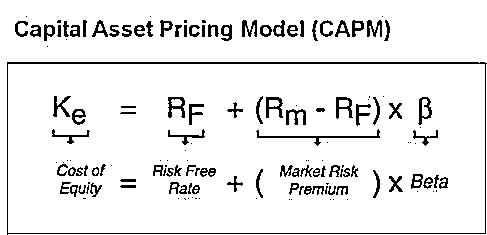市场指数通常都是市值加权（market capitalization weighted）。**如果把市场指数换成按非市值加权的指数或投资组合，其得到的 beta 即为 smart beta**，又被称为 alternative beta 或 exotic beta。理由是因为这些新指数的权重是由某些量化算法得出的，看上去比最普通简单的市值加权要更“聪明”些。 最近比较流行的算法有： **等权重加权**（Equal Weight, EW）: 
**等风险加权**（Risk Parity），可以看作是调节波动率后的等权重: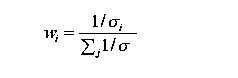
**等风险贡献加权**（Equal Risk Contribution ，ERC），可以看作是考虑了资产回报率之间协方差后的 risk parity: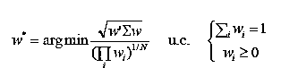
**最小方差加权**（Minimum Variance, MV）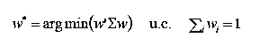
**最大多样化加权**（Maximum Diversification，MD）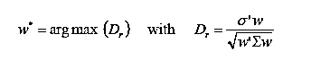如下图所示，从左至右，这些加权法需要的参数逐渐增加。ERC，MV，和 MD 都属于“robust risk parity”因为它们把协方差考虑在内。最经典的均值-方差优化法（mean-variance optimization）需要知道预期回报，方差与协方差，因为此优化法同时使风险最小化，预期回报最大化，不过，这里涉及到因子对准问题（Factor Alignment Problem, FAP），下文中会提到。smart beta 策略只考虑波动率与协方差，所以，我们把它们看作只关注风险（risk-based）而不关注预期回报（return-based）的策略。 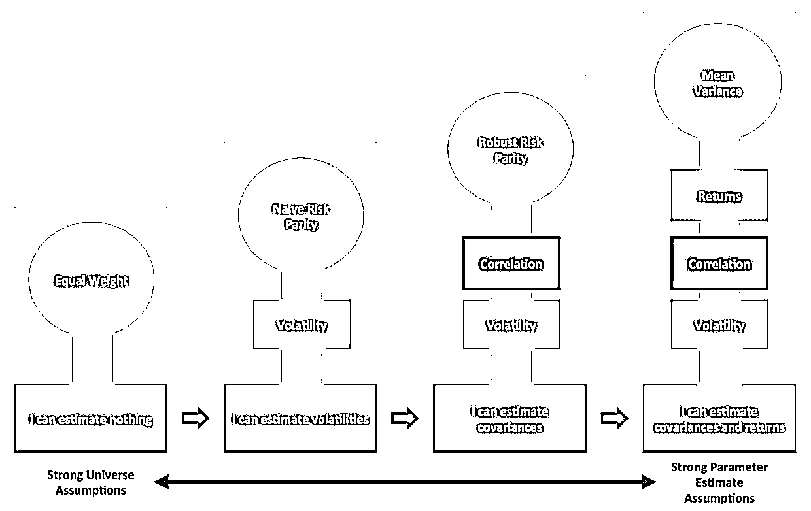**随机折现因子，SDF**事实上，CAPM 模型是资产定价模型（asset pricing model）的一个比较有名的特例，因为广义的随机折现因子（stochastic discount factor，SDF）在 CAPM 中被狭义的市场投资组合所代表了。 按资产定价模型的定义：p = E(mx)，任何资产的价格就是折现后所得回报的期望，其中 x 是资产在未来的回报，m 就是随机折现因子 SDF。利用协方差的定义，我们得到： 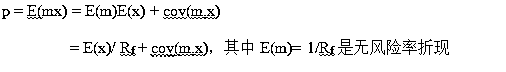所以，任何资产的价格等于用无风险率折现后所得回报的期望再加上一个风险溢价（risk premium），而这个溢价是 SDF 与未来回报的协方差。 按照 John Cochrane 的说法（见[3]），投资者的状态有‘好’和‘坏’之分（good vs. bad times）。‘坏’的状态一般指个人财富降低，导致其发生的原因可以是由于个人负债过高，或收入降低等等造成的。而 SDF 是定义这个状态‘坏’时的指标，状态越‘坏’，指标越高。由于大部分资产在状态‘好’时，回报很高，所以这个协方差通常为负。更重要的是，如果一个资产的回报与个人状态好坏无关，即与 SDF 无关（风险中性状态，risk-neutral），那它的价格只能由无风险率决定（协方差为零）。 我们把上式写成预期回报率（expected return）的形式，会更直观些：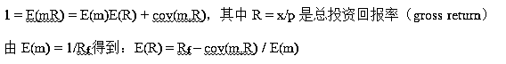进一步推导得到预期资产回报率的“beta 表达式”：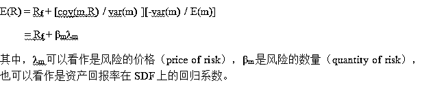
换句话说，人们只有承担系统性风险（systemic risk，与 SDF 相关）才能取得收益。如果承担非系统性风险（idiosyncratic risk），则无任何益处。 **由此可见，SDF 作用很重要，但是它只存在于理论中。人们千方百计地在真实世界里寻找替代品，即所谓的风险因子（risk factor）**。所以，我们也可以这样认为：人们承担的（系统性）风险越大（尤其在状态‘坏’时），作为补偿的因子风险溢价（factor risk premium）也越大（尤其在状态‘好’时）。高风险的资产必须有足够高的预期回报率，即足够低的价格，才能吸引人们来购买并持有它。 **多因子模型**由于我们在 CAPM 中假设 SDF 只与市场投资组合回报有关，所以市场投资组合是 CAPM 中唯一的因子。在此基础上，我们也可以进一步假设 SDF 与多个因子线性相关：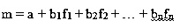
由此得到多因子模型。因子不同，对投资者状态‘坏’时的定义也不同，由此承担的风险敞口以及获得的溢价也会不同。Fama-French 三因子模型是多因子模型中的经典代表。诺奖得主 Gene Fama 和 Dartmouth 大学教授 Ken French 通过对大量股票中某些共同特征进行筛选，从而得到有别于大盘因子的两个新因子：规模与价值（HML，SMB）用以组成三因子模型。这个模型恰好能很好地解释股票的预期回报。后来，该模型又加上了动量因子（momentum，见[4]），遂成四因子模型。从结构上讲，这与 Stephen Ross 提出的套利定价理论（arbitrage pricing theory）相似。唯一不同的是，APT 直接从 equilibrium-pricing 模型入手，假设资产回报率可以由一系列因子表示。 **基于因子的资产配置策略**前面啰里啰唆说了这么多，我只想强调因子的重要性。需要指出的是，上文中提到的广义资产定价模型与风险因子不只局限于股票市场，而是适合任何资产和资本市场。可以这么说，风险因子才是资产之间联动的根本原因，资产配置实际上是因子的配置。我们可以把各种资产比作各种食物，把各种因子比作各种营养，比如维生素。理论上来说，我们既可以通过摄取不同食物来获得不同维生素，也可以通过直接服用维生素来获得所需营养。比如，为了治疗脚气，人们即可以多吃谷物，猕猴桃，蓝莓等富含维生素 B1 的食物，也可以直接服用维生素 B1 药片。 如同某一食物含有多种营养一样，买入并持有某一个资产可能会带来不同的因子风险敞口（factor risk exposure）。比如，在美国 NASDAQ 上市的百度，它的股票价格即包含了科技板块的风险，也包含了中小版块的风险，另外，由于公司的总部在中国，它还包含了中国经济发展的风险。当然，还可能包括一些其他未知风险。这也是多因子模型中资产表现评估（performance assessment）的精髓。 同样道理，如果我们只想要某单一风险，如同维生素 B1 药片，我们就要巧妙选取资产来达到此目的。在上文提到的 Fama-French 三因子模型中，Fama 和 French 为我们很好地展示了如何对大量股票进行筛选，把具有共性的多支股票组合在一起，构造出所需要的因子（factor mimicking portfolio）。人们根据不同的风险偏好选择不同因子，以获得不同的因子风险敞口从而赚取不同的因子风险溢价，比如，动量因子，基本面指数（见[4]，[5]）等等。 至于如何发现新的有用的风险因子，则不在本帖讨论范围内。不过，下图展示了资产配置策略的发展过程与新风险因子的发现密不可分。这些新因子现在已被大众广泛应用于投资中了。 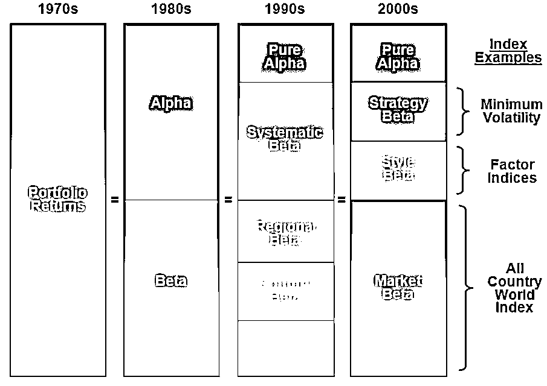70 年代，人们开始将投资组合用于主动投资管理中（active management）。 80 年代，市场指数基金的流行使人们更加便捷且廉价地投资整个市场，因为 CAPM 模型让他们意识到只有承担系统性风险（systemic risk）才能取得收益，其风险及收益的大小由 beta 来衡量。而那些市场超额回报则由 alpha 来衡量。 90 年代，人们不再局限于市场这个单一因子，APT 和 Barra 多因子模型扩大了人们选择因子的范围，其中包括国家地域因子，行业因子，宏观因子等（关于 Barra 模型，见[6]）。 2000 年之后，人们对因子的认识又扩展到了新领域：风格因子与策略因子。比如，Fama-French 三因子及 Carhart 四因子模型中的规模，价值，和动量因子。新的因子又比如 carry，低波动率，流动性（liquidity），基本面因子，以及本帖介绍的 smart beta 策略等。更重要的是，人们意识到之前他们认为的 alpha，其中有很大一部分是非传统的 beta。**那些业内人士把这些 beta 包装成 alpha 在推销**（sell beta as alpha，见下文“另类投资”部分）。 随着 ETF 的流行，人们能够越来越方便地接触到不同因子并直接应用于投资中，尤其是应用于被动投资中。与对冲基金，共同基金，期货等相比，ETF 的优点是更透明，成本更低，进入市场的门槛更低。一些较受欢迎的因子 ETF 或 smart beta ETF 包括：RSP（标准普尔 500 等权 ETF），SPLV（标准普尔 500 低波动率 ETF），FNDB（Schwab 美国基本面指数 ETF）等等。 **全天候式投资组合（All-weather Portfolio）**上文中提到了宏观因子（macro factors），就不得不提一下与之有关的资产配置策略：全天候式投资组合（All-weather Portfolio）。此策略是美国知名对冲基金 Bridgewater 的负责人 Ray Dalio 长期研究的成果，其核心观点是将宏观因子，经济情景（economic scenario），和上文中提到的等风险权重（risk parity）结合在一起。 宏观因子与资产回报之间的相关性很低，尤其是在短期，但使用经济情景可以在长线投资中弥补这个不足。另外，由于一般投资者不喜欢借钱来投资（leverage aversion），这造成了投资组合中股票等高风险资产的权重高于理论中的最优值。使用等风险权重可以纠正这一偏差。 这里，宏观因子主要考察的是经济增长和通货膨胀，并由此定义四种经济情景：
（1）经济增长上升，通胀上升
（2）经济增长上升，通胀下降
（3）经济增长下降，通胀上升
（4）经济增长下降和通胀下降。

然后，从历史数据中找出资产价格的变化与这些经济情景的关系，从而确定可投资的资产以及相应的权重，使得投资组合在每个经济情景中分配到的风险相等（如下图所示）。这样，随着时间的推移，该投资组合能够经受住各种宏观风险的冲击，“全天候式”的名称由此而来。 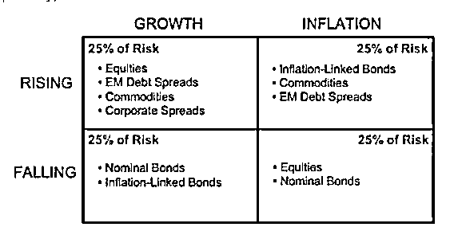 不过，全天候式投资组合在 2013 年遇到了些小麻烦。在标准普尔 500 指数增长 30%的情况下，Ray Dalio 旗下的全天候式投资组合基金的回报率为-3.9%。于是，全天候式投资这个概念也遭受了质疑 。但我认为资产配置的重要功能之一就是帮助保护投资者的财富，防范风险。所以其分散风险的优势要在长线投资中才能显现出来，人们不应该太在意短期的失利，下文中会提到。 **耶鲁模式 Yale Model** 耶鲁大学捐赠基金（Yale Endowment）由于其在同行中长期傲人的投资表现（见[7]），已经被视为是资产配置行业的一个榜样，简称耶鲁模式（Yale Model）或常春藤投资组合（Ivy Portfolio）。耶鲁模式之所以能取得不错的收益，主要得益于其在另类投资（alternative investment）中的高配置，包括各种私募基金，对冲基金，风险资本（venture capital），房地产等。近年来，其占整个投资组合的比重高达 60%（见[7]）。

耶鲁基金从上世纪 90 年代就开始投资当时颇具神秘色彩的私募基金和对冲基金了。这些基金的特点是乏人问津，投资准入门槛高，因此其收益可以说是来源于价值因子和低流动性因子（见[8]，[9]）。 虽然，这些因子给耶鲁基金带来了可观的回报，但在 08 金融危机中，由于人们的恐慌性抛售，低流动性资产重创了该基金。从理论上来讲，这符合上文中提到的因子投资的特性，即人们承担的（系统性）风险越大（尤其在状态‘坏’时），作为补偿的因子风险溢价（factor risk premium）也越大（尤其在状态‘好’时）。 然而 08 金融危机过后，在标准普尔 500 屡创新高的情况下，耶鲁基金的资产始终没有超过 08 年的最高点。一个很重要的原因是因为耶鲁基金的成功模式开始被不少养老金机构和规模较小的大学捐赠基金效仿，导致了在另类投资中的风险溢价大幅减少。耶鲁基金在其年报中也承认了这一点（见[10]）。但它近年来仍能在投资表现上对同行保持微弱的优势，其成功的关键在于它能够找到最优秀的基金经理来管理投资，这在其年报中也提到了。可惜的是，这些最优秀的基金经理中的大部分都已不接受新的资金。因此，这个成功的关键只适用于耶鲁自己而无法被他人复制。 由此可见，耶鲁基金在可预见的未来仍可能继续领跑这个行业，但它作为一种已被大众所熟悉的投资模式不可能在短期内重塑辉煌。 **另类投资并不另类**随着耶鲁基金的成功，那些往日不为人知的另类投资（alternative investment）也掀开了它们神秘的面纱。以其中的对冲基金为例（扫盲贴见[11]，[12]），其高回报及低相关性吸引了人们来研究它。 研究结果显示对冲基金的回报能提供的 alpha 非常有限，而有很大一部分是来自各种 beta，我有一个帖子专门讨论了这个现象（见[13]）。除去少数明星基金，大部分对冲基金能取得回报的一个重要原因并不是因为它们能提供下行风险的对冲（protection on downside risk），恰恰相反，而是因为它们在市场下行的时候回报足够糟糕，也就是说它们对尾部风险（tail risk）的敞口很大（见[14]，[15]）。这与我们之前的认知不太一样，但符合因子投资的特征。 大家可能都知道股神巴菲特与另类投资公司 Protege Partners 之间的十年赌约吧。巴菲特在 2008 年初跟对方打赌说“an index fund will beat a fund of hedge funds over ten years”。那到目前为止（2014 年）结果怎样呢？有“好事”者把两者做了一个比较（见[24]），发现巴菲特建议的投资暂时领先（见下图，笔者注：Protege Partners 已于 2017 年认输）。 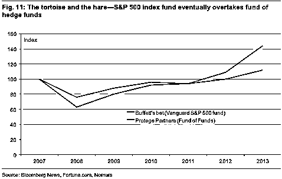 进一步的研究发现，如果我们把指数基金降低杠杆并收取费用，我们竟然得到了与对冲基金同样的收益！（见下图） 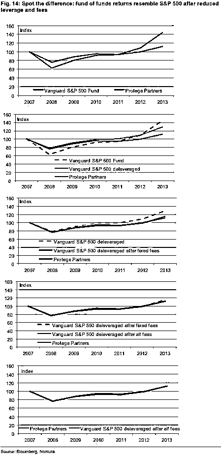 另一方面，如果想要得到私募基金的回报，我们只有增加杠杆并收取费用即可。由此可见，另类投资行业经常把已知的 beta 当成 alpha 来推销。然而，随着因子研究的不断深入，人们对另类投资的理解也越来越深刻。另类投资已变得不再另类。 **重新审视 Smart Beta**在了解了因子与资产之间的关系后，我们现在再来重新审视一下 Smart Beta 策略，看看它们是不是有特别之处呢？回答是否定的。 研究显示这些 Smart Beta 策略其实都是某些因子的组合（见[16]）。比如，等权重加权法偏向于规模因子。这个很容易理解，因为这种加权法使小盘股获得与大盘股同样的权重。又比如，最小方差加权法偏向于低 beta 因子与低波动率因子。然而，等风险加权法与等风险贡献加权法更偏向于低 beta 因子和规模因子。 如下图所示，Smart Beta 策略与上文中提到的其他因子策略同属一个均值-方差框架内，但正如上文中提到的，Smart Beta 策略的着重点是风险，而其他因子策略的着重点是预期回报（risk-based vs. return-based）。不过，最后的效果是相似的，都具有某些因子偏向（factor tilt）。 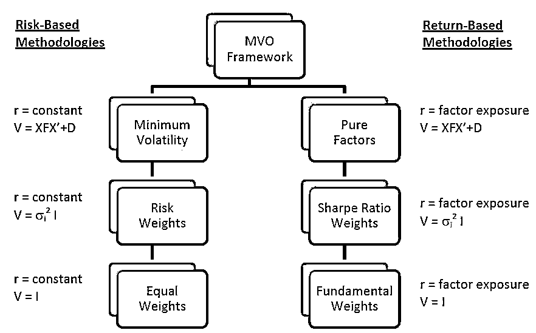 更令人意想不到的是，与 Smart Beta 正好反向操作的策略竟然也能赚钱（见[17]）。究其原因，原来这些反向策略仍就偏向规模与价值因子。即使是随机投资组合（random portfolio，即著名的“猩猩掷飞镖选股法”，在《漫步华尔街》一书中屡次被提及，见[18]）也有类似的因子偏向（factor tilt，下图所示）。

由此可见，Smart Beta 策略能跑赢大盘就不足为奇了，因为它们承担了一定的因子风险。 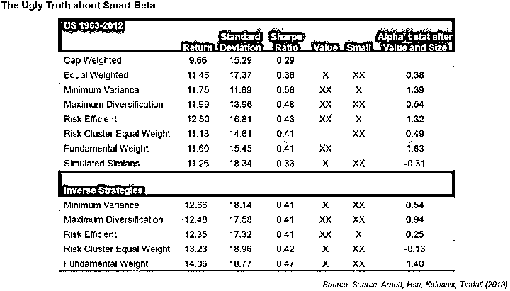 既然谈到了均值-方差优化框架，这里就顺便提一下因子对准的问题（Factor Alignment Problem）。此问题的出现是因为在均值-方差优化法中的预期回报，风险与优化问题的约束条件（optimization constraints）三者所侧重的因子有时不尽相同（misalignment）。

比如，在预测预期回报中使用的因子可能在风险模型中没有被使用到。当我们运用优化算法时，更恶化了这个问题，因为我们可能低估了那部分因子的风险，从而在使预期回报最大化的过程中，高估了与风险模型无关的那部分因子的预期回报（见[19]）。

庆幸的是，Smart Beta 策略和其他因子策略都只侧重均值-方差优化法中的一部分，从而避免了此问题。 虽然 Smart Beta 策略只是普通的因子配置，但它如此受欢迎有它的道理。我认为主要原因有下列几个：

（1）美联储的 QE 大幅降低了固定收益类资产的回报，使得投资者不得不寻找其他投资门道来增加收益，
（2）08 金融危机中的恐慌和之后美联储的 QE 都影响了市场对各种资产的真实定价功能，资产与资产间原有的联系减弱了。取而代之的是，大部分资产都随着美联储的货币政策起舞。“risk-on/off”模式使得传统的资产分散化投资（diversification）失灵了。
（3）投资者们仍然对 08 金融危机时财富大幅缩水记忆犹新，所以比起资产的预期回报，他们更注重风险的控制，更偏爱能控制风险的策略，
（4）08 金融危机后，投资者希望在投资中减少人为操纵的因素，更偏爱透明度高，原理简单的投资产品，
（5）依照某些算法或规则产生的投资策略（rule-based strategy）可以大大降低由于人们行为上的偏差（behaviour bias）而造成的损失，
（6）传统的对冲基金和共同基金的高费用一直受人诟病。因此，这些主题明确，成本更低，且看上去能控制风险的 Smart Beta 策略在经过精心包装后迅速受到了大众的追捧。目前掌握着金融市场大部分资金的机构投资者（institutional investors），比如养老基金，大学捐赠基金，资产管理公司，保险公司等都在往这个方向发展，这股趋势对人们投资理念的影响深远。 **市场与因子风险溢价**虽然因子投资有种种优点，但是，我们没有任何理论可以保证某一个因子策略可以始终跑赢市场。事实上，我们经常看到的是这样的情形：某一个策略或资产在某一段时间内的表现持续地领先整个市场，通过媒体的报道和业界专业人士的包装，普通投资者们立刻对它们趋之若鹜。于是，这些策略中对应的资产价格井喷式地被抬高，预期回报大幅降低，直到泡沫破裂，重新回归长期均线为止。这样的例子比比皆是，比如 90 年代的增长型股票策略，08 金融危机前的新兴市场策略，危机后的黄金，低波动率策略，高股息策略等等。 投资者持有资产时因为包含了风险因子才会得到风险溢价，用以补偿他们所承担的某一种系统性风险，我们知道风险溢价是随时间变动的（time varying），我们不知道何时能够得到补偿。这也是为什么股神巴菲特不断鼓励人们不要在意一时的得失也不要随意改变投资风格，而要做长线投资。只有这样获得溢价补偿才是大概率事件。巴菲特本人就用他大半生的经历来证明这个理念的正确性。如果我们用多个因子构造出一个投资组合，我们就可以利用它们之间稳定的低关联性等优点进行分散化投资，以避免上述单因子策略出现的损失。美国著名对冲基金 AQR 就巧妙地利用了因子的这些优点构造投资组合并取得了持久且不错的收益（见[20]）。 市场是个零合游戏（zero-sum game），任何异于市场的投资，必定有一个与之对应的反向投资，而它们在长期都将回归到市场这个动态的均衡点上（equilibrium）。任何想跑赢市场的投资策略（包括因子策略，择时策略等）只适用于一部分人，因为这需要另一部分人反向操作来支持他们。如果市场内的大部分人都采用同一种策略，那新的市场均衡点就形成了，投资策略也就失去了意义。这也是为什么包括对冲基金在内的另类投资在被大众熟悉后就失去了往日的光环。 有人担心如果市场上大量的资金流向指数基金和被动投资策略，主动投资的交易减少会导致市场失去发现资产真实价值的功能。我倒不这么认为，因为从本帖的分析中我们了解了，只有长期持有整个市场投资组合才是真正的被动投资。除此之外的其它异于市场权重加权的策略或指数都是主动投资，因为它们都具有某些因子的偏向。为了保持这些因子敞口，人们要定期地主动地进行再平衡调整（rebalance，即始终持有对某个因子偏向最强的资产，抛弃偏向最弱的资产）。只不过，主动投资的控制权不在投资者而在指数或 ETF 管理公司那里。无论如何，主动投资仍是市场中的大多数。 另一方面，传统意义上的主动投资（包括共同基金，对冲基金）从长远看并不会消失。尽管主动投资的表现不尽如意，收费也较高。如下图所示，以代表对冲基金整体水平的指数 HFRX 已经连续十年跑输仅由股票和债券组成的简单投资组合了。 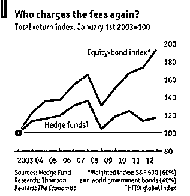 但是投资者们寄希望于将来能够选到更优秀的基金经理来跑赢被动投资，而且主动投资的参与者越少，能跑赢的概率越大，因此，投资者们仍然坚守着自己的主动投资仓位尽管有一些下降（见[21]，[22]）。投资者的这个看似愚蠢的决定其实是经过理性思考后做出的。 这就是主动投资与被动投资之间此消彼长的辩证关系，假设在极端情况下，资产的价格反映了所有信息，那么人们就没有动力去主动寻找新的信息。大家都被动接受信息的结果是整个市场没有信息。那么，这时候主动寻找新信息就可以占得先机。此关系可以看作是对有效市场假说（EMH）的一个注解。所以，完全有效的市场是不稳定的均衡点，永远不可能达到。市场始终处在半 informative 半 uninformative 的状态，两者的人数多少取决于信息的成本和市场本身的结构（见[23]）。比如，在像中国这样不成熟市场中，由于种种原因使得获得信息的成本较高，从而使主动投资者更可能取得较高的回报。不过，随着市场的不断完善，获得信息的成本降低，越来越多的投资者会加入到被动投资的阵营中。 **结语**总而言之，风险因子才是资产之间联动的根本原因，它描述了资产间某些共同特征。资产配置的实质是因子的配置。大规模的资产配置投资很难不涉及到某些因子敞口，而且，因子投资的特性会不断激励人们挖掘新的因子。随着资产定价理论的不断发展，我们不知道的 beta 会越来越少。**参考文献**[1]Fund: The rise of smart beta （http://bbs.pinggu.org/thread-2526779-1-1.html）[2]量化投资——从普通人到理性人（http://bbs.pinggu.org/thread-2872816-1-1.html）[3]John Cochrane, Asset Pricing, 1999, Chapter 1 and 2 （http://bbs.pinggu.org/thread-520857-1-1.html）[4][原创] 浅析动量因子（附带 Matlab/SAS 程序及经典文献 85 篇，全部免费）（http://bbs.pinggu.org/thread-2986322-1-1.html）[5]华尔街系列】指数投资新发现 The Fundamental Index: A Better Way to Invest（http://bbs.pinggu.org/thread-3054567-1-1.html）[6]Barra 模型 (http://bbs.pinggu.org/thread-3123543-1-1.html)[7]解密世界最赚钱耶鲁基金是怎样进行资产配置的（http://bbs.pinggu.org/thread-3128561-1-1.html）[8]Mladina and Colye, “Yale’s Endowment Returns: Manager Skill or Risk Exposure?”, The Journal of Wealth Management, Summer 2010[9]Franzoni et al, “Private Equity Performance and Liquidity Risk”, August 2011[10]2013 The Yale Endowment - Yale Investments Office[11]【推荐】一文读懂美国对冲基金行业（http://bbs.pinggu.org/thread-3132585-1-1.html）[12]对冲基金扫盲帖（http://bbs.pinggu.org/thread-3116465-1-1.html）[13]如何复制对冲基金的成功？（http://bbs.pinggu.org/thread-3135025-1-1.html）[14]Baele et al, “Flights to safety”, Finance and Economics Discussion Series, Federal Reserve Board, 2014[15]Jiang and Kelly, “Tail Risk and Hedge Fund Returns”, Chicago Booth Paper No. 12-44, November, 2012[16]Melas and Kang, “Applications of Systematic Indices in the Investment Process”, Journal of Indices, August 2010[17]Arnott et al, “The Surprising Alpha From Malkiel’s Monkey and Upside-Down Strategies”, The Journal of Portfolio Management, Summer 2013[18]【华尔街系列】最经典金融入门书：A Random Walk Down Wall Street (2011)（http://bbs.pinggu.org/thread-2962765-1-1.html）[19]Ceria et al, “Factor Alignment Problems and Quantitative Portfolio Management”, The Journal of Portfolio Management, Winter 2012[20][专题系列] 福布斯杂志（Forbes）揭秘世界知名对冲基金 AQR 制胜交易策略！附带 29 篇文献（http://bbs.pinggu.org/thread-3015563-1-1.html）[21]Pastor and Stambough, “On the Size of Active Management Industry”, January 2010[22]如果指数基金的表现更好，为什么主动式管理基金会更受欢迎呢？（http://bbs.pinggu.org/thread-1033334-1-1.html）[23]Grossman and Stiglitz, “On the Impossibility of Informationally Efficient Markets”, American Economic Review, 1980[24]"The Hare Gets Rich While You Don’t. Back the Passive Tortoise", Nomura Research Report, 2014
```

来自：经管之家

