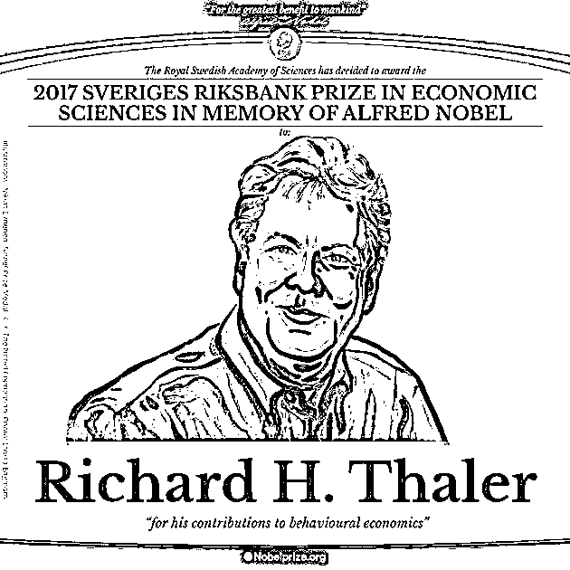
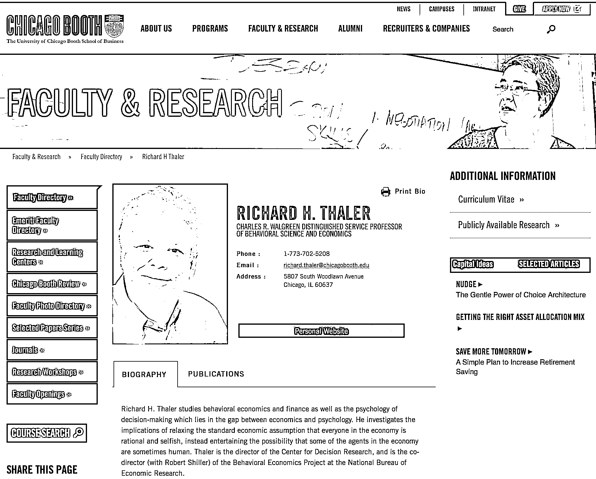
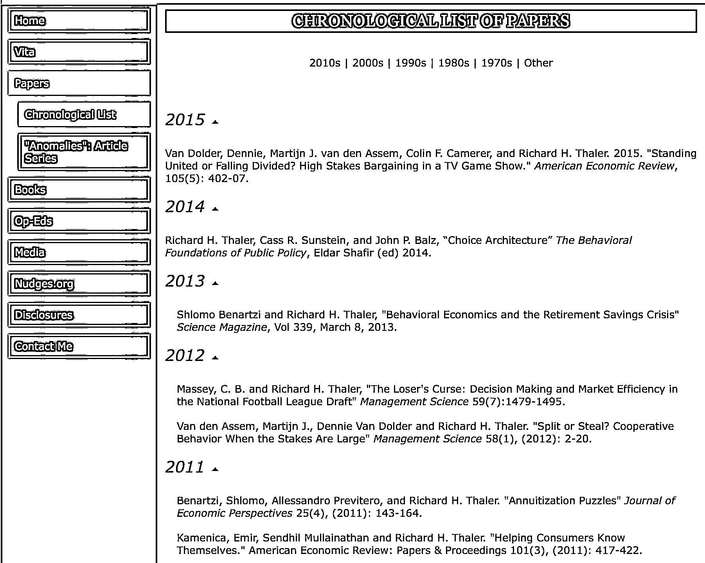
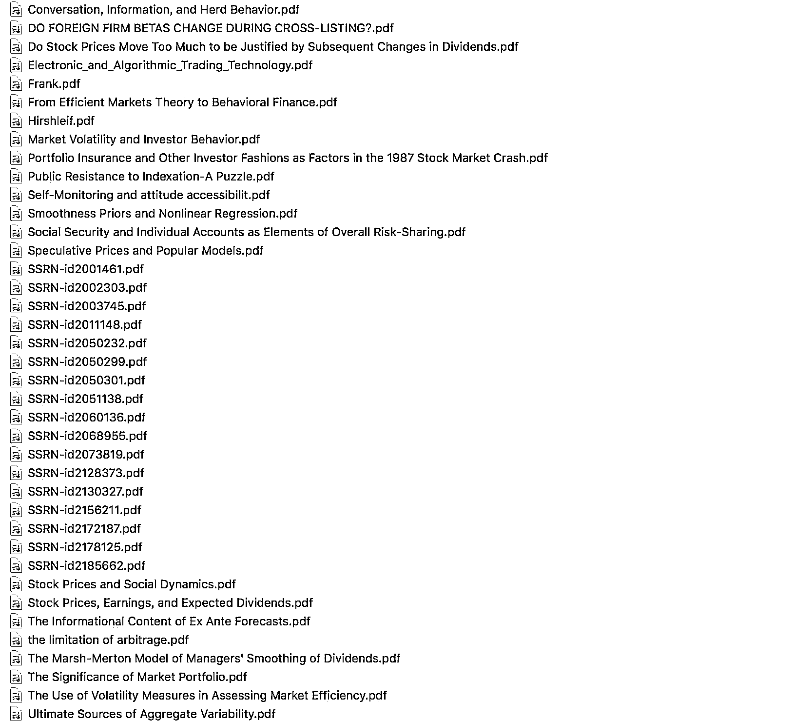
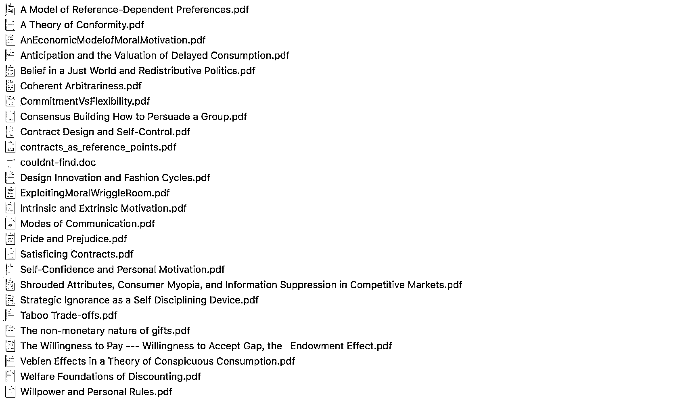

# 【精选干货】有关行为经济学的（10 多本书籍）+（130 多篇论文）致敬诺贝尔经济学奖！

> 原文：[`mp.weixin.qq.com/s?__biz=MzAxNTc0Mjg0Mg==&mid=2653286392&idx=1&sn=f3dd6c7926a797f6111701146d78b529&chksm=802e2dedb759a4fb8fd7806f820f874223246a8cf040e394b98a7333857be8ab39a88870cd66&scene=27#wechat_redirect`](http://mp.weixin.qq.com/s?__biz=MzAxNTc0Mjg0Mg==&mid=2653286392&idx=1&sn=f3dd6c7926a797f6111701146d78b529&chksm=802e2dedb759a4fb8fd7806f820f874223246a8cf040e394b98a7333857be8ab39a88870cd66&scene=27#wechat_redirect)

**编辑部**

微信公众号

**关键字**全网搜索最新排名

**『量化投资』：排名第一**

**『量       化』：排名第一**

**『机器学习』：排名第三**

我们会再接再厉

成为全网**优质的**金融、技术类公众号

北京时间 10 月 9 日 17 时 45 分，2017 年诺贝尔经济学奖揭晓。瑞典皇家科学院诺贝尔奖评审委员会宣布，将今年诺贝尔经济学奖授予 72 岁的美国经济学家、芝加哥大学教授理查德·Ｈ塞勒（Richard H.Thaler），以表彰他在行为经济学上的贡献。

**公众号特此收集了部分关于行为经济学方面的文章（相关资料太多）**。希望大家有所收获。总共有 350M，后续我们会分享更多，这些基本上大家可以看一段时间啦！

大家可以在理查德·Ｈ塞勒（Richard H.Thaler）的个人主页查看有关他的论文。

主页链接：

https://www.chicagobooth.edu/faculty/directory/t/richard-h-thaler#publications|BoothTab1

论文链接：

*http://faculty.chicagobooth.edu/Richard.Thaler/research/chronological.html*

**这是此次分享的部分**

**内容太多，大家下载自行查看**

**关注者**

**从****1 到 10000+**

**我们每天都在进步**

在后台回复

**行为经济学**

即可获取资料

有些人不知道**后台回复**如何操作

为大家介绍一下：

**国庆后第一天工作**

**是不是很迷茫啊！**