# 名校排行榜：上海交大位居内地 CS 排名第一！清华包揽 AI 综合实力及毕业生竞争力第一！

> 原文：[`mp.weixin.qq.com/s?__biz=MzAxNTc0Mjg0Mg==&mid=2653286377&idx=1&sn=a6af7d67893fe34002f2c31a274c8a50&chksm=802e2dfcb759a4ea5a44d0eb76be1081edcd9fd429be065ae80c7e8f01dd8695b07b0b4c50cd&scene=27#wechat_redirect`](http://mp.weixin.qq.com/s?__biz=MzAxNTc0Mjg0Mg==&mid=2653286377&idx=1&sn=a6af7d67893fe34002f2c31a274c8a50&chksm=802e2dfcb759a4ea5a44d0eb76be1081edcd9fd429be065ae80c7e8f01dd8695b07b0b4c50cd&scene=27#wechat_redirect)

**编辑部**

微信公众号

**关键字**全网搜索最新排名

**『量化投资』：排名第一**

**『量       化』：排名第一**

**『机器学习』：排名第三**

我们会再接再厉

成为全网**优质的**金融、技术类公众号

本文授权转自 AI 科技大本营（微信 ID：rgznai100）

21 世纪什么人才最吃香？程序员！

<inherit style="display: block;text-align: justify;">为什么这么说？</inherit>

<inherit style="display: block;text-align: justify;">国家统计局今年最新发布的消息显示，2016 年全国城镇单位就业人员平均工资 57394 元。其中最赚钱的行业是信息传输、软件和信息技术服务业，2016 年平均工资为 122478 元，首次打败金融业成为新霸主。金融业工资水平退居次席，2016 年平均工资为 117418 元。</inherit>

<inherit style="display: block;text-align: justify;">此外，有报道表示，程序员凭借着丰厚的薪资，已经成为相亲市场上的香饽饽。</inherit>

<inherit style="display: block;text-align: justify;">在移动互联网和 AI 浪潮的推动下，程序员未来的好日子显然还很长。</inherit>

<inherit style="display: block;text-align: justify;">这也就不难理解，为何这么多人会选择 CS（计算机科学）专业，甚至很多其他专业的人也纷纷转行。</inherit>

<inherit style="display: block;text-align: justify;">不过，学校和学校之间还是有差距的。对于想报考 CS 专业的学生来说，毕业后是否好找工作显然是必须提前考虑的。</inherit>

<inherit style="display: block;text-align: justify;">近日，QS 全球高等教育集团发布的 2018 年度全球毕业生就业竞争力排名，以及 MIT 公布的全球院校 CS 实力排名，或许能帮你在择校时作出更好的决策。</inherit>

<inherit style="display: block;text-align: justify;">**一、毕业生就业竞争力排名**</inherit>

<inherit style="display: block;text-align: justify;">QS 毕业生就业竞争力排名有 5 个指标组成，分别是：校友成就、雇主与学生的联系、雇主声誉、毕业生就业率、以及与企业的科研合作。中国共有 36 所进入前 500 名，其中内地高校 25 所，香港地区高校 4 所，台湾地区高校 7 所。</inherit>

<inherit style="display: block;text-align: justify;">全球排名前 10 的榜单几乎被英美澳占领，其中斯坦福大学排名第一，紧随其后的分别是加州大学洛杉矶分校（UCLA）、哈佛大学、悉尼大学、麻麻省理工学院（MIT）、剑桥大学、墨尔本大学、牛津大学、加州大学伯克利分校（UCB），而中国的清华大学则从去年的全球第三下降到了第十。</inherit>

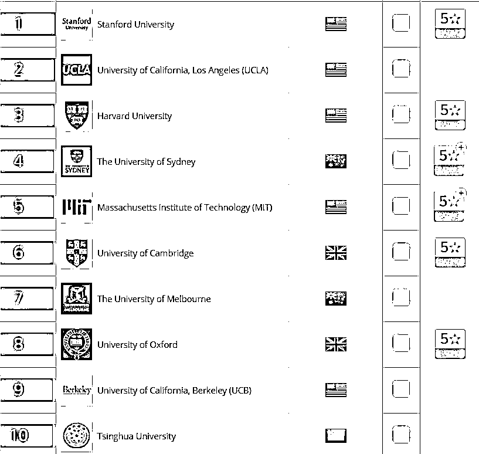

中国内地上榜高校中，除了清华大学之外，进入 100 强的还有：第 23 名的北京大学、第 27 名的复旦大学、第 38 名的浙江大学、第 46 名的上海交通大学。

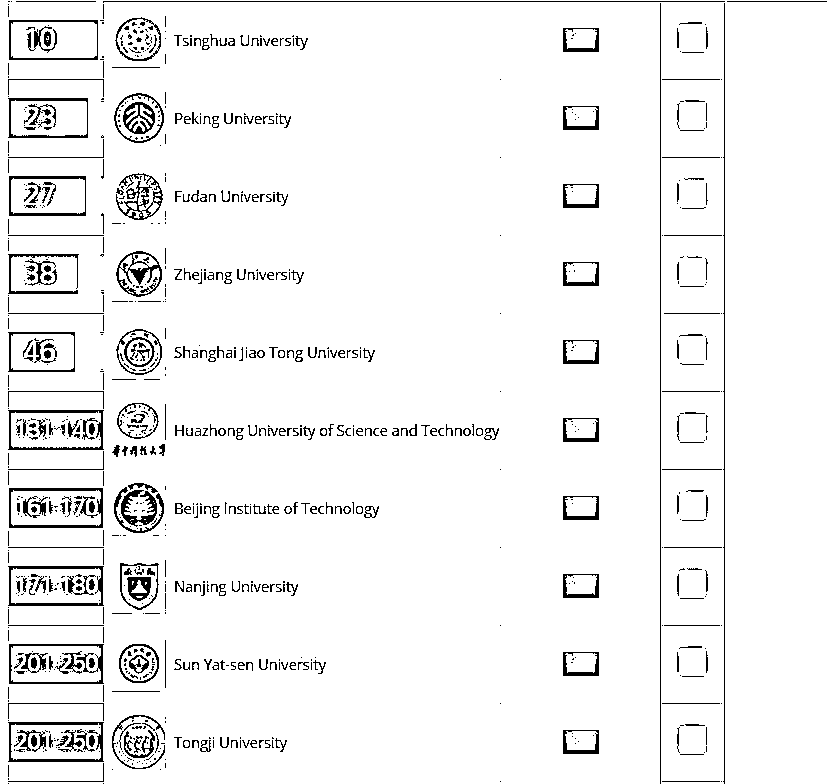

<inherit style="display: block;text-align: justify;">其余排名靠前的高校还包括华中科技大学、北京理工大学、南京大学、中山大学、同济大学等。</inherit>

<inherit style="display: block;text-align: justify;">**二、CS 专业排名**</inherit>

<inherit>上面的这个排名更多的是将学校作为一个整体来进行评估的，对于想要报考 CS 的学生来说，专业排名也至关重要。</inherit>

<inherit>近日，马萨诸塞大学安姆斯特分校的 Emery Berger 教授公布了一个全球院校 CS 实力排名的项目 CSRankings。该排名主要基于院校教员在计算机科学领域的各大顶会所发布的论文数量，包含了 4 个领域：人工智能（AI）、系统（Systems）、理论（Theory）、跨学科领域（Interdisciplinary Areas）。</inherit>

<inherit style="display: block;">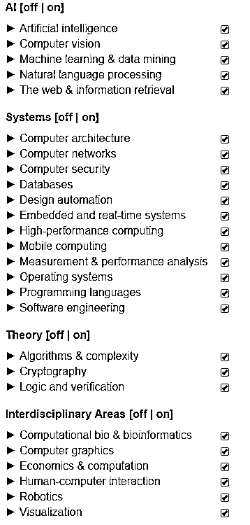</inherit>

<inherit style="display: block;text-align: justify;">根据从 2006 年到 2017 年的数据，全球各院校整体 CS 实力排名如下：   </inherit>

<inherit style="display: block;">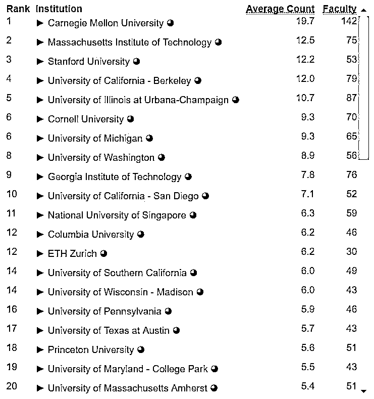</inherit>

<inherit style="display: block;">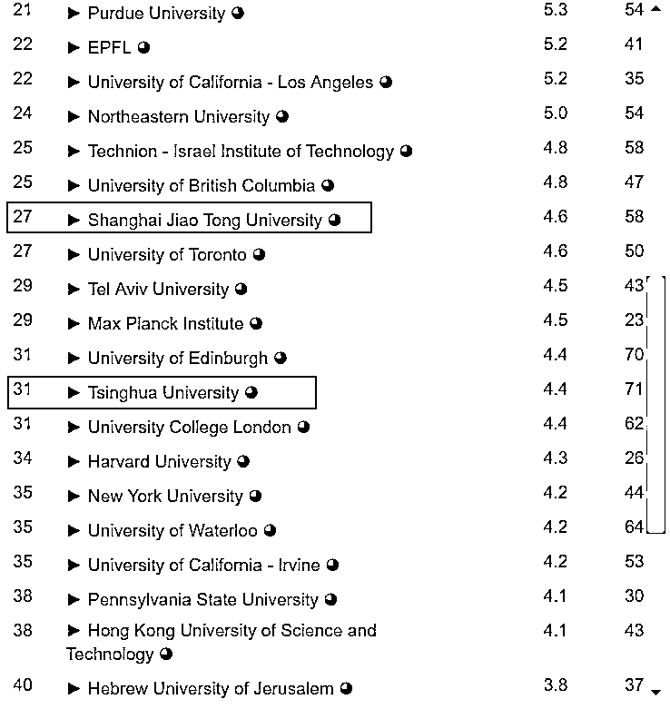</inherit>

可以发现，和 QS 的毕业生就业竞争力排名一样，前 40 依旧被美国统治，中国只有上海交通大学和清华大学上榜，分别排名第 27 和 31。

如果只考虑亚洲地区，那么上海交通大学、清华、中国科技大学的则分别排到了第 2、第 3、和第 15 位，均不及新加坡国立大学，而中外合建的上海纽约大学则排到了第 24。

<inherit style="display: block;">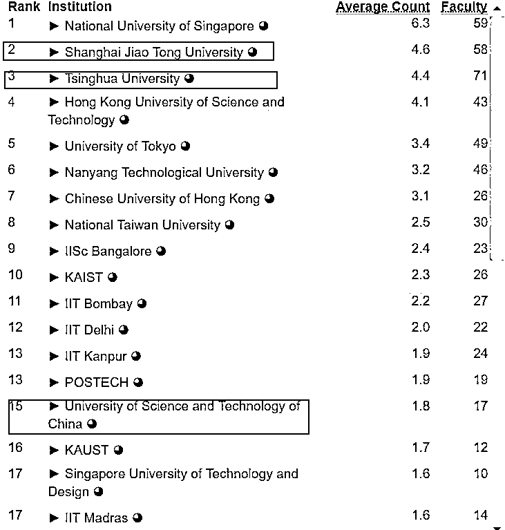</inherit>

让我们把范围进一步缩小，如果只考虑亚洲高校在 AI 方面的实力，那么清华终于排到了第一，上海交通大学和中国科技大学则分列第 6 和第 9。

<inherit style="display: block;">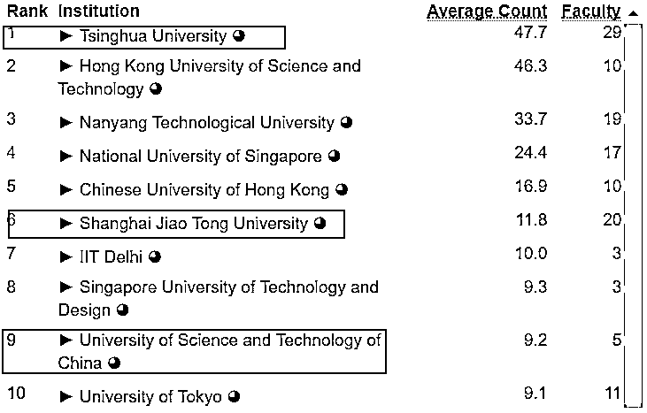</inherit>

当然，AI 作为一个整体，还包含了很多细分领域，比如计算机视觉（Computer Vision）、机器学习和数据挖掘（Machine Learning & Data Mining）、自然语言处理（Natural Language Process）、以及网页和信息检索（The Web & Information Retrieval）。

以下就是亚洲高校在这些细分领域的排名：

<inherit style="display: block;text-align: justify;">1）计算机视觉（Computer Vision）：</inherit>

<inherit style="display: block;">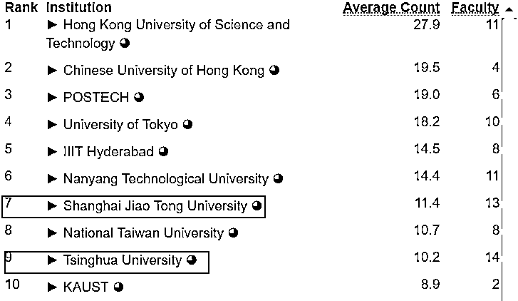</inherit>

<inherit style="display: block;text-align: justify;">2）机器学习和数据挖掘（Machine Learning & Data Mining）：</inherit>

<inherit style="display: block;">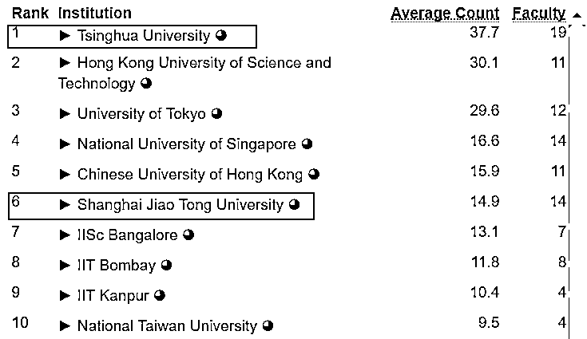</inherit>

3）自然语言处理（Natural Language Process）：

<inherit style="display: block;">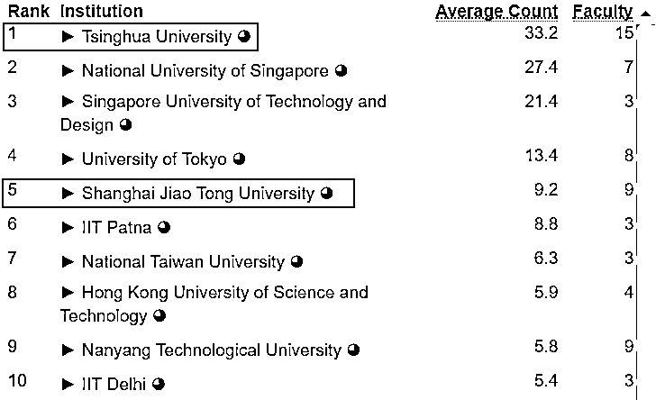</inherit>

4）网页和信息检索（The Web & Information Retrieval）：

<inherit style="display: block;">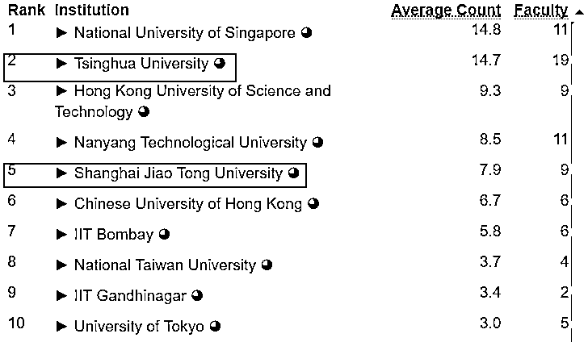</inherit>

<inherit style="display: block;text-align: justify;">**三、导师排名**</inherit>

在选择好学校之后，选择对的导师也很重要，而马萨诸塞大学安姆斯特分校的 Emery Berger 教授的 CSRankings 项目也给出了各个学校的导师的论文数量排名，虽然不是很全面，但也可以作为参考。

<inherit style="display: block;text-align: justify;">1） 清华大学</inherit>

<inherit style="display: block;">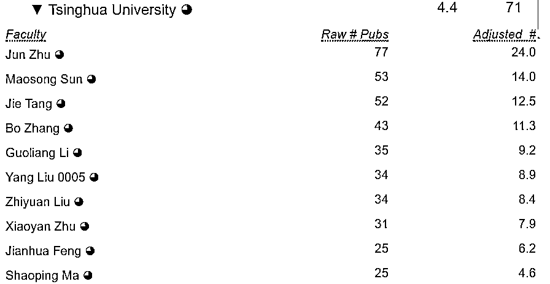</inherit>

2）上海交通大学

<inherit style="display: block;">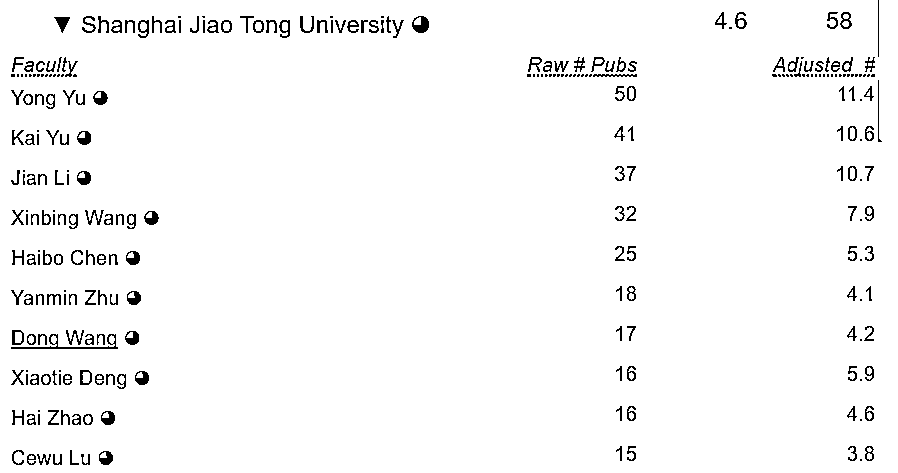</inherit>

3）中国科技大学

<inherit style="display: block;">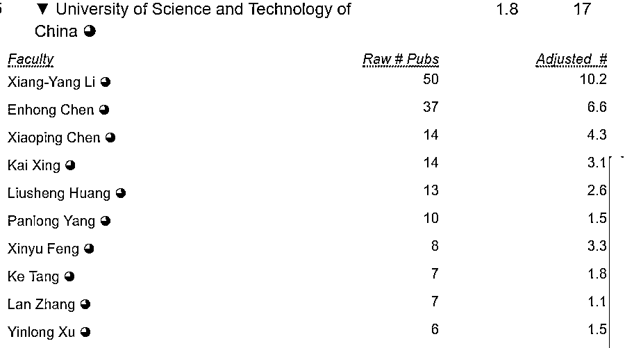</inherit>

4）上海纽约大学

<inherit style="display: block;">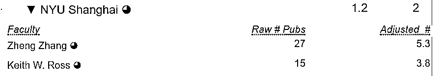</inherit>

<inherit style="display: block;text-align: justify;">**四、编者寄语**</inherit>

结合各种排名，如果你想报考 CS 专业，那么清华大学和上海交通大学都是国内非常不错的选择。如果你对 AI 很感兴趣，那么中国科技大学和上海纽约大学也可以列入考虑的范围。

不过，很多人小时候都曾为长大后选择清华还是北大而苦恼，然而......

当然，进入一所好学校仅仅是开始，它并不能保证什么，希望正在学习路上的各位读者共勉。

参考链接：

http://csrankings.org/

https://www.topuniversities.com/university-rankings/employability-rankings/2018

**关注者**

**从****1 到 10000+**

**我们每天都在进步**

