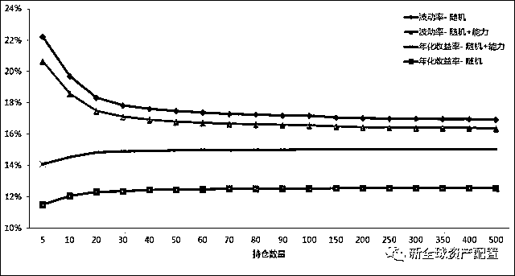

# 如何跑赢大盘？论持仓数量的艺术

> 原文：[`mp.weixin.qq.com/s?__biz=MzAxNTc0Mjg0Mg==&mid=2653286368&idx=1&sn=75d3b0bfc3472eafbcf382569ba19ae8&chksm=802e2df5b759a4e34a256902d42ffa487d262b33270559149bd986f4a3179709ec030ae2c095&scene=27#wechat_redirect`](http://mp.weixin.qq.com/s?__biz=MzAxNTc0Mjg0Mg==&mid=2653286368&idx=1&sn=75d3b0bfc3472eafbcf382569ba19ae8&chksm=802e2df5b759a4e34a256902d42ffa487d262b33270559149bd986f4a3179709ec030ae2c095&scene=27#wechat_redirect)

**编辑部**

微信公众号

**关键字**全网搜索最新排名

**『量化投资』：排名第一**

**『量       化』：排名第一**

**『机器学习』：排名第三**

我们会再接再厉

成为全网**优质的**金融、技术类公众号

今天继续分享一篇朋友的文章

股票投资中一个经典的问题是：我到底需要持有多少只股票？是**集中持股，还是分散持仓**？ 

学过经济学的朋友都知道边际效用递减理论。其实持仓组合的数量也是遵循这个理论：在理想（股神）的状态下，我们加入的每只股票，能够为这个组合带来更好的效用，也就是增加回报并且减小波动率。

**但是天下没有免费的午餐，没有人能做到无止境地添加高边际效用的股票。 **

所以何如是个度？投资组合是建立在一只只股票之上的，为了更好的回答持仓数量的问题，我们必须先看看**持有单只股票的风险**。

而投资单个股票的风险可以从单个股票的历史收益分布看出，比如股票 A，在 10 年的时间内，涨了或者跌了多少？而大盘同期涨了跌了多少？另外，选取的股票数量要足够多，比如 2000 只股票以上的分布，才有一定的代表意义。 

**过度分散投资 --- 回报下降 **

我们在美股市场上，将测试时间分成了 2 部分，第一部分是从 1980 年至 1997 年，第二部分是从 1998 年至 2015 年。比如，在 1979 年 12 月 31 日，我们选取了市场上市值最大的前 3000 只股票，作为开始的股票池，然后计算这些股票在 1980 年 1 月 1 日至 1997 年 12 月 31 的总超额收益。 

举个栗子，股票 A 在 1 月份涨了 10%，而大盘（罗素 3000 指数回报）涨了 4%，那么这只股票当月相对于大盘的超额收益就是 6%。按照此方式，我们在每个月，计算每只股票的超额收益，然后在限定的时间段内，计算每只股票的总超额收益。

有了这些所有的超额收益后，我们就可以画分布图了。 

横轴为总超额收益水平，从负 100%到 400%以上，纵轴为分布比率。从图我们可以看出： 

1.  **有 57%的股票在 1980 年至 1997 年内都没有跑赢大盘！**

2.  **有 54%的股票在 1998 年至 2015 年内都没有跑赢大盘！  **

3.  1980 年至 1997 年， **只有区区 15%左右**的股票大幅跑赢了大盘（累计涨幅超过大盘 100%）！在 1998 年至 2015 年， **只有区区 18%左右**的股票大幅跑赢了大盘（累计涨幅超过大盘 100%）！ 

从历史数据上看，股票跑不跑得赢大盘的概率并不是 50/50 对半分，而是更偏向于跑输大盘。而且**尾部风险尤其明显，有 18%左右的股票，跑输大盘超过 75% 。**

抛开跑不跑得赢大盘不说，只要是投资，就会有下跌风险。 为了更加直接地揭示单只股票的风险，我们又计算了这 3000 只股票 5 年期的最大回撤。 

横轴为 5 年期最大回撤水平，从负 100%到 0%，纵轴为分布比率。让我们看看这些让人不寒而栗的数据： 

1.  1980 年至 1997 年，有 58%的股票，跌幅曾经超过 50%，  

2.  在 1998 年至 2015 年年间，有超过 86%的股票曾经跌幅超过 50%！ 

这意味着什么？这意味着过度的分散投资可能会增加投资风险：

如果你随意的增加持仓数量，很有可能加入的就是一只跑不赢大盘的股票。这不仅会增加跑输大盘的概率，还会增加整个持仓组合的最大回撤。 

**过度集中持股 --- 风险高 **

那反过来，如果我们减少持仓数量，集中持股，能不能增加投资组合的效用呢？ 我们又进行了一组测试。在同样的时间段内，每个月，我们选取市值最大的 1000 只股票，在每一个持仓数量限定中（5，10，20，30，40，50，60，70，80，90，100，150，200，300，350，400，500 只），分别进行 3000 次随机选择。 

比如，1980 年 1 月 1 月，在 1000 只市值最大的股票池中， 随机选择出 300 只股票，按照等权重组成一个投资组合并得到这个组合当月的回报，这样重复 3000 次，一直测试到 2015 年 12 月。最大的模拟次数为 500 只股票×3000 次×37 年×12 个月 = 666000000。 

随着持仓数量的下降，整个投资组合波动率会明显地上升，这不难理解。但是，**随着持仓数量的下降，年化收益率也在下降！**这真是坑爹。

我们前面说过，如果在投资组合中任意添加一只股票，你很有可能加入的是一个垃圾股。但是，**随意地减少持仓组合，也并不能增强投资收益。**减法也不行，加法也不行，你要是怎样！？ 怎么办？如何解决这个问题？

> ** "Diversification is protection against ignorance. It makes very little sense for those who know what they're doing."--- 巴菲特  **

股神就是霸气侧漏：如果你知道你在做什么，你就不需要分散投资。 没错，分散是无知者的罪，如果你能力强，你就不需要分散投资。 

这里的重点是，你需要能力强，你需要知道自己在做什么，换句话说，就是你得有鉴别好坏股票的能力。那么市场上那么多股票，如何能鉴别？ 

随着信息化程度越来越高，股票市场在短时间的基本是有效的。而每个人的知识和精力都是有限的，**市场上 3000 只股票中，如何能找出有投资价值的一只或者是一揽子股票？**是从医药行业开始选？还是化工业？还是消费品？

我们认为，使用量化模型是较好的出路。 我们之前的文章，引起了很多争论。其中有些朋友讲到，量化是纸上谈兵，是刻舟求剑。其实，我们强调的量化，是方法论，而不是世界观。**方法论就是通过历史的数据和量化的手段，回溯历史上几十年甚至几百年的数据，其目的是为了透过现象，寻找本质。 **

虽然历史不能代表未来，但是，历史数据，已经是我们能够得到的最好的参照物。如果一个投资理念和策略，不能够通过历史的数据来模拟和检测，那么投资人如何能够客观地去鉴别这个理念和策略的好坏？当你面对某个基金经理，他只能拿出来几个月的不管是实盘还是回测数据，你如何能相信他？ 

之前写的 2 篇价值股文章《[用量化的手段来做美股价值投资](http://mp.weixin.qq.com/s?__biz=MjM5NzU3MDc1MA==&mid=2455722395&idx=1&sn=0f7bbf2cbf9d8da73ece5c179c8faa00&chksm=b17c084a860b815c01948dd21281e8cfa2036cb015befb657d24e6ed62676a916e8574127927&scene=21#wechat_redirect)》，《[寻找高质量的价值股 才是真正的价值投资](http://mp.weixin.qq.com/s?__biz=MjM5NzU3MDc1MA==&mid=2455722440&idx=1&sn=25dd1c57790350c07760188e1f308628&chksm=b17c0819860b810f973e073f6584986e8a7722f3ec0a12274570a517cebf43b49a76df3beba1&scene=21#wechat_redirect)》目的不是为了告诉大家，仅仅通过几个估值指标，就能赚大钱。

而是想要通过量化的手段和真实的历史数据，把价值投资的理念（低估值+高质量），进行归因分析，让投资人更好的理解价值投资，从而更加清楚的认识，**价值投资到底是在投什么**。 

通过一定的估值指标，能够量化地分出价值被低估的股票，而系统性地购买价值被低估的股票可以获得超额收益。那么回到我们这篇文章中，**使用量化手段来发掘价值股，就是一种投资人能够获得的投资能力。 **

我们下面在价值股的基础上，做一个测试。 

**分散和集中，要在系统性的框架之下 **

我们还是遵循模拟的规则，只是这次我们细分了开始的股票池。我们在这市值最大的 1000 只股票里， 按照企业收益倍数高低将它们分成 2 组，每月初始的股票为企业收益倍数（EV/EBITDA）最低的前 500 只股票，也就是价值最被低估的股票们。  

每一个月，在这 500 只股票里，我们在每一个持仓数量限定中（5，10，20，30，40，50，60，70，80，90，100，150，200，300，350，400，500），分别进行 3000 次随机选择。 

大家看，通过企业倍数的甄别，这些随机选择的股票组合的年化收益率明显地高于普通的股票，而这些价值股组合的波动率却并没有高于普通股票组合。 

可是问题来了，就算是在价值股股票里随机选择，随着持仓组合的下降，年化收益率也会下降。 

**系统性投资框架 + 适度持仓 = 跑赢大盘  **

所以到底什么是投资能力？其实，做过模型的朋友们应该了解，我们这里解决的只是 Garbage in - Garbage out 的问题。我们在 1000 只股票里，去除了 500 只短板股票，但是在这之后，我们只进行了随机选择。

而真正的能力，按照逻辑，应该是从市场上这 1000 只股票中，层层筛选，剥离分析，最后得到一揽子精选的股票。也就是说，这个选择的方式是渐进的，而不是随机的。 

为了验证这个结论。我们在价值股的基础上做了另外一个测试。同样的在每个月初，我们只在企业收益倍数最低的前 500 只股票做选择。

不同的是，我们不再随机组合成 5 只或者 500 只股票，我们在这 500 只价值股股票里，按照企业收益倍数高低，**渐进式地选取最低的前 1 只，前 5 只，前 10 只，一直到前 500 只。 **

可以看出，随着持仓数量下降，资产组合的预期回报收益率和波动率（风险）都会上升。其中波动率上升速度较快，当持仓数量下降到 20 以下时，投资组合的波动率会大幅上升。而预期回报的增长速度，并没有波动率的增长速度快。 

世界上没有免费的午餐，就算是遵循一定的投资规则，也**不能无限制的增加整个投资组合的效用。**衡量投资效用的夏普比率，在资产组合数量降至 20 以下时，呈现了断崖式的下降。 

夏普比率在 20 只股票以上的时候，都比较稳定。其最高值出现在在 250 只到 350 只股票之间，平均值为 0.94，市场同期为 0.62。如果投资人非常注重夏普比率，那么选择 300 只股票左右，比较合理。 

但是，在 300 只股票的时候，预期年化收益率只有 16%，相比，在只有 20-50 只股票的时候，预期年化收益率平均为 18%，但这时的夏普比率平均为 0.90。 

从长期投资的角度来看，2%的年化收益率差距，在 20 年的时间内，会为投资人多赚取近 49%的回报。

夏普比率衡量的是回报和风险间效用，如果你真的能承受高风险，夏普比率就显得不那么重要了。另外 0.90 和 0.94 的差距，在长期来看，基本可以忽略不计。 

投资大师本格雷厄姆的结论相符。在他的大作《聪明的投资者》一书中，明确的写到：**10 到 30 只左右的股票，是一个比较理想的投资组合。**

很多学术论文也从实际数据上支持这一结论， 比如 Dr. Elton 和 Dr. Gruber 的 “Risk Reduction and Portfolio Size: An Analytical Solution”，其中介绍到 **30-50 只股票是一个较为平衡的选择。 **

**写在最后 **

过于激进的投资组合，比如 10 只股票以下，都会大大降低投资人风险调整后收益，造成得不偿失的结果。而过于分散的投资组合，虽然可以为投资人提供更为分散的风险，但却会牺牲一些预期回报。 

**如果你想要战胜大盘，你的持仓数量和组合就必须跟大盘不一样。**

然而根据历史的股票收益率分布，任意地增加和减少持仓组合，都会增加这个组合跑不赢大盘的概率，而且会增加这个组合的波动率和最大回撤。 

那么投资人在决定持仓数量和组合的时候，就必须使用能够增加组合赢面的股票。**投资人可以通过量化的手段，根据一定的模型和投资风格，从市场上几千只股票中精选出一揽子股票。**

在系统性的投资框架和体系里，降低投资组合数量，**相对集中投资，才有意义**。 这样集中持有平均一揽子 20-50 只股票，一方面能增加跑赢大盘的概率和提高预期收益，另一方面还能控制投资组合的波动率，为投资人提供较好的经风险调整后收益。

**关注者**

**从****1 到 10000+**

**我们每天都在进步**

