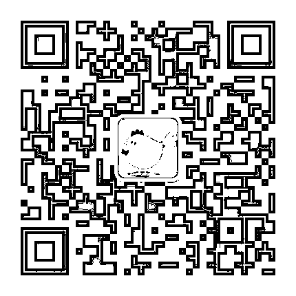
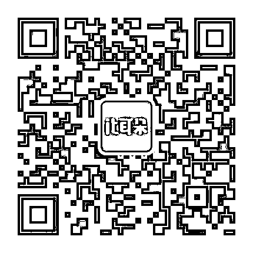
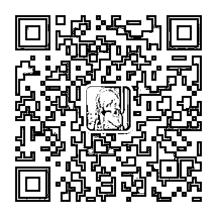
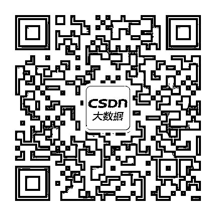
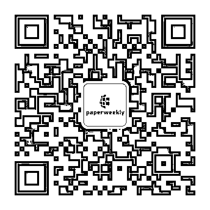
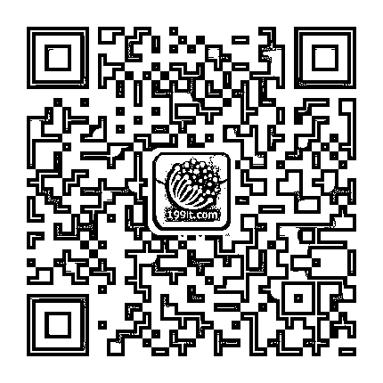
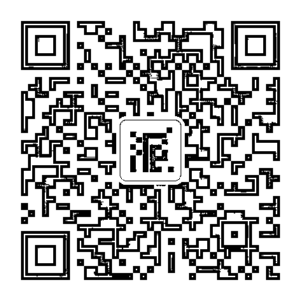
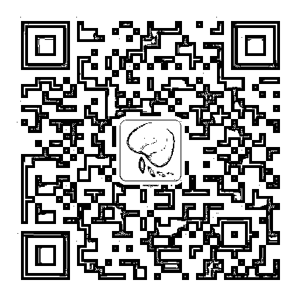

# 荐号 ‖ 关于人工智能、机器学习、大数据的九个黄金公号

> 原文：[`mp.weixin.qq.com/s?__biz=MzAxNTc0Mjg0Mg==&mid=2653286363&idx=1&sn=05369890ac21cf24be42b06864174528&chksm=802e2dceb759a4d8287d15de416bc21ed76ad3ad266f061f18ba0a27d0707bc6ce2d57d8b1cd&scene=27#wechat_redirect`](http://mp.weixin.qq.com/s?__biz=MzAxNTc0Mjg0Mg==&mid=2653286363&idx=1&sn=05369890ac21cf24be42b06864174528&chksm=802e2dceb759a4d8287d15de416bc21ed76ad3ad266f061f18ba0a27d0707bc6ce2d57d8b1cd&scene=27#wechat_redirect)

苹果公司创始人乔布斯曾经说过，创造力就是找到事物之间的联系。

当你询问有创意的人他们是如何做事时，他们觉得有点内疚，因为他们并没有真的这么做，他们只是看到了其中一些关系。这种感觉，在他们过后看来会很明显。 

你无法在展望未来时串联点滴，你只能在回顾过去时将其升华。所以你要相信，这些点滴片段会在未来以某种方式串联起来。

阅读，何尝不是一种串联呢？

本次我们为您精心挑选了以下黄金公号，希望在未来助您一臂之力。

**机械鸡**

—— 

人工智能从业者社群

90%的人工智能从业者都在关注

** IT 耳朵 **

——

国内领先的智能行业科技媒体。

**架构文摘**

—— 

每天一篇架构领域重磅好文，涉及一线互联网公司的互联网应用架构、大数据、机器学习等各个热门领域。

**CSDN 大数据**

—— 

荟百家之言，萃实践之思。CSDN 大数据汇集最新最硬的大数据实践干货，敬献领域内最热最火的热点内容，与读者共飨大数据前沿资讯与一线实战解读。

**paperweekly**

——

paperweekly 是一个推荐、解读、讨论和报道人工智能前沿论文成果的学术平台，致力于让国内外优秀科研工作得到更为广泛的传播和认可

**199IT-互联网数据中心**

——

发掘、分享数据价值，为您提供一个丰富的大数据内容平台！网站、微博、大数据导航，感谢您的关注。

**THU 数据派** 

——

依托清华大学独特的师资和生源优势,旨在提供大数据产业链的思维碰撞与资源对接平台。发布全球大数据资讯，定期组织优质线下活动，分享前沿产业动态。

**集智俱乐部**

——

集智俱乐部由北京师范大学教授张江在 2003 年创办，是一个从事学术研究、享受科学乐趣的探索者群体。它倡导以平等开放的态度、科学实证的精神，进行跨学科的研究与交流，力求搭建一个中国的“没有围墙的研究所”。集智俱乐部公众号专注于在复杂系统、机器学习、人工智能方面的原创文章和精品活动，力图打造最有温度的 AI 学习社区。

**关注者**

**从****1 到 10000+**

**我们每天都在进步**

