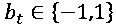
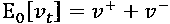
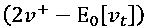
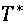
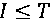
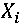
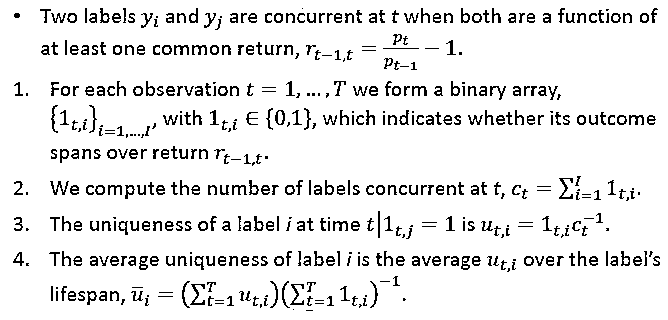

# 【原创精品】机器学习应用在量化投资中失败的 7 个主要原因

> 原文：[`mp.weixin.qq.com/s?__biz=MzAxNTc0Mjg0Mg==&mid=2653286358&idx=1&sn=549e54a2a3b9607b18056463d90cd929&chksm=802e2dc3b759a4d5173bdb2f32801d79831cacf28d47c99f9c956fb42c039f6a23bb9cd98983&scene=27#wechat_redirect`](http://mp.weixin.qq.com/s?__biz=MzAxNTc0Mjg0Mg==&mid=2653286358&idx=1&sn=549e54a2a3b9607b18056463d90cd929&chksm=802e2dc3b759a4d5173bdb2f32801d79831cacf28d47c99f9c956fb42c039f6a23bb9cd98983&scene=27#wechat_redirect)

**编辑部**

微信公众号

**关键字**全网搜索最新排名

**『量化投资』：排名第一**

**『量       化』：排名第一**

**『机器学习』：排名第三**

我们会再接再厉

成为全网**优质的**金融、技术类公众号

Marcos López de Prado 在前不久发布一篇 presentation 也是作为***Advances in Financial Machine Learning, Wiley (2017)***此书的开场，点宽网量化平台联合量化投资与机器学习公众号进行翻译解读，我们力求语言通俗易懂，并且在部分内容处做一些解读。

**原创内容，禁止转载、违者必究！**

要点

⊙The Sisyphus paradigm（团队分工）

⊙Integer differentiation（整数阶差分）

⊙Inefficient sampling（数据同分布）

⊙Wrong labeling（标签的新用法）

⊙Weighting of non-IID samples（样本权重）

⊙Cross-validation leakage（样本内外数据）

⊙Backtest overfitting（过拟合问题）

**1**

西西弗式的宽客

首先解释一下这个标题，在西方语境中，形容词“西西弗的”（Sisyphean）代表“永无尽头而又徒劳无功的任务”。意思就是告诉我们要做有效率的事情，不要一个人全部包办，要懂得团队协作！

**不能让投资组合经理凭个人意愿做所有的事**

*   投资组合经理做出不符合特定理论或有严谨推论的投资决策。

*   因为没有人能够完全理解自己最好的逻辑，所以他们几乎不能像一个团队一样工作，并且在最初的直觉之外有个更深入的洞察力。

*   如果让 50 个投资组合经理一起工作，那么最终 49 个人都会跟着那个最牛逼的去做，50 个人跟 1 个人差不多。

> 因此，投资公司应该是小组分工合作，防止受一个投资组合经理单方面影响，从而保护工作的多元化。

1、在工作中，宽客们应该和投资组合经理一起工作。 

2、让我们聘请 50 名博士，要求他们在 6 个月内每人产出一份投资策略。但是这种做法，可能会适得其反：

    - 过度拟合，回测吊炸天，实盘一般般；

- 结合很多理论模型，但是也效果一般（主要是对市场没有吃透，不能把模型作为核心区做一些策略，要懂得结合市场做出一些调整和改进） 

最终这个项目将会被叫停，原因想必大家都知道的。

3、几十 50 个博士里面有 5 个人的策略可以用，那么老板也会很郁闷啊，项目也大概率叫停，这 5 个人可能也会走。留不住人啊！

**所以**

**干货来了~**

**“[…] there is no more dreadful punishment than futile and hopeless labor.”**

Albert Camus (1913-1960), The Myth of Sisyphus

制定真正的投资策略需要做的几件事： 

- 数据的收集，处理，结构化

- HPC（高性能计）基础设施的建设

- 软件开发

- 特征分析

- 测试等

即使这些都齐活了 ，但是你今天在做这个，明天再做那个，永远是一个失败者，你永远是徒劳的，看似很累很辛苦，但是你没有把一件事做到极致！

> 所以正确的做法应该是：像车间那样，有人生产轮胎，有人生产发动机，分工明确，每个人的工作互不影响，有独立的考核标准，每个人都能做到部分最好的。同时也要对整个流程有统一的看法。个人和全部几部分离也不脱节。

每一个成功的量化公司，都会用到这个模式，他就是**META-STRATEGIES**

具体的内容，请点击下面链接查看：

*https://papers.ssrn.com/sol3/papers.cfm?abstract_id=2547325*

**2**

整数阶差分

**时间序列的平稳性和记忆性的困惑**

- 收益率或者价格（或者 log-prices 的变动）

- 收益的变动

- 波动率的变动

（此段分析来自知乎，作者是：babyquant）

说白了就是人们为了得到 stationary 的 time series，会做一阶差分，发现不行，就二阶差分，总之就是整数阶差分。

比如金融里面的 log return，就是 log price 做一阶差分，几十年来学术界都是这么干的。但作者说：

**这么做是错误的！**

问：What is the minimum amount of differentiation that makes a price series stationary while preserving as much memory as possible? 

答：We would like to generalize the notion of returns to consider stationary series where not all memory is erased.

绿线：E-mini S＆P 500 期货的 K 线频率 1E4。

蓝线：分数差分 

• 在短期时间内，它类似于回报

• 在长期时间内，它类似于价格水平

• On the x-axis, the d value used to generate the series on which the ADF stat was computed.

• On the left y-axis, the correlation between the original series (d=0) and the differentiated series at various d values.

• On the right y-axis, ADF stats computed on log prices.

原始序列（d=0）的 ADF 统计值为-0.3387，而返回序列（d=1）的 ADF 统计值为-46.9114。

在 95％置信水平下，测试的临界值为-2.8623。

ADF 统计量的阈值在 d= 0.35 附近，其中相关性仍然很高（0.995）。

这些表显示了全球最流动的期货合约的 ADF 统计数据。

每一行为一个标的，每一列为 differentiation。

绿色表示，ADF 值接受单位根检验。

红色表示，拒绝单位根检验。

大多数金融时间序列可以通过分数阶差分的方法来做。

原因就是如果是价格序列本身，它显然不是平稳的，平稳就是说均值、方差是固定不变的，当然最严格的平稳要求概率分布一致，价格序列虽然不是平稳的，但它是有记忆的，就是说各个样本独立性很差，高度相关的，所以如果是预测价格本身 R 平方可以非常非常高。

为了得到平稳时间序列一般用一阶差分，这样得到的是价格的增量，一般认为是平稳的，但同时它也是比较独立的，也就是说没有记忆的，这么样做预测的话 R 平方非常非常低。一般来说人们用机器学习做金融都是预测对数收益率之类的东西。

大多数金融研究是基于回报的，其中 d=1。

这意味着，几十年来，大多数金融研究都是基于差分（无记忆）的序列，导致虚假的预测和过度拟合。

**3**

低效的抽样

**按时间顺序抽样**

*   信息不会以不变的熵速在市场流动。

*   按时间顺序抽样数据意味着个别观察体数量的信息内容与通常的数量数不一致。

*   一种更好的方法是将观察体数量的次要（二级）过程进行转换，即转换信息数量：

       - 成交额

       - 成交量

       - 指令不均衡

       - 波动率

       - 熵

> 其实就是说：
> 
> 金融时间序列很多不是同分布的，比如螺纹钢在近期的波动和年初比差别很大，如果用固定时间抽样，一般都是不同分布；但如果用 imbalance at time，就更倾向于同分布。

> **知识拓展：**
> 
> **同分布**
> 
> 在概率统计理论中，指随机过程中，任何时刻的取值都为随机变量，如果这些随机变量服从同一分布，并且互相独立，那么这些随机变量是独立同分布。
> 
> 如果随机变量 X1 和 X2 独立，是指 X1 的取值不影响 X2 的取值，X2 的取值也不影响 X1 的取值且随机变量 X1 和 X2 服从同一分布，这意味着 X1 和 X2 具有相同的分布形状和相同的分布参数，对离随机变量具有相同的分布律，对连续随机变量具有相同的概率密度函数，有着相同的分布函数，相同的期望、方差。**例如：****抛色子每次得到任意点数的概率都是 1/6,这就是同分布的，但若我第一次抛一个六面的色子,第二次抛一个正 12 面体的色子,就不再是同分布了。**
> 
> **熵**
> 
> 我们可以将熵看作是一个系统“混乱程度”的度量，因为一个系统越混乱，可以看作是微观状态分布越均匀。例如，设想有一组 10 个硬币，每一个硬币有两面，掷硬币时得到最有规律的状态是 10 个都是正面或 10 个都是反面，这两种状态都只有一种构型（排列）。反之，如果是最混乱的情况，有 5 个正面 5 个反面，排列构型可以有排列组合数 252 种。（这个概念可以说很多，我就举个例子吧）

**举个例子：Dollar Bars**

我们来定义不平稳的时间 T 为：

操作标记（我姑且认为是多空的标记）

可能代表交易的证券数量或交换的金额。

我们在 bar 开始时计算的期望值

其中

对的初始期望值进行了分解（买卖）为和。

然后

实际上，我们可以估计作为前面 bars 的 T 值的指数加权移动平，同时

也作为前面 bars 的值的指数加权移动平。

我们定义一根 bar 为—ticks 的共同子集满足以下条件：

预期不平衡的大小是指

当比预期更不平衡时，底的 T 值将满足这些条件。

**例子：抽样频率**

计算三种 bar 的类型在 E-mini S&P 500 期货中。

大家知道 tick 数据的频率和数据量所以，tick bars 往往会显示出广泛的采样频率。

volume bars 的采样频率通常与价格水平成反比。

一般来说，dollar bars 的采样频率比较稳定。

**4**

错误的标签

**金融中的标签**

几乎所有 ML 文章在金融标签观察中使用固定时间范围的方法。

一个设定的特征

bars 带索引

分配了不同的标签

**固定时间范围方法的警告**

1、几个避免这种标签方法的原因：

- Time bars 不具有良好的统计属性。

- 无论观察到的波动如何，都应用相同的阈值τ。

2、几个更好的选择是：

- 标签使用变化的阈值，使用收益率准偏差的滚动指数加权值作为其阈值。

- 使用成交量或 dollar bars，因为它们的波动率更接近恒定（同方差性）。也就是同分布啦！

> **知识拓展：**
> 
> **同方差性**
> 
> 对于线性回归的最小二乘法（OLS, Ordinary Least Squares）有 2 个假设被称为（White Noise Condition）白色噪音假设， 其一为 No Autocorrelation；即误差部分相互没有关联，假设回归式 y = α+βx+u，其误差项中，u1，u2 各误差之间没有任何联系即：COV（u1*u2）=0。其二为具备同方差性或者等分散，即误差项与独立变量（independent variable）之间相互独立,，并且误差项的分散(方差 Variance)必须等同即；Var(u|x)=σ²。

但即便用上面两种方法，也忽略了固定时间法的一个关键的缺陷：**The path followed by prices**。我们将用 The Triple Barrier Method 来解决这个问题。

**The Triple Barrier Method（就是三个保障，稳妥）**

文章说的很长，其实也就几句话：

固定一个窗口，价格首先触及哪个 horizontal barrier 就标记标签：

- Upper horizontal barrier：标签 1

- Lower horizontal barrier：标签-1

- Vertical barrier：标签 0

**如何使用 Meta-labeling**

**（这段我觉得还是很好的。怕跑题，就放原文吧，你们要是有想法，可以拓展）**

*   **Meta-labeling is particularly helpful when you want to achieve higher F1-scores:**

*   – First, we build a model that achieves high recall, even if the precision is not particularly high.

*   – Second, we correct for the low precision by applying meta-labeling to the positives identified by the primary model.

*   **Meta-labeling is a very powerful tool in your arsenal, for three additional reasons:**

*   –ML algorithms are often criticized as black boxes. Meta-labeling allows you to build a ML system on a white box.

*   –The effects of overfitting are limited when you apply meta-labeling, because ML will not decide the side of your bet, only the size.

*   –Achieving high accuracy on small bets and low accuracy in large bets will ruin you. As important as identifying good opportunities is to size them properly, so it makes sense to develop a ML algorithm solely focused on getting that critical decision (sizing) right.

**Meta-labeling 为 Quantamental 公司**

**Quantamental，**Quant & Fundamental，即“量化基本面分析法”，就是把量化和基本面两种方法有效结合起来。

*   您可以随时向任何主模型添加 Meta-labeling，无论是 ML 算法，计量经济学，技术交易规则，基本面分析等。

*   个人的直接判断，主观交易等。

*   Meta-labeling 通过 ML 算法使用在特征上范围可以从市场信息到生物统计到心理评估等。

*   **Meta-labeling should become an essential ML technique for every discretionary hedge fund**. In the near future, every discretionary hedge fund will become a quantamental firm, and meta-labeling offers them a clear path to make that transition.

**5**

non-IID 样本的权重

作者就举了个例子，例如，您可以从大量患者中获得血液样本，并测量其胆固醇。

当然，一些基本的常见因素会改变胆固醇分布包括平均值和标准差，但样本仍然是独立的。

假设你在实验室中，将每根管子的血液滴取到右侧的 9 根管子里。

*   即，管 10 里有患者 10 的血液，同时也含有来自患者 1 至 9 的血液。管 11 含有来自患者 11 的血液，同时也含有来自患者 2 至 10 的血液，等等。

现在，你需要确定预测高胆固醇（饮食，运动，年龄等）的特征，而不必确定每位患者的胆固醇水平。

这也是 ML 在金融中面临的挑战。

*   Labels 由结果决定。

*   结果由多个观察决定。

*   由于标签在时间上的重叠，我们无法确定观察到的特征是否有被影响。

（此段分析来自知乎，作者是：babyquant）

这就是说，样本分布不是独立同分布的。比如它之前说用等成交量来划分，比如都是 1000 的成交量：

t=1 要到 t=10 才达到 1000

t=2 其实也是到 t=10 达到 1000

t=3 其实也是到 t=10 达到 1000

这说明或许 t=10 那个时刻的成交量特别大，到了这里就能达到 1000，没到这里就不能。因此如果我们做样本的时候，其实 t=10 这个用了很多次，比如 10 次，但 t=11 这个只用了 1 次。

当然，等时间没有这个问题的，比如 1-10，2-11，3-12。。。每个时间的行情都用到同样的次数，除了开头结尾少数几个。

所以他就定义了一个 c_t，就是说 t 这个行情用了 c_t 次，然后这个行情对应的 return 就要先除以 c_t。其实这部分我没太看懂，按常理来说 c_t 如果都是一样的那么 w_i 应该是相等才对，但貌不是。其实它本质上就没打算给每个样本等权重，如果 c_t 是一样的，那么就是每个样本对应的收益率 y_i 的绝对值来加权；如果 c_t 不是恒定的，则用它那种算法计算出来的收益率的绝对值来加权，总之就不是等权。

所以它这么做会给 y_i 绝对值大的样本更大的权重，更偏向高波动行情了。如上面那个例子：

c_1=1,c2=2...c_10=10,c_11=1....

w_1=|r1/1+r2/2+r3/3+...+r10/10|

w_2=|r2/2+r3/3+...+r10/10|

...

w_10=|r10/10|

然后再除以一个相同的系数，比例不变。这么看 w_10 的权重会比较低，因为 w_10 对应的行情 r10 被用了 10 次，分到它自己的已经很小了。

如果是等权重的话，因为 w_1 到 w_9 对应的样本，其实他们本质上都是依赖 r_10 的，其他行情可能成交量很低，意义不大，因此，这样 r_10 就会被计算很多次；现在新的算法大概就是让每个行情的 return 都一共只被计算 1 次吧，比如 10 个 r10/10 加起来。

这些只对那种按成交量或者其他非等时间划分样本的方法有意义。普通人那种固定时间预测的其实不需要这么复杂。

**R 语言**里面 regression 的函数一般都支持样本不同权重的，比如 glmnet 里面有一个参数是 weight：

weights observation weights. Can be total counts if responses are proportion matrices.Default is 1 for each observation

所以按照他的方法给每个样本一些权重之后还是不难实现的。

但 P**ython**里面的 lasso 是不支持 weighted sample 的：

看不到 weight 相关的参数。总之 python 做统计类分析是一个很烂的工具，重要一点的东西都没有，只有最基本的，做金融稳定亏钱的节奏啊。**（这点对于 Python 的统计包要吐槽一下，R 语言在这方面确实和强势！）**

这段分析，个人觉得理解的很不错！以供参考。

**6**

交叉检验 Leakage

就是说了测试样本内外的事。

该图显示了 K-Fold CV 的一个分区。 测试集前后都包含了训练集。但是必须要去除这段重叠部分，以防 Leakage。

如何防止和去除这段数据，作者给出了这样一个方法（我觉得作者是一个比较严谨的人。如果数据量大的话也可以忽略这个问题）具体大家自己可看看算法：

他把这个过程叫做：**purging**（清洗数据）

由于有些金融特征包含序列相关性如 ARMA：

> **知识拓展：**
> 
> **同分布**
> 
> 自回归滑动平均模型（ARMA 模型，Auto-Regressive and Moving Average Model）是研究时间序列的重要方法，由自回归模型（简称 AR 模型）与滑动平均模型（简称 MA 模型）为基础“混合”构成。
> 
> 预测指标随时间推移而形成的数据序列看作是一个随机序列，这组随机变量所具有的依存关系体现着原始数据在时间上的延续性。一方面，影响因素的影响，另一方面，又有自身变动规律，假定影响因素为 x1，x2，…，xk，由回归分析：
> 
> 
> 
> 其中 Y 是预测对象的观测值，Z 为误差。作为预测对象 Yt 受到自身变化的影响，其规律可由下式体现，
> 
> 
> 
> 误差项在不同时期具有依存关系，由下式表示，
> 
> 
> 
> 由此，获得 ARMA 模型表达式：
> 
> 
> 
> 正因如此，我们应该从训练集的观察中消除这个，在测试集中观察到结果。作者称它为：**embargo**
> 
> 
> 
> 

**7**

回测中的过拟合问题

**Deflated 夏普比率**

他就是改进夏普比率，基于以下这篇文章。来源：https://papers.ssrn.com/sol3/papers.cfm?abstract_id=2460551

这篇文章看了半天，有点困难，才疏学浅哈。大家有兴趣可以看看。但是大概是这样的嘿嘿：

DSR 包含比 SR 更多的信息，是有概率条件在里面的。

> Deflation will take place when the track record contains “bad” attributes. However, strategies with positive skewness or negative excess kurtosis may indeed see their DSR boosted, as SR was failing to reward those “good” attributes.

N=46，DSR≈ 0.9505。

原文：https://papers.ssrn.com/sol3/papers.cfm?abstract_id=3031282

