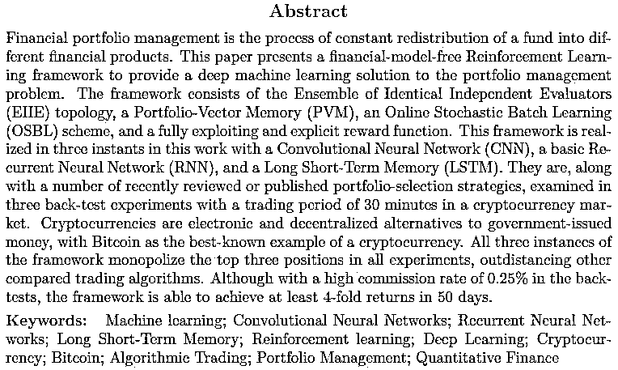

# 深度增强学习框架在金融投资组合管理中的应用

> 原文：[`mp.weixin.qq.com/s?__biz=MzAxNTc0Mjg0Mg==&mid=2653286354&idx=1&sn=e87589ab242372f663d118c0e2eb3a1e&chksm=802e2dc7b759a4d104b2f77f9a7db6dfec641792132ee5fc4922af6a90dcb16d1bededd40581&scene=27#wechat_redirect`](http://mp.weixin.qq.com/s?__biz=MzAxNTc0Mjg0Mg==&mid=2653286354&idx=1&sn=e87589ab242372f663d118c0e2eb3a1e&chksm=802e2dc7b759a4d104b2f77f9a7db6dfec641792132ee5fc4922af6a90dcb16d1bededd40581&scene=27#wechat_redirect)

**编辑部**

微信公众号

**关键字**全网搜索最新排名

**『量化投资』：排名第一**

**『量       化』：排名第一**

**『机器学习』：排名第三**

我们会再接再厉

成为全网**优质的**金融、技术类公众号

最近在读一些关于深度学习在量化投资和资金管理方面的文章，觉得这篇不错，分享给大家，恰逢周末，就不发太多内容，大家可以看看，有些思路值得学习。 

在这里，我想说一点，现在我们搞量化，一定不能眼高手低，太多的文章，太多的策略，太多的······，但是我们在看自己的回测的时候，不能因为曲线走势不错或者知道一些认为很高大上的东西，然后就夸夸而谈。别人听了感觉很牛逼，但是你有真正做到吗？有真正在市场中实践获利吗？

这里并不是说我们一定要为了钱，只是希望我们搞量化的人，不能因为很多高大上的东西，而忘记我们的初衷。

有时候做投资是一件不那么复杂的事情，像很多人说的那句：大道至简。我觉得确实，做到某种程度真是这样。但是怎么做到这种程度，那不是搞几个算法模型就能搞定的。实践和理论一定要相结合。

最后，说一句，深度学习是好，在投资方面业界也有标杆，但是也要看个人能力，如果只是为了混混噱头，一知半解的，那完全没必要。

我们何必活的那么累。两根均线都可以做很多事！没有吹牛。

量化投资与机器学习公众号会一直陪伴你们走下去！ 

周末快乐！

论文链接在**阅读原文**