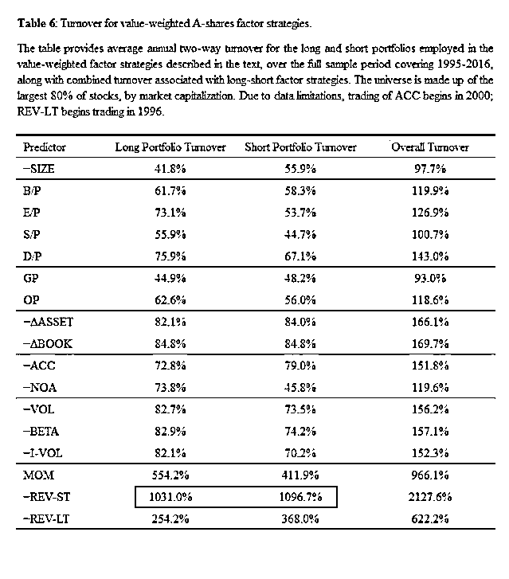

# A 股到底能不能做股票量化投资？

> 原文：[`mp.weixin.qq.com/s?__biz=MzAxNTc0Mjg0Mg==&mid=2653286336&idx=1&sn=d5cb48f1999251bcd9cfd0cac53d47ff&chksm=802e2dd5b759a4c3c33154fdd4f3c9e98d97d99630af386ed34d95d21ebe77ccadf85bb44ff9&scene=27#wechat_redirect`](http://mp.weixin.qq.com/s?__biz=MzAxNTc0Mjg0Mg==&mid=2653286336&idx=1&sn=d5cb48f1999251bcd9cfd0cac53d47ff&chksm=802e2dd5b759a4c3c33154fdd4f3c9e98d97d99630af386ed34d95d21ebe77ccadf85bb44ff9&scene=27#wechat_redirect)

**编辑部**

微信公众号

**关键字**全网搜索最新排名

**『量化投资』：排名第一**

**『量       化』：排名第一**

**『机器学习』：排名第三**

我们会再接再厉

成为全网**优质的**金融、技术类公众号

转载一篇朋友写的文章。

巴菲特在今年的伯克希尔年会上说过：

> **“ (Chinese) Markets have a casino characteristic that has a lot of appeal to people, particularly when they see people getting rich around them. And those who haven't been through cycles before are more prone to speculate than people who have experienced the outcome of wild speculation.... it will offer investors more opportunity if you have lots of speculation, if they keep their wits about them... ”  **

简而言之：中国的股市像赌场，市场博弈机会多，如果你是聪明的人，你才能够抓住机会。  

其实老巴讲话很婉转，不能当着这么多远道而来的中国投资人的面打脸吧？他实际上是在警告投资人：**赌性强的市场，更加容易暴露和放大投资人的非理性行为（Irrationality)，而不理性的投资行为会导致投资人遭受巨额损失。  **

投资人种种的非理性行为和认知偏见（Cognitive Bias）以及行为偏见（Behavioral Bias），是市场异常现象（Anomaly）产生的金融行为学本源。“Your Loss, My Gain”，如果大家都理性，哪里来的套利空间和超额收益？  

小股民是小韭菜，大股民是大韭菜。比如相对于 Ray Dalio 的桥水，John Paulson 这种就是韭菜。如果 2016 年 Paulson 的基金不亏个 23%总计 30 亿美金，桥水全球 1178 亿美金的盘子哪里来的赚钱机会？  

继上一篇文章《[史上最全的美股量化因子实操手册](http://mp.weixin.qq.com/s?__biz=MjM5NzU3MDc1MA==&mid=2455722492&idx=1&sn=6204ca1de78793dbb930c1706892ef8a&chksm=b17c082d860b813baeb6495fe3d9f631fe3d4ca7dd3c5b2bf86219e044f9567c00be855dddf5&scene=21#wechat_redirect)》，介绍了美国市场中的 6 种市场异常现象（Anomaly） ：**大市值，小市值，高价值，高动量，低波动和高质量**。通过历史数据，加上传统金融学和行为金融学的解释，为大家展示了这 6 种因子过去 45 年的回报。 

**A 股市场上多空因子的年化收益  **

那么看回中国 A 股市场，存在哪些市场异常现象（Anomaly）和能够投资的因子？有没有可以收割的韭菜？今天要为大家推荐一篇精彩的学术论文《Anomalies in Chinese A-Shares》，作者是 Jason Hsu，Vivek Viswanathan， Micheal Wang 和 Phillip Wool。 

这篇学术论文通过 A 股 1995 年 5 月到 2016 年 12 月近 22 年的数据，按照 7 大类别，分析了一共 17 种因子，Dr. Hsu 非常给力。 

指标的具体构建方式请参照论文原文。 

**历史回测的方式  **

1\. 每年五月初（基于回报的 3 个指标为每月），将 A 股市场上市值最大的前 80%的股票作为起始股票池。 

2\. 然后按照上面指标的高低，将上述的股票分成 10 组。 

3\. 做多指标最高的股票组，做空指标最低的股票组。这里要注意，上面的指标中有些是带有负号的，比如市值（-SIZE），做多的是市值最小的前 10%的股票，做空的是市值最大的前 10%的股票。 

4\. 平均持仓持有一年（或者一个月）后，进行再平衡。 

**回测结果如何呢？  **

作者把这中美 2 个市场的结果对照排列了出来，并且在 2 个市场中，分别分成了 2 个时间组。由于学术论文的图表比较难懂，我们把文章的数据做了整理，并且只列出了中国 A 股市场中的回报。回报均为毛回报（没有扣除任何费用）。 

**中国的全样本中（1995/05-2016/12）： **

1\. 小市值股票有极强的溢价，平均每年跑赢大市值股票 14.6%。 

2\. 价值股（B/P, E/P, S/P, D/P）也不甘落后。其中低市净率（E/P）的股票，年化平均跑赢高市净率的股票 11.5%。值得注意的是整个价值股中，不管是用市净率还是其它的 3 个指标，高价值股的股票都跑赢了低价值的股票。  

3\. 短期市场反转（-REV-ST）和长期市场反转（-REV-LT）也有不错的效果。比如按照短期市场反转的构建规则，买入过去 1 个月跌的最多的前 10%的股票，然后卖出涨的最多的前 10%的股票，平均持仓，能够平均每年赚 8.3%。  

4\. 低波动（-VOL）的多空收益也类似。买入波动率最低的前 10%的股票，卖出最高的前 10%，能够平均每年赚 8.5%。  

这里有一个非常有趣的结果，就是高动量因子（MOM，过去 2-12 个月总回报）在 A 股上大大的水土不服。高动量因子可是美国市场上闪耀的明星，从 1965 年到 2016 年，买入动量最高的前 10%的股票然后卖出最低的前 10%，平均每年的收益为 22%。然而到了中国市场上，这个策略的多空年化收益竟然是负的 1.4%！ 

**中国的最近 8 年（Recent Sample）（2008/5-2016/12）：  **

1\. 小盘股策略有惊人的表现，多空的年化收益在 23.9%。  

2\. 短期市场反转的多空年化收益也非常高，在 21.9%。  

3\. 之前在 Full Sample 中表现还不错的其它策略，其多空年化收益都有腰斩式的下降。 

4\. 最悲惨的还是高动量策略，其多空年化收益竟然变成了负 8.5%！坑爹！  

**以下是中美市场对比图 **

**回测和实际操作中的问题  **

从量化回测的角度来说，2007 年之前，A 股的总市值还不到 1 万亿美元，一共只有 1353 只股票，平均市值也就是区区的 4000 万美元，国有市值占比超过了 80%，根本没办法做量化策略。

从 2007 年以后，这个情况才慢慢地好转。到了 2016 年，A 股有了近 3000 只股票，平均市值在 27 亿美元，这就为量化投资执行提供了必要的条件。 

从市场机制上来看，90 年上交所正式成立，到 92 年正式向境外发行股票，再到 2005 年的股权分置改革，至今也就是短短的 20 年，而 05 年股改后才使得 A 股贴上了真正意义上的”现代资本市场“的标签。  

在经历了 08 年金融危机和 15 年股灾后，到现在 IPO 重启，A 股可以说是经历了比较大的成长。但是策略管理人和投资人还是面对着一些非常重要的机制性问题：  

1\. 市场上全流动股票还是较少 

2\. 做空成本过高 

3\. 退市机制不足 

4\. 国有控股股票占比高 

5\. 无法方便的进行 T+0 交易  

纸面上跑的好的策略，实际操作中都会有较大的代价。比如短期市场反转这种多空年化收益 22%，听起来又高大上的策略。根据文中的数据，**其看涨部分的年化换手率竟然达到了爆表的 1031%，看跌更高， 1096%！ **

我们抛开高频交易对执行系统可靠性要求很高不说，高换手率对策略最直接的影响是高交易费。 

这些乱七八糟看起来低的费用，在高换手率的杠杆效应下，对短期市场反转策略的实际收益有非常大的影响。根据我们的假设，总执行成本平均在 8%。**也就是说 22%的多空年化收益扣除执行成本后只有 14%左右。而这还没有将高频交易对股价的冲击效应和融资融券成本计入，实际的净收益会更低。** 

**写在最后  **

非常感谢 Dr. Hsu 和他团队的这篇文章，这是我们至今看到的从数据上最全面阐述 A 股因子历史回报的论文。  

总的来说，小盘股流动性溢价明显，短期市场反转策略回报高，特别是在 08 年之后到 2016 年，这 2 种策略的多空年化收益有非常明显的提高。但是我们必须要清楚的认识到，**在大的资金规模面前，没有一种策略能够像庞氏骗局一样持续地保证高超的收益，除非是庞氏骗局本身。  **

高的收益必定会吸引更多的投资人进入，导致市场竞争加剧，套利空间减少，从而降低预期回报。而从操作层面上来讲，在竞争加剧的基础上保证套利超额收益，会让很多策略管理人提高杠杆、交易频率，甚至是铤而走险的内幕交易。  

这就使得投资人会面临更大的系统性风险：**杠杆过高爆仓**（N 多的私募就这么挂掉），**交易系统出错加上频率过高导致短时间内巨亏**（光大乌龙指），**监管层出手干预**（股指期货做空一刀切）。  

另外，每种策略都有周期性，较为理性的投资人应该考虑更多的逆周期投资决策。比如价值股策略，虽然在近 8 年内其多空收益相较之前有较大的下降，但是作为一个传统金融学和行为金融学都有理论支撑的策略，杀个回马枪是可预期的。  

总的来说，A 股市场绝对是一个套利空间充斥的市场，中国人赌性强，市场有效机制不足，投资人的不理性行为会被成倍地放大。**投资人不要总是想着短期巨幅跑赢大盘，多想想如何通过资产配置来减少回撤，保证本金安全**，就算是当不了镰刀，也要努力不成为韭菜。

转自：新全球资产配置

**关注者**

**从****1 到 10000+**

**我们每天都在进步**

