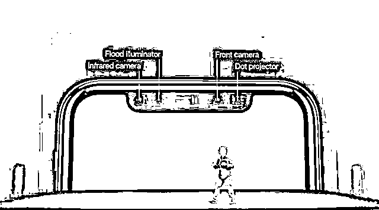
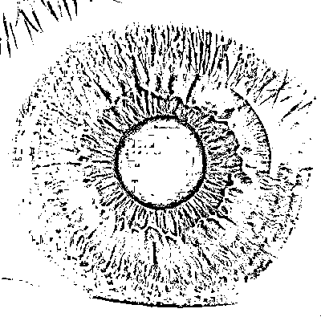

# 别高兴太早！关于苹果刷脸背后的四大问题！

> 原文：[`mp.weixin.qq.com/s?__biz=MzAxNTc0Mjg0Mg==&mid=2653286329&idx=1&sn=6864ca66e6f8663427ff507bee23f54a&chksm=802e2dacb759a4ba1403670899d18d875660bbfedf93e9544e4d10e019ff77adac587eb7a5ca&scene=27#wechat_redirect`](http://mp.weixin.qq.com/s?__biz=MzAxNTc0Mjg0Mg==&mid=2653286329&idx=1&sn=6864ca66e6f8663427ff507bee23f54a&chksm=802e2dacb759a4ba1403670899d18d875660bbfedf93e9544e4d10e019ff77adac587eb7a5ca&scene=27#wechat_redirect)

[AI 科技大本营](https://mp.weixin.qq.com/s?__biz=MzI0ODcxODk5OA==&mid=2247489031&idx=1&sn=6b767b6128e97263933c8ad9e9a0db0b&scene=21#wechat_redirect)

本文授权转自 AI 科技大本营

（微信 ID：rgznai100）

<inherit style="max-width: 100%;box-sizing: border-box !important;word-wrap: break-word !important;"><inherit>就在今日凌晨，苹果发布了逆天黑科技 iPhone X，其中群众们讨论得最多的，无外乎这里面是用的 Face ID，也就是说，刷脸解锁。</inherit></inherit>

[`v.qq.com/iframe/preview.html?vid=t1324hhdvpv&width=500&height=375&auto=0`](https://v.qq.com/iframe/preview.html?vid=t1324hhdvpv&width=500&height=375&auto=0)

这几天，朋友圈里，手机+刷脸这个热点泛滥成灾。

就在周一小米发布 Note3 刷脸手机的当天，网上就有文章，[提到刷脸手机容易被破解的四种方式](http://mp.weixin.qq.com/s?__biz=MzI0ODcxODk5OA==&mid=2247488969&idx=1&sn=11a65a47e8a6eab1cc5df7535da5f537&chksm=e99d2630deeaaf26d90810eac86452b83279f82b516e15b1568777ec1f775c3f83c7a3ae1fe2&scene=21#wechat_redirect)，并且随着刷脸技术越来越普及，想拥有自己的隐私已经不太可能了。

今天，趁着这个热点，营长再次从技术层面，来透彻地解析一下有关手机刷脸这件事。

文中有来自业内人士的访谈，有来自苹果发布会的消息，也有相关的国外译文。AI 科技大本营只负责公正地将各类观点平铺直叙，而不对文中观点进行站队。

<inherit style="max-width: 100%;box-sizing: border-box !important;word-wrap: break-word !important;"><inherit>**问题一：苹果手机刷脸（Face ID ）的背后到底是什么原理？**</inherit></inherit>

<inherit style="max-width: 100%;box-sizing: border-box !important;word-wrap: break-word !important;">在苹果的刘海中，请注意这么四个标识：Infrared camera（红外镜头）,Dot projector（点阵投影器），Flood illuminator（反光感应元件），Front camera（前置摄像头），这四个部件在苹果手机的刷脸功能 Face ID 中举足轻重。</inherit>

<inherit style="max-width: 100%;box-sizing: border-box !important;word-wrap: break-word !important;">Face ID 的原理是，通过屏幕上方的 Dot projector 在用户脸上投射超过 30000 个肉眼不可见的光点，绘制出一个专属于你面部的深度图，并将其存储起来。解锁时，苹果将从刘海中投射出人脸看不见的红外光，并读取用户脸部的 3D 几何结构图，由此与之前存储的脸部数据图进行对比。图片相近，即可解锁成功。</inherit>

<inherit style="max-width: 100%;box-sizing: border-box !important;word-wrap: break-word !important;">为了更好地完成实时的面部数据比对，苹果为此专门开发了一个神经引擎(Neural Engine)。</inherit>

<inherit style="max-width: 100%;box-sizing: border-box !important;word-wrap: break-word !important;">据相关媒体援引旷世科技的采访报道，**苹果的这个原理，与刚刚发布的小米 Note3 不同。**</inherit>

<inherit style="max-width: 100%;box-sizing: border-box !important;word-wrap: break-word !important;">据悉，小米 Note3 采用了 2D 人脸解锁的方案，这样的方案在对于平面的照片，视频人脸，或者熟睡的人脸时，也有解锁可能。</inherit>

<inherit style="max-width: 100%;box-sizing: border-box !important;word-wrap: break-word !important;">而苹果采用的原理叫做“结构光双摄方案”，该方案足以识别这类平面攻击。且在刷脸时，眼睛闭着也是解不了锁。此外，库克称其无论是改变发型，戴上眼镜，还是戴上帽子，Face ID 都能成功识别。这在活体检测上，又近了一步。</inherit>

<inherit style="max-width: 100%;box-sizing: border-box !important;word-wrap: break-word !important;">那么问题又来了，如《碟中谍》电影中人脸面具怎么办？长得像是不是也可以解锁？</inherit>

<inherit style="max-width: 100%;box-sizing: border-box !important;word-wrap: break-word !important;">关于这个问题，营长会在第四个问题——手机刷脸安全性解析中，进行详细分析。</inherit>

<inherit style="max-width: 100%;box-sizing: border-box !important;word-wrap: break-word !important;">此外，营长就对文中提到的结构光多做一些解释，并说说 3D 传感中的三项技术：**结构光，飞行时间(TOF)以及双目视觉**。</inherit>

<inherit style="max-width: 100%;box-sizing: border-box !important;word-wrap: break-word !important;">结构光是一种 3D 传感的原理。结构光，说白了，就是将光投到物体表面，再使用摄像机扫描该物体表面反射的结构光图案。</inherit>

<inherit style="max-width: 100%;box-sizing: border-box !important;word-wrap: break-word !important;">这里不得不提，苹果在 2013 年收购一家以色列公司 PrimeSense。</inherit>

2013 年，苹果花了 3 亿美金的价格收购了此公司。而这家公司可谓 3D 传感器的鼻祖。而这家公司最核心的技术就是结构光的散斑测距。 

<inherit>联想到苹果今日所用的点阵投影器，不外乎就来自这项技术的雏形。</inherit>

<inherit>那么飞行时间又是什么？</inherit>

<inherit>这和雷达原理接近。即通过测量光脉冲发射及返回的时间差，来读取物体的三维位置信息。</inherit>

<inherit>值得一提的是，早前，PrimeSense 曾与微软合作，研发第一代 Kinect。但之后，两者关系崩塌，PrimeSense 被苹果收至麾下，于是，微软的第二代 Kinect 也只能重新研发新的技术，即飞行时间。</inherit>

<inherit>双目视觉就比较简单了，原理和人眼差不多，通过两个摄像头的视差来确定距离深度。</inherit>

<inherit>三种方式综合来看，飞行时间的精度和稳定性更好，但结构光的功耗比较小。双目在精准度上，不及前两者。</inherit>

<inherit>这样，就能更清晰的比对苹果和小米的刷脸手机了。小米 Note3 属于双目识别，由于其属于被动光，而非主动发射光源，其在暗光下，识别度会比较差。而苹果则不会出现这个问题。</inherit>

尽管在技术上有大的革新，苹果此次发布的刷脸真的有它说的那么邪乎，错误率只有百万分之一？

<inherit><inherit>**问题二：错误率真的只有百万分之一？**</inherit></inherit>

<inherit style="max-width: 100%;box-sizing: border-box !important;word-wrap: break-word !important;"><inherit>接下来，让我们来谈谈第二个问题，苹果 iPhone X 的错误识别率是否只有百万分之一？</inherit></inherit>

<inherit>就在发布会现场，苹果 CEO 现场的第一次刷脸解锁并未成功，场面一度十二分尴尬。</inherit>

<inherit>为何解不开锁呢？</inherit>

<inherit>也许是因为发布会后面的强光束。目前原因不得而知，不过，这款手机确实有这个硬伤，近红外光或强太阳光下，可能刷不出脸来，解不开锁。</inherit>

<inherit>因为苹果手机在解锁时，发射的是红外光，当光的波段与红外光接近时，就会干扰到识别过程，继而解锁失败。</inherit>

<inherit>此外，强太阳光包含所有波段的光，其中就有红外光，因此，在一个大太阳的中午，当手机正面冲上时，可能也解不了锁。不过，目前营长还没拿到手机进行具体的测试，这只是理论推测。</inherit>

不少人对 AI 科技大本营抱怨，苹果此举有点太过激进，完全取消指纹识别，用起来可能比较麻烦。 

<inherit>至于库克所说的百万分之一的成功率，可能只是一个软件算法层面的识别率，显然实际在应用中的识别几率。他很聪明地回避了前提条件，这个说法，不愧为一个很巧妙的公关概念。</inherit>

<inherit style="max-width: 100%;box-sizing: border-box !important;word-wrap: break-word !important;"><inherit><inherit>**问题三：真的比指纹识别更方便吗？**</inherit></inherit></inherit>

<inherit>如果从识别率来说，yes!</inherit>

<inherit>在发布会上说，库克说到 Face ID 比 Touch ID 更为安全，后者被破解的概率是五万分之一，而前者是百万分之一。</inherit>

<inherit>当然，这有不如指纹识别的时候。这有不如指纹识别的时候。在你掏衣兜时，指纹识别就可以解锁了，但刷脸识别你还先得掏出来手机，再对着脸才行。</inherit>

<inherit>不过，可以肯定的是，既然苹果这个举旗者，已经出了这个大招，国内的手机大厂接下来一定会纷纷跟进了。不管你是更喜欢指纹识别，还是人脸识别，以后你的选择不多了。</inherit>

<inherit>据不少业内人士透露，旷世科技已经 ALL IN 手机刷脸项目，而商汤科技也在猛增人手，支援手机刷脸。目前，旷世科技拿下了小米手机的刷脸项目，而商汤则拿下了 Oppo 的人脸识别业务。日前，两家正对 Vivo 项目展开激烈争夺。</inherit>

<inherit>**问题四：生物识别真的比密码安全吗？**</inherit>

历史上，生物特征识别一直不安全。

相机可以被骗。

声音可以录制。

指纹可以解除。

并且，包括美国在内的许多国家  ，警方可以合法地强迫你用指纹来解锁手机。所以，他们同样可以强迫你刷脸来解开手机，无论你愿意还是不愿意。当然，碰上坏人的话，劫匪压根就不会在意这合不合法、你愿不愿意之类的细节。

同时，生物特征识别被破解的情况时有发生。

2007 年，在电影《谍影重重 3》里面，为了拿到黑蔷薇计划的全部资料，马特·达蒙就破解了所谓安全的声音加指纹双因素生物识别，他所采用的方法很好地说明了生物识别本身所固有的问题：

[`v.qq.com/iframe/preview.html?vid=j132484mb97&width=500&height=375&auto=0`](https://v.qq.com/iframe/preview.html?vid=j132484mb97&width=500&height=375&auto=0)

以更复杂的虹膜识别为例：人类视网膜有数百万个细胞，每个人的视网膜都是独一无二的。这应该算是相当高端的生物识别方式，对吧？

但在今年 5 月份，三星 Galaxy S8 手机上最新的虹膜解锁，已经被一些安全研究人员破解了。他们所用的工具不过是打印机和隐形眼镜，所为的只是获取你的虹膜信息。 

[`v.qq.com/iframe/preview.html?vid=a1324dek2lw&width=500&height=375&auto=0`](https://v.qq.com/iframe/preview.html?vid=a1324dek2lw&width=500&height=375&auto=0)

如果你的虹膜信息被黑客掌握了，如果你的指纹、脸型信息被黑客掌握了，只需合适的方法，他们就能破解任何以这些信息做密码的系统。 

一旦你的 DNA 序列被黑客掌握，比如施瓦辛格的电影《第六日》，他们用此克隆出另外一个你也不是没有可能。

<inherit>这一切都是因为，你的生物识别信息是无法改变的。密码丢了，你换个密码就可以继续用设备；而虹膜、指纹、脸型信息丢了，你就很难把眼睛、手指、脸型换了继续生活……</inherit>

事实上，89%的 iPhone 用户之所以使用指纹解锁，只不过是为了免密码查看手机信息。但是，当你的支付宝、微信支付、比特币钱包的支付解锁方式同样换成 Touch ID 后，“睡觉的时候……钱没了”这事，就只剩下发生早晚的问题。

但 iOS 的默认设置却是，在不解锁手机的情况下你就能读取收到的短信。而在 App Store 中购买应用时，它默认却需要你输入长长的复杂密码才能确认购买。这是“读”“写”权限的一种分离。

反过来，处处使用指纹解锁，看上去好像安全……但在“读”“写”权限的逻辑上，跟处处不用密码又能有多大的差别呢？所以，还是等苹果先搞定这里面的逻辑再说吧……

另外，为了避免“每天解锁手机 80 次”繁琐，你已经把指纹交出去了，这次真的要把脸也交出去吗？

 /mp/newappmsgvote?action=show&__biz=MzAxNTc0Mjg0Mg==&supervoteid=464837660#wechat_redirect