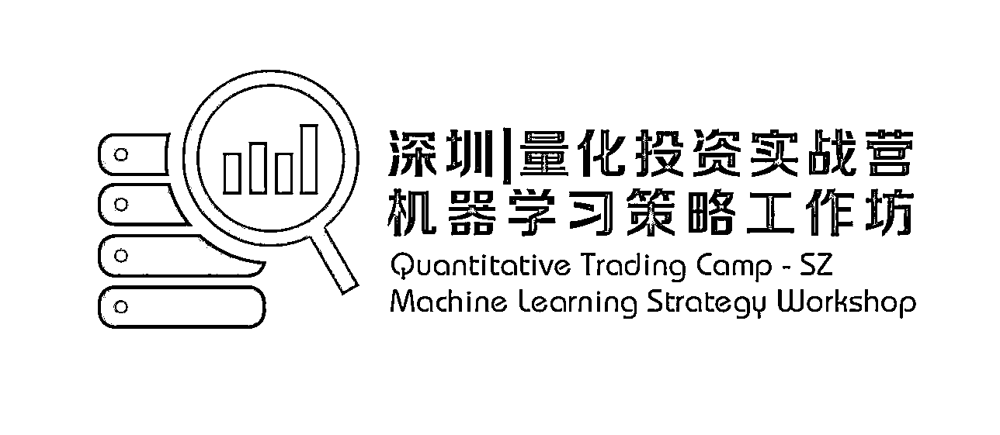
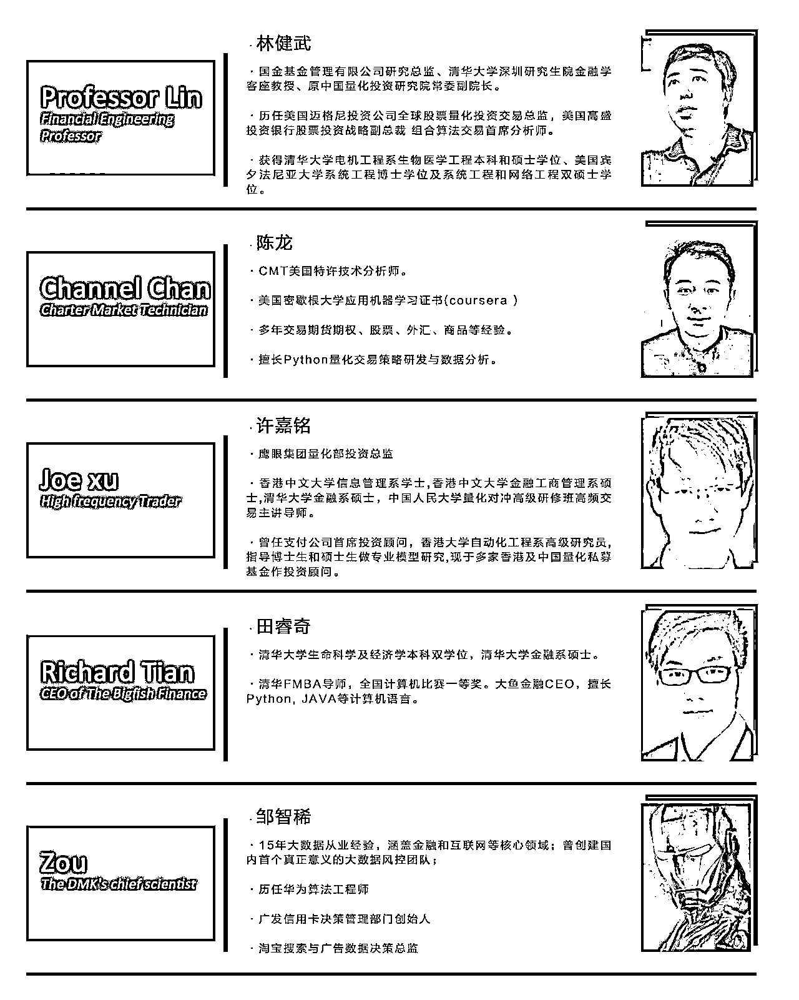
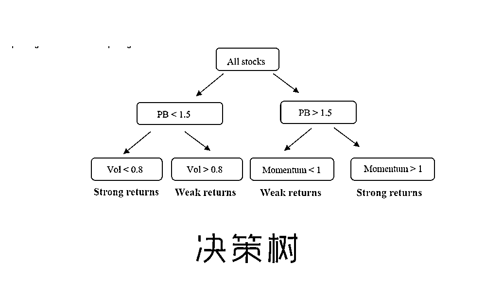
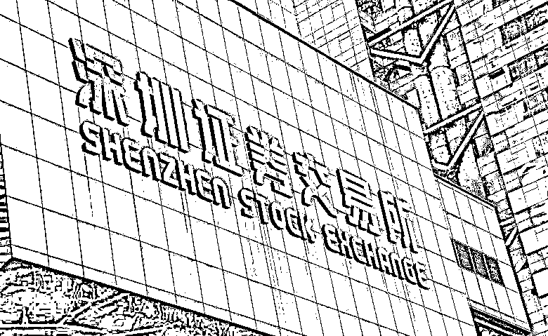
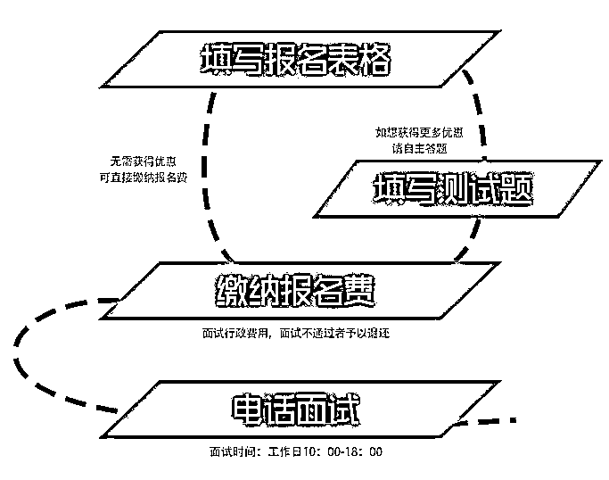

# Python 机器学习策略工作坊（深圳）

> 原文：[`mp.weixin.qq.com/s?__biz=MzAxNTc0Mjg0Mg==&mid=2653286316&idx=1&sn=a73b4b24889f4a2478ca210d0a65fb05&chksm=802e2db9b759a4afe1b860efca51f4dbd1e5e51b446f559a9a6d8b818e431712b122a94b71ed&scene=27#wechat_redirect`](http://mp.weixin.qq.com/s?__biz=MzAxNTc0Mjg0Mg==&mid=2653286316&idx=1&sn=a73b4b24889f4a2478ca210d0a65fb05&chksm=802e2db9b759a4afe1b860efca51f4dbd1e5e51b446f559a9a6d8b818e431712b122a94b71ed&scene=27#wechat_redirect)

这是一份带你从 0 到 1 的机器学习深度研究指南

国庆我们应大家要求开启量化投资实战进阶营

文中藏有巨大优惠，

欢迎大家报名参加！

# **Python****机器学习策略工作坊**

## A Hands-On Learning Approach to Python Machine Learning Strategy

* * *

**■ 课程特点**

Python 机器学习策略工作坊**（QTC_MLS）**是由清华大学深圳研究生院量化研究中心公益支持，配合深交所前海股权交易中心联手塑造的 Python 机器学习量化交易策略线下工作坊。

在这里不仅有专业导师当面传授机器学习模型理念与模块应用，还有技术团队解决工具安装与配置，提供优质的机器学习量化策略源代码，通过**五天高强度研习**，最终实现动手**编写实现机器学习策略代码。**

* * *

**■ 你将获得**

**1\.  Python 机器学习模块应用技能**

**2\.  Mongodb 数据库处理大数据**

**3\.  机器学习策略代码模板与回测绩效**

**4\.  清华量化研究中心的研习证书**

****

* * *

****■ 支持方****

****

*   ****清华大学深圳研究生院量化研究中心****

**清华大学深圳研究生院与清华大学中誉研究院集前沿计算机技术、高端数学，与现代金融理论为一体，并整合了国内外一流的金融平台,逐步形成了研发核心团队，并开发了一批金融函数及上千个量化交易策略，并且经过实盘交易的检验,并有一定的经济基础和市场影响力。**

*   ****深交所前海股权交易中心****

*   ****新格网络科技有限公司(大鱼金融)****

*   ****香港高频交易公司****

* * *

****■****Guided By Professors****■****

****

****▲一线研发与投资团队辅导****

**有别于校园的金融课程，工作坊不仅邀请到清华研究生院量化投资中心一线机器学习研究员指导教学，更请到 CMT 持证分析师，与数位多年从事机器学习的专家随同辅导,业界真实经验教学，打造全程真实编程体验。** 

* * *

****■ 课程主题****

**The curriculum includes topics such as:**

****SVM、决策树、隐马尔可夫模型、****

****套索回归、卡尔曼滤波、****

****神经网络、深度学习…****

****

| **第一天：量化投资与机器学习概述 _ 林健武** |
| 国内外量化投资发展现状与趋势量化投资的 IT 技术、数据与设备量化投资业界人才的需求特征量化投资的策略种类、资金规模与管理的品种机器学习在量化投资中的应用 |
| **《应用机器学习》- 邹智稀** |
| 机器学习的重要概念、算法概述与工作流程金融数据变量选取的方法机器学习对量化投资中目标设置的类型机器学习在量化投资上的难点与案例 |
| **第二天：《Alpha 特征选取》- 田睿奇团队** |
| Mongodb 载入与更新股票因子与价格数据安装 Alphalens/Sklearn/Keras/Mongodb 因子 IC 值与 Quantile 收益曲线计算因子算法参数优化与多因子组合权重因子数据特征选取 |
| **《机器学习 _ 分类器应用》- Alfred** |
| 逻辑回归 KNN 模型 SVM 模型决策树分类随机森林交叉验证混淆矩阵 |
| **第三天：《机器学习 _ 回归应用》 - Channel,CMT** |
| OLS 回归 Ridge & Lasso 回归 Polynomial 回归 Kalman Filter 卡尔曼滤波 R_Square 过度与欠拟合 _Overfitting and Underfitting 机器学习策略案例分享 |
| **《量化投资 _ 高频交易》- 许嘉铭** |
|  高频交易关键字高频策略的定义与体系架构高频算法交易与高频交易分析高频对市场的影响 |
| **第四天：《神经网络与深度学习》 – 田睿奇** |
| 神经网络 _NN 卷积神经网络 _CNN 长短期网络 _LSTM 深度学习预测行情案例 |
| **《机器学习策略回测》- Channel,CMT** |
| 如何使用回测引擎如何回测机器学习选股绩效如何回测机器学习回归策略如何回测深度学习策略如何优化策略参数 |
| **第五天：《Python 机器学习策略考试》** |
|   选择题  操作题  计算题 |
| **《Python 机器学习策略大赛》** |
|  机器学习策略与绩效展示  每个团队 15 分钟展示时间  评委问答时间  颁奖仪式 |

****▲应用型的经验传授与实操研习****

**要熟悉机器学习并用其模型作为量化投资的工具，不仅需要学习模型的理念与算法，调参优化与模型选择，更需要掌握 Sklearn 与 Keras 模块的使用，只有经验丰富的导师指导配合自己动手编写，才能在短时间掌握核心技能。**

* * *

****■ 往期回顾 ****

**以下是 2017QTC 精彩回顾视频：**

 **[`v.qq.com/iframe/preview.html?vid=c0535g68jph&width=500&height=375&auto=0`](https://v.qq.com/iframe/preview.html?vid=c0535g68jph&width=500&height=375&auto=0)** 

* * *

****■ 项目详情**** 

********

****时间：****2017.10.2~2017.10.6****

****地点：****清华大学深圳研究生院量化研究中心、深圳证券交易所****

****对象：**对 Python 机器学习与量化投资感兴趣的爱好者、投资者等。以及广大程序员、大学生、交易员、风控员、基金经理、产品经理、私募和公募管理者、金融从业人员、寻求投资合作机会的伙伴。**

****费用：****5680/人**** 5 天，在校学生凭学生证可优惠 1000 元，即 4680 元/人****

**此费用不包含食宿费,报名后填写测试题更有机会获得**1000~2000**元优惠券！**

* * *

****■****SIGN UP****■****

****报名方式****

****

**填写报名表点击**

**“阅读原文”**