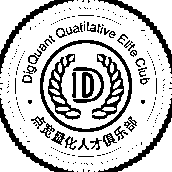
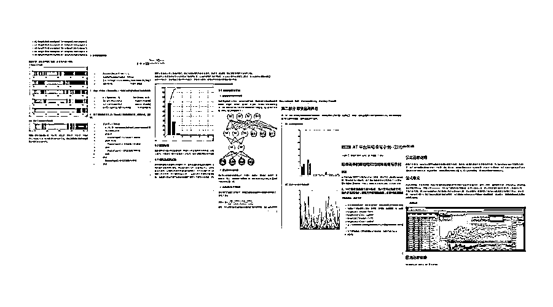

# 全网首推量化人才俱乐部，牛逼你就来！

> 原文：[`mp.weixin.qq.com/s?__biz=MzAxNTc0Mjg0Mg==&mid=2653286306&idx=1&sn=48a0435e076c89df7e2ed45e7f23539e&chksm=802e2db7b759a4a1f560577d8a03fce7eb2eb2390eab578c0053f3ae47b257c01ff7a0725e99&scene=27#wechat_redirect`](http://mp.weixin.qq.com/s?__biz=MzAxNTc0Mjg0Mg==&mid=2653286306&idx=1&sn=48a0435e076c89df7e2ed45e7f23539e&chksm=802e2db7b759a4a1f560577d8a03fce7eb2eb2390eab578c0053f3ae47b257c01ff7a0725e99&scene=27#wechat_redirect)

**编辑部**

微信公众号

**关键字**全网搜索最新排名

**『量化投资』：排名第一**

**『量       化』：排名第一**

**『机器学习』：排名第三**

我们会再接再厉

成为全网**优质的**金融、技术类公众号

**你若不凡，与我为伴**

**不是人人都有能力成为专业的宽客**

**如果你坚信自己的不凡，请与我们结伴同行**

2017 年 9 月 7 日，点宽 digquant 量化研究社区高校量化人才俱乐部**第一期会员**招募正式落下帷幕，**5 名**优秀的**MATLAB**量化研究在校学生从 30 名学生中脱颖而出，成为第一期正式会员。

为了发现培养国内最顶尖的在校量化人才， DigQuant 量化社区成立**“点宽量化人才俱乐部” **，邀请全国高校中理工科背景、爱好量化投资的优秀学生加入，致力于打造量化社群里的专业在校明星团体。

7 月 1 日起，点宽 digquant 社区开始面向全国高校量化研究人才公开招募，在互联网宽客社群中取得了各个学校量化研究爱好者们的关注，第一期就获得了来自国内外包括**英国伯明翰、对外经贸、武汉大学、中国人民大学、北京交通大学、北京师范大学等 15 家知名高校的近 30 名学生的申请**。

经过二个月的培训期，许多成员基于 MATLAB 和 AT 量能产出的交易策略和研究报告已经接近专业量化研究员的水平，点宽俱乐部发布的研报复现策略系列文章获得了多家机构和量化自媒体的转载。

最后有五名同学，凭借高质量的产出成功入驻点宽量化俱乐部，成为第一期正式会员。

**刘晓帆**

北京交通大学 | 统计学 | 硕士

“ “在这里我认识了很多优秀的小伙伴，大家在量化的探索之路上，都有很多困惑和期待，我们一起分享、交流、学习。也欢迎更多优秀的在线量化研究爱好者们，加入点宽俱乐部，让我们相伴共同成长。” **张日升**

对外经贸大学 | 量化投资 | 硕士

“ “喜欢做一名宽客，是因为可以自己把握命运，我希望能够打造我自己的宽客人生。但是我知道成为一名比他人更优秀的宽客，就需要付出比别人更多的努力，拥有扎实的功底和对投资理念的感悟。很荣幸成为点宽俱乐部的首期会员，得到点宽乐斌老师的亲自指导。” **张滔**

广东海洋大学 | 信息与计算科学 | 本科

“ “点宽是非常好的平台，点宽量化研究负责人乐斌老师，亲自指导我们带我们真正进入量化研究实践的世界。在两个月的时间里，几乎每周点宽俱乐部的指导老师乐老师都会为我们提供线上的培训交流会。” **王昱聪**

深圳大学 | 电子科学与技术 | 本科

“ “在课堂上，我们就用 MATLAB 进行研究，我拥有非常扎实的 MATLAB 变成功底，但是一直苦于没有工具可以实现我在 MATLAB 上的研究产出，直到我开始接触到 AT 量能。虽然不是所有人都能够驾驭好这款产品，但是我相信专业从来都是少数人的专属。” **吴雨豪**

北师大珠海校区 | 金融数学 | 本科

“ “我是学金融数学专业的，以前我很迷茫未来职业发展的方向，在一次点宽高校量化讲座上，我才知道原来我课堂上学到的知识可以直接应用于量化研究方向。我已经将量化作为我终生事业的目标，很感谢点宽网为我和我们提供了一个展示自我和放大自我的平台。” 

点宽俱乐部专栏会员部分成果展示

<fieldset class="96wx-bdc" style="margin-top: 0.5em; margin-bottom: 0.5em; box-sizing: border-box; border: 0px rgb(89, 135, 241); width: 455px; word-wrap: break-word !important;">**点击****“阅读原文”，查看人才俱乐部详细！**</fieldset>