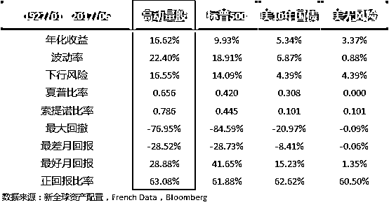
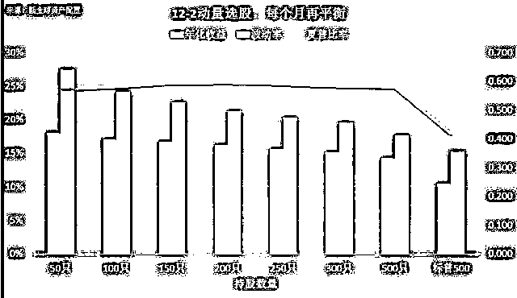

# 动量选股是王道：勇敢追涨，该出手时就出手！

> 原文：[`mp.weixin.qq.com/s?__biz=MzAxNTc0Mjg0Mg==&mid=2653286300&idx=1&sn=537477c3734860f18cf6b15bef9eea39&chksm=802e2d89b759a49f9e59036dc8c0620fbf9c9479ad71873dfaf68184629f30dc69d4cac6addc&scene=27#wechat_redirect`](http://mp.weixin.qq.com/s?__biz=MzAxNTc0Mjg0Mg==&mid=2653286300&idx=1&sn=537477c3734860f18cf6b15bef9eea39&chksm=802e2d89b759a49f9e59036dc8c0620fbf9c9479ad71873dfaf68184629f30dc69d4cac6addc&scene=27#wechat_redirect)

**编辑部**

微信公众号

**关键字**全网搜索最新排名

**『量化投资』：排名第一**

**『量       化』：排名第一**

**『机器学习』：排名第三**

我们会再接再厉

成为全网**优质的**金融、技术类公众号

诺贝尔奖得主尤金-法玛和肯-佛伦奇（Fama-French），两位作为市场有效性理论强有力的支持者，曾经在其论文中，写到过：

> *The premier market anomaly is momentum. Stocks with low returns over the past year tend to have low returns for the next few months, and stocks with high past returns tend to have high future returns.* 
> 
> ***动量是一种优异的超额收益策略。过去 1 年表现不好的股票，在今后的几个月中，往往会继续下跌；而过去 1 年表现好的股票，往往会继续走高。***

既然坚信市场有效性的诺奖得主都这么肯定动量（Momentum），那么动量到底是什么东西？我们怎么能拿它来做股票赚大钱成为人生赢家？

这里，我们首先梳理一下知识。

动量（Momentum）的定义很简单：**动量就是资产在过去某个时间段内的总回报**，比如过去 12 个月股价的总回报，计算起来很简单。说白了就是股票继续冲高的惯性。

用动量来做策略的话，按照空间结构，其实分为 2 种：

1.  **Time-series Momentum（时间序列动量）**，又被称为 Absolute Momentum（绝对动量）。就是计算资产自身，在某一段时期内的总回报。如果其总回报为正，那就继续持有，如果为负，就卖出（或者做空）。只持有动量绝对为正的资产。

2.  **Cross-sectional Momentum（横截面动量）**，又被称为 Relative Momentum（相对动量）。是在将每种资产根据自身某一段时期内的总回报大小，进行横向比较，持有动量相对较高的一些资产。

简单来说，绝对动量策略，考虑的完全是资产本身的表现；而相对动量策略，则做的是资产间动量的比较。

比如市场上只有 3 只股票，过去 12 个月，股票 A 涨了 80%，股票 B 跌了 10%，股票 C 跌了 20%。

那么如果是**绝对动量**策略的话，我们会买入或者继续持有股票 A。

但是如果用**相对动量**的话，如果我们的策略是持有 3 只股票中动量最高的前 2 只，那么我们不仅要继续持有 A，而且要持有 B，虽然股票 B 的动量为负。

实践中，绝对动量一般被用来做风险管理或者是趋势择时；而相对动量，则是用来做选股或者是资产间的轮动。

诺奖得主的所说的这个动量，在实践中，就是用**相对动量选股****（追涨）**的方式，进行股票的筛选。

规则其实很简单：

1.  每个月底，计算市场上 3 家主要交易所上的所有股票的动量。

2.  动量计算的期限为过去 12 个月（跳过最近一个月）的总回报。

3.  按照动量大小，将所有股票排成 10 组。

4.  买入前动量最高的一组，市值加权持仓。

5.  每月如此，进行再平衡。

分组如下图所示

**动量选股历史表现优秀**

那么它的历史表现如何呢？我们从诺奖得主自己的数据库 French Data 里面，提取了这 10 组股票组历史上 90 年的数据，计算年化回报： 

低动量股票组的年化收益率竟然是负的 1.51%，而动量最高的股票组，其年化达到了 16.61%。

诺奖得主言之有理：**动量大法好，****涨的好的还涨，跌的烂的还跌！**

我们加入几个比较基准继续看看高动量股票组的威力：

高动量股：Fama-French 高动量股，市场上前 10%的过去 12 个月总回报为正的股票，市值加权组合，每个月再平衡。（上图中最右边的柱子）

不比不知道：在过去近 90 年的历史数据上，高动量股一马当先，大幅跑赢标普 500。 其年化收益率有惊人的 16.62%，标普 500 只有 9.93%。其 0.786 的夏普比率，也远远高于标普 500 的 0.420，可谓是赚取超额收益的一大法宝。

**动量选股为何管用**

动量选股投资为什么管用？这个问题在学术界里面也是一直争论不休，有一大堆一大堆的关于动量为什么管用和不管用的论文和报告。你要是有什么好论文，请推荐给我。

传统上很多学者都认为动量是基于风险溢价理论，因为持续上涨的股票，一般有较大的下跌压力预期，所以为了补偿购买这些股票的“理性投资人”的风险，动量股必须提供额外的收益。

而我自己，更加喜欢金融行为学的解释，因为我不相信市场（参与者）是有效的。 

很多学术研究表明，投资人不仅对坏消息**over-react（反应过激）**，也同时对好消息**under-react（反应过低）**。比如很多投资人在某只股票在盈利超预期的时候不敢进场，瞻前顾后，在看到股价大幅拉升的时候，才跟随进场。 

再加上**limited attention bias（有限注意力偏差）**，投资人很难持续追踪一系列的小的好消息，这就使得涨的慢的股票有持续上涨的空间。

另外，**亏损厌恶（Loss Aversion）**和**处置效应（Disposition Effect）**，也导致投资人往往急于了结获利，过早卖出浮赢股票；但是在浮亏是往往犹豫不决，过晚卖出，这也给了高动量股继续上涨的空间。详见文末延伸阅读。

抛开以上的投资人偏见（Investor Bias），导致投资人无法做出最理性的决策，市场上还有**套利限制（Limits to Arbitrage）**。

Limit 1: 市场上最大的大腿：保险基金和社保基金，这 2 种机构参与者都无法做空股市。 

Limit 2: 做空或者做多成本过高 

Limit 3: 做空或者做多手段过少 

Limit 4: Leverage Constraint (杠杆限制) 

这些林林种种的、在现实中非常骨感的条件，限制了空头对多头的有效制约。特别是在动量策略中，人总是觉得一个股票涨得多了就要跌，这完全是吃不着葡萄说葡萄酸的表现。

先不说其它的，就拿腾讯举个栗子，过去 10 年涨了 5127%，年年化回报 47%，有多少投资人搭上了这趟去火星拯救马丁的火箭？又有多少投资人还犹犹豫豫等着回调，却眼睁睁地错过行情？（此处并非叫大家去买腾讯）。

**做动量就是这么的逆人性：只买高，不买低！**

**做动量选股不简单**

别看动量选股是完全基于股票历史价格的一个策略，听起来很简单。但是除了计算总回报以外，还有很多的因素会影响到这个策略：

1.  按照计算动量的历史区间（look-back period）分：是用过去 12 个月呢、还是 10 个月、6 个月、1 个月？

2.  按照再平衡的频率分：是买入持有 1 个月，还是 3 个月，12 个月？

3.  按照持仓数量的多少分：是持有 1 只股票，还是 10 只，50 只、100 只？

4.  按照持仓方式分：是平均权重呢，还是按照市值加权？

**动量计算的历史区间问题**

这个问题已经有大量的学术论文进行了研究，比如 Robert Novy-Marx 教授的文章《 Is momentum really momentum？ 》，就指出：

较短期的动量，有明显的均值回归；中长期的动量，比较稳定。

图来源：《 Is momentum really momentum？ 》 by Robert Novy-Marx

上图中可以看出，如果用过去 1 个月的时间窗口来计算动量，得出的结果就不是“追涨杀跌了”，而是“追跌杀涨”。

因为用过去 1 个月总回报来当动量指标，买入高动量卖出低动量的平均月回报（左图）是负 0.6%，夏普（右图）也是负 0.44。

**这就说明了短期动量越高，其下跌的风险（均值回归）越大；****而如果用更长期限的动量来做选股的话，效果明显变好**：上图中的 12 个月动量的月平均回报和夏普率均为正，而且高于其他的动量指标。

所以业界中，动量选股的动量计算周期，一般都是 12-2（过往 12 个月，跳过最近 1 个月，以求最大化上涨动能，同时减少均值回归的影响），如下图：

这里可以用 T-12 月底的价格除以 T-2 月底的价格来计算动量，也可以用每个月的回报+1 然后阶乘，都没有什么区别。学术上计算真实动量的时候，还会用以上计算出的动量减去当期的无风险收益动量，以求得到由风险资产价格变动而得到的动量。

**用动量做投资，必须在系统系的框架之上**

那么剩下的问题：再平衡频率、持仓数量的多少和持仓方式，我们就用自己的数据，通过历史回测的方式来判断。（以下测试没有假设任何交易费、市场冲击和利得税）

**回测时间：01/1970 - 12/2016**

起始股票池：美国市场上市值最大的前 1000 只股票。

动量计算方式：12-2 动量。

**测试维度**

1.  持仓数量：50 只，100，150，200，250，300，500 只

2.  再平衡平率：1 个月，2，3，4，5，6，7，8，9，10，12 个月

3.  持仓方式：平均持仓，市值加权持仓

**测试结果**

**年化收益率**

非常明显的看到，如果用动量选股，平均持仓 50 只，每个月再平衡的年化收益率是最高的。动量是一种类似惯性的策略，过去动量越大，接下来就越有获得高收益的可能。但不管是动量还是惯性，都会有衰减的周期。

随着持有动量股票的时间增加，动量的未来盈利惯性也在减少。比如持有 50 只股票时，1 个月就再平衡的年化收益率是 18%，而如果买入持有 12 个月再调仓的话，收益率就会下降到 11.48%，基本与同期大盘的表现相同。

**所以，持仓少 + 调仓快 = 较高预期的回报**

**那么风险呢？**

我们知道，世界上基本没有免费的午餐，如果持续减少持仓数量，是会增加组合的波动率的。详见文末延伸阅读。

果不其然，随着持仓数量的减少，组合的波动率增加的非常快。平均持有 500 只股票的时候，波动率在 17%左右，而减少到 50 只的时候，波动率大幅上升到 27%左右，远远高于标普同期的 15%。

这里我们也看到，再平衡频率在动量选股中对组合波动率的影响不大，持仓数量是决定性因素。

**所以，持仓少  = 较高的波动率**

**跟踪误差**

较大的波动率肯定会带来较大的预期回报，但是较大的波动率也会带来较大的跟踪误差，导致策略在短期内有较大的跑输大盘的可能性

如果每个月再平衡，外加只平均持仓 50 只股票，策略与标普 500 的跟踪误差会高达 20%。非常极端的例子就是，如果标普今年回报是 10%，这个策略有可能是正 30%，或者是负 10%。

想要跑赢大盘，就必须承担集中投资带来的风险。

**所以，持仓少 + 调仓快 = 较大的跟踪误差**

**经风险调整后的夏普比率**

夏普比率这个数据比较有趣。我们之前说波动率的决定性因素是持仓数量。而从夏普比率上来看，再平衡频率对夏普比率的影响跟持股数量相当，甚至更大。

再平衡频率越快的情况下，持股数量对夏普比率的影响越小。比如每个月再平衡的话，夏普比率基本都在 0.58 上下；但是如果再平衡频率掉到了 12 个月，持仓 50 只的夏普比率是 0.369，而持仓 500 只的是 0.476。

从以上的数据，我们得出以下的结论

1.  12-2 个月的动量选股有效。

2.  在动量选股中，在平衡频率是决定性因素。

3.  在平衡频率一定要等于或者低于 3 个月，每个月再平衡频率的收益最高。

4.  在保证了一定的再平衡平率的情况下，持仓数量的多少，决定了预期收益率的高低和跟踪误差的大小。数量越少，预期收益和误差越高。

**这些结论为什么重要呢？**

动量选股，其方法很直白。但是由于资产组合构造（持仓量和在平衡平率）的不同，不同的动量策略间会有很大的收益和风险区别。投资人在做动量策略时，或者在购买做动量的共募基金和 ETF 时，必须要认真考虑这 2 个重要的因素。

如果你风险承受能力高，当然要选 1 个月再平衡+持仓 50 只左右的动量策略。

如果你风险承受能力相对较低，你可以选择再平衡 1 个月 + 持仓 500 只左右的策略。

这些策略在历史上都跑赢了大盘，并且夏普比率都非常接近。

所以在系统性的框架下，调整持股数量，是一个比较好的调整风险的方法。

最后还是俗套的来一张１００元净值增长图，看看高预期回报和时间复利的强大作用，你们看，多厉害。

那么按市值加权持仓的回测数据呢？结果跟上面的平均持仓的数据相似，不好意思，文章太长，我就不放上来了。需要看的朋友，可以添加微信公众号“新全球资产配置”，发送“动量市值持仓回报”即可。

**实际操作中的考虑：动量虽好，可不要贪杯。**

**策略的成本**。动量选股虽然有着较高的预期回报，但是在现实中最制约它的因素有３个：交易费用、资本利得税、市场冲击。

由于动量策略需要较高的再平衡频率，产生频繁的交易和非常高的换手率，从而增加交易佣金和市场冲击，使得预期收益率下降。特别是对于个人投资人，除非是牛散，一般都不会有太低的交易费用。

个人投资人也很难拥有机构交易的能力，无法保证较低的市场冲击。另外如果在资本利得税较高的国家（比如美国），短期的交易会带来较高的税赋，使得动量策略的收益很可能被大幅侵蚀。

比如美国著名的研究机构 RAFI，就在其一篇论文中指出：高换手率和较高的市场冲击，很可能会抹除再平衡频繁的高动量股超额回报。

但其同时也指出，如果管理人有丰富的交易经验，这种负面的影响是可以被避免的。

**策略的周期性。**每个策略都有其周期性，动量策略也不例外。动量策略由于是追涨型策略，在市场风格反转的时候，收到的冲击会非常明显，以为大家首先抛售的肯定是浮赢最多的股票。

动量策略是一种比较顺经济周期的策略：牛市涨的多，熊市跌的多。

**策略执行复杂。**由于每 3 个月甚至是每个月都要做再平衡，才能最大化动量策略的预期收益。并且最少的持股数量在 50 只左右。但是普通的投资人，很难进行频繁的、大量股票的股票交易。费时费力，很难坚持下去。

个人投资人如何能过获得动量策略的好处？共募基金或者是 ETF 肯定是一个较好的选择。我会在之后的文章中，详细介绍一些好的动量策略基金。

**写在最后**

动量选股，是赚取市场超额收益的一个有效武器。这个市场异常（Anomaly），不仅诺奖得主拿它没办法，无法从市场有效性假设解释，还有非常长的实证的数据做支撑。

从金融行为学和市场套利限制上看，动量选股是一个非常棒的策略，因为它是一个逆人性的策略：高了继续追，勇者胜！

然而，**做动量策略做的是系统性的选股，不是拿动量指标去赌哪只个股还会创新高，不是去炒股，不是不经大脑的赌博**。

每个月再平衡，或者每２个月再平衡，年复一年，月复一月，做投资需要持续做，需要定力和毅力，更需要有逻辑和系统性，这在动量策略身上体现得淋漓尽致。

动量选股虽然有着较高的预期回报，但是也受现实交易因素的制约。如何在预期收益、交易成本、策略可靠性之间寻找平衡，是策略管理人需要回答的问题。

而个人投资人，也要通过实证研究，做到心中有数，方能在长期跑赢大盘。

**来源：新全球资产配置**

**关注者**

**从****1 到 10000+**

**我们每天都在进步**

