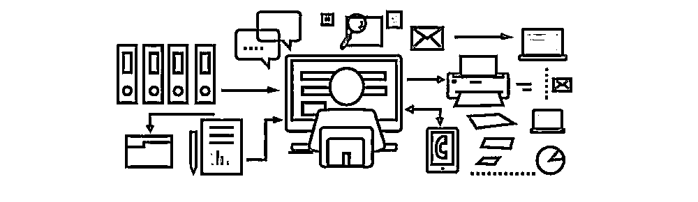
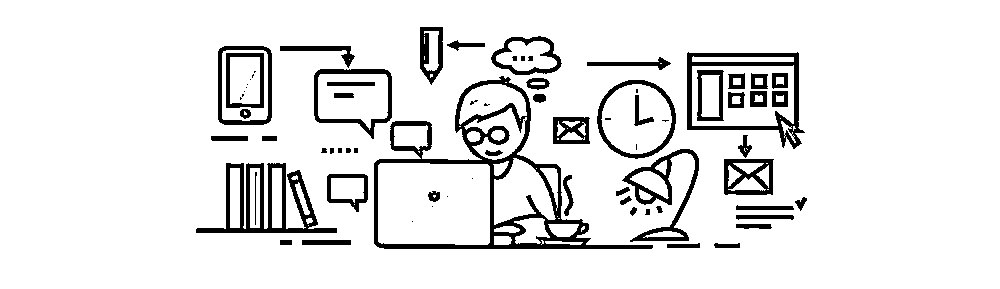

# 为什么程序员一定要学深度学习

> 原文：[`mp.weixin.qq.com/s?__biz=MzAxNTc0Mjg0Mg==&mid=2653286296&idx=1&sn=f7029776595d093c80004a5d215ee1c5&chksm=802e2d8db759a49b325569fedaffbba6c65ecdb718211981168a92ca5c4c7bc3928f4f19888d&scene=27#wechat_redirect`](http://mp.weixin.qq.com/s?__biz=MzAxNTc0Mjg0Mg==&mid=2653286296&idx=1&sn=f7029776595d093c80004a5d215ee1c5&chksm=802e2d8db759a49b325569fedaffbba6c65ecdb718211981168a92ca5c4c7bc3928f4f19888d&scene=27#wechat_redirect)

**编辑部**

微信公众号

**关键字**全网搜索最新排名

**『量化投资』：排名第一**

**『量       化』：排名第一**

**『机器学习』：排名第三**

我们会再接再厉

成为全网**优质的**金融、技术类公众号

对于深度学习，我也是一个初学者，能力有限，但这些的确是我现在的真实想法，我也会按这个思路去尝试。

***1***

我是一个好奇心很重的人。深度学习刚开始流行的时候，我就做过简单的学习。当时我的结论是短期内，深度学习只能在弱智能徘徊，很难进展到强智能。

这个结论在今天看来，也不算过时。但真正被深度学习给 Shock 到，是去年和某教育 APP 的 CEO 同学聊天。他告诉我，在教育这个垂直领域，他们的语音识别率已经比讯飞要高了，依赖于大量的数据；更 NB 的是，加上 NLP，他们的 AI 已经可以帮老师改主观题了。主观题啊，就是数学的问答题，语文的作文。

这让我开始重新思考弱智能。

***2***

完全依靠强智能的应用场景，会产生很多问题。比如自动驾驶，要想在中国这种各种奇葩状况层出不穷的交通环境下运行，一时半会儿是不行。即使是一个看起来简单的问答机器人，也没一家真正做好，你多问 siri 几句，她很快就晕了。

经常关注我微博同学会知道，我最喜欢说的一句话就是：「能自动化的，要自动化；不能自动化的，要半自动化」。

在人工智能上，这个法则似乎依然是有效的。既然现在强智能还不够强，那么为什么我们不用弱智能+人工确认的方式，来实现「半智能化」呢：用机器帮你做预选，你来做最终选择，虽然依然包含了人工干预，但却可以把生产效率提升几十倍。

***3***

有同学和我说，找不到应用深度学习的场景，这是因为太执着于强智能，想让机器独立处理所有事情；如果使用「半自动化」的思路，你会发现遍地都是场景。

最典型的场景就是「按需求进行组合搭配」。拿今天小程序举例，小程序在框架层上，将功能分隔到了 page 的粒度，这使得小程序的组件会很好的被重用；而在设计上，小程序提供了统一的官方指导风格，所以不会出现太多个性化的东西。

我需要一个用户资料管理， xpm install user-profile；我需要动态 Feed 流，xpm install feed-timeline 。

然后这货就喊着要去做，还在 GitHub 上开了个坑，据说 SDK 已经写完，安装器年前能开始内测。https://git.oschina.net/xpmjs/xpm

然后我告诉他，你得赶紧做，从长远看，通用应用最后是不太值钱的，因为很快就有开源项目把它做得很好。真正值钱的是，下沉到行业里边的应用。比如说吧，同样是用户资料页，房地产行业的、猎头行业的以及技术社区的会完全不一样。但区别也就是添加几个行业特定的字段而已。 大量的「二次开发」工作，才是最为琐碎又最为挣钱的。

这就是典型的可以用上深度学习的场景。通过抓取对应行业的 H5 页面，我们很快就可以把各个行业需要哪些可能的字段给整理出来，然后把这些交给机器进行学习，当再有新的需求进来的时候，机器就可以自动配好预设字段。机器会出错么？当然。但哪怕是 80%的准确率，也已经可以节省掉好几个程序员了。

为什么我要学深度学习？ 因为这背后是 TM 白花花的银子。

***4***

其实细心的同学会发现，我一直说的是「深度学习」而不是「机器学习」。 

因为我的目的很简单，那就是用。在学习第一年，我给自己定的目标不是要理解「机器学习」的原理，而是要把「深度学习」用到自己产品的方方面面。

先学「深度学习」还有一个好处，那就是不用太多「机器学习」的基础。能把 tensorflow、kears 这种开源框架搭起来，然后喂数据，然后看结果。等到优化的时候再去补知识点。

因为深度学习更像是一个黑盒子，现在很多专门搞深度学习的同学也说不清楚为什么要建三个层、要放四个节点；什么情况下用什么激活函数。只说通过实践+观察数据慢慢调整。这简直就是新手上路的最好切入点嘛。

如果不想在本地搭建环境，AWS 上已经有可以用的镜像，基于 API 的深度学习服务也日益增多。这东西就像水电气一样，用比学重要。

也有同学严谨的指出，很多场合下，机器学习的其他方法远比深度学习有效。他们是对的，如果说学好整个机器学习，可以做到 90 分；那么光用深度学习，可能只有 70 分。但现在绝大部分的程序，连 TM 一点智能都还没用上呢。从零分到 70 分，只需要把深度学习用起来。

为什么我要学习深度学习，因为这 TM 的性价比太高。

**课程大纲**

>上下滑动即可查看全部课程大纲

课程大纲

第一课：深度学习总体介绍 

    1\. 神经网络：从传统到现代

    2\. 深度学习应用特点

    3\. 深度学习发展方向

    4\. 深度学习流行框架比较 ：用 TensorFlow 进行课程实例学习与工程部署

    5\. 实例：深度学习环境配置，TensorFlow 基础／进阶／示例，PyTorch 基础

第二课：传统神经网络 

    1\. 神经网络起源：线性回归

    2\. 从线性到非线性：非线性激励

    3\. 神经网络的构建：深度广度复杂度扩展

    4\. 神经网络的“配件”：损失函数，学习率，动量，过拟合等

    5\. 多层感知器

   6\. 实例: 线性回归与逻辑回归模型 (TensorFlow, PyTorch)

第三课： 卷积神经网络：基础篇 

    1\. 链式反向梯度传导

    2\. 卷积神经网络－卷积层：正向反向推导

    3\. 卷积神经网络－功能层：激活函数，降维，归一化，池化，区域分割

    4\. 实例：简单卷积神经网络训练与运行 (TensorFlow, PyTorch)

 第四课：卷积神经网络：高级篇

    1\. AlexNet：最早的现代神经网络

    2\. VGG，GoogleNet，ResNet，DenseNet： 近期的高级卷积网络模型

    3\. U-Net：深度图片生成网络

    4\. 实例：利用预训练模型进行物体分类／特征提取 (TensorFlow, PyTorch)

第五课：卷积神经网络：目标分类与识别 

    1\. 目标分类与识别任务介绍

    2\. 传统分类识别方法总结

    3\. ImageNet 与 PASCAL VOC 数据库

    3\. 迁移学习

    4\. 个人研究分享：如何设计新的的网络

    5\. 实例训练：物体识别／场景识别／文字识别 (TensorFlow)

第六课： 卷积神经网络：目标检测与追踪 

    1\. 目标检测与追踪任务介绍

    2\. 基于手动设计特征的传统目标检测追踪方法总结

    3\. 目标检测：RCNN，Fast-RCNN，Faster-RCNN, FPN 系列

    4\. 目标检测：YOLO，SSD，YOLO9000 系列

    5\. 目标追踪：Hierarchical Features, Tracking with FCNs 系列

    6\. TensorFlow 官方目标检测接口：Object Detection API

   7. 个人研究分享：自然场景文本检测识别领域的最新方法与动向

   8. 实例：目标检测模型训练／部署 (TensorFlow)

第七课：卷积神经网络：目标分割 

    1\. 目标分割任务介绍

    2\. 传统图片分割方法总结

    3\. 全卷积网络 

    4\. 图像语义分割

    5\. 图像实例分割

    6\. 目标分割：FCIS, Mask-RCNN 系列

   7. 业界应用：目标分类／检测／分割模型在自动驾驶与无人车中的应用

    8. 实例：目标分割模型训练／部署 (TensorFlow)

第八课： 循环神经网络 

    1\. RNN 基本原理

    2\. 改进版 RNN：门限循环单元

    3\. 改进版 RNN：长短期记忆单元

    4\. 语言特征提取

    5\. 编码器 + 解码器结构

    6\. 注意力机制模型

    7\. 图片标注：学会看图说话

    8\. 图片问答：学会看图推理

   9. 业界应用：Language and Vision，语言文字与图像的结合应用

   10\. 实例：图片标注与图片问答实例 (TensorFlow, PyTorch)

第九课：无监督式学习 

    1\. 无监督式学习：以生成式模型为例

   2. 生成式对抗网络：( GANs)

    3\. DCGAN：GAN ＋深度学习

    4\. Conditional GAN： 生成图片由我控制

    5\. InfoGAN： 无监督找特征

    6\. Wasserstein GAN： 理论创新

    7\. 实例：Pix2Pix/CycleGAN 自定义图片生成 (TensorFlow, PyTorch)

第十课：增强学习

    1\. 增强学习基础

    2\. DQN 深度增强学习

    3\. DQN 改进模型

    4\. A3C 模型： 高效游戏机器人

    5\. ELF 模型：简化版《星际争霸》，人工智能游戏测试平台

    6\. 实例： DQN 用于 Atari 游戏学习 (TensorFlow)

**小象学院****《深度学习》****总招生量**

**已突破 5000 人**

**不想落后于他人**

**就该马上行动起来！**

**主讲老师：戎雪健**

**美国纽约城市大学博士**

**顶会审稿人**

**CVPR，ICCV，BMVC，WACV 等重要会议**

**及 TMM，TIP，CVIU，JVCI 等期刊的审稿人**

研究领域包括深度学习，计算机视觉，与图像处理等，尤其是自然场景文字检测与识别方向。

原价 899

**现拼团已达最低价 399！**

**你今天的选择，决定了明天的路。**

**长按扫码加客服参加拼团↓**

****