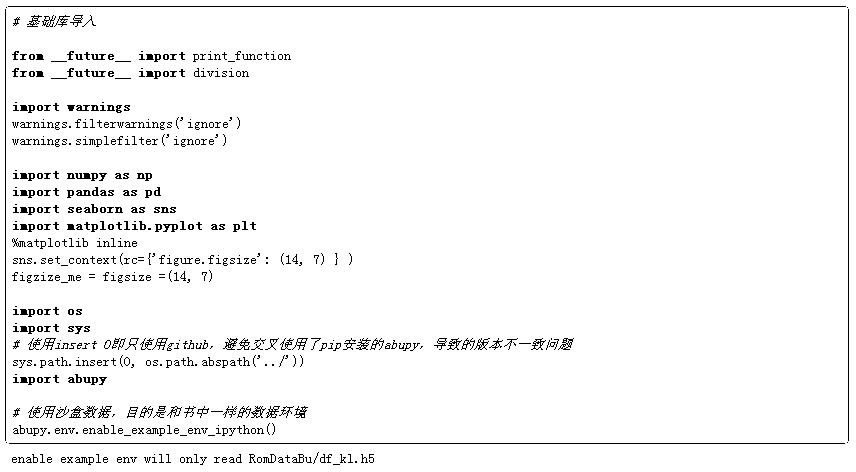

# 【独家发布】期货市场内外盘低频统计套利基于 Python

> 原文：[`mp.weixin.qq.com/s?__biz=MzAxNTc0Mjg0Mg==&mid=2653286291&idx=1&sn=ec881a91d31cc918079d96f4c1135dae&chksm=802e2d86b759a4907ea4228e65105a1c410eb4f3cfabab6c5d86b7ab3acbcb5a8480cadafeec&scene=27#wechat_redirect`](http://mp.weixin.qq.com/s?__biz=MzAxNTc0Mjg0Mg==&mid=2653286291&idx=1&sn=ec881a91d31cc918079d96f4c1135dae&chksm=802e2d86b759a4907ea4228e65105a1c410eb4f3cfabab6c5d86b7ab3acbcb5a8480cadafeec&scene=27#wechat_redirect)

**编辑部**

微信公众号

**关键字**全网搜索最新排名

**『量化投资』：排名第一**

**『量       化』：排名第一**

**『机器学习』：排名第三**

我们会再接再厉

成为全网**优质的**金融、技术类公众号

**声明**  

作者: 阿布

公众号独家授权

未经允许 禁止转载

github 地址：

https://github.com/bbfamily/abu

本策略可直接运行，运行地址

https://github.com/bbfamily/abu/tree/master/abupy_lecture

首先导入本节需要使用的 abupy 中的模块：

算法交易之父托马斯•彼得菲最成功的一段经历是利用当时最快的计算机，租赁独享电话线以保证数据传输畅通无阻，甚至超越时代定制平叛电脑，使用统计套利在不同市场进行对冲策略。

这是最有保证的一段量化交易历史，在当时的交易环境下运用高科技在市场中确实可以获利。

但是这个策略放到今天肯定不适用，因为科技在不停的进步，技术的不断透明化，信息社会的高速发展，自动化交易占了美国股票市场 60%以上的成交量。在美国很多高频交易为了通信速度能有几毫秒的提升，不惜在太平洋底打洞自己搭建通信网络，也有专门提供暗光纤的独享网络商，他们网络的一年租赁费用就高达几千万美元。在这种环境下，个人量化投资者是不是一点机会都没有呢？

### **1\. 伦敦期货市场和国内期货市场中的金属期货**

本节示例适合个人量化交易者的低频统计套利策略，目标市场为伦敦期货市场和国内期货市场中的金属期货。

如下先获取伦敦的金属期货 symbol 数据：

接下来获取国内的金属期货 symbol 数据：

如下分别将两两金属期货进行跨市场配对，首先可视化一下走势，可以看到每一个配对期货市场的走势都非常跟随：

如果做跨市场高频交易，需要非常好的设备，盯着盘口的数据，快速进行交易决策，且对资金量也有要求，本节的示例为适合个人量化交易者的跨市场低频统计套利示例。

注意观察上面的每一对趋势曲线，如 CAD vs CU0，你可以发现 CU0 对趋势敏感的速度要明显快于 CAD, 而且是非高频的快，即上面的蓝线在趋势下跌时先下跌，趋势上涨时先上涨，那么就可以认为 CAD 在非高频下跟随 CU0，具有低频统计套利机会。

### **2\. 趋势变化的敏感速度**

我们不可能真的用肉眼去一个一个观察，而且也无法量化具体趋势敏感的速度，也即无法确定是否真实存在低频统计套利机会。

对于量化交易，优势是通过计算机强大的运算能力，在市场广度的优势下获取概率优势，进行交易，下面示例如何使用 abupy 中的 api 计算趋势变化的敏感速度，如下所示：

备注: 具体计算计算趋势速度请阅读 tl 模块中 calc_pair_speed 方法

上面的计算结果 0.57 为 CU0 对趋势变化敏感速度，0.52 为 CAD 对趋势变化敏感速度，即 CU0 的对趋势变化的敏感度大于 CAD，且大于 0.03 具备低频统计套利的条件。（大于 0.05 认为具有安全低频统计套利机会，具体这些阀值将在之后的章节讲解）

在低频统计套利的情况下将会使用 CAD 做为交易目标，CU0 做为趋势风标，因为它的敏感度高，下面初始化一个字典，key 为将会使用做为交易目标的 CAD，value 为做为趋势风标 CU0，如下所示：

下面计算沪铝（AL0）和伦敦铝（AHD）对趋势变化的敏感速度，如下：

上面的计算结果 0.61 为沪铝（AL0）对趋势变化敏感速度，0.57 为伦敦铝（AHD）对趋势变化敏感速度，即 AL0 对趋势变化的敏感度大于 AHD，且大于 0.03 具备低频统计套利的条件。

字典中 key 为将会使用做为交易目标的低敏感 AHD，value 为做为趋势风标的高敏感 AL0，如下所示：

下面计算国内黄金（AU0）和伦敦黄金（XAU）对趋势变化的敏感速度，如下：

上面的计算结果 0.58 为国内黄金（AU0）对趋势变化敏感速度，0.61 为伦敦黄金（XAU）对趋势变化敏感速度，即外盘敏感速度快于国内期货趋势变化敏感速度，之前的两个都为国内期货趋势变化敏感速度快于外盘敏感速度。

字典中 key 为将会使用做为交易目标的低敏感国内黄金（AU0），value 为做为趋势风标的高敏感伦敦黄金（XAU），如下所示：

下面计算国内白银（AG0）和伦敦白银（XAG）对趋势变化的敏感速度，如下：

上面的计算结果 0.55 为国内白银（AG0）对趋势变化敏感速度，0.60 为伦敦白银（XAG）对趋势变化敏感速度，即白银的外盘敏感速度也快于国内期货趋势变化敏感速度。

字典中 key 为将会使用做为交易目标的低敏感国内白银（AG0），value 为做为趋势风标的高敏感伦敦白银（XAG），如下所示：

下面计算沪锌（ZN0）和伦敦锌（SND）对趋势变化的敏感速度，如下：

字典中 key 为将会使用做为交易目标的低敏感伦敦锌（SND），value 为做为趋势风标的高敏感沪锌（ZN0），如下所示：

下面计算沪铅（PB0）和伦敦铅（PBD）对趋势变化的敏感速度，如下：

上面的计算结果 0.50 为沪铅（PB0）对趋势变化敏感速度，0.59 为伦敦铅（PBD）对趋势变化敏感速度，差值达到 0.09 远大于 0.03，是非常好的低频统计套利配对。

字典中 key 为将会使用做为交易目标的低敏感沪铅（PB0），value 为做为趋势风标的高敏感伦敦铅（PBD），如下所示：

上面即选定了跨市场低频统计套利的交易配对字典，key 为为交易目标的低敏感，value 为做为趋势风标的高敏感，如下：

### **3\. 基于跨市场低频统计套利的突破策略**

下面编写择时交易策略实现这个跨市场低频统计套利的交易配对，如下所示：

策略编写如上 AbuFactorBuyPairBreak 所示和之前章节一直使用的周期突破策略 AbuFactorBuyBreak 唯一不同的只有突破信号发出者为趋势风标的高敏感目标，一旦高敏感目标今天突破了，则买入的是低敏感的交易目标。

下面使用这个买入策略进行回测，卖出策略依然延用之前的策略，如下所示：

回测结果如上所示，对比未基于内外盘统计套利的普通突破策略回测可以看到回测效果提升很多，如下所示：

而且即使再次降低交易频度，不使用跨市场套利的时间优势，选择再隔一天买入交易目标，即下面的构造因子参数 buy_today=False，可以看到回测的结果依然好于未基于内外盘统计套利的普通突破策略回测结果。

**关注者**

**从****1 到 10000+**

**我们每天都在进步**

