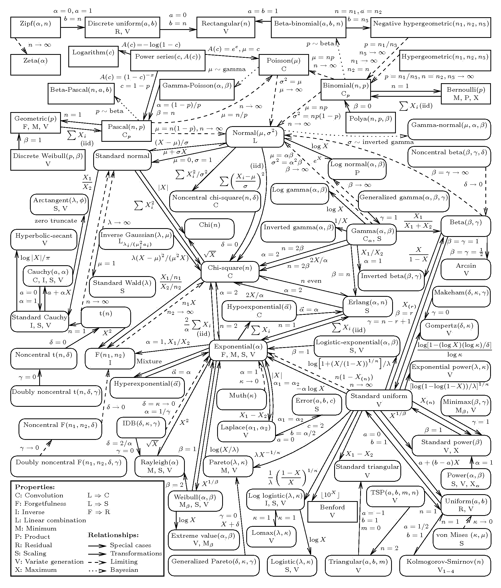

# 打下扎实的基本功，你才可以在关键的时刻展现出你的不凡！

> 原文：[`mp.weixin.qq.com/s?__biz=MzAxNTc0Mjg0Mg==&mid=2653286258&idx=1&sn=168112aace2fb74eb4f307824e1aaef3&chksm=802e2d67b759a471b43b35ffa8d6f6dfaf1610b5e5f524b3acccb63270553e07cbaae5883ffe&scene=27#wechat_redirect`](http://mp.weixin.qq.com/s?__biz=MzAxNTc0Mjg0Mg==&mid=2653286258&idx=1&sn=168112aace2fb74eb4f307824e1aaef3&chksm=802e2d67b759a471b43b35ffa8d6f6dfaf1610b5e5f524b3acccb63270553e07cbaae5883ffe&scene=27#wechat_redirect)

**请大家理解** 

近期由于大家工作学业繁忙

我们推送文章的频率会慢一些

但是每篇文章都会比之前更加用心



**公众号**将和**DigQuant 点宽**开展一次学术合作

我们会把这张看起来很复杂的概率分布图

解析的通俗易懂、有血有肉

敬请期待

```py
**广然后深,博然后专**
```