# 年薪 50 万是什么样的工作？

> 原文：[`mp.weixin.qq.com/s?__biz=MzAxNTc0Mjg0Mg==&mid=2653286242&idx=1&sn=9621b13812b1701f33c47ec42906c658&chksm=802e2d77b759a461516e400ed20c53dd5e59b39d5105e0c00a11863246ac72426eefd1ea1f5b&scene=27#wechat_redirect`](http://mp.weixin.qq.com/s?__biz=MzAxNTc0Mjg0Mg==&mid=2653286242&idx=1&sn=9621b13812b1701f33c47ec42906c658&chksm=802e2d77b759a461516e400ed20c53dd5e59b39d5105e0c00a11863246ac72426eefd1ea1f5b&scene=27#wechat_redirect)

大数据（big data），指无法在一定时间范围内用常规软件工具进行捕捉、管理和处理的数据集合，是需要新处理模式才能具有更强的决策力、洞察发现力和流程优化能力的海量、高增长率和多样化的信息资产。

大数据 5V 特性：  

——Volume（大量）

——Velocity（高速）

——Variety（多样）

——Value（低价值密度）

——Veracity（真实性）

**大数据的就业前景？**

近年来大数据迅速发展，成为工业界，学术界，甚至世界各地政府，高度关注的热点。大数据领域正面临全球性的“人才荒”。而在国内，根据数联寻英发布《大数据人才报告》,目前全国的大数据人才仅 46 万,3-5 年内大数据人才的缺口将高达 150 万。 

对数据的占有和控制，将成为国家间和企业间新的争夺焦点。大数据正在成为继云计算之后的新的热词，大数据时代已然来临，大数据背后，隐匿着巨大的商机。包括 IBM，微软，谷歌，亚马逊等一大批知名企业纷纷掘金这一市场。

中国商业联合会数据分析专业委员会统计，未来中国基础性数据分析人才缺口将达到 1400 万，而在 BAT 企业招聘的职位里，60%以上都在招大数据人才。

**职位技能需求**

**1.学历需求现状：大专最多，本科次之**

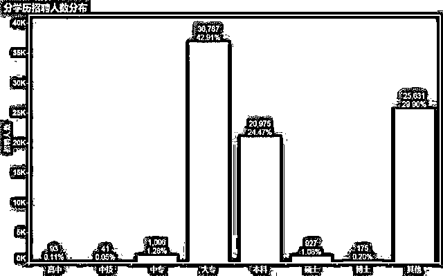

**2.工作经验需求现状：半数企业经验不限**

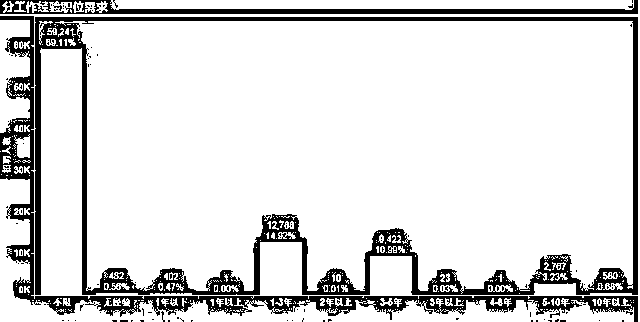

从工作经验来看，69.1%的企业对求职者的要求是经验不限，这很大一部分说明的人才的稀缺，这对于应届大学生而言，无疑是一大机遇，因为企业对于工作经验要求的低，而应届大学生只需要通过培训就能掌握该岗位应有的技能，就能轻松上岗拿高薪，这也充分说明当下学习大数据绝对是千载难逢的黄金时间点。

**不管你是谁，学历如何，只要技术好，你就是老大！！！**

****

**大数据就业薪资**

**1\. Hadoop 大数据开发方向**

据了解 Hadoop 开发工程师入门薪资已经达到了 8K 以上，工作 1 年可达到 1.2W 以上，具有 2-3 年工作经验的 hadoop 开发工程师年薪可以达到 30 万—50 万，一般需要大数据开发的公司基本上都是大公司，Hadoop 开发工程师是目前 BAT 企业、大数据公司最急需的人才，所以学习大数据专业也是进大公司的捷径！

**2. ****数据挖掘、数据分析&机器学习方向**

机器学习职位薪水范围：12k--30K，最大值 30k+若干股票，最小值 12k+若干期权，上四分位 25k，中位数 18k，下四分位 13k；数据挖掘薪水范围：12k--30K，最大值 30k+若干股票，最小值 12k，上四分位 23k，中位数 18k，下四分位 14k。

**★****北京大数据开发平均工资：¥ 30230/月。**

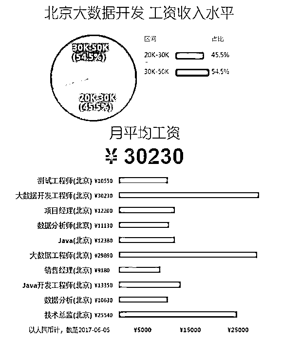

**1、基础人才-数据分析师**

**北京数据分析师平均工资：¥ 10630/月，取自 15526 份样本，较 2016 年，增长 9.4%。**

**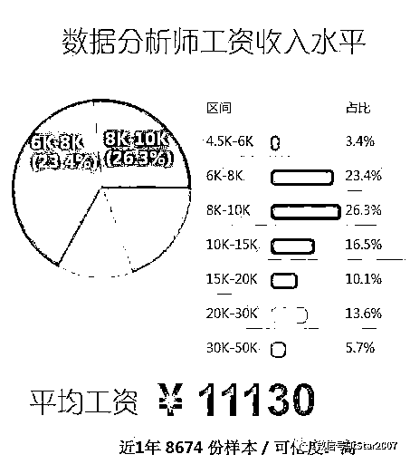**

**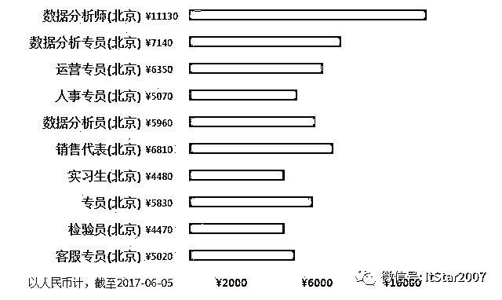**

****4、大数据开发工程师****

**北京大数据开发工程师平均工资：¥ 30230/月。** 

**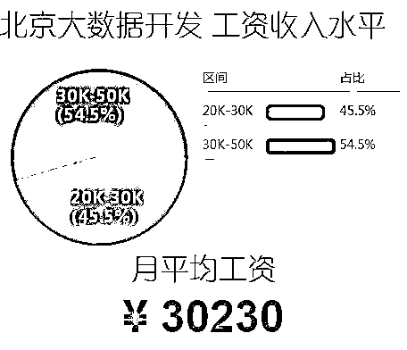**

**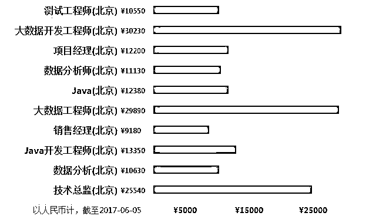**

### ****3、Hadoop 开发工程师****

### **北京 hadoop 开发工程师平均工资：¥ 20130/月，取自 1734 份样本。** 

**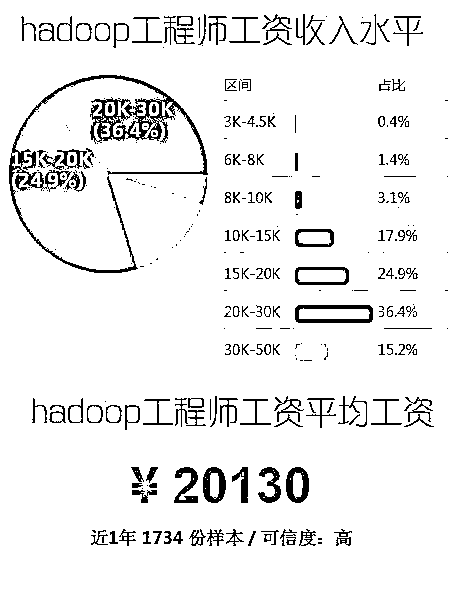**

**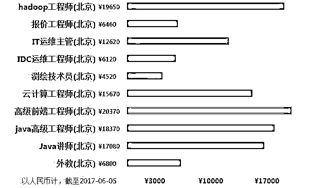**

### ****4、数据挖掘工程师****

**北京数据挖掘平均工资：¥ 21740/月，取自 3449 份样本，较 2016 年，增长 20.3%；** 

**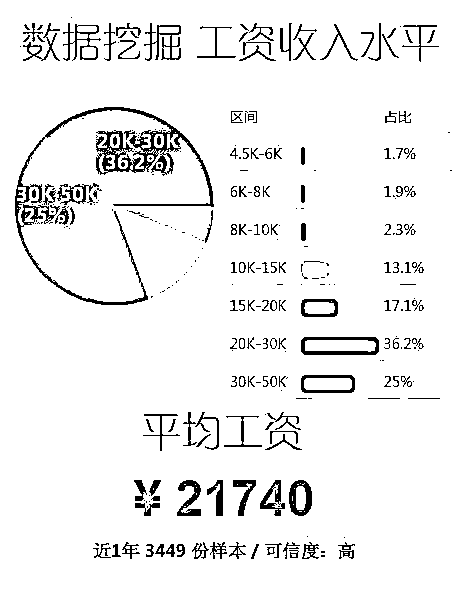**

**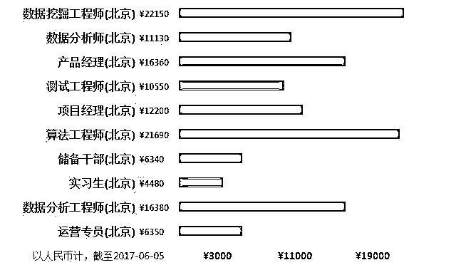**

### ****5、算法工程师****

**北京算法工程师平均工资：¥ 22640/月，取自 10176 份样本。**

**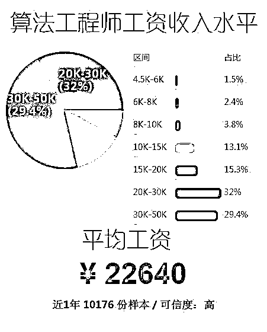**

**** 

****

**在中国，大数据也正迅速成为行业和市场的热点。专注与亚太及中国市场的市场调查机构泛亚咨询发布的调研数据显示，目前出现在各类招聘平台上与数据分析相关的招聘需求比去年同期相比，增长率高达 67%；大数据相关高级职位的薪酬与其他同类技术职位相比平均高出 43%以上。无论是世界范围内还是在中国，大数据浪潮正在深刻改变着各行各业，而各行各业对大数据人才的需求，以及技术从业者希望跻身大数据高级人才的需求也变得越来越强烈。** 

****

****「福利时间」****

****想学大数据没有思路？****

****零基础可不可以学大数据？****

****java 转型大数据容易还是困难？****

****ITStar 大数据研究院****

**特别联合**行业大咖**** 

****8 年**大数据开发经验**

****前腾讯**大数据架构师**

****arry 老师**

**组织大型大数据免费公开讲座**

****

**那么本次讲座都讲什么内容呢？**

****

**Linux 系统简介和常用指令使用**

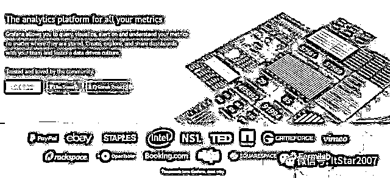

**涉及知识点 :**Linux 系统安装与配置；局域网工作机制和网络地址配置；文件常用操作命令、权限的操作；网络服务器介绍、nginx 负载均衡；自动化部署脚本等。

**Hadoop 离线计算处理**

**项目知识点内容：**Hadoop 的简介、体系结构、背景环境；Hadoop OLTP 与 OLAP；

分布式存储(HDFS）；互联网应用的架构；Hadoop 在淘宝的应用等。

**Storm 实时计算处理**

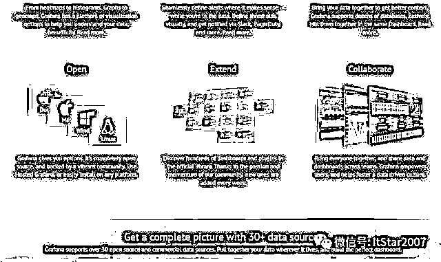

**项目知识点内容：**Redis 的环境搭建，单机版和分布式版本的安装和组成；离线计算和流式计算；Storm 分组的概念；Storm 与其他中间件集成 Api 等。

**此次讲座分两个批次：**

零基础到初级大数据工程师；

适合人群：小白新手、初级大数据工程师

中高级大数据批次；

适合人群：1-3 年大数据工程师

**扫码即可获得价值**** 399 元一节的**

**大数据直播课****免费权限**

**