# 【研报复现】广发证券——基于加权傅里叶变换的长期趋势预测择时策略。

> 原文：[`mp.weixin.qq.com/s?__biz=MzAxNTc0Mjg0Mg==&mid=2653286233&idx=1&sn=0d398648be061e737aeed9d597d84a27&chksm=802e2d4cb759a45a2a26bf05980201b4b547854d4a0947245eab9635c6317f4647e497e6b2ac&scene=27#wechat_redirect`](http://mp.weixin.qq.com/s?__biz=MzAxNTc0Mjg0Mg==&mid=2653286233&idx=1&sn=0d398648be061e737aeed9d597d84a27&chksm=802e2d4cb759a45a2a26bf05980201b4b547854d4a0947245eab9635c6317f4647e497e6b2ac&scene=27#wechat_redirect)

**编辑部**

微信公众号

**关键字**全网搜索最新排名

**『量化投资』：排名第一**

**『量       化』：排名第一**

**『机器学习』：排名第三**

我们会再接再厉

成为全网**优质的**金融、技术类公众号

**1**

摘要

##### **并非任何时刻都可以择时**

有些时候仅仅将市场状态分解为看多或者看空是不合理的，因为市场可能根本就不存在趋势。 在市场没有趋势的时候进行趋势跟随，可能会出现趋势信号不断改变的情况。此时采用趋势策略是不明智的。只有市场存在趋势，趋势策略的价值才能得到体现。

##### **通过震荡判断趋势**

趋势与震荡是市场的两种状态，市场非趋势即震荡。那么当采用趋势线判定市场状态存在较高延迟时，我们可以考虑首先判断市场是否处于震荡状态。判断震荡的模型所需数据窗口相对较短，延迟更低。经过模型计算，若非震荡，则市场处于趋势行情，可以通过趋势模型攫取绝对收益。

##### **通过估计市场波动周期甄别震荡与趋势**

判断市场是否为震荡市，可以通过市场波动周期进行衡量。波动周期短的行情往往对应震荡市；反之，波动周期长的行情往往对应趋势市。 估计市场波动周期的方法有很多，我们之前几篇交易性择时报告采用希尔伯特变换进行非周期波动的瞬时周期估计，但是这种方法存在一定得局限性，例如其必须在窄带随机过程下完成，也就是说要求市场波动保持一定的均值回复平稳特征，而股票市场显然是不符合这种特点的，因此在之前的几篇报告中，我们必须首先对市场波动进行去趋势处理，而这样处理就抹杀掉了市场的趋势特征，因此在本篇进行趋势与震荡区分的报告中，我们开发了一种新的算法——加权傅里叶变换。

**通过加权傅里叶变换估计市场波动周期**

通过传统的傅里叶变换估计非周期函数的“准周期”，主要存在分辨率较低的问题。于是我们开发了加权傅里叶变换算法——按照每个频率分量（周期）在谱上的强度确定权重，计算加权平均后的周期。 这一模型可以很好地刻画非周期市场波动的“准周期”。

##### **长线择时（沪深 300 指数） 实证结果良好**

当市场处于趋势行情时，我们将进行趋势交易。如果市场出现趋势，方向是很好判断的——我们将信号出现前时间子序列的收盘价数据做线性回归，当回归斜率大于零时，我们认为是上升趋势，做多指数；回归斜率小于零时，我们认为是下降趋势，做空指数。当市场从趋势行情回归至震荡行情的时候，我们对所持有的头寸进行平仓。 我们将这一方法运用于沪深 300 指数择时——模型平均择时周期超过半年， 2005 年至今择时正确率超过 80%，属于高胜率的长线择时模型。

**2**

研报复现改动部分

#### 原文择时周期为半年多，此研报复现为 60 天（20*3，约 3 个月），时间为 2006 年到 2017 年，正确率为 76.47%。见最后的回测报告，属于高胜率的长线择时策略。

**3**

策略说明

### **投资种类：**股指期货 

**投资类型：**择时
**持仓类型：**隔夜
**投资品种：**沪深 300 指数
**回测时间：**20060101 至 20170731
**回测频率：**60 天 

**回测策略：**
①数据信息不足 30 天的不予处理。
②信号为 1 做多，信号为-1 做空，信号为 0 平仓。每次选取动态权益资金的 0.8 的金额入场，如若信号持续则继续入场。

**4**

模型应用

我们在日线基础上进行加权傅里叶变换建模，判断市场处于趋势状态还是震荡状态。具体分为以下几个步骤：

##### **1、时间窗口划分**

首先我们取整个日线收盘价时间序列，经过 MA10 平滑，得到{pi}。指定窗口长度 N ，依次取{P1,P2 ,…, PN} 、 {P2 ,P3 ,…, PN+1} 、……等子窗口，计算 PN 、PN+1 、……等时点的瞬时周期。这里的窗口长度 N 要取得比较合适，因为如果 N 过小，时间子序列的信噪比太低，无法提取出有效的周期信息；如果 N 过大，虽然能够计算出更为精确地周期，但延迟会比较高，不利于我们最初的低延迟理念——因为我们希望通过判断市场是否震荡从而判断市场是否趋势，这一方法应该具有相对较低的延迟。在我们的策略中，取 N=15。

##### **2、计算功率谱**

根据

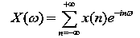

式子对上述每个时间窗口进行离散傅里叶变换，计算不同频率下的功率谱强度|X(w)|2，得到类似于图 5 的谱。不同的是示意图 5 中的谱取 N = 90 ，而我们实证中取 N =15 。

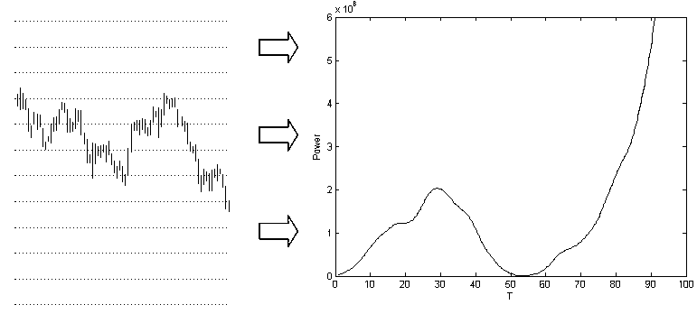

##### **3、加权傅里叶变换计算平均周期**

根据

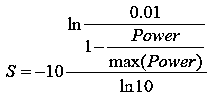

式，计算功率谱上每个周期 T 的强度。当该强度小于阈值 q 时，根据 

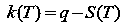

式计算权重，并根据

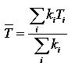

式计算时间子序列的平均周期。例如我们取的子序列是{P1,P2 ,…, PN}，那么计算得到的平均周期即为收盘价为 PN 当天对应的市场波动瞬时周期。我们得到沪深 300 指数时间序列 2005 年至 2013 年的平均瞬时周期时间序列如图 8 所示。

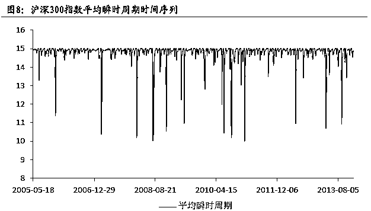

至于这里最大周期为 15 的原因，是因为我们设定了子序列长度 N=15。当整个子序列都不展现出周期性时，即图 2 下方的趋势行情，瞬时周期就会趋近于 15；反之，如果市场震荡，在子序列中表现出一定的周期特征，瞬时周期的值将向下偏离 15。至于偏离到什么程度才算震荡，我们将设定一个阈值进行判断。 

另外，从图 8 可以看出，除了个别尖峰位置，瞬时周期的变化还是较为缓慢的。也就是说，市场的趋势往往会维持较长一段的时间，但震荡状态消失得都很快。这也表明，我们的模型在大多数时候不仅可以判断市场当前的周期，还可以在缓变的市场状态中预测未来一段时间市场的方向，并且这种趋势方向的预测是长周期大级别的。这就解决了我们开篇所说趋势与震荡预测的问题。

##### **4、趋势行情中进行趋势交易**

通过设定阈值

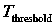

可以判断市场处于震荡还是趋势。趋势判断标准为 

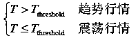

当市场处于趋势行情时，我们将进行趋势交易。如果市场出现趋势，方向是很好判断的——我们将信号出现前时间子序列的收盘价数据做线性回归，当回归斜率大于零时，我们认为是上升趋势，做多指数；回归斜率小于零时，我们认为是下降趋势，做空指数。当市场从趋势行情回归至震荡行情的时候，我们对所持有的头寸进行平仓。

**5**

**策略思路和代码实现**

#### **参数说明**

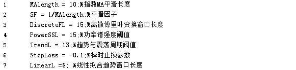

#### **策略思路**

##### **1．取收盘价先用 MA10 平滑处理后用时间窗口划分，窗口大小（DiscreteFL ）取 15。**

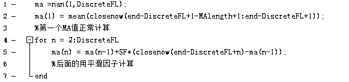

##### **2．对每个窗口进行离散傅里叶变换，计算不同频率下的功率谱强度**

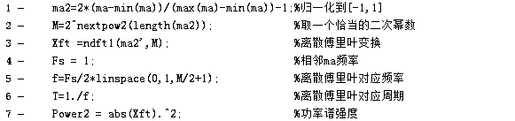

**ndf1 函数部分**

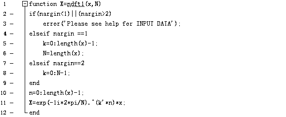

##### **3\. 功率谱强度转换**

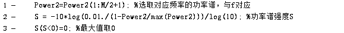

##### **4．设定一个阀值（PowerSSL）15 对于功率谱强度小于 15 的符合条件的进行加权傅里叶计算平均周期。**

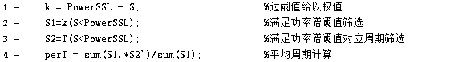

##### **5．对于平均周期大于 13（TrendL）的做趋势交易，否则平仓。趋势交易取 8 日（LinearL）回归的符号，符号为正做多，符号为负做空。**

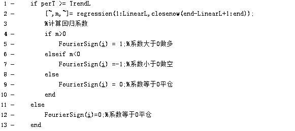

**6**

回测报告

##### 图一 权益曲线及潜在亏损

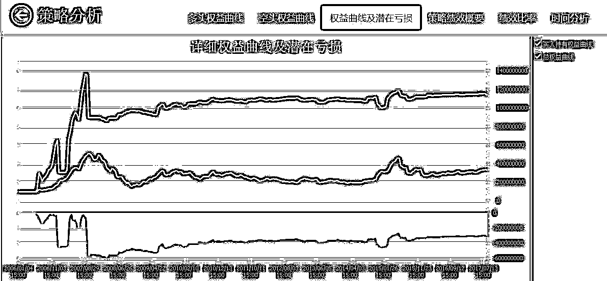

##### 图二 策略绩效概要

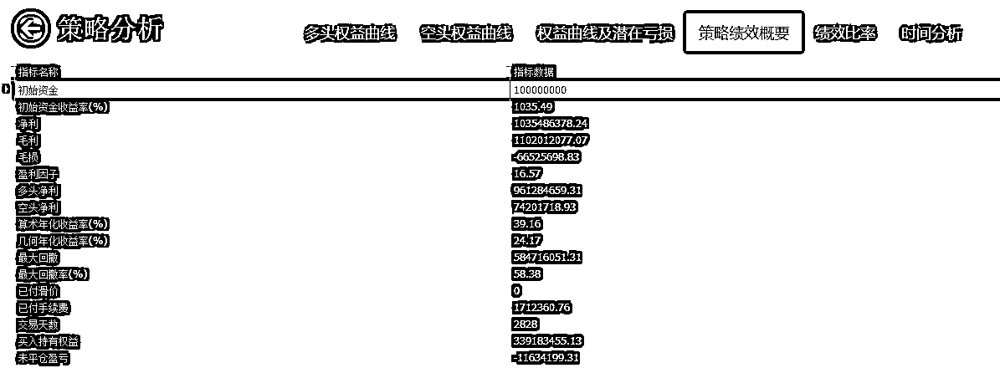

##### 图三 绩效比率

##### 图四 总体交易分析

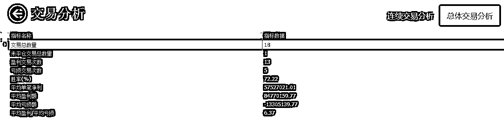

##### 图五 月盈利

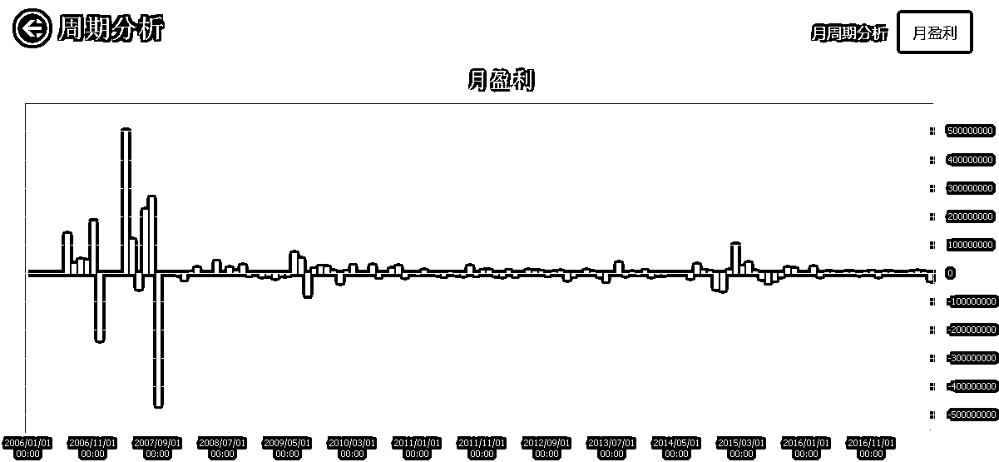

**7**

**策略实现代码**

查看全部策略请点击**阅读原文**

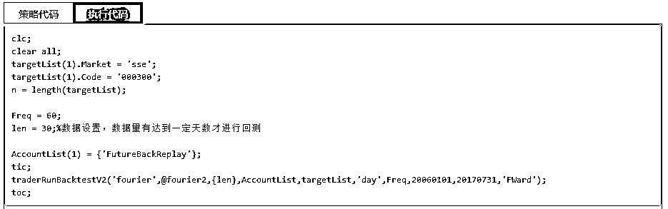

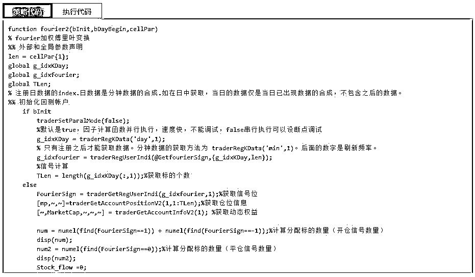

**策略开发平台**：**AT 量能策略研究平台**基于 MATLAB，支持股票、期货、期权等全市场品种的策略研究和自动化交易，目前已经有超过 300 家高校的数学背景的学生、近万名专业量化用户。

**关注者**

**从****1 到 10000+**

**我们每天都在进步**

<fieldset class="96wx-bdc" style="margin-top: 0.5em; margin-bottom: 0.5em; box-sizing: border-box; border-width: 0px; border-style: initial; border-color: rgb(89, 135, 241); width: 455px; word-wrap: break-word !important;">**点击****“阅读原文”，查看更多策略代码！**</fieldset>