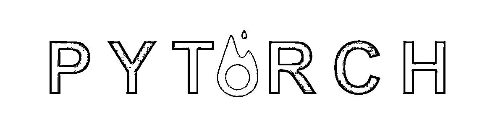
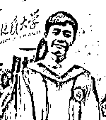
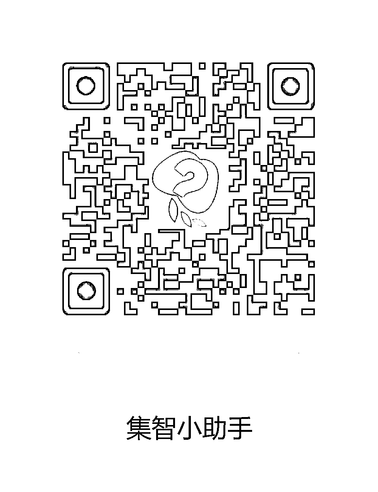
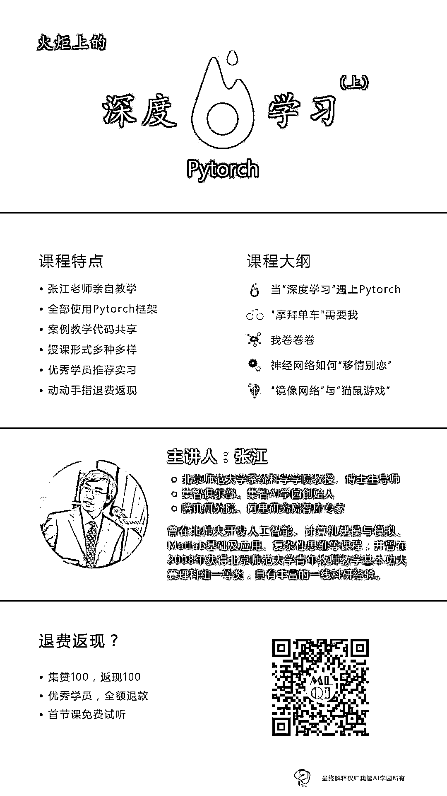
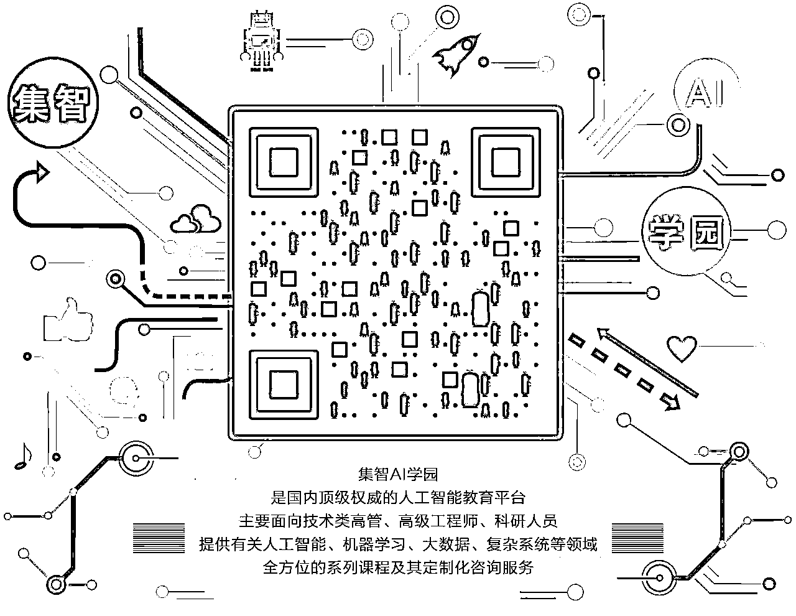

# 入门 | PyTorch 系列课程：火炬上的深度学习（向张江教授致敬）

> 原文：[`mp.weixin.qq.com/s?__biz=MzAxNTc0Mjg0Mg==&mid=2653286224&idx=1&sn=bd9b8cc1b6f9bbd56e357d673ea07e2a&chksm=802e2d45b759a4532f56a73dcd7aff02c1f2cc17226f8e0c5c5b6c18bc7825767f36e29c27db&scene=27#wechat_redirect`](http://mp.weixin.qq.com/s?__biz=MzAxNTc0Mjg0Mg==&mid=2653286224&idx=1&sn=bd9b8cc1b6f9bbd56e357d673ea07e2a&chksm=802e2d45b759a4532f56a73dcd7aff02c1f2cc17226f8e0c5c5b6c18bc7825767f36e29c27db&scene=27#wechat_redirect)

**公众号此次****鼎力推荐此课程**

**在此也向张江教授致敬**

还在纠结着学习 TensorFlow 吗？赶快放弃吧，PyTorch 比它好用 100 倍！吴恩达大大的深度学习课程是很牛，可你听得懂吗？来上这个“火炬上的深度学习”课程吧！上哪找一个会讲中文、说人话的名师手把手教你 PyTorch 和深度学习呢？只要你懂 Python，保证你能学得懂！

<inherit style="max-width: 100%; box-sizing: border-box !important; word-wrap: break-word !important;">除此之外，该课程的**亮点**是：</inherit>

1

<inherit style="max-width: 100%; box-sizing: border-box !important; word-wrap: break-word !important;">**名师教学**</inherit>

<inherit style="max-width: 100%; box-sizing: border-box !important; word-wrap: break-word !important;">全部系列课程都是由具备十多年人工智能领域教学经验的北京师范大学教授、集智俱乐部创始人、集智 AI 学园创始人张江老师亲自设计并主讲，深入浅出、讲解细腻、风趣幽默，手把手教学，如此贴心的老师，你值得拥有！</inherit>

2

<inherit style="max-width: 100%; box-sizing: border-box !important; word-wrap: break-word !important;">**PyTorch 框架**</inherit>

<inherit style="max-width: 100%; box-sizing: border-box !important; word-wrap: break-word !important;">本课程是国内为数不多的全部采用 PyTorch 进行案例讲解的深度学习课程。**PyTorch 是由 Facebook 支持的一套深度学习开源框架，相比较 Tensorflow，它更加容易快速上手，**一经推出就广受欢迎；</inherit>

3

<inherit style="max-width: 100%; box-sizing: border-box !important; word-wrap: break-word !important;">**案例教学**</inherit>

<inherit style="max-width: 100%; box-sizing: border-box !important; word-wrap: break-word !important;">课程中设置了大量的实践案例，**从“手写数字加法机”到“共享单车预测器”，从“汉字星空”到“游戏高手”，**每一个案例全部由张江老师精心设计选择，独特而有趣；更重要的是，**代码全部共享！**</inherit>

4

<inherit style="max-width: 100%; box-sizing: border-box !important; word-wrap: break-word !important;">**多种授课方式**</inherit>

<inherit style="max-width: 100%; box-sizing: border-box !important; word-wrap: break-word !important;">该网络课程打破了单一的授课模式，**安排了作业、项目、展示、神秘大咖嘉宾客串**等多个环节丰富我们的形式；</inherit>

5

<inherit style="max-width: 100%; box-sizing: border-box !important; word-wrap: break-word !important;">**丰厚回报**</inherit>

<inherit style="max-width: 100%; box-sizing: border-box !important; word-wrap: break-word !important;">为了激励学员，我们设置了“Swarmer”奖励制度。我们将根据作业情况，**甄选出 3 名优秀的学员，退还全部课程费用，并推荐**到包括腾讯、百度、搜狗、联想、Momenta、彩云 AI、图灵机器人、深度好奇、爱因互动等国内知名 AI 公司**实习。**</inherit>

6

<inherit style="max-width: 100%; box-sizing: border-box !important; word-wrap: break-word !important;">**退费返现？你赚到了！**</inherit>

<inherit style="max-width: 100%; box-sizing: border-box !important; word-wrap: break-word !important;">我们设置了丰富多彩的退费返现环节（如下），只要你够优秀和努力，全额退费！</inherit>

*   **动一下手指，返现 100：**购课后，只需动一下手指转发本课程海报或本文到朋友圈集赞，即可获得返现奖励。**一个赞抵一块钱，100 元封顶！**截止日期 8 月 31 日统一会有课程助教为大家返现，**真金白银哦！**

*   我们计划在课程结束后将全部课程内容整理成**《火炬上的深度学习》书籍出版，**如果您参与了某一节课的笔记整理，并最终被我们收录选用，**将享受全额退费，你的名字还会出现在新书中！**

*   如果您足够优秀，被评选上了**Swarmer 优秀学员，将享受全部退款！**

<inherit style="max-width: 100%; box-sizing: border-box !important; word-wrap: break-word !important;">注：</inherit>

1、返现退费不可累加，最高返现为全部学费

2、最终解释权归集智 AI 学园所有

7

<inherit style="max-width: 100%; box-sizing: border-box !important; word-wrap: break-word !important;">**名校助教，为你随时解答技术难点**</inherit>

**讲师介绍：**

**张江**

<inherit style="max-width: 100%; box-sizing: border-box !important; word-wrap: break-word !important;">**北京师范大学系统科学学院教授、博士生导师**</inherit>

<inherit style="max-width: 100%; box-sizing: border-box !important; word-wrap: break-word !important;">**集智俱乐部、集智 AI 学园创始人**</inherit>

<inherit style="max-width: 100%; box-sizing: border-box !important; word-wrap: break-word !important;">**腾讯研究院、阿里研究院智库专家**</inherit>

<inherit style="max-width: 100%; box-sizing: border-box !important; word-wrap: break-word !important;">张老师长期从事有关人工智能、复杂系统的教学与科研工作；曾在北京师范大学开设人工智能、计算机建模与模拟、Matlab 基础及应用、复杂性思维等课程；并曾在 2008 年获得北京师范大学青年教师教学基本功大赛理科组一等奖；具有丰富的一线科研经验，曾指导数十名学生（包括本科生）在国内外会议、刊物发表论文数十篇，获得国家自然科学基金、北京市高等教育基金、北师大自主科研基金等多项资助，主要研究兴趣集中在人工智能与复杂系统。他先后组织集智俱乐部编写出版了《科学的极致——漫谈人工智能》、《走近 2050——注意力、互联网与人工智能》两本广受欢迎的人工智能科普书。其中《科学的极致》被杨澜在其微博推荐，已反复再版，《走近 2050》刚一面市就冲击到了亚马逊计算机类图书排行榜首位。</inherit>

**助教团队：**

**李周园**

清华大学博士、荷兰 Wageningen 大学 WIMEK 学者，遥感数据挖掘方向。

**胡胜**

中国地质大学（武汉）硕士、攻读博士，空间数据挖掘和智慧交通方向，熟悉 Python 语言。

**孙颖宝**

荷兰 Wageningen 大学遥感与地理信息实验室研究生，熟悉 R、Python 语言。

**苏尚君**

 前运维开发工程师、现 Udacity 机器学习课程助教，熟悉 Python 语言，GitHub 用户、有“简书”技术专栏。

**任伟**

中国科学院大学博士，气候系统与碳循环方向，有深度学习技术基础，熟悉数据挖掘与空间分析。

**张庆逸**

学生，有编程工作经验，了解 Python 语言。

基本要求

<inherit style="max-width: 100%; box-sizing: border-box !important; word-wrap: break-word !important;">**学员应具备如下条件：**</inherit>

*   熟练掌握 Python 编程，特别是 Numpy 数组操作部分

*   熟练掌握线性代数

*   了解概率论基本知识

课程大纲

**1、当“深度学习”遇上 PyTorch（免费试听）**

http://campus.swarma.org/gcou=10335

<inherit style="max-width: 100%; box-sizing: border-box !important; word-wrap: break-word !important;">当 Deep Learning 遇上 PyTorch，一切都会变得简单而深刻！深度学习（Deep Learning）作为当今人工智能最关键的技术，不仅在图像识别、图像生成、自然语言处理等领域大显身手，更是 AlphaGo、自动驾驶等黑科技的核心。PyTorch 则是一款刚刚推出，广受欢迎的深度学习开源框架，非常适合新手快速入门。我们的课程就从 PyTorch 开始。</inherit>

<inherit style="max-width: 100%; box-sizing: border-box !important; word-wrap: break-word !important;">首先，我们将简要介绍深度学习基本原理和应用。其次，我们介绍 PyTorch 框架。通过实例，我们介绍了什么是 Tensor，如何对 Tensor 进行各种运算；我们还将介绍什么是自动微分技术，以及它在整个深度学习中的重要性。最后，我们通过实例来介绍机器学习的基本步骤以及基本概念。另外，在本课程的配套视频课程中，您还会学到有关 PyTorch 的安装与应用。</inherit>

<inherit style="max-width: 100%; box-sizing: border-box !important; word-wrap: break-word !important;"><inherit style="max-width: 100%; box-sizing: border-box !important; word-wrap: break-word !important;"><inherit style="max-width: 100%; box-sizing: border-box !important; word-wrap: break-word !important;">**2、**</inherit>**"摩拜单车"需要我**</inherit></inherit>

<inherit style="max-width: 100%; box-sizing: border-box !important; word-wrap: break-word !important;">在这堂课中，你将和我一起亲手搭建一个名字叫 Neu 的神经网络，并用它来解决共享单车的数量预测问题。与此同时，你将学到如何处理数据来喂给一个神经网络，并让它完成训练的基本方法。之后，我们还会进一步解剖我们的 Neu 神经网络，看一看它是如何工作的；它又为什么会在一些特殊的情况下失灵。除此之外，在本课程的配套视频中，你还可以学会神经网络反向传播算法的基本原理和数学推导。</inherit>

**作业：手写数字识别网络**

我们要求学员在神经网络 Neu 的架构上就行更改，从而让它能够完成手写数字的模式识别。

<inherit style="max-width: 100%; box-sizing: border-box !important; word-wrap: break-word !important;">**3、**</inherit>**我卷卷卷**

<inherit style="max-width: 100%; box-sizing: border-box !important; word-wrap: break-word !important;">这一章的主角当然就是卷积神经网络了。从卷积到池化操作，本课程将深入潜出地为你介绍卷积神经网络的工作原理。之后，我们展示了如何用 PyTorch 来实现一个卷积神经网络，并进一步复习了张量的概念及其运算。在这个基础上，我们引出了过滤器、特征匹配与特征图的概念，并揭示了卷积神经网络的工作原理。作为本课程的附属视频，我们介绍了应用于卷积神经网络的反向传播算法。</inherit>

**思考与练习：手写数字加法机**

请设计一个卷积神经网络，要求它能够根据输入的两张手写数字图片，自动计算并输出这两个数字的和。

<inherit style="max-width: 100%; box-sizing: border-box !important; word-wrap: break-word !important;">**4、**</inherit>**神经网络如何“移情别恋”**

<inherit style="max-width: 100%; box-sizing: border-box !important; word-wrap: break-word !important;">在去年的 NIPS 2016 讲座上，吴恩达表示：“在监督学习之后，迁移学习将引领下一波机器学习技术商业化浪潮。” </inherit>

<inherit style="max-width: 100%; box-sizing: border-box !important; word-wrap: break-word !important;">什么是迁移学习？它就是一种将一个领域训练的机器学习模型应用到另一个领域中去的技术手段。在本课程中，我们将详细介绍迁移学习概念，以及如何用 PyTorch 实现简单的迁移学习。作为项目实例，我们将手把手地教你利用迁移学习来搭建一个“手写数字加法机”。我们还将教会你如何借用别人训练好的大型神经网络，实现你自己的计算机视觉。</inherit>

**作业：**

不同迁移学习方法的比较

<inherit style="max-width: 100%; box-sizing: border-box !important; word-wrap: break-word !important;">**5、**</inherit>**“镜像网络”与“猫鼠游戏”**

<inherit style="max-width: 100%; box-sizing: border-box !important; word-wrap: break-word !important;">正如每个物质粒子都有一个镜像反粒子，卷积神经网络也存在着一个镜像，这就是反卷积神经网络。利用这种“镜像”网络，我们可以生成图像。为了让生成的图像更逼真，我们创造了两个神经网络，让它们彼此之间玩“猫鼠游戏”，这就是对抗生成网络技术（Generative Adversial Network，简称 GAN）。</inherit>

<inherit style="max-width: 100%; box-sizing: border-box !important; word-wrap: break-word !important;">在本课程中，我们将首先引入图像生成任务，并讲述它的实际用途是什么；之后，我们详细讲述了卷积技术的扩展以及反卷积神经网络。随后，我们引入了“猫鼠游戏”，让一个网络充当造假的老鼠，另一个网络充当识别假货的猫，并让它们俩完成共同训练。最终，我们利用 GAN 训练出一个厉害的生成器。</inherit>

**项目：图像乘法机**

设计一个神经网络架构，要求输入两张手写数字图片，计算出这两个数字相乘的结果，并用网络生成图片来表示。

<inherit style="max-width: 100%; box-sizing: border-box !important; word-wrap: break-word !important;">**6、**</inherit>**Swarmer 舞台**

<inherit style="max-width: 100%; box-sizing: border-box !important; word-wrap: break-word !important;">本课程最后一节课设置了一个学员展示环节，我们将根据同学们历次提交的作业情况，甄选出五名左右学生，展示他们的作业，分享他们在做作业过程中遇到的问题以及解决方案。这五名学员将会作为“Swarmer”学员的候选。</inherit>

Swarmer 奖励政策

我们将根据学员完成作业的情况对优秀学员进行奖励和选拔，我们将挑选出 3 名优秀学员作为本年度 Swarmer，他（她）们可以享受：

<inherit style="max-width: 100%; box-sizing: border-box !important; word-wrap: break-word !important;">1、**全额退费：**退还全部课程费用； </inherit>

<inherit style="max-width: 100%; box-sizing: border-box !important; word-wrap: break-word !important;">2、**免费推荐**到集智 AI 学园的合作单位实习； </inherit>

<inherit style="max-width: 100%; box-sizing: border-box !important; word-wrap: break-word !important;">3、**为期半年的 VIP 权限**：半年时间内可以免费学习集智 AI 学园网站上的全部课程；</inherit>

<inherit style="max-width: 100%; box-sizing: border-box !important; word-wrap: break-word !important;">4、受邀参加集智俱乐部的**年度大 Party。**</inherit>

 <inherit style="max-width: 100%; box-sizing: border-box !important; word-wrap: break-word !important;">**[`v.qq.com/iframe/preview.html?vid=c0369hvu398&width=500&height=375&auto=0`](https://v.qq.com/iframe/preview.html?vid=c0369hvu398&width=500&height=375&auto=0)**</inherit> 

2016 年集智学术圣诞 party

开课时间：

2017.8.23 开始，每周三 20：00—21：30

课程定价：

499￥【可开发票】

包含《火炬上的深度学习》（上）系列课程共六节

抢购方式：

http://campus.swarma.org/gapp=120?src=1

截止日期：

本次报名只限前 100 名，人满即止。

温馨提示：

1.  报名成功后在哪里听课？

    报名成功后，小助手会拉大家进群，直播前，在群内发布听课链接

2.  添加小助手为什么没有拉我入群？

    由于学员较多，小助手会定期统一处理大家的消息，希望同学们不要着急。

咨询课程请添加小助手微信

**火炬上的深度学习（下）预告**

1，词汇的星空

2，机器也懂感情？

3，神经网络莫扎特

4，彩云小译

5，游戏高手

敬请期待......

