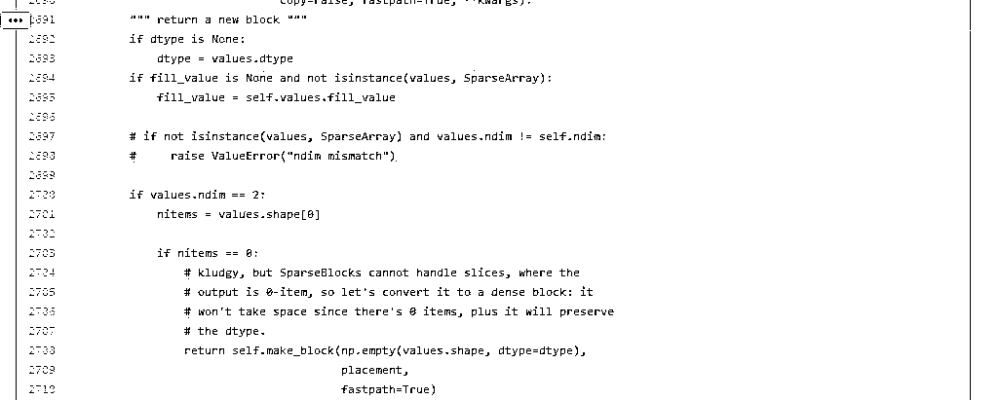
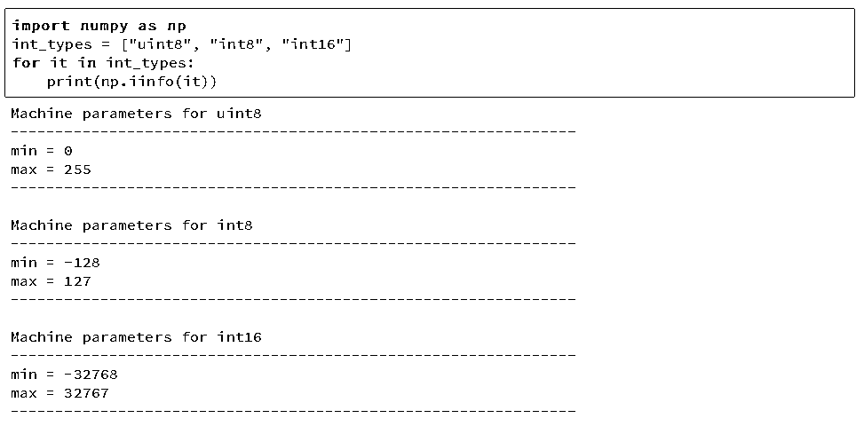

# 【精心解读】用 pandas 处理大数据——节省 90%内存消耗的小贴士

> 原文：[`mp.weixin.qq.com/s?__biz=MzAxNTc0Mjg0Mg==&mid=2653286198&idx=1&sn=f8f0ea4845586b1f9b645995aa07d8a0&chksm=802e2d23b759a435aa1fc3a4ce26c69a7a4ce0a769c8d9f873c913066ff8a877109d5f2a9d15&scene=27#wechat_redirect`](http://mp.weixin.qq.com/s?__biz=MzAxNTc0Mjg0Mg==&mid=2653286198&idx=1&sn=f8f0ea4845586b1f9b645995aa07d8a0&chksm=802e2d23b759a435aa1fc3a4ce26c69a7a4ce0a769c8d9f873c913066ff8a877109d5f2a9d15&scene=27#wechat_redirect)

**编辑部**

微信公众号

**关键字**全网搜索最新排名

**『量化投资』：排名第一**

**『量       化』：排名第一**

**『机器学习』：排名第三**

我们会再接再厉

成为全网**优质的**金融、技术类公众号

**编辑部翻译**  

**编译：西西、wally21st**

未经允许，不得转载

一般来说，用 pandas 处理小于 100 兆的数据，性能不是问题。当用 pandas 来处理 100 兆至几个 G 的数据时，将会比较耗时，同时会导致程序因内存不足而运行失败。

当然，像 Spark 这类的工具能够胜任处理 100G 至几个 T 的大数据集，但要想充分发挥这些工具的优势，通常需要比较贵的硬件设备。而且，这些工具不像 pandas 那样具有丰富的进行高质量数据清洗、探索和分析的特性。对于中等规模的数据，我们的愿望是尽量让 pandas 继续发挥其优势，而不是换用其他工具。

本文我们讨论 pandas 的内存使用，展示怎样简单地为数据列选择合适的数据类型，就能够减少 dataframe 近 90%的内存占用。

**处理棒球比赛记录数据**

我们将处理 130 年的棒球甲级联赛的数据，数据源于

Retrosheet（http://www.retrosheet.org/gamelogs/index.html）

原始数据放在 127 个 csv 文件中，我们已经用**csvkit**

（https://csvkit.readthedocs.io/en/1.0.2/）

将其合并，并添加了表头。如果你想下载我们版本的数据用来运行本文的程序，我们提供了**下载地址**。

（https://data.world/dataquest/mlb-game-logs）

我们从导入数据，并输出前 5 行开始：

我们将一些重要的字段列在下面：

*   date - 比赛日期

*   v_name - 客队名

*   v_league - 客队联赛

*   h_name - 主队名

*   h_league - 主队联赛

*   v_score - 客队得分

*   h_score - 主队得分

*   v_line_score - 客队线得分, 如 010000(10)00.

*   h_line_score- 主队线得分, 如 010000(10)0X.

*   park_id - 主办场地的 ID

*   attendance- 比赛出席人数

我们可以用 Dataframe.info()方法来获得我们 dataframe 的一些高 level 信息，譬如数据量、数据类型和内存使用量。

这个方法默认情况下返回一个近似的内存使用量，现在我们设置参数 memory_usage 为'deep'来获得准确的内存使用量：

我们可以看到它有 171907 行和 161 列。pandas 已经为我们自动检测了数据类型，其中包括 83 列数值型数据和 78 列对象型数据。对象型数据列用于字符串或包含混合数据类型的列。

由此我们可以进一步了解我们应该如何减少内存占用，下面我们来看一看 pandas 如何在内存中存储数据。

**Dataframe 对象的内部表示**

在底层，pandas 会按照数据类型将列分组形成数据块（blocks）。下图所示为 pandas 如何存储我们数据表的前十二列：

可以注意到，这些数据块没有保持对列名的引用，这是由于为了存储 dataframe 中的真实数据，这些数据块都经过了优化。有个 BlockManager 类

会用于保持行列索引与真实数据块的映射关系。他扮演一个 API，提供对底层数据的访问。每当我们查询、编辑或删除数据时，dataframe 类会利用 BlockManager 类接口将我们的请求转换为函数和方法的调用。

每种数据类型在 pandas.core.internals 模块中都有一个特定的类。pandas 使用 ObjectBlock 类来表示包含字符串列的数据块，用 FloatBlock 类来表示包含浮点型列的数据块。对于包含数值型数据（比如整型和浮点型）的数据块，pandas 会合并这些列，并把它们存储为一个 Numpy 数组（ndarray）。Numpy 数组是在 C 数组的基础上创建的，其值在内存中是连续存储的。基于这种存储机制，对其切片的访问是相当快的。

由于不同类型的数据是分开存放的，我们将检查不同数据类型的内存使用情况，我们先看看各数据类型的平均内存使用量：

由于不同类型的数据是分开存放的，我们将检查不同数据类型的内存使用情况，我们先看看各数据类型的平均内存使用量：

我们可以看到内存使用最多的是 78 个 object 列，我们待会再来看它们，我们先来看看我们能否提高数值型列的内存使用效率。

**选理解子类（Subtypes）**

刚才我们提到，pandas 在底层将数值型数据表示成 Numpy 数组，并在内存中连续存储。这种存储方式消耗较少的空间，并允许我们较快速地访问数据。由于 pandas 使用相同数量的字节来表示同一类型的每一个值，并且 numpy 数组存储了这些值的数量，所以 pandas 能够快速准确地返回数值型列所消耗的字节量。

pandas 中的许多数据类型具有多个子类型，它们可以使用较少的字节去表示不同数据，比如，float 型就有 float16、float32 和 float64 这些子类型。这些类型名称的数字部分表明了这种类型使用了多少比特来表示数据，比如刚才列出的子类型分别使用了 2、4、8 个字节。下面这张表列出了 pandas 中常用类型的子类型：

一个 int8 类型的数据使用 1 个字节（8 位比特）存储一个值，可以表示 256（2⁸）个二进制数值。这意味着我们可以用这种子类型去表示从-128 到 127（包括 0）的数值。

我们可以用 numpy.iinfo 类来确认每一个整型子类型的最小和最大值，如下：

这里我们还可以看到 uint（无符号整型）和 int（有符号整型）的区别。两者都占用相同的内存存储量，但无符号整型由于只存正数，所以可以更高效的存储只含正数的列。

**用子类型优化数值型列**

我们可以用函数 pd.to_numeric()来对数值型进行向下类型转换。我们用 DataFrame.select_dtypes 来只选择整型列，然后我们优化这种类型，并比较内存使用量。

我们看到内存用量从 7.9 兆下降到 1.5 兆，降幅达 80%。这对我们原始 dataframe 的影响有限，这是由于它只包含很少的整型列。

同理，我们再对浮点型列进行相应处理：

我们可以看到所有的浮点型列都从 float64 转换为 float32，内存用量减少 50%。

我们再创建一个原始 dataframe 的副本，将其数值列赋值为优化后的类型，再看看内存用量的整体优化效果。

可以看到通过我们显著缩减数值型列的内存用量，我们的 dataframe 的整体内存用量减少了 7%。余下的大部分优化将针对 object 类型进行。

在这之前，我们先来研究下与数值型相比，pandas 如何存储字符串。

**选对比数值与字符的储存**

object 类型用来表示用到了 Python 字符串对象的值，有一部分原因是 Numpy 缺少对缺失字符串值的支持。因为 Python 是一种高层、解析型语言，它没有提供很好的对内存中数据如何存储的细粒度控制。

这一限制导致了字符串以一种碎片化方式进行存储，消耗更多的内存，并且访问速度低下。在 object 列中的每一个元素实际上都是存放内存中真实数据位置的指针。

下图对比展示了数值型数据怎样以 Numpy 数据类型存储，和字符串怎样以 Python 内置类型进行存储的。

图示来源并改编自 Why Python Is Slow

你可能注意到上文表中提到 object 类型数据使用可变（variable）大小的内存。由于一个指针占用 1 字节，因此每一个字符串占用的内存量与它在 Python 中单独存储所占用的内存量相等。我们用 sys.getsizeof()来证明这一点，先来看看在 Python 单独存储字符串，再来看看使用 pandas 的 series 的情况。

你可以看到这些字符串的大小在 pandas 的 series 中与在 Python 的单独字符串中是一样的。

**选用类别（categoricalas）类型优化 object 类型**

Pandas 在 0.15 版本中引入类别类型。category 类型在底层使用整型数值来表示该列的值，而不是用原值。Pandas 用一个字典来构建这些整型数据到原数据的映射关系。当一列只包含有限种值时，这种设计是很不错的。当我们把一列转换成 category 类型时，pandas 会用一种最省空间的 int 子类型去表示这一列中所有的唯一值。

为了介绍我们何处会用到这种类型去减少内存消耗，让我们来看看我们数据中每一个 object 类型列中的唯一值个数。

可以看到在我们包含了近 172000 场比赛的数据集中，很多列只包含了少数几个唯一值。

我们先选择其中一个 object 列，开看看将其转换成类别类型会发生什么。这里我们选用第二列：day_of_week。

我们从上表中可以看到，它只包含了 7 个唯一值。我们用.astype()方法将其转换为类别类型。

可以看到，虽然列的类型改变了，但数据看上去好像没什么变化。我们来看看底层发生了什么。

下面的代码中，我们用 Series.cat.codes 属性来返回 category 类型用以表示每个值的整型数字。

可以看到，每一个值都被赋值为一个整数，而且这一列在底层是 int8 类型。这一列没有任何缺失数据，但是如果有，category 子类型会将缺失数据设为-1。

最后，我们来看看这一列在转换为 category 类型前后的内存使用量。

存用量从 9.8 兆降到 0.16 兆，近乎 98%的降幅！注意这一特殊列可能代表了我们一个极好的例子——一个包含近 172000 个数据的列只有 7 个唯一值。

这样的话，我们把所有这种类型的列都转换成类别类型应该会很不错，但这里面也要权衡利弊。首要问题是转变为类别类型会丧失数值计算能力，在将类别类型转换成真实的数值类型前，我们不能对 category 列做算术运算，也不能使用诸如 Series.min()和 Series.max()等方法。

对于唯一值数量少于 50%的 object 列，我们应该坚持首先使用 category 类型。如果某一列全都是唯一值，category 类型将会占用更多内存。这是因为这样做不仅要存储全部的原始字符串数据，还要存储整型类别标识。有关 category 类型的更多限制，参看 pandas 文档。

下面我们写一个循环，对每一个 object 列进行迭代，检查其唯一值是否少于 50%，如果是，则转换成类别类型。

更之前一样进行比较：

这本例中，所有的 object 列都被转换成了 category 类型，但其他数据集就不一定了，所以你最好还是得使用刚才的检查过程。

本例的亮点是内存用量从 752.72 兆降为 51.667 兆，降幅达 93%。我们将其与我们 dataframe 的剩下部分合并，看看初始的 861 兆数据降到了多少。

耶，看来我们的进展还不错！我们还有一招可以做优化，如果你记得我们刚才那张类型表，会发现我们数据集第一列还可以用 datetime 类型来表示。 

你可能还记得这一列之前是作为整型读入的，并优化成了 uint32。因此，将其转换成 datetime 会占用原来两倍的内存，因为 datetime 类型是 64 位比特的。将其转换为 datetime 的意义在于它可以便于我们进行时间序列分析。

转换使用 pandas.to_datetime()函数，并使用 format 参数告之日期数据存储为 YYYY-MM-DD 格式。

**在数据读入的时候设定数据类型**

目前为止，我们探索了一些方法，用来减少现有 dataframe 的内存占用。通过首先读入 dataframe，再对其一步步进行内存优化，我们可以更好地了解这些优化方法能节省多少内存。然而，正如我们之前谈到，我们通常没有足够的内存去表达数据集中的所有数据。如果不能在一开始就创建 dataframe，我们怎样才能应用内存节省技术呢？

幸运的是，我们可以在读入数据集的时候指定列的最优数据类型。pandas.read_csv()函数有一些参数可以做到这一点。dtype 参数接受一个以列名（string 型）为键字典、以 Numpy 类型对象为值的字典。

首先，我们将每一列的目标类型存储在以列名为键的字典中，开始前先删除日期列，因为它需要分开单独处理。

现在我们使用这个字典，同时传入一些处理日期的参数，让日期以正确的格式读入。

通过对列的优化，我们是 pandas 的内存用量从 861.6 兆降到 104.28 兆，有效降低 88%。

**分析棒球比赛**

现在我们有了优化后的数据，可以进行一些分析。我们先看看比赛日的分布情况。

我们可以看到，1920 年代之前，周日棒球赛很少是在周日的，随后半个世纪才逐渐增多。

我们也看到最后 50 年的比赛日分布变化相对比较平稳。

我们来看看比赛时长的逐年变化。

看来棒球比赛时长从 1940 年代之后逐渐变长。

**总结**

我们学习了 pandas 如何存储不同的数据类型，并利用学到的知识将我们的 pandas dataframe 的内存用量降低了近 90%，仅仅只用了一点简单的技巧：

*   将数值型列降级到更高效的类型

*   将字符串列转换为类别类型

通过对列的优化，我们是 pandas 的内存用量从 861.6 兆降到 104.28 兆，有效降低 88%。

原文链接：https://www.dataquest.io/blog/pandas-big-data/

**关注者**

**从****1 到 10000+**

**我们每天都在进步**

