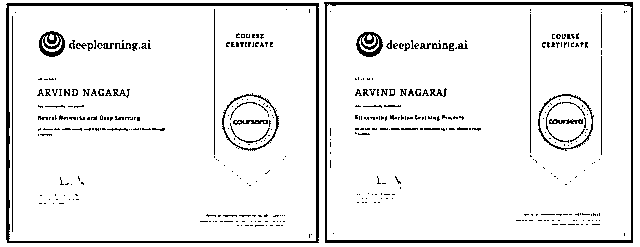
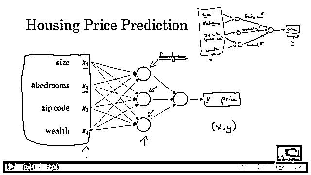
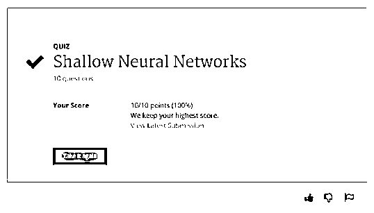
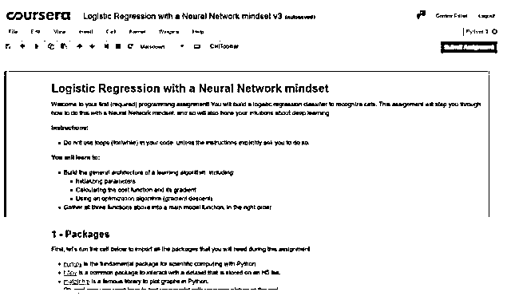
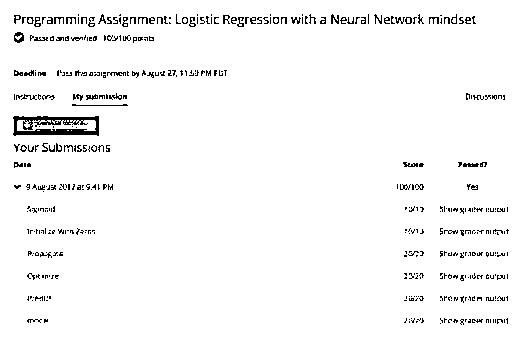
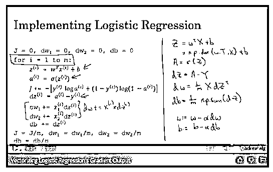
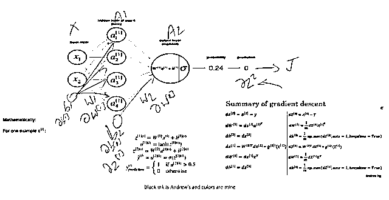
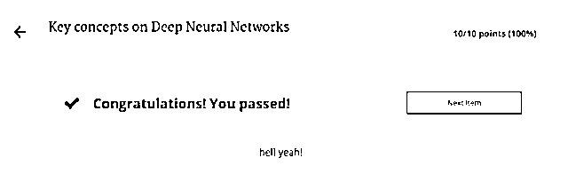
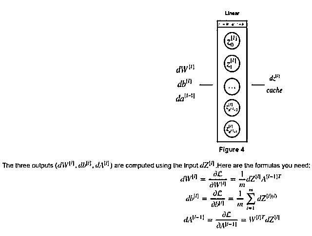

# 我花了四个晚上，拿到了吴恩达 Deeplearning.ai 深度学习课程证书

> 原文：[`mp.weixin.qq.com/s?__biz=MzAxNTc0Mjg0Mg==&mid=2653286159&idx=1&sn=5c98b2fcf9dc8d0719d67df70c7816da&chksm=802e2d1ab759a40caf7b3b3a836753fe96cba185a5e4429a36759b5dd5c4b632b7e18d952fc4&scene=27#wechat_redirect`](http://mp.weixin.qq.com/s?__biz=MzAxNTc0Mjg0Mg==&mid=2653286159&idx=1&sn=5c98b2fcf9dc8d0719d67df70c7816da&chksm=802e2d1ab759a40caf7b3b3a836753fe96cba185a5e4429a36759b5dd5c4b632b7e18d952fc4&scene=27#wechat_redirect)

**编辑部**

微信公众号

**关键字**全网搜索最新排名

**『量化投资』：排名第一**

**『量       化』：排名第一**

**『机器学习』：排名第三**

我们会再接再厉

成为全网**优质的**金融、技术类公众号

前不久，吴恩达正式在 Coursera 上公布了自己的 Deeplearning.ai 深度学习系列课程，一经发布火爆全网，最近这位 Arvind N 的小哥亲测了这个系列课程。

**▍****介绍**

在全职工作和照顾孩子的间隙，我花了空闲时间学习认知科学与 AI。一直期待有一个劲爆的课程来帮助我更好的学习。

吴恩达的深入学习课程就像我最喜爱的美国大片一样，蹦了出来！

课程在 coursera 上刚发布，我马上注册并花了四个晚上学习其中的讲座、参加考试、完成作业，最后拿到了证书。

DL 从业者和 ML 工程师通常花费大部分时间在 Keras 或 TensorFlow。但是，但如果花上一点时间深入了解算法的本质，手动去实践会是非常有意义的过程。不仅有趣，而且能够让你学到很多。

****▍**了解本课程**

吴恩达的新课程是一种自下而上的方式，教你初、中级神经网络的系列课程。

吴恩达与同事们，精心挑选了不长不短的视频时长和精准定位的课程信息进行教授。

吴恩达从他的经典 ML 课程的遗漏信息讲起，并介绍了使用单一神经元（逻辑回归）神经网络的想法，并慢慢增加复杂性 - 更多的神经元和更多层。

在 4 周（课程 1）结束时，学生将学习到构建密集神经网络所需的所有核心思想，例如损失函数、使用梯度下降和向量化并行 python（numpy）实现进行迭代学习。

吴恩达耐心地按照精心策划的顺序和恰到好处的讲解了必要的数学和编程概念。

#### ******▍**课程材料和工具：****

视频讲解  

演讲使用幻灯片演示，附以吴恩达本人的笔记。这看起来是一种能让人时刻集中精力的方法。我觉得将视频速度调至 1.25 倍或 1.5 倍速度是最好的。

测试工具

测试被安排在每个讲课视频之后，以选择题的形式出现。如果你完整地观看了视频，这些问题应该很容易回答。你也可以多做几遍题，系统会保留测试成绩最高分。

Jupyter notebook 编程作业

编程作业需要使用 Jupyter notebook 来做，这是一种强大的网页版应用。

作业具有良好的引导顺序结构，你不需要在每个部分中写入 2-3 行以上的代码。如果你很了解矢量化的概念，则可以使用一行代码完成大部分编程部分！

在作业做完后，你需要点击按钮提交自己的代码，自动打分系统会在几分钟后返回你的分数。一些作业会有时间限制——比如 8 小时只能提交三次。

Jupyter notebook 设计精良，没有任何 bug，它们就像抛光打磨好的完美工业产品。

#### ******▍**适合的学习人群****

任何有兴趣了解神经网络是什么，如何工作，如何建立神经网络以及有兴趣将你的想法应用于生活的人均适合学习此课程。

如果你的数学不好，那么不用担心 - 吴恩达解释了所有需要的微积分问题，并详细说明了数学相关的衍生，这样你就可以专注于构建网络，并专注于在代码中实现你的想法。

如果你的编程不好，那么有一个很好的编码任务来教你 numpy。但是我建议先在编解码器学习 python 。

这个 DL 课程与 Jeremy Howard 的 Fast.ai 课程有何不同：

让我用一个类比来解释一下：假设你正在努力学习如何开车。

Jeremy 的 fast.ai 课程让你从司机开始学起。他教导你移动方向盘、踩刹车、加速等。然后，他慢慢地解释了更多关于汽车工作的细节 - 为什么旋转车轮会使车转弯，为什么按下制动踏板会让你慢下来停下来。

他越来越深入汽车的内部工作，在课程结束之前，你将明白内燃机的工作原理，燃油箱的设计方式等等。课程的目标是让你开车。你可以选择在任何时候停止，你会驾驶的相当不错 - 没有必要学习如何建立/修理汽车。

吴恩达的 DL 课程完成了所有这一切，但是完全相反。他首先教你内燃机！他不断添加抽象的层次，你学完后几乎可以驾驶 F1 赛车了！

Fast.ai 的课程主要教你驾驶的艺术，而吴恩达的课程主要教你汽车背后的技术。

#### ******▍**本课程学习方法：****

如果你在此之前尚未学过任何机器学习课程，请勿先学习本课程。最好的起点是吴恩达最初的 ML 课程。（http://suo.im/2o1uD）

完成该课程后，请尝试完成 Jeremy 杰出的深入学习课程的第 1 部分。Jeremy 教授自上而下的深入学习课程，绝对适合初学者。（http://course.fast.ai）

一旦你学会了创建深度神经网络，之后就可以进一步学习吴恩达的 deeplearning.ai 课程，它会填补你对底层细节和概念理解的空白。

****▍**本课程中我喜欢的内容**

1\. 事实是 - 所有的不确定性和模糊性都被定期地消除

2\. 吴恩达强调深度学习的工程学方面，并提供了大量实用的技巧来节省时间和金钱 - DL 专业课程的第三个课程，作为领导技术团队的我来说非常有用。

3\. 专业术语处理的很好。吴恩达解释说，实践即试错  - 他真诚的讲解了设计和训练深度网络的残酷诚实。在某种程度上，我觉得他可能认为深度学习是美化过的曲线拟合

4\. DL 和 AI 的炒作 - 吴恩达对主流媒体中 AI 炒作的传播进行了克制、仔细的评论，很显然，DL 并不是终结者。

5\. 开箱即用的样板代码！

6\. 优秀的课程结构。

7\. 一贯有用的符号。吴恩达努力为神经网络建立一个新的命名方式，我觉得他做的相当成功。

8.吴恩达独一无二的教学风格 - 我可以感受到，我在 2013 年刚开始学习 ML 课程时感受到的兴奋。

9\. 深入学习专家的访谈令人耳目一新 - 听到专家的故事和轶事是激励和乐趣。

****▍**我在课程里学到的其他知识：**

1\. DL 并不简单。随着时间的推移，“理解”概念并使其运作良好，需要一些努力。吴恩达曾经写过一个古怪的答案，我感到深深的共鸣。（http://suo.im/31HaHK）

2\. 好用工具很重要，可以帮助你加快学习速度。学完吴恩达课程后，我买了一支数字笔。它帮助我更有效地工作

黑色墨水是 Andrew 的笔迹，其他颜色是我的笔迹

3\. 为什么我在此之前推荐 Fast.ai 课程，因为我心理有一个想法。你应该找到你的兴趣，之后就可以随心所欲地学习。

4\. 你每次得满分时都会让身体的多巴胺兴奋。

5\. 不要被 DL 术语（hyperparameters =settings，architecture/topology=style etc.）或数学符号吓倒。

一些看起来很可怕的符号。当你开始看课程视频时，这些符号就会变的好理解了。

******▍**最后****

**每个人开始都是作为初学者在这个领域学习。如果你是 DL 领域的一个不折不扣的新人，那么自然会被所有的术语和概念所吓倒。**

**请不要放弃！你可能渐渐的被吸引到这个领域，希望找到你的灵感。相信你的直觉，保持专注，你会比你意识到更快的成功！即使是在曾经的某个时刻，吴恩达也不得不学习线性代数 - 他也不是天生就会的。**

**虽然这是一个令人难以置信的资源，但这不是世界上唯一的 DL 课程。**

**许多慷慨的老师，如 Salman Khan，Jeremy Howard，Sebastian Thrun，Geoff Hinton 都在线免费分享了他们的知识，就像吴恩达一样。**

**我没有追求硕士或博士学位，因为我必须努力工作养活我的家庭。但这并不意味着学习必须止步。由于知识的民主化，我有机会定制自己的学习计划。**

**我可以选择从我最崇拜的人那里学习：编程（Gerald Sussman），线性代数（Gilbert Strang），AI（Marvin Minsky），哲学（Daniel Dennett），心理学（Jean Piaget），物理学（Hans Bethe）...**

**大部分 DL 的应用是纪律严明的工程，而且吴教授提供了第 3 课（迄今为止发布的课程中，第 3 个课程是我的最爱）的精彩汇编。为你做 DL 工作所需的思维方式与处理任何其他硬件工程问题时所需的思维方式一样。**

**Claud Shannon 在几十年前，就已经清楚记录了你需要知道的一切。（http://suo.im/31UIf2）。来源：medium，作者：Arvind N**

****关注者****

****从****1 到 10000+****

****我们每天都在进步****

****