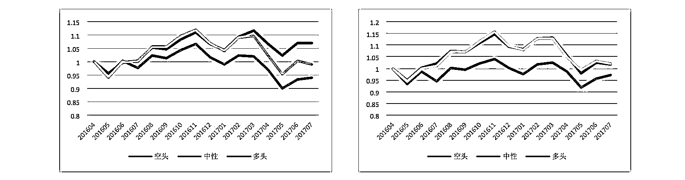

# RNN 增强—ACT（自适应计算次数）多因子选股模型

> 原文：[`mp.weixin.qq.com/s?__biz=MzAxNTc0Mjg0Mg==&mid=2653286157&idx=1&sn=b4969dfdc7f4206f0afc4aaca2bac143&chksm=802e2d18b759a40e032f7b42861247e445f062ced583c404b8abca4835a41102deff1a869926&scene=27#wechat_redirect`](http://mp.weixin.qq.com/s?__biz=MzAxNTc0Mjg0Mg==&mid=2653286157&idx=1&sn=b4969dfdc7f4206f0afc4aaca2bac143&chksm=802e2d18b759a40e032f7b42861247e445f062ced583c404b8abca4835a41102deff1a869926&scene=27#wechat_redirect)

**编辑部**

微信公众号

**关键字**全网搜索最新排名

**『量化投资』：排名第一**

**『量       化』：排名第一**

**『机器学习』：排名第三**

我们会再接再厉

成为全网**优质的**金融、技术类公众号

今天我们来读一篇来自国信证券研究文章

**RNN 简介**

RNN 不同于传统神经网络的感知机的最大特征就是跟时间挂上钩，即包含了一个循环的网络，就是下一时间的结果不仅受下一时间的输入的影响，也受上一时间输出的影响，进一步地说就是信息具有持久的影响力。放在实际中也很容易理解，人们在看到新的信息的时候产生的看法或者判断，不仅仅是对当前信息的反应，先前的经验、思想的也是参与进去这次信息的推断的。人类的大脑 不是一张白纸，是包含许多先验信息的，即思想的存在性、持久性是显然的。举个例子，你要对某电影中各个时点发生的事件类型进行分类:温馨、烂漫、 暴力等等，如果利用传统神经网络是很难做到这一点的，但是 RNN 因为具备一 定的记忆功能，可以较好处理这个问题。 

**LSTM 选股模型 **

当需预测信息和相关信息距离较远时，原始 RNN 结构的传输的效率并不让人满意。虽然有学者证明了，我们可以通过精心设计参数来达到预测较远处信息的目的，但是 这样无 疑是成 本很高 的，实现起来也很困难，也 就失去了实践意义。 

LSTM (long-short term memory)，长短期记忆网络，就是为了解决上面的长期依赖问题而生的。LSTM 是一种经过精心巧妙设计的 RNN 网络，尽管 LSTM 和原始 RNN 总的来看都会三大层，即输入层、隐含层、输出层。但是 LSTM 和原始 RNN 在隐含层设计上有较大的差异，主要是 LSTM 是在隐含层具备特 殊的 cell 结构。

LSTM 是将一个简单型的激活改成几部分的线性组合的储存单元 cell 去激活。 相当于每次都可以控制下一步的输出信息，如是否要包含前面的信息，包含多少的问题等。类似于进行下一步操作前，根据情况提醒你需要注意的信息。 

**参数设定**

**回测时间：**2007 年 5 月 1 日-2016 年 4 月 30 日，该时间区间下月度数据训练样本数超过 18w(每一个股票每一个月底代表一个样本)。

**策略时间：**2016 年 5 月 1 日-2017 年 4 月 30 日

**RNN 时间长度( steps)：**24 个月，即每一个训练样本包含过去 24 个月的因子 数据，依次从第一个月输入神经网络，并将返回值与下一个月因子同时循环输入神经网络，以此类推，直到得到第 24 个月的预测值。

**因子数：**由于放入神经网络中训练，我们在期初并不评价因子的有效性，同时 也不对因子进行合并，全部输入模型之中。(剔除部分相关性过高，且属于同类的因子，该过程可以降低模型训练过拟合的可能)最终入选 48 个小因子，属于 10 类常见的风格因子。

**分类数：**为了验证预测的准确性，同时排除样本中的部分噪声，我们将样本的收益率类型分为三类：上涨(月收益率大于 3%)、下跌(月收益率小于-3%)、 中性(月收益率处于-3%与 3%之间) 

**RNN 的增强**

从原模型的参数设定以及深度学习的算法特征上，我们很容易将神经网络的增强划分为两条路线：输入数据的数据结构改进，神经网络的算法改进。

**数据端改进**

1、相对收益与绝对收益:在原模型中，我们是以股票下一期收益的绝对数值 3%作为样本的标签，而按照绝对数值对历史样本进行划分，会导致不同时期不同类别样本的数量并不一致。因此，我们尝试利用相对收益对样本进行划分。具体而言，我们考虑将每一期的收益率，按照股票个数分为前 30%(看多)、 后 30%(看空)、中间 40%(震荡)。 

绝对收益标签  | 相对收益标签 

可以发现，两种标签的方式比较，相对收益的结果较绝对收益的标签结构更为显著，但最终收益率差异不大。中性组合仍然无法与多头组合区分开来。

2、第二个需要考虑的数据处理是关于输入特征的个数问题。在上一篇报告中， 我们选择了 48 个小因子作为输入端的数据特征，包含了传统的 10 大因子风格。 由于因子之前共线性的问题，采用 48 个因子相对较多，也包含了较多的共线性 信息。本次处理，我考虑仅选取具有代表性的风格因子，最终选定 PE、现金流 波 动率、营收增 长率、净利润 增长率、账面 价值杠 杆、一月 换收益 、一月 动量、 市值、BP、股价对数、BETA、ROE 共计 12 个因子作为输入特征。 结果上看，缩减至 12 个特征的最终收益效果反而提升，多空的区分度与收益率绝对水平均比 48 个特征的样本更高。

48 个输入特征 | 48 个输入特征 

3、由于采用 RNN 神经网络，每一次的输入样本是包含其历史特征序列的，在之前的报告中，我们根据经验采用了过去 24 个月的输入特征。本次将历史长度缩短，采用 12 个月的特征样本，但实际发现两者的区别并不明显。 

24 个月 RNN  | 24 个月 RNN 

4、最后，我们尝试提高神经网络的预测精度，将 3 类划分提高至 5 类划分：超过 5%、3%-5%、-3%-3%，-3% -5%，跌幅超过-5%。 

3 档划分 | 5 档划分 

从结果上看，5 档的效果较差，最高涨幅的预测效果也并不显著。

综合来看，从数据的输入端对模型进行改进，目前并没有取得较为有效的提升，尤其是中性档的预测通常是失败的。

**算法改进**

RNN 的另一个增强思路则集中于学习算法的增强上，本次将着重介绍目前 一个较为主流的 RNN 神经网络拓展：自适应计算次数(Adaptive Computation Time - ACT) 

**RNN- ACT**

从深度神经网络的特性上看，网络深度的增加在经验上是能够提升学习的效果的。但是，从 RNN 的算法特点上看，随着层数的增加，以 tanh 作为激活函数 的 RNN 网络会面临梯度消失的问题。

ACT 则提出了另一个方向的增加深度，即在每一次的学习中，增加同一批数据重复学习的次数，以此提高 RNN 网络的复杂性。

一个完整的 ACT 结构的递归神经网络如下图所示：

ACT-RNN 结构 

上图是由 两步传 导的隐 层结构，可以看到，T 期的输入在传入第一步的隐层是，分裂成 4 小步进行数据输入的，这个过程就是 ACT 的开始。

由于每一个时间步的处理原理是一致的，我们接下来详细分析每一步的具体过程: 

ACT-RNN 单步结构 

在一个时间 T 的输入中，以上图为例，则处理后的最终输出是由三个输出加权构成的，三个输出均来自于同样输入的 S 层处理: 

ACT-RNN 单步结构步骤 1 

而三个输出的权重，则通过下图的 sigmoid 函数得到，在 ACT 中被称为“halting neu ron”。 

ACT-RNN 单步结构步骤 2 

由于 ACT 的主要目标是自适应计算次数，也就是图例中 sigmoid 函数传导的次数。设阈值为 epsilon，当 halting 神经元给出的累积概率超过阈值，则停止计算，将停止 前的次数进行加权，也就是图例中的三个输出实际上个数是变动的。   

ACT-RNN 单步结构步骤 3 

以一张图来描述上述的全部过程: 

ACT-RNN 示意图 

每一步的矩形将输入端的 Xt 进行了 N 次处理，最终输出的 st 是 N 次处理的 st 的加权，以此增加了网络计算的复杂度。而传统的 RNN 的基本结构: 

RNN 示意图 

可以看到，传统的 RNN 的结构是没有前一张图中的矩形结构的，但是两者是时间序列上 的处理过程仍然保持一致。 

在此我们略去 ACT 模型的严格的数学定义，通过对 A 股市场多因子模型的应用，我们直接观察 ACT 的 RNN 网络选股效果，并与传统的 RNN(LSTM)网络多因子选股模型进行对比。 

**ACT-RNN 多因子选股模型模型参数**

**回测时间：**2007 年 5 月 1 日-2016 年 4 月 30 日，该时间区间下月度数据训练样本数超过 18w(每一个股票每一个月底代表一个样本)。

**策略时间：**2016 年 5 月 1 日-2017 年 7 月 30 日

**RNN 时间长度( steps)：**24 个月，即每一个训练样本包含过去 24 个月的因子数据，依次从第一个月输入神经网络，并将返回值与下一个月因子同时循环输入神经网络，以此类推，直到得到第 24 个月的预测值。

**因子数：**不对因子进行合并，剔除部分相关性过高且，属于同类的因子，该过程可以降低模型训练过拟合的可能，最终入选 48 个小因子，属于 10 类常见的风格因子 。

**分类数：**为了验证预测的准确性，同时排除样本中的部分噪声，我们将样本的收益率类型分为三类:上涨(月收益率大于 3%)、下跌(月收益率小于-3%)、 中性。(经过测试，相对收益的标签回测过程中并没有超过绝对收益标签)

**batch size：**1000，该参数属于 RNN 神经网络的系统参数，是 BP 算法中用来计算梯度的参数，即每次的训练，随机抽取 18w 训练样本中的 1000 个样本作为训练样本。由于 ACT 的网络结构，batch size 成为了需要输入到 ACT 网络 中的参数。

**隐层神经元个数：**400，1 层，该参数同样属于 RNN 神经网络的系统参数，是输入样本与隐层细胞连接的“ 神经” 个数。

**基本 RNN cell：**LSTM

 **学习速率：**0001，RNN 神经网络的系统参数，是模型训练时梯度下降的速度，过高容易导致梯度消失 ，过低则训练过慢。

**犹豫阈值：**0.1，针对 ACT 的参数，意味着当每一步计算的 halting rate 累计值超过 0.9， 则停止计。

**最大计算次数：**30， 同样是针对 ACT 的参数，意味着每一期累积计算次数达到 30 次，则停止计算，它与犹豫阈值一同控制计算次数。

**选股效果**

首先从学习性能上看，对比 LSTM 的网络结构，准确率的收敛速度有所增加。ACT 通过网络复杂度的提升在理论上是存在提高学习性能的可能的，但是在实际应用中并不是确定的。从本次的对照来看，在多因子选股上，我们能够观察到速度的提高，从 LSTM 在 7000 次迭代时的收敛提高到 ACT 的 5000 次以下的收敛。

训练准确率曲线 

从收益曲线上，则能够观察到较 LSTM 更为显著的结果: 

ACT 选股 

多、空以及中性三个类别最终的收益曲线能够显著分开，同时，看多组合的绝对收益也比 LSTM 预测的看多组合显著的高。

**选股特征分**

在机器学习的算法中，我们评价一个学习网络的准确率是通过全部测试样本的预测结果来计算的。但是在选股中，我们更关心的是算法预测上涨的组合的实际胜率。

因此，我们选择计算看多组合中，概率最高的 100 只股票进入真实涨幅前 100 股票的比例，作为衡量算法选股的准确性标准。 

看多组合 TOP100 准确率 

与算法计算的成本函数和准确率不同，通过组合的 TOP100 准确率我们可以发现，目前报告的 RNN 算法实际的看多组合效率并不突出，对应的真实准确率均值在 15%左右，这也解释了算法较高的准确率与组合净值曲线较低的原因。 

除了准确率以外，每一期神经网络预测看多的股票个数占比分布如下图: 

看多组合占比 

组合的平均占比在 42%左右，而 HS300 在最近 15 个月，涨幅超过 30%的比例是 33%左右，RNN 网络对看多股票的预测相对偏多。同时，对比市场指数在接下来的实际涨跌幅我们发现，神经网络预测的看多股票的比例与市场的实际涨跌幅有一定的关系，组合比例提高对应接下来的市场上涨这一现象的胜率大概在 75%左右，市场的趋势对神经网络的结果有较为明显的影响。 

**结论**

目的是针对 RNN 的结构进行改进， 尝试提高神经网络的性能和结果。

相对于基本的 LSTM 模型，本策略主要结论是依托于 LSTM 网络的增强结构 ACT—自适应计算次数。在每一次的学习中，增加同一批数据重复学习的次数，以此提高 RNN 网络的复杂性。从结果上看，ACT 的增加能够有效的改善网络对上涨、下跌、中性组合预测的实际区分度，且看多组合的实际收益率 也较前期报告有所提升。

另外一条思路是对输入端的数据结构进行改良。通过尝试相对收益、特征个数优化、时间步长缩短等方法，能够获得一定程度的改善，但预测组合的区分度并没有较好的提高。

但是，仍然要强调的是，对于深度学习而言，网络结构复杂度的提高是一个主要的研究方向，但是数据端的处理在实际中重要性更高，本策略没有得到良好的结果，并不意味着该方向的失效，数据端的优化处理同样值得继续深入的尝试与研究。 

**关注者**

**从****1 到 10000+**

**我们每天都在进步**

