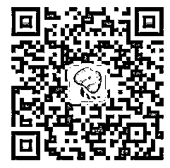

# 据说想成为业界大牛的人关注了这些号号号号号

> 原文：[`mp.weixin.qq.com/s?__biz=MzAxNTc0Mjg0Mg==&mid=2653286128&idx=1&sn=46fc2583109f030299f8eda39eb18d0d&chksm=802e2ce5b759a5f38a82096e473a7f8c94091a701587320c09e47550bb1ab50ab3553b5b0405&scene=27#wechat_redirect`](http://mp.weixin.qq.com/s?__biz=MzAxNTc0Mjg0Mg==&mid=2653286128&idx=1&sn=46fc2583109f030299f8eda39eb18d0d&chksm=802e2ce5b759a5f38a82096e473a7f8c94091a701587320c09e47550bb1ab50ab3553b5b0405&scene=27#wechat_redirect)

**编辑部**

微信公众号

**关键字**全网搜索最新排名

**『量化投资』：排名第一**

**『量       化』：排名第一**

**『机器学习』：排名第三**

我们会再接再厉

成为全网**优质的**金融、技术类公众号

你肯定会有各种疑惑：比如买了各种各样的书却不知道从哪里下手；知识零碎难成体系；一边学一边担心自己学了屠龙技无用武之地；想找志同道合的伙伴却觅而不得......

为了帮你解决这些烦恼，小编特意搜寻了一些**值得关注的公众号**，提供的内容包括机器学习、深度学习、量化投资、大数据分析、技术应用场景、业界深度观点、Paper 解读等等。

**51CTO 技术栈**

（微信号：blog51cto）

51CTO 技术栈专注于 IT 技术领域，汇聚顶级技术大咖为您分享开发架构、系统运维、大数据、人工智能等一线技术解析和实践案例等深度干货文章，愿我们一起悦享技术，成就 CTO 梦想！

**CSDN 大数据**

(微信号： )

CSDN 大数据荟百家之言，萃实践之思。延循技术发展脉络，与我们共飨大数据前沿资讯与一线实战解读。

**美团点评技术团队**

（微信号：meituantech）

美团点评技术团队是美团·大众点评多个研发组织的统称，负责支撑和驱动美团、大众点评多个业务的发展。该公众账号将面向互联网开发/产品从业者，提供我们研发及部分产品岗位的招聘信息，发布优质原创技术内容或发起相关活动。欢迎大家关注我们。

**AI 科技大本营**

（微信号：rgznai100）

程序员转型 AI 第一站。干货资源，热点分析，技术前沿，应用场景，技术落地，独家视频课程，线上线下精彩分享。内容涉及机器学习、深度学习等....

**PaperWeekly**

（微信号：）

PaperWeekly 是一个推荐、解读、讨论和报道人工智能前沿论文成果的学术平台，致力于让国内外优秀科研工作得到更为广泛的传播和认可。

**集智俱乐部**

（微信号：）

集智俱乐部由北京师范大学教授张江在 2003 年创办，是一个从事学术研究、享受科学乐趣的探索者群体。它倡导以平等开放的态度、科学实证的精神，进行跨学科的研究与交流，力求搭建一个中国的“没有围墙的研究所”。集智俱乐部公众号专注于在复杂系统、机器学习、人工智能方面的原创文章和精品活动，力图打造最有温度的 AI 学习社区。

**优矿量化实验室**

『优矿 uqer.io』是您的专属金融量化分析平台，在这里，您可以学习到丰富的量化知识以及由专业金融工程团队出品的策略干货。作为国内量化平台的领军者，我们旨在打破金融量化壁垒，为广大量化从业者提供华尔街专业量化装备，解决从研究到实盘的一站式需求。

▲▲▲

以上就是本期精选的微信公众号

加油哦，看好你！

