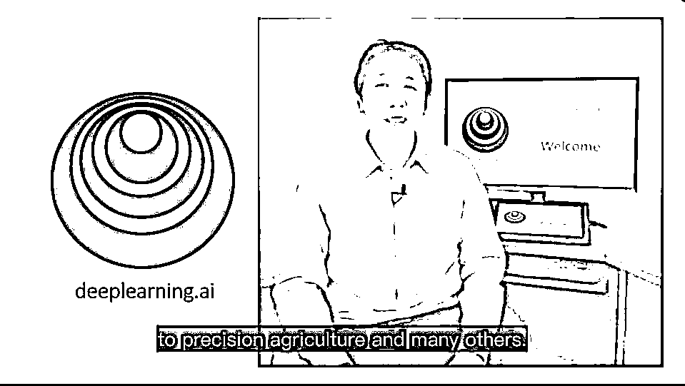
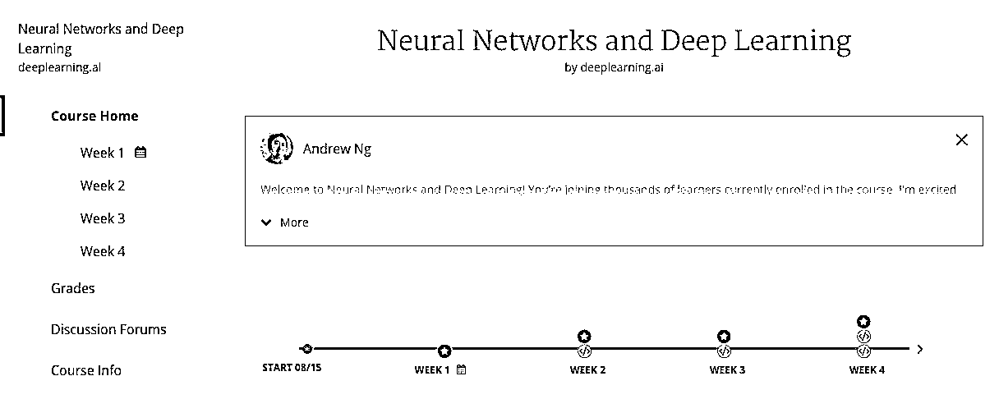
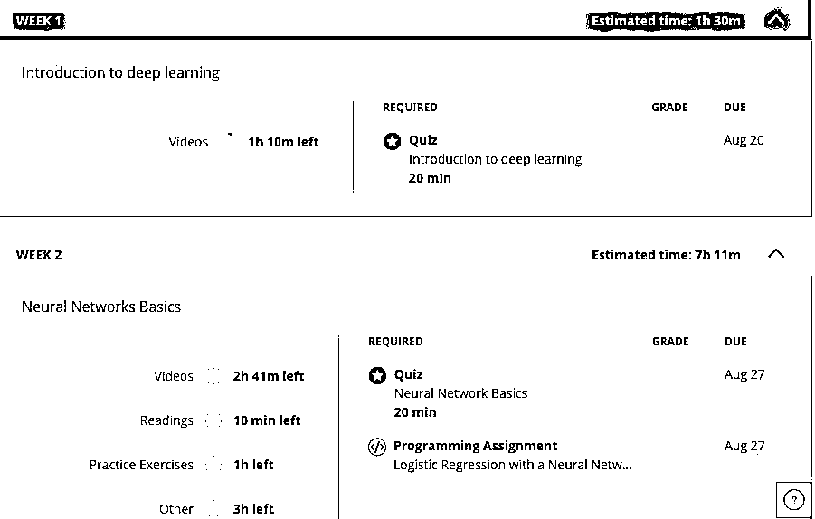
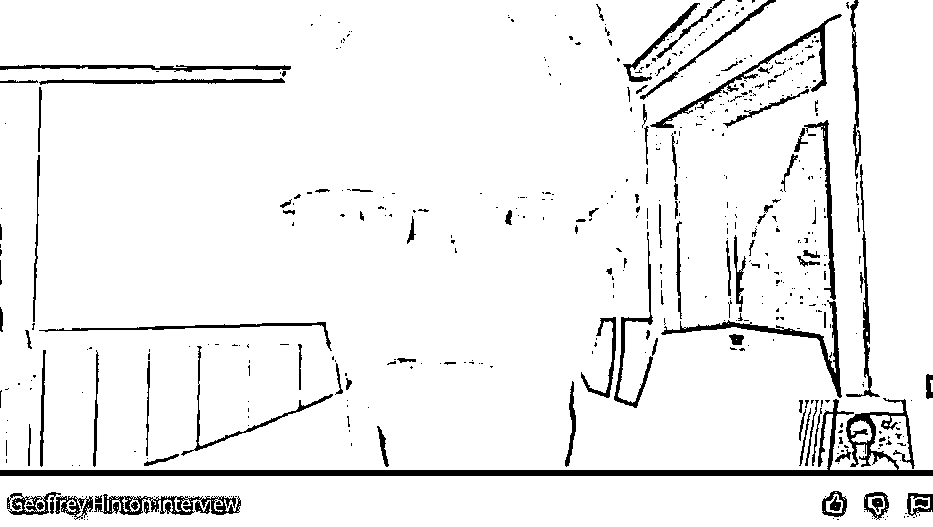
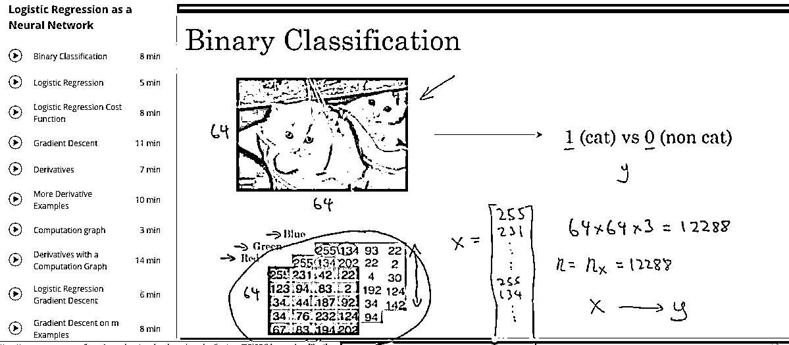
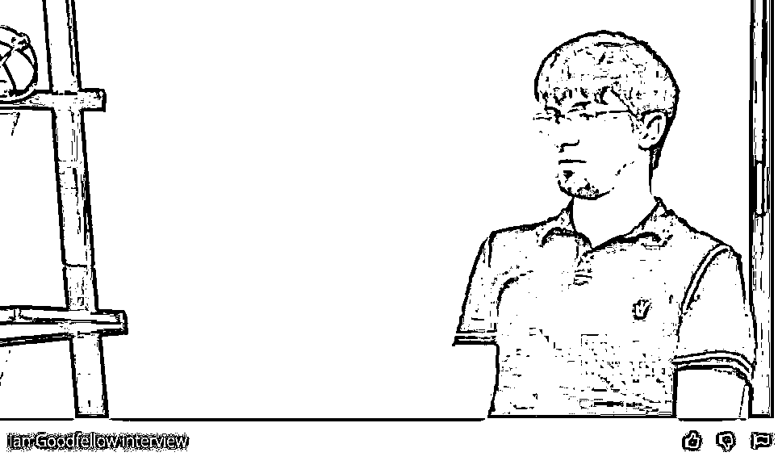
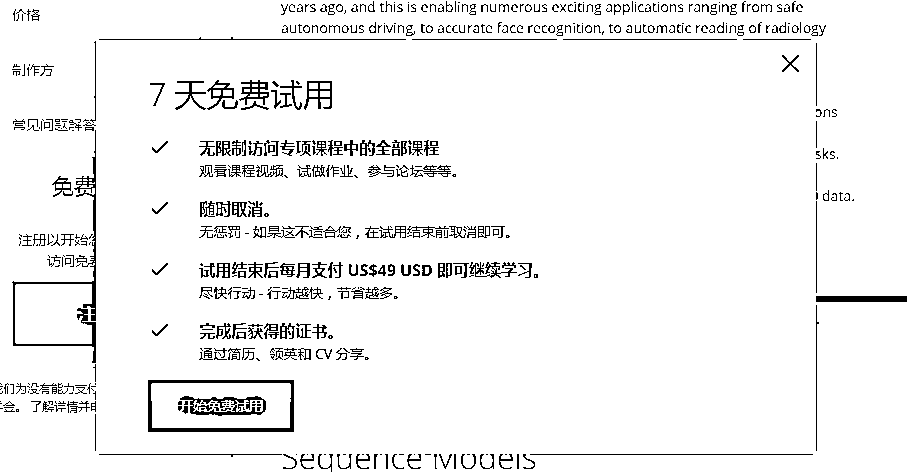
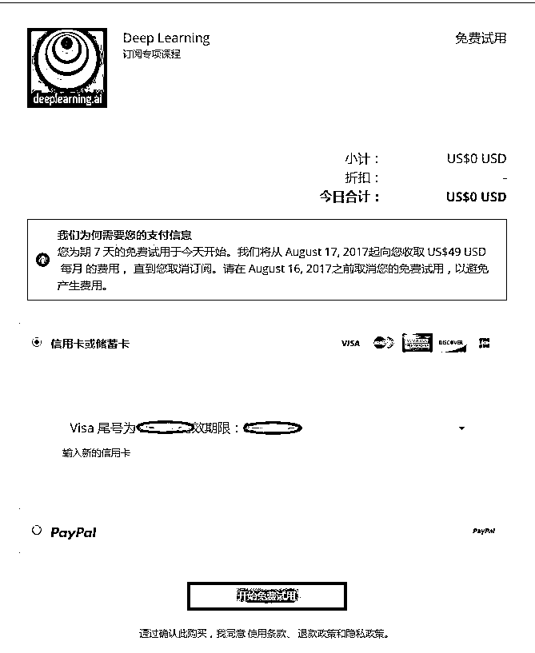

# 刚刚，我们详细对比了吴恩达和 Udacity 的深度学习课程，你们感受下...

> 原文：[`mp.weixin.qq.com/s?__biz=MzAxNTc0Mjg0Mg==&mid=2653286124&idx=1&sn=4e981a7feda6717607eeccc775f3a64f&chksm=802e2cf9b759a5efd7bd3311f71825edaf1aeeb63ede2fcb4405f950fbfed71955c454ade2d8&scene=27#wechat_redirect`](http://mp.weixin.qq.com/s?__biz=MzAxNTc0Mjg0Mg==&mid=2653286124&idx=1&sn=4e981a7feda6717607eeccc775f3a64f&chksm=802e2cf9b759a5efd7bd3311f71825edaf1aeeb63ede2fcb4405f950fbfed71955c454ade2d8&scene=27#wechat_redirect)

**编辑部**

微信公众号

**关键字**全网搜索最新排名

**『量化投资』：排名第一**

**『量       化』：排名第一**

**『机器学习』：排名第三**

我们会再接再厉

成为全网**优质的**金融、技术类公众号

本文授权转自 AI 科技大本营（rgznai100）

相信吴恩达公布新项目之一——在线课程已经刷遍朋友圈了，顺带的，连他的生平背景也顺便给缕了一个遍了，不过，本着一丝不苟出产干货的原则，今天，我们要来扒一扒，这个课程到底肿么样？

吴恩达亲自上阵授课

<inherit style="max-width: 100%; box-sizing: border-box !important; word-wrap: break-word !important;"><inherit>欲知真相如何，总得对比着来看。那我们就把大火的 Udacity 搬出来对比一下。</inherit></inherit>

<inherit>我们采访到了一位此前参与了 Udacity “深度学习纳米学位”的资深学员，正好他也刚刚体验完吴恩达推出的深度学习课程，他从视频质量及练习题质量等方面对两者进行了详细的对比。</inherit>

<inherit style="max-width: 100%; box-sizing: border-box !important; word-wrap: break-word !important;"><inherit>**Udacity VS Deeplearning.AI**</inherit></inherit>

我今年三月份报名参加了 Udacity 的深度学习纳米学位，经过几个月的学习，基本了解了神经网络、CNN、RNN、GAN 的概念，并且通过五个项目的联系，具备了一定的动手能力。我的体会是，Udacity 的这个纳米学位课程，精华在于项目。

坦率的说，他们家的视频课程的理论讲授部分本身并不是很出色，很多内容我听得云里雾里，比如 CNN 和 RNN 的理论介绍部分，说真的有走过场的感觉。但是这个纳米学位的项目作业的设计不得不点赞。五个大项目，每一个都有详细的目标和完备的 Notebook。Notebook 的内容之清晰，考虑之周到，在我参加过的在线培训课程中无出其右。所有的项目作业都由 Udacity 的老师手工批改，这一点尤其令人感动，批改细致，不但告诉你对不对，还告诉你为什么，有什么更好的做法。更有趣的是，这些改卷的老师还经常跟我说一些鼓励的话，让我很有成就感。

按照 Notebook 的要求，你必须反复听课，甚至要参考很多课外资料才能把题目做出来。如果说我从这个过程中学到了一点东西，90%是被项目逼出来的，不是靠听课听出来的。

在五个必做项目之外，其实课程本身还示范了上十个项目，比如文本生成、股票价格预测等等，我知道有些同学超级认真，也超级有时间，所有这些示范项目也都完成了，想必学到的东西和编程功力会远在我之上。

另外一个要点赞的是这个课程的论坛，非常活跃，超级有爱。

现在吴恩达的课程一上线，我马上就注册了，看了几节课，更重要的是看了一下项目的设计。我曾经上过吴恩达的机器学习课程，对他讲授理论的水平超级钦佩，看上去很复杂的问题，他抽丝剥茧、举重若轻的就给讲明白了。

在这个新的深度学习课里，我非常激动的感到，吴恩达继续保持了他强大的脑波发射力，真的能帮我把理论上的很多不足和坑填上。

从内容来说，其实两个课程覆盖的东西差不多，但吴恩达的课程在结构上明显更具匠心，比如说把 dropout、Mini-batch 这些技术都归于 Optimization 之下，就非常容易帮我搞清楚它们的定位和关系。而我学习 Udacity 课程时，搞了半天都不知道这两个技术的目的是什么，还是参考了很多第三方资料才有所理解。

再比如吴恩达课程里专门把超参调校拎出来作为一个模块来讲，这个太重要了。有人说，认为深度学习只是调超参的人，实际上一定是连超参都不会调，所以调超参背后的理论，真的是太重要了。

现在很多技术类课程都以“实战”为荣，以“理论”为耻。我觉得这个态度在深度学习这门课里绝对要不得，因为理论太重要了。理论如果不搞懂，你照猫画虎做几个例子就以为自己掌握了，但一遇到新的问题立刻就会抓瞎。从这个意义上来说，吴恩达的课程如果能够延续自己之前在《机器学习》课程中的理论教授水平，那毫无疑问对我们学习者来说是一个巨大的福利。

再谈谈练习层面。我看了这个课程当中的一些练习，感觉相比于 Udacity 还是略有进步。

第一是可以在线练习、在线训练、在线提交。Coursera 开了一个伴侣网站叫做 coursera-notebooks.org，这个课程的作业以在线 notebook 的形式放在这个伴侣网站上，我们在这个网站上昨晚练习之后，点一个键就可以提交了。而 Udacity 的作业需要自己在本机上做完之后，打包成 zip 文件上传，或由 Github 方式提交，比较麻烦。在这方面吴恩达课程是有优势的。

现在我还不知道当做 CNN、RNN 的时候，Coursera 课程是否会自动分配 GPU 资源。在 Udacity 上，我们需要自己去找 GPU 资源(课程官方推荐了一个 GPU 云，但是得自己去注册使用)，如果 Coursera-notebooks.org 能够在背后自动动态配置 GPU 资源给学员，那就太牛了。

第二是项目练习的题目质量，我觉得目前评价还为时尚早。因为吴恩达课程的第四、第五门，也就是 CNN 和 RNN 的课还没推出来，看不到他会给学生设计怎样的练习题。但是 Udacity 的习题还是不错的，特别是，我再强调一遍，Udacity 的批改老师真的很负责。

总之，最近这段时间学习深度学习的朋友们心情大爽，前有 Udacity 的深度学习纳米学位，后有《深度学习》花皮书，现在又来了吴恩达的课程。深度学习者的盛宴时代开始了，酷！

<inherit style="max-width: 100%; box-sizing: border-box !important; word-wrap: break-word !important;"><inherit>**此外，鲁朗软件（北京）有限公司联合创始人，花伴侣团队机器学习负责人，AI 科技大本营智库专家智亮老师第一时间看到吴恩达课程大纲后，也分享了他的看法：**</inherit></inherit>

> 从课程大纲来看，这次的五节内容最大的特点是两个：
> 
> 一个是比较新，思路清晰，且全面，基本上涵盖了学术界最新的进展，虽然还属于比较基础和通用的部分，但是和吴恩达原来的机器学习课程相比，已经算是和学术界的 state-of-the-art 接轨了。
> 
> 第二个特点就是偏工业，目标比较明确，可以培养工业适用的经济适用型程序猿，它的实战项目确实都非常贴近近期的工业焦点，如自动驾驶、医疗等。习题和项目做完之后，确实足够去做相关行业的工作了。

> 吴恩达有将复杂问题抽丝剥茧讲得很明白的实力，以及他对工业的了解，很可能再次成为一个爆款课程。

那么，吴恩达的课程内容有哪些？课程结构如何？有哪些练习题？

<inherit><inherit>**以下是本次吴恩达即将开启的在线深度学习专项课程的详细介绍，AI 科技大本营在第一时间将其全部翻译完毕，来看看吴恩达到底会给想要学习 AI 的程序猿们带来什么惊喜？**</inherit></inherit>

<inherit>**课程详细介绍**</inherit>

**目标：**

通过这 5 门课程，你将学会深度学习的基础，弄懂如何搭建神经网络，并掌握如何组织起一个成功的机器学习项目。

**具体技能：**

*   你将会学到卷积网络、RNN、LSTM、Adam、Dropout、BatchNorm、Xavier/He initialization 等；

*   了解并学习深度学习在医疗、自动驾驶、手语识别、音乐生成、自然语言处理等领域的真实案例；通过这一“机器学习飞行模拟器”的学习，特别是通过其中具体案例的研究，你将获得接近于真实的“行业经验”，并为面向工业界的机器学习研究做好准备；

*   学到 Python 和 TensorFlow，并亲手打造最先进的深度学习模型。

此外，每一门课，你都将能听到来自深度学习顶级专家们的分享，他们会讲讲自己的深度学习故事，并为你的深度学习之路提一些建议。

目前，deeplearning.ai 会同英伟达的深度学习研究院(Deep Learning Institute)在一些专门的深度学习高等话题上合作，为学生的编程作业提供 GPU 运算。你将有机会在最先进的工业级环境中打造自己的深度学习项目。

<inherit style="max-width: 100%; box-sizing: border-box !important; word-wrap: break-word !important;">**▌****第一课  神经网络与深度学习**</inherit>

*   即将开课的班次：8 月 15 日—9 月 18 日

*   课程学习时间：4 周，每周 3-6 小时

*   字幕：英语

*   课程概述：如果你想学习最前言的 AI 知识，本门课程刚好能帮到你。深度学习工程师正受到高度热捧，掌握深度学习相关知识会为您带来无数的全新机遇。深度学习还是一种全新的“超能力”，能让你做出几年前不可能实现的人工智能系统。

在本课程中，您将学到深度学习的基础知识。学习完本课程，您将：

*   理解推动深度学习的主要技术趋势

*   能够构建、训练和应用全连接深度神经网络

*   知道如何实现高效（矢量化）神经网络

*   了解神经网络架构中的关键参数

本课程还会带你了解深度学习事实上的运作机制，而非仅提供粗略或表层的描述。 完成本课程后，你将能把深度学习应用到你自身的领域之中。如果您想寻求一份与 AI 相关的工作，学完本课程，您将能够回答一些基本的面试问题。

这是深度学习专项课程的的第一门课。

*   **第 1 周：深度学习介绍**

这部分主要介绍推动深度学习兴起的主要趋势，了解当下深度学习应用的具体方面，以及如何来应用它。

吴恩达视频采访：Geoffrey Hinton

吴恩达通过视频采访 Geoffrey Hinton 截图

*   **第 2 周：神经网络基础**

这一部分我们将学习如何用神经网络来解决机器学习问题，学会如何用矢量化来加速模型。

*   图片截取自第二周课程的 Binary Classification 专题在线课程

吴恩达视频采访：Pieter Abbeel

*   **第 3 周：浅层神经网络**

这一部分我们将学习使用前向传播和反向传播构建一个带有隐含层的神经网络。

吴恩达视频采访：Ian Goodfellow

截取自吴恩达面对面采访 Ian Goodfellow 的视频

*   **第 4 周：深度神经网络**

在这部分，你将了解深度学习中的关键计算，使用它们来构建和训练深度神经网络，并将其应用于计算机视觉。

<inherit style="max-width: 100%; box-sizing: border-box !important; word-wrap: break-word !important;">**▌第二课  改进深层神经网络：超参数调优、正则化与最优化**</inherit>

*   即将开课的班次：8 月 15 日—9 月 11 日 

*   课程学习时间：3 周，每周 3-6 小时

*   字幕：英语

*   课程概述：本课程教你的将是如何把深度学习用得更好的“魔法”。深度学习的内部过程不该是个黑箱，您应当理解性能表现背后的因素，进而更为系统地各种优秀结果。 您还将学会 TensorFlow。

通过 3 周的学习，您将：

*   **理解打造深度学习应用的行业最佳实践；**

*   **能够有效地利用普通神经网络的“技巧”，包括初始化、L2 和退出正则化、Batch 归一化、梯度校验；** 

*   **能够实现和运用各种优化算法，小型 Batch 梯度下降，Momentum，RMSprop 和 Adam，并能检验它们的收敛性；**

*   **理解深度学习时代设置 训练/开发/测试 数据集并分析 误差/方差 的全新最佳实践；**

*   **能够在 TensorFlow 中实现神经网络。**

这是深度学习专项课程的第二门课。

*   第 1 周：深度学习实践

吴恩达视频采访：Yoshua Bengio

*   第 2 周：算法优化

吴恩达视频采访：林元庆

*   第 3 周：超参数调优、Batch 归一化与编程框架

<inherit style="max-width: 100%; box-sizing: border-box !important; word-wrap: break-word !important;"><inherit style="max-width: 100%; box-sizing: border-box !important; word-wrap: break-word !important;"><inherit style="max-width: 100%; box-sizing: border-box !important; word-wrap: break-word !important;">**▌第三课  构建机器学习项目**</inherit></inherit></inherit>

*   即将开课的班次：8 月 15 日—9 月 4 日

*   课程学习时间：2 周，每周 3-4 小时

*   字幕：英语

*   课程概述：您将学会如何打造出一个成功的机器学习项目。如果您渴望成为 AI 领域的技术领导者，并想弄懂如何团队工作设定方向，本课程将为指明道路。

本门课程的多数内容来自我开发和推广深度学习产品的经验，其他任何地方均从未有教授。本课程还设有两个用于练习机器学习项目领导决策的“飞行模拟器”，能够提供给你只有经历数年机器学习工作实践才能获取到的“行业经验”。

通过 2 周的学习，您将：

*   **弄懂如何诊断机器学习系统中的错误**

*   **有能力筛选出最有希望降低错误的工作方向**

*   **理解复杂的机器学习设置，如 训练/测试 数据集的不配备，并能对比 和/或 实现超越人类水平的表现**

*   **弄懂如何应用端对端学习、迁移学习和多任务学习**

我遇到过仅仅因为不理解一些机器学习原则而而浪费数月甚至数年时间的团队，所以我要用一门课程来教授这里的原则，希望这个为期两周的课程能帮您省下这些时间。

本课程是一门独立课程，只要具备基本的机器学习知识就可以参加。这是深度学习专项课程的第三门课。

*   第 1 周：深度学习策略 (1)

吴恩达视频采访：Andrej Karpathy

*   第 2 周：深度学习策略 (2)

吴恩达视频采访：Ruslan Salakhutdinov

<inherit style="max-width: 100%; box-sizing: border-box !important; word-wrap: break-word !important;">**▌第四课  卷积神经网络**</inherit>

*   课程内容及时间安排将在数周内公布 

*   字幕：英语

*   课程概述：本课程将教您如何构建卷积神经网络并用它来处理图像数据。在深度学习的驱动下，计算机视觉近两年来取得了巨大的进步，从安全的自动驾驶到精确的面部识别再到医学放射影像的自动读取，出现了无数激动人心的应用研究成果。

您将：

*   **理解如何构建卷积神经网络，包括它最新的变体，如残差网络。**

*   **弄懂得如何用卷积神经网络来完成视觉检测和识别任务。**

*   **弄懂如何用风格转换器创造艺术图像。**

*   **能用这些算法来处理各种各样的图像、视频，以及其他 2D 或 3D 数据。**

这是深度学习专项课程的第四门课。

<inherit style="max-width: 100%; box-sizing: border-box !important; word-wrap: break-word !important;">**▌第五课  序列模型**</inherit>

*   课程内容及时间安排将在数周内公布

*   字幕：英语

*   课程概述：本课程将教会你为自然语言、音频和其他序列数据构建模型。在深度学习的驱动下，序列算法近两年来取得了巨大的进步，语音识别、音乐合成、聊天机器人、机器翻译、自然语言理解等领域涌现出无数激动人心的成果。

您将：

*   弄懂如何构建并训练递归神经网络（RNN）及其常用的变体，如 GRU、LSTM。

*   能用序列模型解决自然语言问题，包括文本合成问题。

*   能用序列模型实现音频应用，包括语音识别和音乐合成。

这是深度学习专项课程的第五门课，也是最后一门。

**课程相关信息**

国外媒体称吴恩达此次的在线深度学习项目“Deep Learning Specialization”是迄今为止，最全面、系统和容易获取的深度学习在线课程。登陆 Coursera 可以观看。

日前，5 门课程中，前 3 门课已经就绪，由吴恩达亲自出镜授课。

课程将按月费收费，每月 49 美元。不过，根据 Coursera 的规则，用户申请的在线课程，前 7 天里可以无限量访问。

<inherit style="max-width: 100%; box-sizing: border-box !important; word-wrap: break-word !important;"></inherit>

目前，7 天的免费试用已经开启，感兴趣的小朋友可以火速前往课程围观。

<inherit style="max-width: 100%; box-sizing: border-box !important; word-wrap: break-word !important;"></inherit>

不过，这个在线课程在中国大陆无法正常观看，有需要的小伙伴...（你懂的）

附：Udacity 深度学习纳米学位课程大纲

**部分 1：神经网络**

神经网络是深度学习的基石。在这部分课程中，你将学习神经网络的基本原理，并在实战项目中从头开始构建一个神经网络。

**部分 2：卷积神经网网络**

卷积神经网络是解决视觉问题的标准答案。 在无人驾驶车，面部识别，医学影像等领域，都有它的应用。在这部分课程中，你将了解卷积神经网络的基本原理，并在实战项目中用它来解决图片分类问题。

**部分 3：循环神经网络**

循环神经网络对预测音乐和文本等有序数据非常有用。利用这个神经网络，你可以生成新音乐，翻译文本，或通过脑电图预测癫痫发作。在这部分课程中，我们将教你如何搭建和训练一个循环神经网络。

**部分 4：生成对抗网络**

生成对抗网络是无监督学习的一种。在生成对抗网络中，两个神经网络相互竞争，通常可用于生成图像数据。在这部分课程中，你将学习如何搭建自己的生成对抗网络，并让两个神经网络互相竞争。

**关注者**

**从****1 到 10000+**

**我们每天都在进步**

