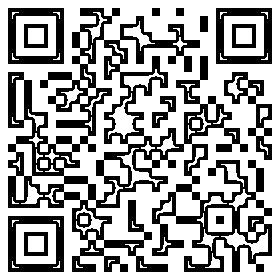

# 清华大学导师带你解读量化投资

> 原文：[`mp.weixin.qq.com/s?__biz=MzAxNTc0Mjg0Mg==&mid=2653286121&idx=1&sn=3185b15f4b14ca5a1c9cc7846e024b60&chksm=802e2cfcb759a5eaeb8ef870b87d9dbc3efb05d3acbbab552c2590e565110edc99a511926985&scene=27#wechat_redirect`](http://mp.weixin.qq.com/s?__biz=MzAxNTc0Mjg0Mg==&mid=2653286121&idx=1&sn=3185b15f4b14ca5a1c9cc7846e024b60&chksm=802e2cfcb759a5eaeb8ef870b87d9dbc3efb05d3acbbab552c2590e565110edc99a511926985&scene=27#wechat_redirect)

所有人都期待暑假 

但大多数人的第一天和最后一天

都选择和床度过

如果你不想浪费时间

那就要给自己 set 目标

这一次，给自己设定的技能是

**学会用公式改变投资市场**

这、就是神奇的  

**量**

**化**

**投**

**资**

****

**** 项目安排 / Project S********chedule ****

**▍****时间：QTC 二期 8.21~8.25；**

**▍时长：五天**

**▍地点：深圳&香港**

**▍住宿：深圳住宿 3 天，香港住宿 2 天**

****目前 QTC 二期的名额仅剩最后三席！****

****欢迎同学们报名！****

****暑假，给自己一个升级的机会！****

****量化投资实战营（Quantitative Trading Camp）**是由**清华大学深圳研究院量化研究中心公益支持**，配合财富 500 强香港金融名企联手塑造的**Python 量化人才培训项目**。在这里会有导师当面做 Python 技术指导以及名师量化策略教学，有强大的数据库和工具可供你一键全球选股，还有模拟私募基金量化投资策略大赛，面对真实 500 强基金管理人，让你用实操数据展示自己的才能。**

**正所谓“读万卷书不如行万里路，行万里路不如名师指路”，在这里有**mentor 一对一的软件技术指导以及名师策略教学**。优秀者不仅能获得清华研究院量化投资中心的**交流证书**与**香港宏利金融的实训证明**，更有机会进入上述机构工作，跟着量化顶级导师**实习**。**

****

 ****SPARK POINT****

****项目亮点****

**1.****** 港深两地深入体验量化投资****

**项目安排了 5 天课程，两天深圳，三天香港，涵盖了宏观到个体的量化投资战略课程。深圳和香港两地是不同的投资环境，其投资策略固然有所不同。在这种差异化的背景下学员更容易分析理解量化投资的要领之处，从而高效率接受课程内容并用之于实战操作中。** 

****

**2.****结构化课程与实战教学**

**要深入学习量化投资，不仅需要学习投资策略（strategy）更需要数据库（data base）与程序（programming）支持，配合实战经验丰富的导师指导，才能在短时间内掌握核心技巧。**

****

**3.****一线研发与投资团队辅导**

**有别于校园的金融课程，量化投资实战营不仅邀请到清华研究院量化投资中心一线研究员指导教学，更请到 500 强基金经理、CMT 持证分析师随同辅导,业界真实经验教学，打造全程真实投资挑战体验。**

****

**4.****全球量化投资策略大赛**

**根据导师的策略指导与技术支持，学员将在短期内模拟数据回测，并以收益风险率为核心竞争指标，通过演讲的形式展开量化策略融资路演大赛，最终获得更多投资者青睐的小组将获得导师推荐信。**

****

**5.****优质岗位内推机会**

**项目中表现优秀的学员不仅可以获得实习证书与推荐信，还有机会内推至优质的相关岗位。包括但不限于：清华研究院量化投资中心（研究方向）、香港宏利金融集团（销售方向）。**

****

**6.。。****Free for 数据库+分析代码**

**凡参与项目的学员，导师将协助安装使用 MongoDB 数据库及自研数据代码，全球行情一键更新实时选股，学员可享受永久免费使用。**

****

****COURSE OBJECT**** 

****课程对象****

**▐ 对 Python 量化投资感兴趣的爱好者、投资者等。**

**▐ 广大程序员、大学生、交易员、风控员、基金经理、产品经理、私募和公募管理者、金融从业人员、寻求投资合作机会的伙伴。**

****COURSE HARVEST****

****课程收获****

**▐ Python 量化投资需要的数据处理编程基础技能**

**▐  Mongodb 数据库的应用与全球多个金融数据源导入**

**▐  Alpha 因子与 CTA 趋势策略的代码模板与回测绩效**

**▐  清华量化研究中心的研习证书**

****QTC 回顾片（字幕）****

 **[`v.qq.com/iframe/preview.html?vid=c0535g68jph&width=500&height=375&auto=0`](https://v.qq.com/iframe/preview.html?vid=c0535g68jph&width=500&height=375&auto=0)** 

**** 项目费用/Project Cost ****

****报名费用：500 元/人****

****课程费用：4180 元/人****

**** 费用内容 /Cost details ****

****▍****费用包括 ****

**报名费用（报名行政费用）**

**课程费用（讲师费用、场地费用、保险费用、项目交通费等）**

****▍****费用不包括 ****

**各地到目的地的往返费用、餐食费、住宿费及其他个人消费**

**** 报名方式/Sign up ****

****

**长按二维码即可报名**

**或“**阅读原文**”**

**如果你也立志成为一名在量化投资研究领域深入钻研的宽客，除了理论知识的充分掌握，你更需要的是一次从**0 到 100 的实战体验**，在实战过程中快速解开量化投资“黑箱”的秘密，或许下一个实现 175%的巴菲特投资神话的逆袭者，就是你！**

****

****

**如想了解更多或报 QTC**

****请点击”阅读原文“****

****

**点击“阅读原文”了解详情**