# 【史上最详细】WorldQuant Alpha 101 因子 #001 研究

> 原文：[`mp.weixin.qq.com/s?__biz=MzAxNTc0Mjg0Mg==&mid=2653286117&idx=1&sn=c68e5ce6309f6b5faa6e7d021ff3707c&chksm=802e2cf0b759a5e66b6c5cb6d680ad4f7b1150124d66321d24bc549e664839a4adc581fa916f&scene=27#wechat_redirect`](http://mp.weixin.qq.com/s?__biz=MzAxNTc0Mjg0Mg==&mid=2653286117&idx=1&sn=c68e5ce6309f6b5faa6e7d021ff3707c&chksm=802e2cf0b759a5e66b6c5cb6d680ad4f7b1150124d66321d24bc549e664839a4adc581fa916f&scene=27#wechat_redirect)

**编辑部**

微信公众号

**关键字**全网搜索最新排名

**『量化投资』：排名第一**

**『量       化』：排名第一**

**『机器学习』：排名第三**

我们会再接再厉

成为全网**优质的**金融、技术类公众号

公众号与**点宽 DigQuant**量化社区开展了本期研究合作。

大家应该前段时间就知道 Alpha 101 了吧，很多人有去做，但是做的大多数都是简单的进行了一个复现，没有过多的区深究每个因子的涵义。本期推文我们和点宽合作，推出一个系列。来很系统的介绍 Alpha 101 。

社区俱乐部成员把 WorldQuant Alpha 101 的每个因子都了做一次**最详细**的**解释**和**回测研究，****一层一层的去拆分因子，把每个公式都说清楚**。我们不讨论这些因子是否都是有效的，我们更多的是希望通过我们分析因子背后的金融意义，帮助大家更好的理解市场，明白如何去做一些类似的研究、策略。这是我们的初衷。

**Alpha #001：**

 (rank(Ts_ArgMax(SignedPower(((returns < 0) ? stddev(returns, 20) : close), 2.), 5)) -0.5)

**因子函数说明：**

***1、rank（x）***

**    含义：**股票的排名。输入值向量 x 为股票向量，若输入值含 NAN，则 NAN 不参与排名，输出为股票对应排名的 boolean 值（排名所占总位数的百分比）。

    例如，输入值：x=[3,7,5,9,12,2]；

   ** 计算过程**：按向量 x 的元素大小排序，小的值排在前面，序号从 0 开始，则 x 元素对应排序排名为：r=[1,3,2,4,5,0]；

    输出值：对应排名的 Boolean 值为

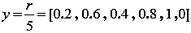

***2、Ts_ ArgMax(x,d)***

**含义**：找出前 d 天的向量 x 值最大的值，并返回其索引。

    例如：

    d=5 , x=[5,8,9,3,2]，对应索引号为 L=[5,4,3,2,1]，其中，索引号为 5 代表过去第 5 天，索引号为 1 代表过去第 1 天。因为 x 中最大的元素为 9，则索引号为 3，即过去第 3 天。

***3、SignedPower(x,t)=Sign(x).*(Abs(x).^t)***

**含义**：保持向量 x 的正负特性，将 x 进行 t 次幂处理使其差异放大。 

    其中，Sign(x)为符号函数，表示：如果 x>0，就返回 1，如果 x<0，则返回-1，如果 x=0，则返回 0。

    Abs(x)为绝对值函数，进行非负数处理。

***4、stddev(x,n)***

**含义**：求前 n 个 x 值的标准差。

**公用变量说明：**

**returns**：表示收益率，又称回报率，输入 n+1 行收盘价 close，输出 n 行收益率 returns。式子为：

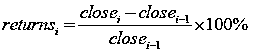

**close：**表示收盘价。

**公式解析：**

根据 Alpha #001 公式，我们根据公式的运算顺序解析：

***1、x1=(returns<0?stddev(returns,20) : close)***

**    结构**：判断语句。当 returns<0 成立，则返回 stddev(returns,20)；否则，返

回 close 。

 **   逻辑**：判断每日回报率 returns，如果小于 0，则返回前 20 天的回报率的标

准差，否则返回收盘价。

    **解析**：当日回报率是由当天收盘价与前一天收盘价得到的。returns 大于 0

时，收盘价相对昨天上升，此时，返回当前收盘价进行接下来的运算；反之，返

回前 20 天的回报率的标准差进行接下来的运算。

***2、x2=SignedPower(x1,2)***

**结构**：x2=SignedPower(x1,2)=Sign(x1).*(Abs(x1).²)

**逻辑**：对 x1 进行保留正负号的平方处理，其中 x1 为 1 中返回值。

**解析**：将 x1 经过此运算得到 x2，运算前后对比之后你会发现 x2 的值与对应的 x1 的值符号不变，但对应的值都放大了，我们将此操作称为差异放大。为什么要放大？我们根据 x1 值进行分析：x1 对应的值为收盘价和前 20 天的回报率的标准差两种。将其差异放大之后变成 x2，此时，收盘价的平方普遍大于前 20 天的回报率的标准差。这就是我们进行差异放大处理需要达到的效果。

***3、x3=Ts _ ArgMax(x2,5)***

**结构**：x3=Ts _ ArgMax(x2,5)=find(Max(x2,5))

**逻辑**：即从过去 5 个值 x2 找出最大值，返回其对应索引。其中，x2 为 2 中返回值。

**解析**：x2 值为收盘价或前 20 天的回报率的标准差进行差异放大后的值，对其进行取最大值的意义在于找出过去 5 天里最大的收盘价或者前 20 天的回报率的标准差。结合前面分析我们知道，returns>0 时，x2 才为收盘价；反之，x2 为前 20 天的回报率的标准差。

因此，过去 5 天里面 x2 值有可能包含以下三种情况：①全部为收盘价、②全部为前 20 天的回报率的标准差、③一部分为收盘价，一部分为前 20 天的回报率的标准差。而 x2 是进行差异化放大的值，放大后满足：收盘价的平方普遍大于前 20 天的回报率的标准差。因此，过去 5 天里只要存在一天满足 returns>0，一般最大值就为收盘价。

根据前面对 Ts_ ArgMax(x2,5)说明，我们知道对过去 5 天里找出收盘价或前 20 天的回报率的标准差的最大值的意义在于：根据均值回归的规律，涨得太多了，就会向平均值移动下跌；跌得太多了，就会向平均值移动上升。本策略主要利用跌得太久，就会反弹上升原理以及“波动性”原理，即总是认为其价格在一定范围内上下波动，即在最高点下跌一定程度，就会反弹回原来的最高点。根据这个原理，我们可以得到：

    1）对某股票过去 5 天里取最大的收盘价的索引，作为其权重值。即收盘价最大值离当前越久，说明收盘最大值之后相对收盘最大值那天来说股价在下降，而当前离最大值那天越久，下降时间越长，从而股价反弹越明显；

    2）而对某股票过去 5 天里取最大的前 20 天的回报率的标准差的索引，作为其权重值。我们知道，标准差越大，波动性越明显。我们知道，如果过去 5 天里都是取标准差的话，说明 returns 都是小于 0；否则，有一天存在 returns>0，最大值都是取收盘价。那么，returns 在过去 5 天里一直都小于 0，根据对 returns 的定义，股价一直都在下降。那么其最大的标准差的索引，其意义在于，最大标准差那天离当天越久，最大标准差那天之后，标准差都小于那天的标准差，即波动性从那天之后在下降。而从 returns<0 可知，股价一直在下跌，从而我们认为过去 5 天标准差最大值离现在越久，就会有更高的概率反弹上升。

***4、x4=rank(x3)0.5***

**结构**：先排序，再进行-0.5 中性化变换。

**逻辑**：rank(x3)表示对 x3 排序，返回其对应排名的 boolean 值，再进行-0.5 中性化操作，使得最后的返回值 x4 一半为正一半为负。x3 为 3 中的返回值。

**解析**：我们知道 x3 的值为各股票根据前 5 天最大收盘价或最大的前 20 天的回报率的标准差的索引作为对应股票的权重值。那么，我们对其进行排序以及-0.5 中性化操作，最后返回的 x4 就是我们得到的 Alpha #001 因子。取其正数的股票为买入股票池，即将所有股票的根据 Alpha #001 因子将其对半分，将 Alpha #001 因子排序取其最大的 50%进行交易。

**转换为伪 MATLAB 公式**

**Step1：**

****

****Step2：****

**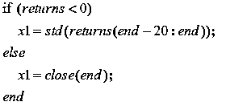**

****Step3：****

****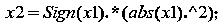****

******Step4：******

****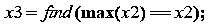****

******Step5：******

****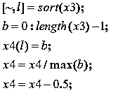****

******策略说明：******

**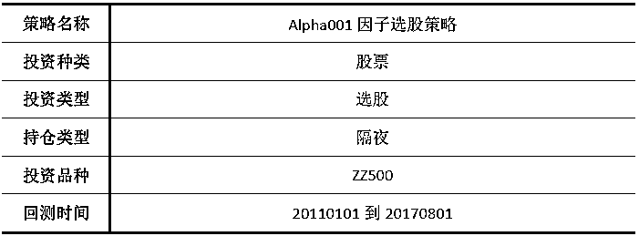**

****思路**：找出每只股票前 5 天的记录值（前 20 天的标准差或收盘价）的最大值的索引作为其权重，然后对每只股票的权重进行排序，最后返回股票对应排名的 boolean**

**值（排名所占总位数的百分比）减去 0.5 作为因子 alpha001 的值，判断：若 alpha001>0，则买入股票加仓；若 alpha001<0，则卖出已有仓位的股票平仓。**

****步骤：****

**1、计算前 25 天的每日回报率 returns：前 5 天的 returns 用来判断、前 5 天之后**

**的过去 20 天的 returns 用来计算标准差。每日回报率 returns 公式为：**

****

**2、判断前 5 天的每日回报率，若 returns<0，则当天记录值 x1 为当天之前 20 日**

**回报率的标准差；否则，当天的记录值 x1 为当天的收盘价。**

**3、将前 5 天的记录值 x1 经过以下公式进行差异化放大处理：** 

**x2=Sign(x1).*(abs(x1).²)**

**4、找出经过差异化放大处理后的前 5 天的记录值 x2 的最大值的索引。前 5 天数**

**据对应的索引为当天离现在的天数，如前一天为 1，前 5 天为 5。**

**5、将每只股票返回的索引号进行排序，返回其股票对应排名的 boolean 值（排名**

**所占总位数的百分比），再减去 0.5 的中性化操作得到最终的 alpha001 因子。**

**判断：若 alpha001>0，则买入股票加仓；若 alpha001<0，则卖出已有仓位的股票平仓。**

****回测报告：****

**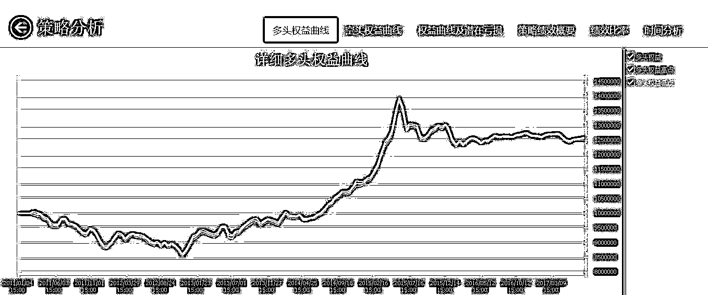**

**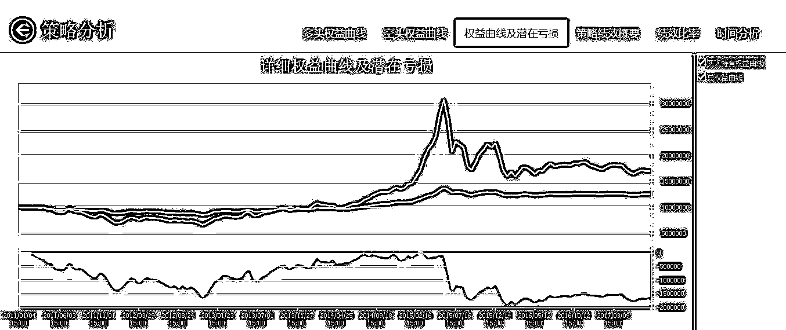**

**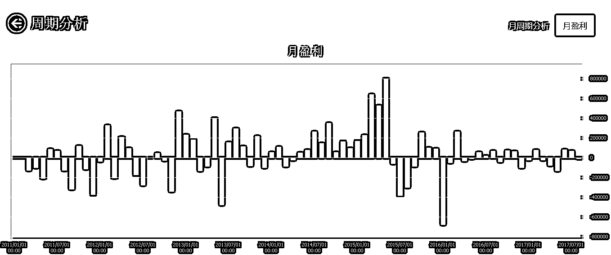**

**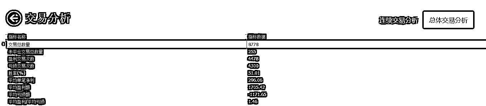**

****

****策略代码：****

**alpha001.m**

**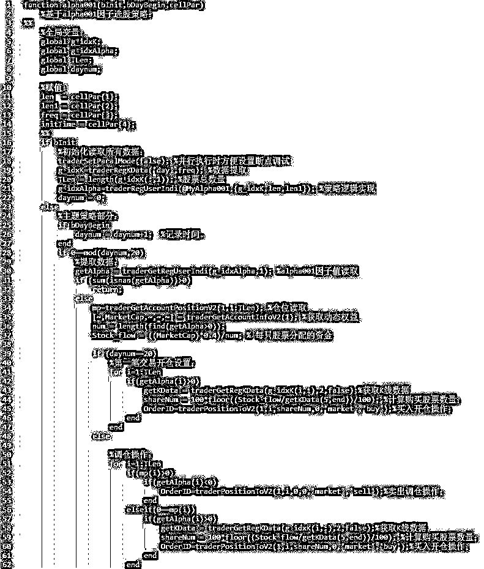**

**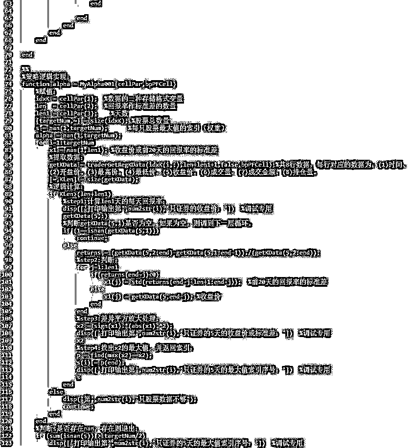**

**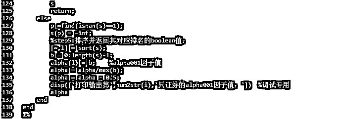**

****执行代码：****

**TestAlpha001.m **

**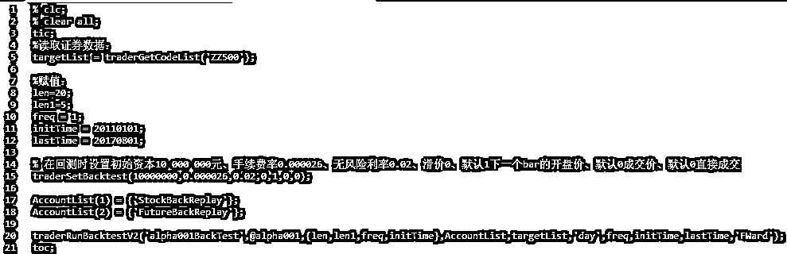**

****策略开发平台**：**AT 量能策略研究平台**基于 MATLAB，支持股票、期货、期权等全市场品种的策略研究和自动化交易，目前已经有超过 300 家高校的数学背景的学生、近万名专业量化用户。**

****

****关注者****

****从****1 到 10000+****

****我们每天都在进步****

****