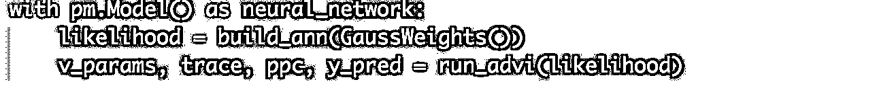
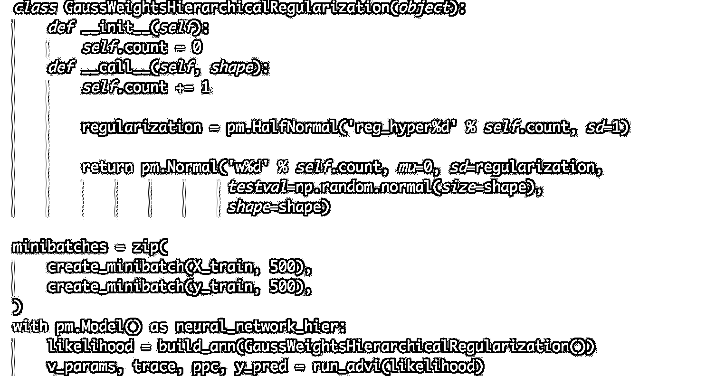
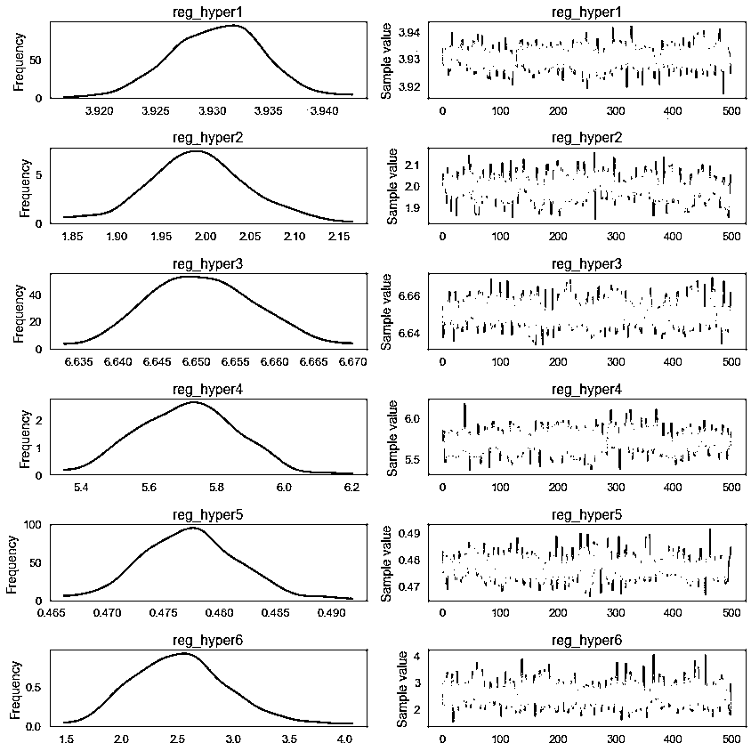

# 贝叶斯深度学习：桥接 PyMC3 和 Lasagne 构建层次神经网络

> 原文：[`mp.weixin.qq.com/s?__biz=MzAxNTc0Mjg0Mg==&mid=2653286097&idx=1&sn=488a8bef567894aadd219714fd45c845&chksm=802e2cc4b759a5d2a6f6008b45ba7f57ec29f4251e39fbc6b2340a58ece028570b1d843243ab&scene=27#wechat_redirect`](http://mp.weixin.qq.com/s?__biz=MzAxNTc0Mjg0Mg==&mid=2653286097&idx=1&sn=488a8bef567894aadd219714fd45c845&chksm=802e2cc4b759a5d2a6f6008b45ba7f57ec29f4251e39fbc6b2340a58ece028570b1d843243ab&scene=27#wechat_redirect)


**编辑部**

微信公众号

**关键字**全网搜索最新排名

**『量化投资』：排名第一**

**『量       化』：排名第一**

**『机器学习』：排名第三**

我们会再接再厉

成为全网**优质的**金融、技术类公众号

**编辑部翻译组**  

**编译：西西、wally**

**作者：Thomas Wiecki**

今天，我们将使用 Lasagne 构建一个更有趣的模型，这是一个灵活的 Theano 图书馆，用于构建各种类型的神经网络。你可能知道，PyMC3 还使用了 Theano，因此在 Lasagne 中建立了人工神经网络（ANN），将贝叶斯先验放在参数上，然后在 PyMC3 中使用变分推理（ADVI）来估计模型。

由于 Lasagne 的优秀表现，我们可以轻松地建立一个具有最大汇集层的分层贝叶斯卷积 ANN，在 MNIST 上实现 98％的准确性。


**数据集：MNIST**

我们将使用手写数字的经典 MNIST 数据集。 与之前的博客文章相反，MNIST 是具有合理数量的维度和数据点的有实际挑战性的 ML 任务（当然不如像 ImageNet 那样有挑战性）。


Loading data...


**模型说明**

我想像应该可以把 Lasagne 和 PyMC3 搭在一起，因为他们都依赖于 Theano。 然而，目前还不清楚它将会是多么困难。 幸运的是，第一个实验做得很好，但有一些潜在的方法可以使这更容易。 我开设了一个*GitHub issue*在 Lasagne's 的报告里，在这几天后，*PR695*被合并，允许他们更好的整合。


首先，Lasagne 创建一个具有 2 个完全连接的隐藏层（每个具有 800 个神经元）的 ANN，这几乎是从教程中直接采用的 Lasagne 代码。 当使用*lasagne.layers.DenseLayer*创建图层时，我们可以传递一个函数*init*，该函数必须返回一个用作权重和偏差矩阵的 Theano 表达式。 


接下来，为 ANN 创建权重函数。 因为 PyMC3 要求每个随机变量具有不同的名称，我们创建一个类并且是唯一命名的先验。

在这里，priors 充当了调节者的角色，试图保持 ANN small 的权重。它在数学上等价于一个 L2 的损失项，作为通常的做法是将大的权重惩罚到目标函数中。


下面是一些设置小批量 ADVI 的函数。


**放在一起**

让我们用小批量的 ADVI 来运行 ANN:




确保一切聚合:


```py
Accuracy on test data = 89.81%
```

分层神经网络：学习数据的正则化

上面我们只是固定了所有层的 sd = 0.1，但是可能第一层应该有不同于第二层的值。也许开始时是 0.1，要么太小或太大。在贝叶斯建模中，很常见的是在这种情况下放置 hyperprior，并学习最佳正则化应用到数据中去。这节省了我们在超参数优化中对参数进行调优的时间。




Accuracy on test data = 92.25999999999999%

我们得到一个很小但很好的 boost 在准确性上。 我们来看看超参数后面的部分：




有趣的是，它们都是不同的，这表明改变正规化数量在网络的每一层是有意义的。

**卷积神经网络**

但到目前为止，在 PyMC3 中实现也很简单。有趣的是，我们现在可以构建更复杂的 ANNs，像卷积神经网络:


```py
Accuracy on test data = 98.03%
```

更高的精度。我也尝试了这个层次模型，但它实现了较低的精度(95%)，我认为是由于过度拟合。

让我们更多地利用我们在贝叶斯框架中的产出，并在我们的预测中探索不确定性。正如我们的预测是分类的，我们不能简单地计算预测标准差。相反，我们计算的是卡方统计量，它告诉我们样本的均匀程度。越均匀，我们的不确定性越高。我不确定这是否是最好的方法。


正如我们所看到的，当模型出错时，答案会更加不确定(即提供的答案更加均匀)。你可能会说，你从一个普通的 ANN 那里得到了同样的效果，但事实并非如此。


这篇文章在后续会翻译

**结论**

通过桥接 Lasagne 和 PyMC3，并通过使用小批量的 ADVI 来训练贝叶斯神经网络，在一个合适的和复杂的数据集上(MNIST)，我们在实际的贝叶斯深度学习问题上迈出了一大步。

我还认为这说明了 PyMC3 的好处。通过使用一种常用的语言(Python)和抽象计算后端(Theano)，我们能够很容易地利用该生态系统的强大功能，并以一种从未考虑过的方式使用 PyMC3。我期待着将它扩展到新的领域。

**关注者**

**从****1 到 10000+**

**我们每天都在进步**

