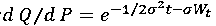

# 基金定投介绍 | 北京大学量化交易协会点宽量化专栏

> 原文：[`mp.weixin.qq.com/s?__biz=MzAxNTc0Mjg0Mg==&mid=2653286070&idx=1&sn=15e6ba98da667eb682c4260541ff6190&chksm=802e2ca3b759a5b55049401ba291a1092fe78ffa01c9cc97171e6bd2c9dff6664f8b4d43be5e&scene=27#wechat_redirect`](http://mp.weixin.qq.com/s?__biz=MzAxNTc0Mjg0Mg==&mid=2653286070&idx=1&sn=15e6ba98da667eb682c4260541ff6190&chksm=802e2ca3b759a5b55049401ba291a1092fe78ffa01c9cc97171e6bd2c9dff6664f8b4d43be5e&scene=27#wechat_redirect)

**编辑部**

微信公众号

**关键字**全网搜索最新排名

**『量化投资』：排名第一**

**『量       化』：排名第一**

**『机器学习』：排名第三**

我们会再接再厉

成为全网**优质的**金融、技术类公众号

**本文来源于北京大学量化交易协会**

**基金定投介绍**

**传统定投的定义**

基金定期定额投资简称基金定投，是指每隔预设的固定时间，对某一证券投资基金投入固定金额的投资方法。在海外成熟市场，定投广泛被称为自动投资计划（Automatic investment plan，AIP），突出定投的交易指令是根据预先设定好的规则自动完成。而定投运用的交易策略被称作美元成本平均法（Dollar cost average）或投资平均法（Investment averaging），突出了该投资法通过不断投入，以长期平均成本获得证券资产，降低择时风险的特点。

#### **传统定投策略优化**

智能定投建立在传统定投基础上，它在保留传统定投纪律性投资的特点，降低主观操作可能风险的同时，又通过数量分析方法对市场进行客观的判断，调整每期定投金额，优化投资成本。

*   基于价格指数的技术策略：借助技术分析手段，主要原理是认为股价走势中长期来看将回归均线。在股价偏离均线较大时，应相应地调整定投金额

*   基于市盈率的基本面策略：根据历史市场市盈率的变动区间，判断目前市场 PE 是相对高估还是低估，从而指导进行较低金额还是较高金额的定投。

*   基于平均投资成本的策略：移动平均成本法从持有人成本的角度考虑，在能够降低平均成本的时候多投，在不能够降低平均成本的时候少投，从而优化投资成本。

#### **定投的主要特点**

*   （1）投资标的为波动率较高的基金类型：基金定投的基金类型一般为指数型、股票型、混合型、商品型等，由于理财基金、货币基金等基金类型风险收益较低，且收益率一般为正，不需要通过分批买入对冲市场波动风险，对低风险基金的定投，更类似于定期存款，是一种储蓄行为。

*   （2）分次投资：定投中投入的资金不是在期初一次性投入，而是在连续的时间范围内，每隔一段时间固定投入。在投资实践中，投资期数往往较多。

*   （3）定期投资：每次投资的间隔是固定的。事前设定的投资间隔可长可短，根据投资人的投资偏好于资金安排情况可以是每周、每双周、每月、每季度等。

*   （4）定额投资：每次投入的金额一般是固定的。由于投资证券的价格会发生变化，因此其每期投资所获得的证券数量是变化的。在定投金额既定情况下，当投资对象的净值上涨时，其获得的投资对象的份额数量减少，净值下跌时，则获得的投资对象的份额数量增加。简而言之，就是逢低多买，逢高少买。

#### **适合定投的市场条件**

*   当市场单边上涨，定投的回报率比一次性投资差

*   当市场单边下跌，定投的回报率比一次性投资好

*   当市场先跌后升，定投的回报率比一次性投资好

**连续时间模型下定投与一次性投资的对比**

**定投的连续时间模型**

*   本质上基金单位净值也是一个连续时间过程

*   基金所投标的：股票、债券等资产价格都是连续的，且一般假设满足几何布朗运动

    

*   使用伊藤引理可推导出

*   一般以股指、期货等为标的的基金，其单位净值也假定符合几何布朗运动，于是在连续时间模型下可写出基金定投收益的表达式，并与一次性投资进行对比。

**定投基金期末资产净值**

*   假设投资时间长度为 T，投资金总额为 M。对于一次性 投资， 期末基金资产净值 表示为：

*   我们将投资时间 T 分为 N 期，每定投金额表示为 ：M/N，每期得到的基金份额 为：M/NSt。投资到期时， 定投获得的期末总份数 为，

*   此时定投期末的基金资产净值为 ：

**定投与一次性投资对比**

*   对比定投和一次性投资的收益情况：用二者期末净值之比的大小来衡量定投策略的表现

*   对上式求期望：

*   应用 Girsanov 定理，令

*   我们可以推导出定投与一次性投资期末的比值期望是

的增函数

时，趋势项μ为较大的正数，σ² 较小，说明标的资产价格上涨趋势明显。

**直观规律**

*   σ²-μ<0 趋势项μ为较大的正数，σ² 较小，说明标的资产价格上涨趋势明显。

*   σ²-μ>0 可能是趋势项μ较小，而σ² 主导，说明标的资产价格无明显趋势且波动较大也可能是趋势项μ为较大的负数，说明标的资产价格下跌趋势明显。

 <semantics style="max-width: 100%; box-sizing: border-box !important; word-wrap: break-word !important;"><annotation encoding="application/x-tex" style="max-width: 100%; box-sizing: border-box !important; word-wrap: break-word !important;"></annotation></semantics> 

<semantics style="max-width: 100%; box-sizing: border-box !important; word-wrap: break-word !important;"></semantics><semantics style="max-width: 100%; box-sizing: border-box !important; word-wrap: break-word !important;"><annotation encoding="application/x-tex" style="max-width: 100%; box-sizing: border-box !important; word-wrap: break-word !important;">**σ² 与μ**</annotation></semantics>**参数估计**

1、μ为资产价格的漂移率，由公式：

定义，根据几何布朗运动方程和伊藤引理有： 

2、由上式得对数收益率的期望：

3、由于每天的对数收益<semantics style="max-width: 100%; box-sizing: border-box !important; word-wrap: break-word !important;"><annotation encoding="application/x-tex" style="max-width: 100%; box-sizing: border-box !important; word-wrap: break-word !important;">r</annotation></semantics>i 独立同分布，可以用样本均值来估算总体均值 

<semantics style="max-width: 100%; box-sizing: border-box !important; word-wrap: break-word !important;"><annotation encoding="application/x-tex" style="max-width: 100%; box-sizing: border-box !important; word-wrap: break-word !important;"></annotation></semantics>

<semantics style="max-width: 100%; line-height: 1.6; box-sizing: border-box !important; word-wrap: break-word !important;"></semantics><semantics style="max-width: 100%; box-sizing: border-box !important; word-wrap: break-word !important;"><annotation encoding="application/x-tex" style="max-width: 100%; box-sizing: border-box !important; word-wrap: break-word !important;">**σ²-**</annotation></semantics>**μ指标实证测试**

漂移率μ和价格序列走势在较长时间尺度上看，基本呈正相关的关系，因为μ的主要影响因素是前一段时间窗口内对数收益率的均值，价格上涨则μ较大，价格下跌则μ为负。但是在较短时间尺度内，μ的值可能会因为增长速度（或下跌速度）的变化而偏离正相关的趋势。这种在相同涨跌趋势中的速度变化是μ这个指标的特点

可以看到，σ2 这个指标和价格序列走势有较明显的负相关关系，且在断崖式单边下跌市中，历史波动率的数值也会爆发式增长。‍‍

μ与价格序列走势的相关关系

σ2 与价格序列走势的相关关系

*   数据使用：中证 500 指数、创业板指、沪深 300、上证综指，每 1 小时的收盘价格，时间跨度为指数建立时间到 2016 年 12 月 15 日。

*   建仓平仓设置：σ²-μ指标在(-0.0005~-0.0035)之间建仓，超出阈值则平仓。

*   止盈止损条件：无

#### 中证 500 回测结果

#### 创业板指回测结果

#### 沪深 300 回测结果

#### 上证综指回测结果

#### 各指数回测风险收益情况

【注①】：上表中最右列的“使用阈值”仅为大致估算，未经调参。
【注②】：上表回测时皆未设置止盈止损条件，入场出场指标均为( σ2 – μ )指标

#### 单边上涨市

#### 震荡市

#### 单边下跌市

参考华泰金工基金定投系列研报

**关注者**

**从****1 到 10000+**

**我们每天都在进步**

<fieldset class="" style="margin-top: 0.5em; margin-bottom: 0.5em; max-width: 100%; box-sizing: border-box; min-width: 0px; border: 0px rgb(89, 135, 241); width: 455px; word-wrap: break-word !important;">**点击****“阅读原文”，获取更多专栏文章！**</fieldset>