# 战斗民族开源神器 ClickHouse：一款适合于构建量化回测研究系统的高性能列式数据库（二）

> 原文：[`mp.weixin.qq.com/s?__biz=MzAxNTc0Mjg0Mg==&mid=2653286067&idx=1&sn=e638282945a04ebcc9b0b189480be66e&chksm=802e2ca6b759a5b0a572f2f50f28f0636711c8e8c6ce96ce8a8ab9d9b9edaed4bdb6bd959ed1&scene=27#wechat_redirect`](http://mp.weixin.qq.com/s?__biz=MzAxNTc0Mjg0Mg==&mid=2653286067&idx=1&sn=e638282945a04ebcc9b0b189480be66e&chksm=802e2ca6b759a5b0a572f2f50f28f0636711c8e8c6ce96ce8a8ab9d9b9edaed4bdb6bd959ed1&scene=27#wechat_redirect)


**编辑部**

微信公众号

**关键字**全网搜索最新排名

**『量化投资』：排名第一**

**『量       化』：排名第一**

**『机器学习』：排名第三**

我们会再接再厉

成为全网**优质的**金融、技术类公众号

**编辑部原创**  

**编译：wally21st、 西西**

未经允许，不得转载


## **Tutorial**

对于一些**私募**、**投资机构**和**个人**来说，量化投资研究、回测离不开数据的支持。当数据量达到一定数量，如 A 股所有频率和种类的数据等等。这时候需要的是对数据有效的储存和管理。今年 6 月才开源的数据库 ClickHouse，为我们提供了福音。ClickHouse 来自俄罗斯，又是刚刚开源，社区也是俄语为主。因此，大家对它并不是很熟悉，用的人也不是很多。 

我们对比一下他的速度

一个字

**快**

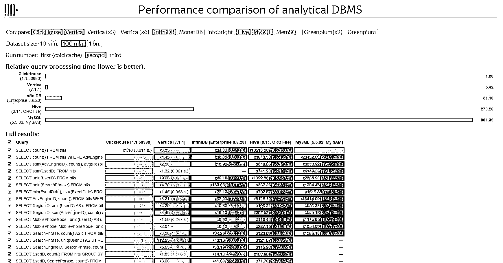

上面是 100M 数据集的跑分结果：ClickHouse 比 Vertia 快约 5 倍，比 Hive 快 279 倍，比 My SQL 快 801 倍。 举个例子：ClickHouse 1 秒，Vertica 5.42 秒，Hive 279 秒；

今天，公众号开始连载 ClickHouse 的文档，由**特约作者：****wally21st、西西**翻译和解释。希望在量化圈对于数据管理苦恼的人们，带来一些有用的信息和帮助。

私募和机构对于数据是渴求的，但是拿到那么多数据怎么管理也是一门很深的学问。

由于译者英文水平、数据库技术和时间精力所限，希望大家一起参与翻译和研究。

参与请联系邮箱：lhtzjqxx@163.com

> 原文档：https://clickhouse.yandex/tutorial.html
> 
> 蓝色字体因为微信公众号不支持外部链接，请大家自己操作。

**已经翻译系列：**（点击下方标题即可查看）

[战斗民族开源神器 ClickHouse：一款适合于构建量化回测研究系统的高性能列式数据库（一）](https://mp.weixin.qq.com/s?__biz=MzAxNTc0Mjg0Mg==&mid=2653286050&idx=1&sn=6401e3c22d42ad8cdca9aa88cbbdec9d&chksm=802e2cb7b759a5a123c9e4c708b972bb5bab580059c66c25876a3b3a67d47de0d1868492b881&scene=21#wechat_redirect)

**Clickhouse 入门指南**

我们先获取一些开源数据样本集，我们将使用美国 1987 到 2015 年的民用航班数据，很难称这个样本为大数据（只包含 1 亿 6 千 6 百万行数据，未压缩时有 63GB），但我们能用它很快地开干。数据可以从这里下载，你也可以从原地址下载，戳这里.

首先，我们将在单台服务器上部署 Clickhouse，之后，我们再来搞搞如何部署到支持分片和复制的集群上。

在 Ubuntu 和 Debian 上，Clickhouse 可以通过包安装。在其他 Linux 发行版上你得自己从源码编译安装。

clickhouse-client 这个包内含名为 clickhouse-client 的应用程序——一个交互式 Clickhouse 客户端。clickhouse-server-base 包含一个名为 clickhouse-server 的二进制文件。clickhouse-server-commom 包含 clickhouse-server 的配置文件。

服务端配置文件在/etc/clickhouse-server/下。在开干之前要注意配置文件中的 path 元素，path 决定了数据存放的路径。考虑到包更新的问题，直接编辑 config.xml 文件不是很方便，建议重写 config.d 目录下配置文件中的配置元素。另外，你也可能希望在开干前设置访问权限。

clickhouse-server 服务不会在安装和升级之后自动启动。启动服务如下：

```py
sudo service clickhouse-server start
```

服务器日志文件默认存放在/var/log/clickhouse-server/下。服务器在记录下“Ready for connections”后便可等待处理客户端连接请求。

使用 clickhouse-client 来连接服务器。

下面是 clickhouse-client 的一些用法小提示：

交互模式：

```py
clickhouse-clientclickhouse-client --host=... --port=... --user=... --password=...
```

开启多行查询模式：

```py
clickhouse-client -m
clickhouse-client --multiline
```

在批处理模式下执行查询：

```py
clickhouse-client --query='SELECT 1'echo 'SELECT 1' | clickhouse-client
```

从指定格式的文件中插入数据：

```py
clickhouse-client --query='INSERT INTO table VALUES' < data.txt
clickhouse-client --query='INSERT INTO table FORMAT TabSeparated' < data.tsv
```

### **给样本数据库创建表**

创建表的语句：

```py
$ clickhouse-client --multiline
ClickHouse client version 0.0.53720.
Connecting to localhost:9000.Connected to ClickHouse server version 0.0.53720.

:) CREATE TABLE ontime
(
    Year UInt16,
    Quarter UInt8,
    Month UInt8,
    DayofMonth UInt8,
    DayOfWeek UInt8,
    FlightDate Date,
    UniqueCarrier FixedString(7),
    AirlineID Int32,
    Carrier FixedString(2),
    TailNum String,
    FlightNum String,
    OriginAirportID Int32,
    OriginAirportSeqID Int32,
    OriginCityMarketID Int32,
    Origin FixedString(5),
    OriginCityName String,
    OriginState FixedString(2),
    OriginStateFips String,
    OriginStateName String,
    OriginWac Int32,
    DestAirportID Int32,
    DestAirportSeqID Int32,
    DestCityMarketID Int32,
    Dest FixedString(5),
    DestCityName String,
    DestState FixedString(2),
    DestStateFips String,
    DestStateName String,
    DestWac Int32,
    CRSDepTime Int32,
    DepTime Int32,
    DepDelay Int32,
    DepDelayMinutes Int32,
    DepDel15 Int32,
    DepartureDelayGroups String,
    DepTimeBlk String,
    TaxiOut Int32,
    WheelsOff Int32,
    WheelsOn Int32,
    TaxiIn Int32,
    CRSArrTime Int32,
    ArrTime Int32,
    ArrDelay Int32,
    ArrDelayMinutes Int32,
    ArrDel15 Int32,
    ArrivalDelayGroups Int32,
    ArrTimeBlk String,
    Cancelled UInt8,
    CancellationCode FixedString(1),
    Diverted UInt8,
    CRSElapsedTime Int32,
    ActualElapsedTime Int32,
    AirTime Int32,
    Flights Int32,
    Distance Int32,
    DistanceGroup UInt8,
    CarrierDelay Int32,
    WeatherDelay Int32,
    NASDelay Int32,
    SecurityDelay Int32,
    LateAircraftDelay Int32,
    FirstDepTime String,
    TotalAddGTime String,
    LongestAddGTime String,
    DivAirportLandings String,
    DivReachedDest String,
    DivActualElapsedTime String,
    DivArrDelay String,
    DivDistance String,
    Div1Airport String,
    Div1AirportID Int32,
    Div1AirportSeqID Int32,
    Div1WheelsOn String,
    Div1TotalGTime String,
    Div1LongestGTime String,
    Div1WheelsOff String,
    Div1TailNum String,
    Div2Airport String,
    Div2AirportID Int32,
    Div2AirportSeqID Int32,
    Div2WheelsOn String,
    Div2TotalGTime String,
    Div2LongestGTime String,
    Div2WheelsOff String,
    Div2TailNum String,
    Div3Airport String,
    Div3AirportID Int32,
    Div3AirportSeqID Int32,
    Div3WheelsOn String,
    Div3TotalGTime String,
    Div3LongestGTime String,
    Div3WheelsOff String,
    Div3TailNum String,
    Div4Airport String,
    Div4AirportID Int32,
    Div4AirportSeqID Int32,
    Div4WheelsOn String,
    Div4TotalGTime String,
    Div4LongestGTime String,
    Div4WheelsOff String,
    Div4TailNum String,
    Div5Airport String,
    Div5AirportID Int32,
    Div5AirportSeqID Int32,
    Div5WheelsOn String,
    Div5TotalGTime String,
    Div5LongestGTime String,
    Div5WheelsOff String,
    Div5TailNum String)
ENGINE = MergeTree(FlightDate, (Year, FlightDate), 8192);
```

现在我们有了一个 MergeTree 类型的表。推荐在生产环境中使用 MergeTree 类型的表。这种类型的表有一个用于增量排序的主键，允许通过主键快速执行查询。

### **导入数据**

```py
xz -v -c -d < ontime.csv.xz | clickhouse-client --query="INSERT INTO ontime FORMAT CSV"
```

Clickhouse 的 INSERT 语句允许以任何支持的格式导入数据。数据导入只需要 O(1)的 RAM 消耗。INSERT 语句可以接受任何大小数据量作为输入。强烈建议不要以太小的数据块插入数据。注意，以大小为 max_insert_block_size（默认为 1048576 行）的块进行插入是一个原子操作（即数据块要么完全插入，要么完全不插入）。要是在插入操作的时候断开了连接，你可能不清楚数据块是否成功插入了。为了实现妥妥地一次性完工，Clickhouse 支持复制表的幂等性。这意味着你可以重试插入相同的数据块（可能在不同的副本上），但实际上这个数据块只插入了一次。由于本指南中是从本地导入数据，所以暂时不 care 数据块生成和一次准确性问题。

用 INSERT 语句向 MergeTree 类型表中插数据的操作是非阻塞的，SELECT 操作也是非阻塞式的，你可以在插入操作后即刻执行 SELECT 查询。

我们的示例数据集有点不太理想，有两点原因:

第一个原因是示例中的字符串（String）数据用枚举（Enum）或者数值类型是最合适的。

> 当要插入的数据的可能类别已知并且比较短小（比如操作系统的名称、浏览器厂商等信息）时，我们建议使用枚举或数值类型可以提高性能。如果数据形式不确定（比如搜索查询、URL 等），那就还是用字符串类型吧。

第二个原因是数据集包含了年、季度、月、本月第几日、本周第几日等等冗余字段。实际上，一个航班日期（Flightdate）就够了。这么做可能是为了给那些处理日期函数不得劲儿的数据库系统提高查询性能而已。

> Clickhouse 中处理 DateTime 字段的函数是经过优化的，所以这种冗余是不需要的。反正有了 Clickhouse 这种列式数据库，妈妈再也不用担心表内列数太多了，想要多少就要多少，大几百列都是小 case。（料理数据的家庭主妇们用过之后都说：得劲儿！）

### **查询样本数据集**

下面是一些对测试数据的查询示例。

*   2015 年最受欢迎的目的地

```py
SELECT
    OriginCityName,
    DestCityName,    
    count(*) AS flights,
    bar(flights, 0, 20000, 40)
FROM ontime WHERE Year = 2015 GROUP BY OriginCityName, DestCityName ORDER BY flights DESC LIMIT 20
```

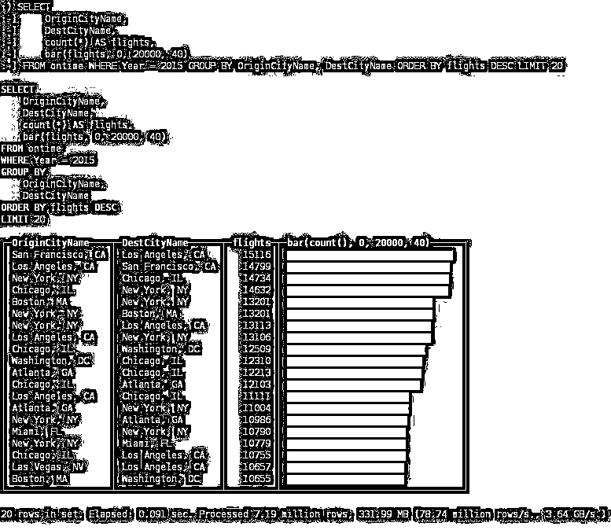

*   最受欢迎的出发城市

```py
SELECT OriginCityName, count(*) AS flights
FROM ontime GROUP BY OriginCityName ORDER BY flights DESC LIMIT 20
```

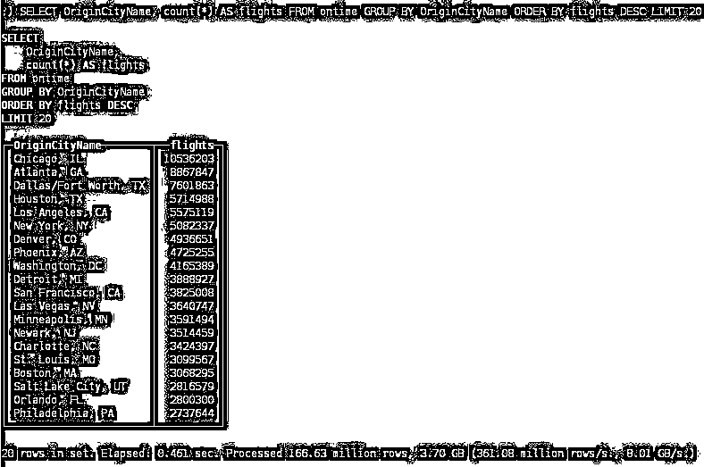

*   目的地最多的出发城市

```py
SELECT OriginCityName, uniq(Dest) AS u
FROM ontime GROUP BY OriginCityName ORDER BY u DESC LIMIT 20
```

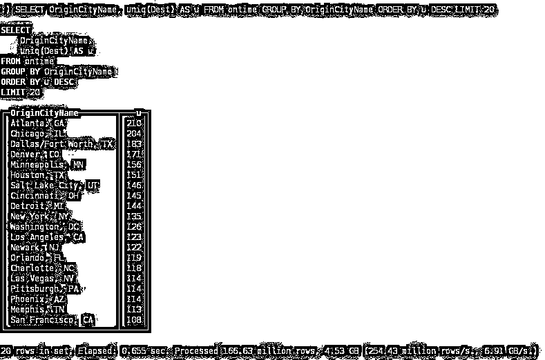

*   周内各天的航班延误

```py
SELECT DayOfWeek, count() AS c, avg(DepDelay >  60) AS delays
FROM ontime GROUP BY DayOfWeek ORDER BY DayOfWeek
```

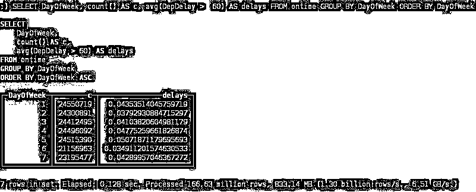

*   最常延误 1 小时及以上的出发城市

```py
SELECT OriginCityName, count() AS c, avg(DepDelay >  60) AS delays
FROM ontime
GROUP BY OriginCityName
HAVING c >  100000
ORDER BY delays DESC
LIMIT 20
```

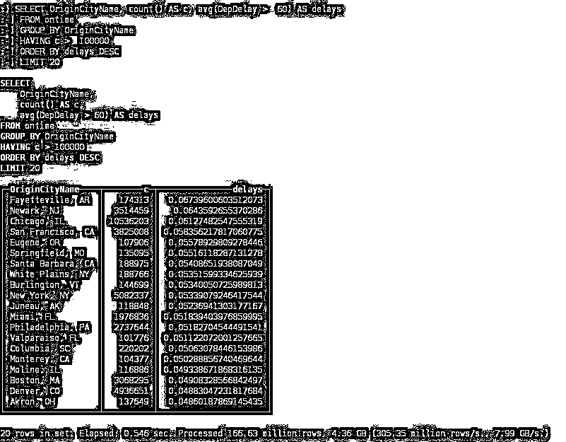

*   最长飞行时间

```py
SELECT OriginCityName, DestCityName, count(*) AS flights, avg(AirTime) AS duration
FROM ontime
GROUP BY OriginCityName, DestCityName
ORDER BY duration DESC
LIMIT 20
```

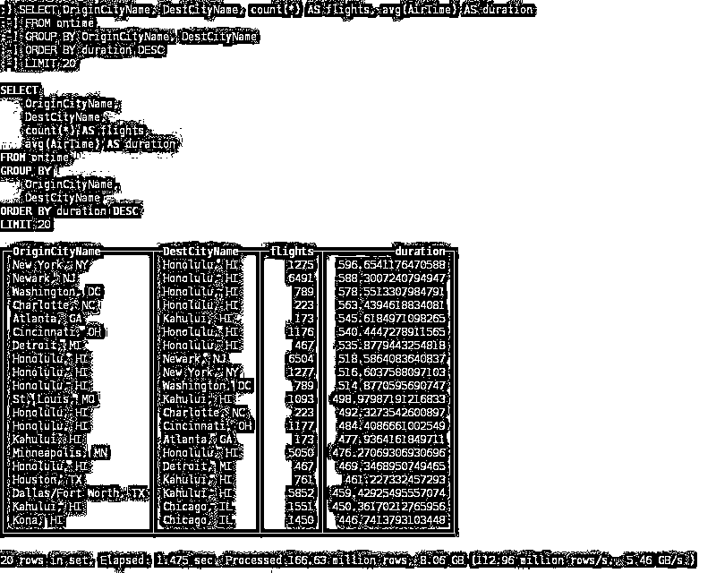

*   按航空公司进行划分的到达时间延迟分布

```py
SELECT Carrier, count() AS c, round(quantileTDigest(0.99)(DepDelay), 2) AS q
FROM ontime GROUP BY Carrier ORDER BY q DESC
```

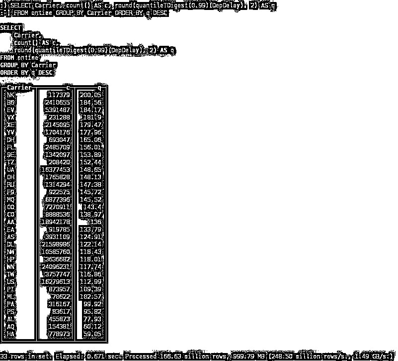

*   停止航班运营的航空公司

```py
SELECT Carrier, min(Year), max(Year), count()
FROM ontime GROUP BY Carrier HAVING max(Year) < 2015 ORDER BY count() DESC
```

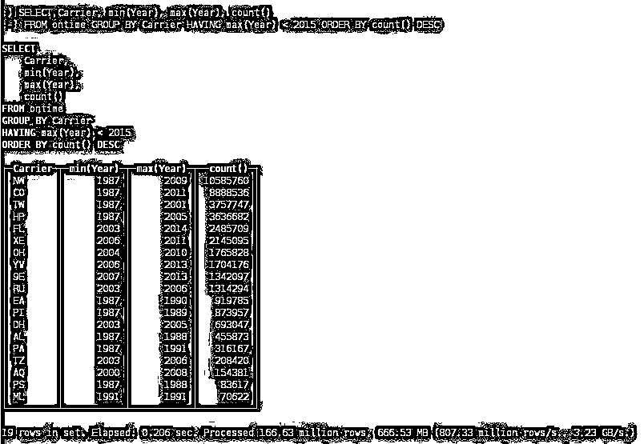

*   2015 年最具趋向目的地城市

```py
SELECT
    DestCityName,    
 sum(Year = 2014) AS c2014,    
 sum(Year = 2015) AS c2015,
    c2015 / c2014 AS diff
FROM ontime
WHERE Year IN (2014, 2015)
GROUP BY DestCityNameHAVING c2014 >  10000 AND c2015 >  1000 AND diff >  1
ORDER BY diff DESC
```

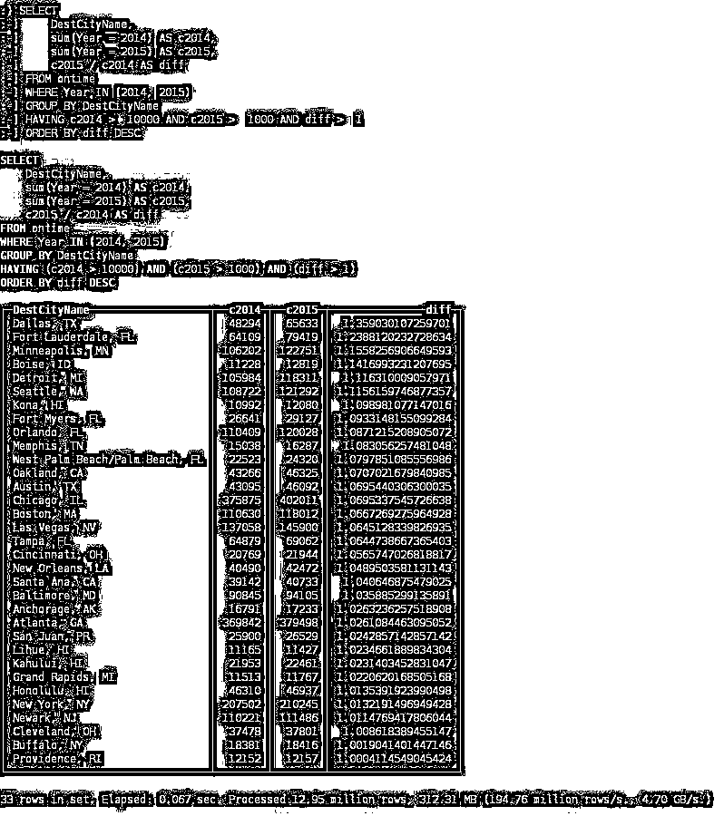

*   最受欢迎的季节性旅游目的地城市

```py
SELECT
    DestCityName,    
    any(total),    
    avg(abs(monthly * 12 - total) / total) AS avg_month_diff
FROM (    
    SELECT DestCityName, count() AS total    
    FROM ontime GROUP BY DestCityName HAVING total > 100000 )
ALL INNER JOIN (    
    SELECT DestCityName, Month, count() AS monthly   
    FROM ontime GROUP BY DestCityName, Month HAVING monthly > 10000 )
USING DestCityName
GROUP BY DestCityName
ORDER BY avg_month_diff DESC
LIMIT 20
```

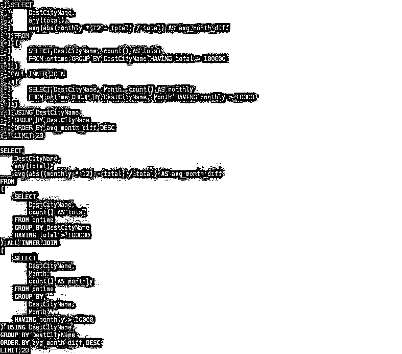

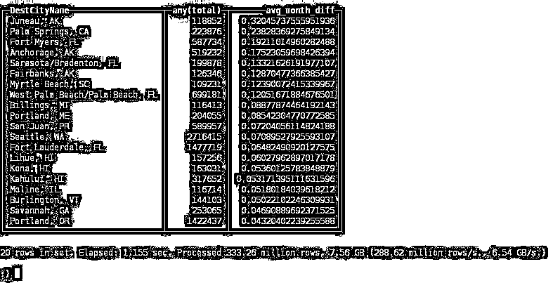

### **Clickhouse 的集群部署**

Clickhouse 集群是一个同质化（homogenous）集群，构建步骤如下：

1.  在集群每一台机器上都安装上 Clickhouse 服务器

2.  设置集群配置文件

3.  在每个实例上创建本地表（local tables）

4.  创建一个分布式表

分布式表实际上是 Clickhouse 集群本地表的一种“视图”。对分布式表的 SELECT 查询，会利用集群所有分片资源进行执行。你可以配置多个集群，并创建多个分布式表，给不同的集群提供视图。

如下是有三个分片组成一个集群的配置文件，每个分片单独存储一个数据副本

```py
<remote_servers>
    <perftest_3shards_1replicas>
        <shard>
            <replica>
                <host>example-perftest01j.yandex.ru</host>
                <port>9000</port>
            </replica>
        </shard>
        <shard>
            <replica>
                <host>example-perftest02j.yandex.ru</host>
                <port>9000</port>
            </replica>
        </shard>
        <shard>
            <replica>
                <host>example-perftest03j.yandex.ru</host>
                <port>9000</port>
            </replica>
        </shard>
    </perftest_3shards_1replicas>
</remote_servers>
```

创建一个本地表：

```py
CREATE TABLE ontime_local (...) ENGINE = MergeTree(FlightDate, (Year, FlightDate), 8192);
```

创建一个分布式表，提供到集群本地表的视图：

```py
CREATE TABLE ontime_all AS ontime_local    
    ENGINE = Distributed(perftest_3shards_1replicas, default, ontime_local, rand());
```

你可以在集群的所有机器上创建分布式表。这将允许在任何机器上运行分布式查询。除了分布式表外，还可以使用“remote”表函数。

我们来运行 INSERT SELECT 语句，往分布式表中插入数据，将表扩展到多个服务器。

```py
INSERT INTO ontime_all SELECT * FROM ontime;
```

> 值得注意的是，上面介绍的方法不适合那些大表分片。请使用内置的分片特性。

如你所料，重量级查询在 3 台服务器上的执行速度比在 1 台机器上快 N 倍： 

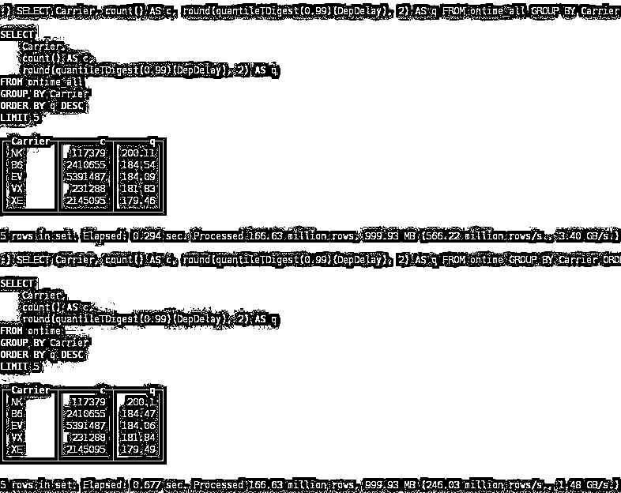

这个例子中我们使用了包含 3 个分片的集群，每个分片包含了一个副本。 

在生产环境中为了提供数据恢复能力，我们建议每个分片最好有 2-3 个副本分布到多个数据中心之间。Clickhouse 支持无限数量的副本。

下面是一个分片包含三个副本的集群配置：

```py
<remote_servers>
    ...    <perftest_1shards_3replicas>
        <shard>
            <replica>
                <host>example-perftest01j.yandex.ru</host>
                <port>9000</port>
             </replica>
             <replica>
                <host>example-perftest02j.yandex.ru</host>
                <port>9000</port>
             </replica>
             <replica>
                <host>example-perftest03j.yandex.ru</host>
                <port>9000</port>
             </replica>
        </shard>
    </perftest_1shards_3replicas>
</remote_servers>
```

要实现数据复制，ZooKeeper 必不可少。Clickhouse 会照顾到所有副本数据的一致性，在运行故障发生后能自动恢复程序。建议吧 ZooKeeper 集群部署到独立的服务器上。

简单起见，你可能自己写程序代码将数据写到所有副本中来完成数据复制，那么这就不需要 ZooKeeper 了。这种做法我们不推荐，因为这种情况下 Clickhouse 不能保证所有副本的数据一致性。看你啰！搞砸了我不负责！

在配置文件中设置 ZooKeeper 的位置：

```py
<zookeeper-servers>
    <node>
        <host>zoo01.yandex.ru</host>
        <port>2181</port>
    </node>
    <node>
        <host>zoo02.yandex.ru</host>
        <port>2181</port>
    </node>
    <node>
        <host>zoo03.yandex.ru</host>
        <port>2181</port>
    </node>
</zookeeper-servers>
```

我们还需要设置确定分片和副本的宏，这在创建表的时候会用到。

```py
<macros>
    <shard>01</shard>
    <replica>01</replica>
</macros>
```

如果复制表在创建的时候没有副本，首个新的副本将会被实例化。如果已经有过副本，新的副本将从已存在的副本中克隆。你可以先创建所有复制表，再向其中插入数据；也可以创建若干副本，再在数据插入期间或之后加入其它副本。

```py
CREATE TABLE ontime_replica (...)
ENGINE = ReplicatedMergeTree(    
    '/clickhouse_perftest/tables/{shard}/ontime',    
    '{replica}',
    FlightDate,
    (Year, FlightDate),    
    8192);
```

这里我们使用的是 ReplicatedMergeTree 表类型。在参数中我们指定 Zookeeper 的路径，其中包含了分片和副本标示符。

```py
INSERT INTO ontime_replica SELECT * FROM ontime;
```

复制发生在多主（multi-master）模式下，数据可以加载到任何副本中，它将自动与其他实例同步。复制过程是异步的，因此在给定的时刻，并非所有副本都可能包含最近插入的数据。为了允许数据插入，至少创建一个副本。一旦其他副本再次可用，将会同步数据并修复一致性。请注意，这种方案仍存在使刚刚添加的数据丢失的可能性。

**关注者**

**从****1 到 10000+**

**我们每天都在进步**

