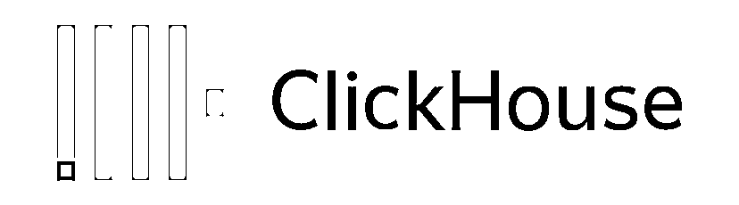
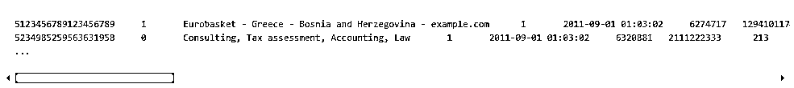

# 战斗民族开源神器 ClickHouse：一款适合于构建量化回测研究系统的高性能列式数据库（一）

> 原文：[`mp.weixin.qq.com/s?__biz=MzAxNTc0Mjg0Mg==&mid=2653286050&idx=1&sn=6401e3c22d42ad8cdca9aa88cbbdec9d&chksm=802e2cb7b759a5a123c9e4c708b972bb5bab580059c66c25876a3b3a67d47de0d1868492b881&scene=27#wechat_redirect`](http://mp.weixin.qq.com/s?__biz=MzAxNTc0Mjg0Mg==&mid=2653286050&idx=1&sn=6401e3c22d42ad8cdca9aa88cbbdec9d&chksm=802e2cb7b759a5a123c9e4c708b972bb5bab580059c66c25876a3b3a67d47de0d1868492b881&scene=27#wechat_redirect)

**编辑部**

微信公众号

**关键字**全网搜索最新排名

**『量化投资』：排名第一**

**『量       化』：排名第一**

**『机器学习』：排名第三**

我们会再接再厉

成为全网**优质的**金融、技术类公众号

**编辑部原创**  

**编译：wally21st、 西西**

未经允许，不得转载

对于一些**私募**、**投资机构**和**个人**来说，量化投资研究、回测离不开数据的支持。当数据量达到一定数量，如 A 股所有频率和种类的数据等等。这时候需要的是对数据有效的储存和管理。今年 6 月才开源的数据库 ClickHouse，为我们提供了福音。ClickHouse 来自俄罗斯，又是刚刚开源，社区也是俄语为主。因此，大家对它并不是很熟悉，用的人也不是很多。

我们对比一下他的速度

一个字

**快**

上面是 100M 数据集的跑分结果：ClickHouse 比 Vertia 快约 5 倍，比 Hive 快 279 倍，比 My SQL 快 801 倍。 举个例子：ClickHouse 1 秒，Vertica 5.42 秒，Hive 279 秒；

今天，公众号开始连载 ClickHouse 的文档，由**特约作者：****wally21st、西西**翻译和解释。希望在量化圈对于数据管理苦恼的人们，带来一些有用的信息和帮助。

私募和机构对于数据是渴求的，但是拿到那么多数据怎么管理也是一门很深的学问。

由于译者英文水平、数据库技术和时间精力所限，希望大家一起参与翻译和研究。

参与请联系邮箱：lhtzjqxx@163.com

> **介绍**
> 
> **第一节**

**Clickhouse 是什么**

Clickhouse 是一个用于联机分析处理（OLAP）的列式数据库管理系统（columnar DBMS）。

在通常的按行存储的数据库中，数据是按照如下顺序存储的：

换句话说，一行内的所有数据都彼此依次存储。像这样的行式数据库包括 MySQL、Postgres、MS SQL-Server 等。

在面向列的数据库管理系统中，数据是这样存储的：

这些例子只显示了数据排列的顺序。来自不同列的值分别存储，而来自同一列的数据存储在一起。列式数据库例如有：Vertica, Paraccel (Actian Matrix) (Amazon Redshift), Sybase IQ, Exasol, Infobright, InfiniDB, MonetDB (VectorWise) (Actian Vector), LucidDB, SAP HANA, Google Dremel, Google PowerDrill, Druid, kdb+等。

不同的数据存储顺序适合不同的应用场景。对于数据访问场景而言，通常关注的是：多久、以多少比例进行怎样的查询；对不同类型（行、列、字节）的查询，需要读取多少数据量；读取与更新数据之间的关系；数据的工作规模量和如何在本地使用数据；是否使用事务和事务的隔离问题；数据复制和逻辑完整性的要求；对各种查询类型的延迟和吞吐量的要求。

系统负载越高，为场景进行系统定制化就越重要，定制化就越具体。没有一个系统能同样适用于极其不同的场景。在高负载下，一个能适应众多场景的系统，要么在各个场景下表现得都很差，要么仅仅只能较好地处理某一场景的问题。

我们认为，以下几条针对的是联机分析处理（OLAP）应用场景：

*   绝大多数请求都是用于读访问的。

*   数据需要以大批次（大于 1000 行）进行更新，而不是单行更新；或者根本没有更新操作。

*   数据只是添加到数据库，没有必要修改。

*   读取数据时，会从数据库中提取出大量的行，但只用到一小部分列。

*   表很“宽”，即表中包含大量的列

*   查询频率相对较低（通常每台服务器每秒查询数百次或更少）。

*   对于简单查询，允许大约 50 毫秒的延迟。

*   列的值是比较小的数值和短字符串（例如，每个 URL 只有 60 个字节）。

*   在处理单个查询时需要高吞吐量（每台服务器每秒高达数十亿行）。

*   不需要事务。

*   数据一致性要求较低。

*   每次查询中只会查询一个大表。除了一个大表，其余都是小表。

*   查询结果显著小于数据源。即数据有过滤或聚合。返回结果不超过单个服务器内存大小。

显然，OLAP 场景与其他常用的应用场景非常不同，如 OLTP 或 key-Value 获取的场景。所以，如果你在处理分析型查询中想要获得高性能，没有任何理由去使用 OLTP 或键值数据库。打个比方，如果你想用 MongoDB 或者 Elliptics 做数据分析，你会“爽”到极点，谁用谁知道。

列式数据库更适合 OLAP 场景（大多数查询的处理速度至少提高 100 倍），原因如下：

**1、I/O 的原因：**

**a.** 对于分析型查询，只需要读取少量的列。在列式数据库中，你能只读取你需要的。例如，如果你需要 100 个列中的 5 个，你可以预期 I/O 减少 20 倍。

**b.** 由于数据是打包读取的，所以更容易压缩。列式数据更容易压缩，也进一步降低了 I/O 量。

**c.** 由于减少了 I/O，更多数据可以进入系统缓存。例如，查询“计算每个广告平台的记录数”，需要读取一个“广告平台 ID”的列，该列未压缩时占用 1 字节空间。如果大多数流量不是来自广告平台，你可以期望把此列至少压缩 10 倍。采用快速压缩算法，数据解压缩的速度可以达到每秒解出几个 GB 的数据。换句话说，这个查询可以以每秒大约数十亿行的速度在单台服务器上处理。这个速度在实践中是被检验过的。

举个栗子：

**2、CPU 的原因**

由于执行查询需要处理大量的行，所以它有助于以整个向量方式分发所有运算，而不是按单独的行。它也有助于实现查询引擎，因此几乎没有分发成本。如果不这样做，对于任何像样的磁盘子系统，查询解释器不可避免地会阻塞 CPU。因此，如果可以的话，将数据按列存储和处理，是明智之举。

有两种方法可以实现这一点：

1.  一个向量引擎。所有操作都是为向量，而不是为单独的值编写的。这意味着你不需要经常调用运算，而且分发成本可以忽略不计运算代码包含一个优化的内部循环。

2.  代码生成。为查询生成的代码包含了所有的间接调用。

这不是在“普通”的数据库中完成的，因为执行简单查询是没有意义的。然而，也有例外，例如 MemSQL 使用代码生成来减少处理 SQL 查询时的延迟。（对比而言，分析型数据库系统需要优化吞吐量，而不是优化延迟）。

注意，为了 CPU 效率，查询语言必须是声明式的（SQL 或 MDX），或者至少是一个向量（J.K）。考虑到优化，查询应该只包含隐式循环。

**关注者**

**从****1 到 10000+**

**我们每天都在进步**

