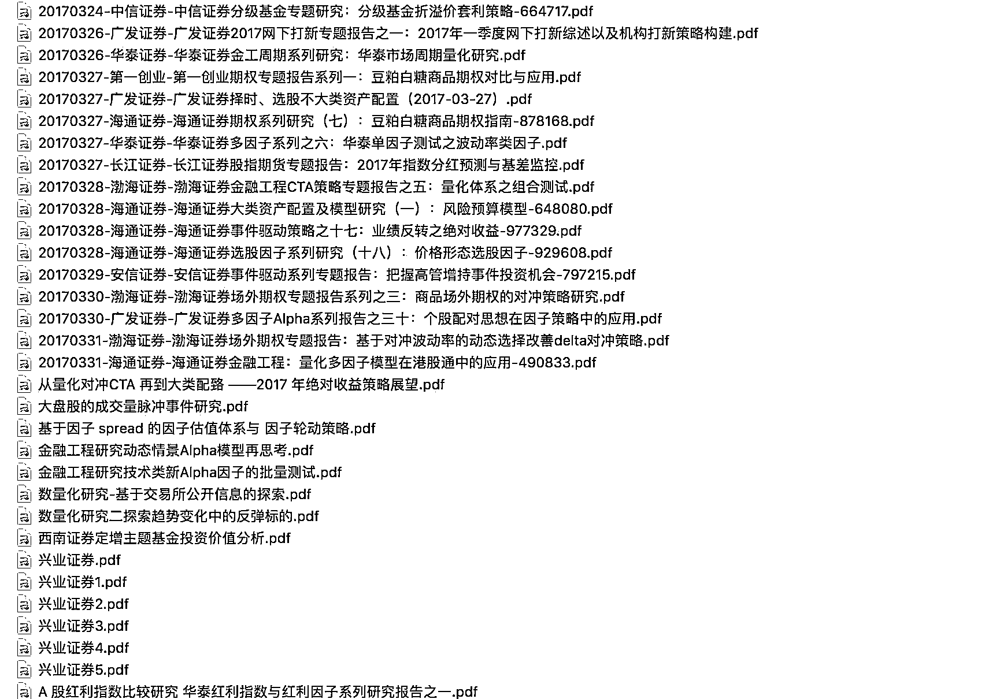

# 【年度干货】2017 上半年所有券商金融工程研究报告（一）

> 原文：[`mp.weixin.qq.com/s?__biz=MzAxNTc0Mjg0Mg==&mid=2653286032&idx=1&sn=f931e3de55ba425049553d524173b57e&chksm=802e2c85b759a5935002ab01161a92be5ba6c7a5ba64ad12d8be55490fa328973835008ab2dc&scene=27#wechat_redirect`](http://mp.weixin.qq.com/s?__biz=MzAxNTc0Mjg0Mg==&mid=2653286032&idx=1&sn=f931e3de55ba425049553d524173b57e&chksm=802e2c85b759a5935002ab01161a92be5ba6c7a5ba64ad12d8be55490fa328973835008ab2dc&scene=27#wechat_redirect)

**编辑部**

微信公众号

**关键字**全网搜索最新排名

**『量化投资』：排名第一**

**『量       化』：排名第一**

**『机器学习』：排名第三**

我们会再接再厉

成为全网**优质的**金融、技术类公众号

****

******编辑部声明****** 

****由于百度网盘经常出现连接失效、大家获取方式不便、文档保存提取的优化等一系列问题。很幸运，**DigQuant 点宽****社区**为我们提供了**依托于微软云的存储**。公众号从今天开始推出的所有的干货资料，全部会放在点宽社区上。便于大家下载浏览。****

****请大家**点击****阅读原文**（www.digquant.com.cn ）下载。****

******不需要任何乱七八糟的获取方式！！！******

****我们始终坚持****

******不让大家像别的公众号一样******

****通过朋友圈和微信群转发来获取干货****

******分享就是分享******

******就应该做到无偿******

****我们只不过做了****

****搬运工****

******今日分享******

****2017 上半年**所有券商******

******金融工程**研究报告****

******研报系列（1-3 月）******

********

********

********

******关注者******

******从****1 到 10000+******

******我们每天都在进步******

********

<fieldset class="96wx-bdc" style="box-sizing: border-box; border: 0px rgb(82, 154, 243); width: 472px; margin-top: 0.5em; margin-bottom: 0.5em; word-wrap: break-word !important;">******点击“阅读原文”，无条件获取研报。棒棒哒！******</fieldset>