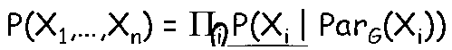
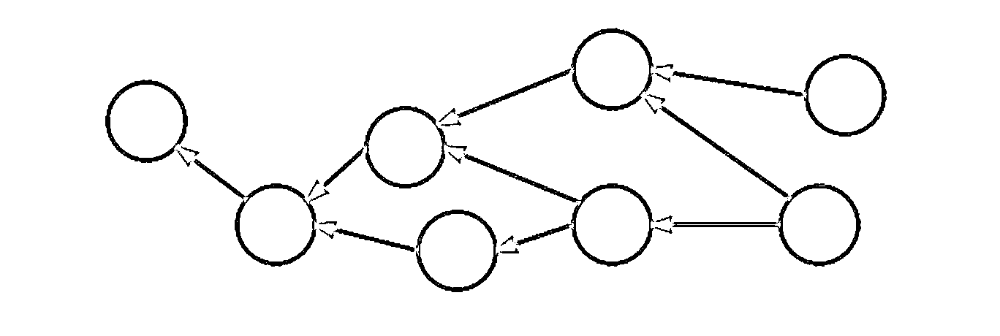
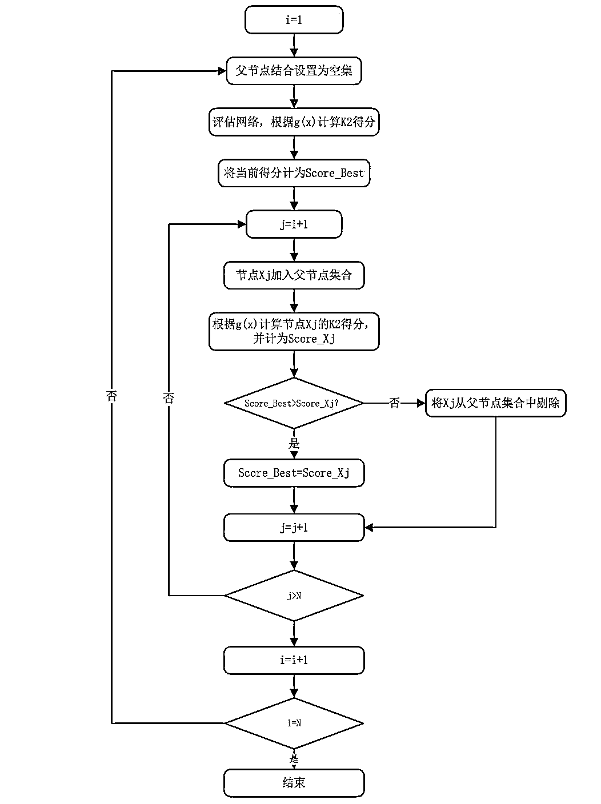
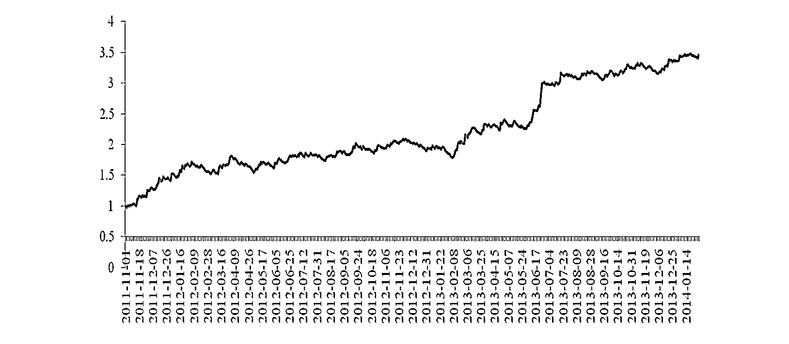
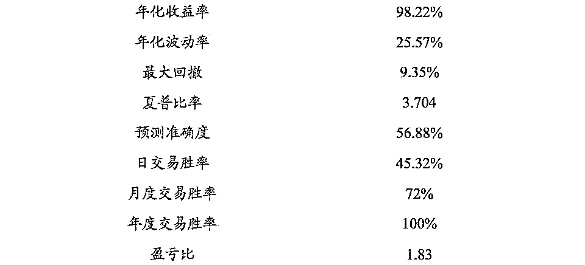
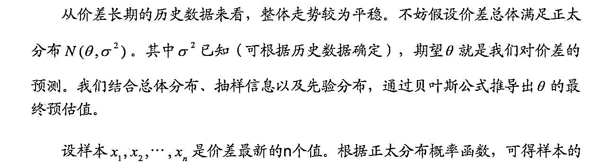
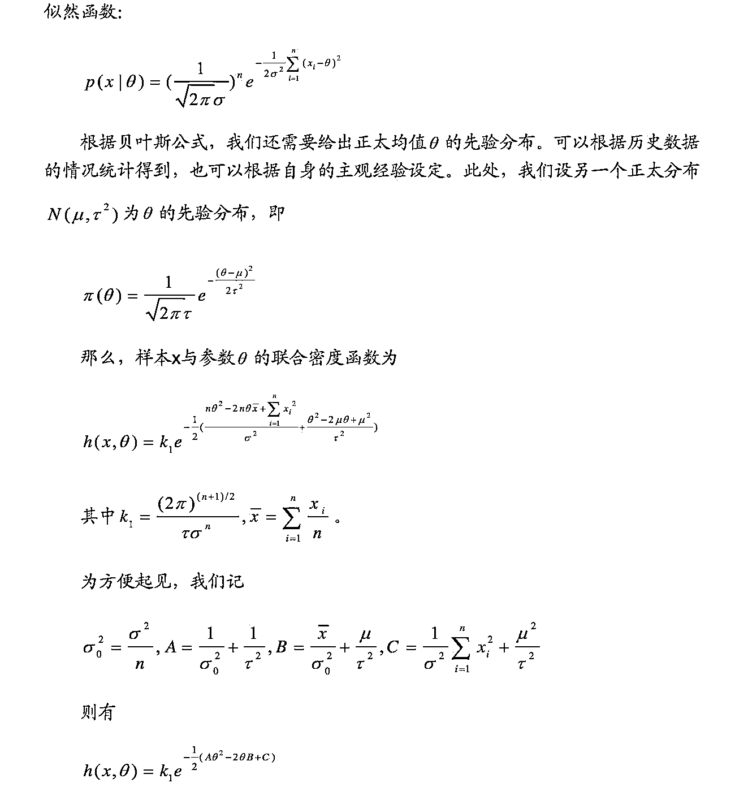
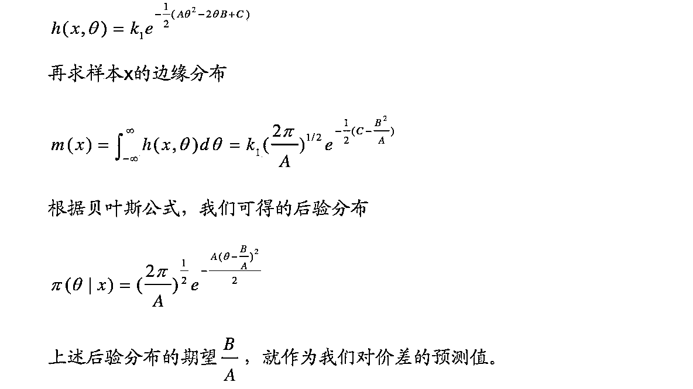
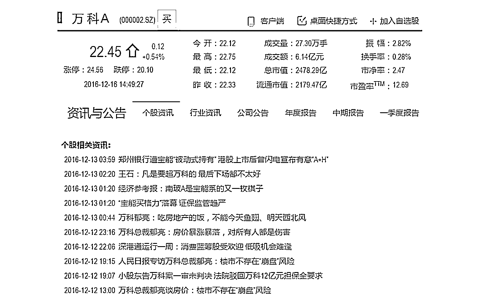
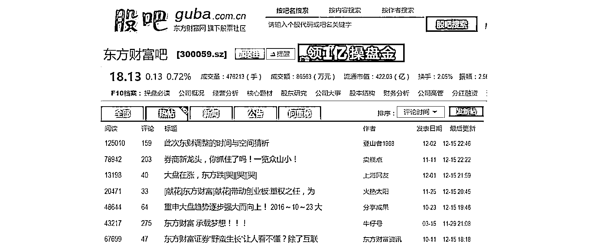

# 【贝叶斯系列】在研究机构如何应用贝叶方法论进行量化投资

> 原文：[`mp.weixin.qq.com/s?__biz=MzAxNTc0Mjg0Mg==&mid=2653286020&idx=1&sn=cb465abd1a4ec12b963d9156bb2f5498&chksm=802e2c91b759a58764ba11e486a84c563088e196b9ab7983e990d9303b688fcf800634af2769&scene=27#wechat_redirect`](http://mp.weixin.qq.com/s?__biz=MzAxNTc0Mjg0Mg==&mid=2653286020&idx=1&sn=cb465abd1a4ec12b963d9156bb2f5498&chksm=802e2c91b759a58764ba11e486a84c563088e196b9ab7983e990d9303b688fcf800634af2769&scene=27#wechat_redirect)

**编辑部**

微信公众号

**关键字**全网搜索最新排名

**『量化投资』：排名第一**

**『量       化』：排名第一**

**『机器学习』：排名第四**

我们会再接再厉

成为全网**优质的**金融、技术类公众号

**贝叶斯方法与量化投资**

**贝叶斯方法在量化投资中有哪些应用?**

*   股票分类

*   市场趋势识别

*   波动率估计

*   投资组合风险 

**股票分类**

*   构造投资组合的方法是买入好的 股票(未来收益率高)或卖出(空) 差的股票(未来收益率为负)

*   如何甄别好坏?

*   对股票进行打分或者分类。

*   贝叶斯分类器。 

**市场趋势识别**

*   有些投资策略在单边下跌行情中会无效， 因而，需要识别市场趋 势是上涨、下跌，还是震荡。

*   计算机直接识别趋势难度很大。

*   我们可以观察到各个策略收益率。

*   可否反推? 

**波动率估计**

*   很多策略依赖于市场波动才会生效，捕捉波动率很重要。

*   期权的盈利尤其依赖于波动率建模。

*   波动率建模比预测趋势更容易。

**投资组合风险 **

*   厚尾风险是否独立? 

**研究机构的应用**

国海证券：

CTA 交易策略基于贝叶斯网络概率推断

**解读分析：**

这篇研报引入了**贝叶斯网络**(Bayesian Network)，也称为信度网络 。目前不确定知识表达和 推理领域最有效的理论模型之一。 

**贝叶斯网络结构介绍：**

贝叶斯网络是一个有向无环图，其中结点代表了随机变量，边代表了随机变量之间的概率关系，其联合概率分布可以用贝叶斯链式法则来表示

其中 ParG(Xi)表示结点 Xi 在图 G 中的父节点对应的随机变量。

条件概率是指事件 A 在另外一个事件 B 已经发生条件下的发生概率。通常， 事件 A 在事件 B 发生的条件下的概率，与事件 B 在事件 A 的条件下的概率是不一样的，然而，这两者是有确定的关系。贝叶斯定理是关于随机事件 X 和 Y 的 条件概率和边缘概率: 

如果变量 X 的值依赖于变量 Y，那么变量 X 与变量 Y 的关系可以表示为:Y->X，其中 Y 可以称为 X 的父节点，X 称为 Y 的子节点。如果 X 有多个父节点，那么这些父节点的集合可以表示为:Set{X 的父节点}={Y1, Y2, Y3, ...}。 

贝叶斯网络和条件概率有着密不可分的关系。贝叶斯网络**是一种概率网络**， 利用图形化的方式进行决策分析，**是一种将因果关系和概率知识相结合的信息表示框架**。贝叶斯网络是**有向无环图**(Directed Acyclic Graph，DAG)，由代表变量节点及连接这些节点有向边构成。

构成一个完整的贝叶斯网络有**两个要素**：**节点**和有**向边**，其中，节点代表随机变量，节点间的有向边代表了节点间的互相关系，用条件概率进行表达关系强度，没有父节点的用先验概率进行信息表达。因此，对于具有不确定性的事件，我们可以依赖贝叶斯网络对事件做出有条件的推断。 

**概率网络：**

这个很好理解，即所谓的概率图模型（PGM）是一种对现实情况进行描述的模型。其核心是条件概率，本质上是利用先验知识，确立一个随机变量之间的关联约束关系，最终达成方便求取条件概率的目的。

**有向无环图：**

有向无环图（Directed Acyclic Graph, DAG）是有向图的一种，字面意思的理解就是图中没有环。常常被用来表示事件之间的驱动依赖关系，管理任务之间的调度。拓扑排序是对 DAG 的顶点进行排序，使得对每一条有向边(u, v)，均有 u（在排序记录中）比 v 先出现。亦可理解为对某点 v 而言，只有当 v 的所有源点均出现了，v 才能出现。 

经典的有向无环图的拓扑结构如下图所示：

**贝叶斯网络构建与训练**

对于一个未知的贝叶斯网络，通常有三种方法可以对其结构进行推断：(1) 专家知识；(2)从数据集推断；(3)前面两种方法的结合。在许多研究中，构建贝叶斯网络首先由专家知识直接给出条件概率表(CPT)，再根据 CPT 估计贝叶斯网络结构。但是，在很多情况下，对于特定贝叶斯网络结构，专家知识无法用于估算其中的条件概率。此时，如果有足够的数据集，可以网络参数学习的算法， 根据给定的数据集，对网络结构进行概率推断。

目前，关于贝叶斯网络参数学习的方法有很多种。在这篇研报中本用到的是 **K2 算法**。**K2 ****算法**由 Gregory F.Cooper 和 Edward Herskovits 在 1991 年和 1992 年的两篇文章中首次提出，该算法的基本原理是通过对不同的贝叶斯网络结构进行打分，从而对贝叶斯网络结构进行选择和推断。在 K2 算法中， 假设有一个节点没有父节点，如果该节点新增加的父节点可以增加该网络结构的评分，那么该新增节点则作为父节点加入网络中。换言之，在网络推断过程中，K2 按顺序逐一考察节点变量，确定父节点，然后添加相应的边和节点。当额外增加的父节点不能增加评分，则停止增加该节点的父节点。 

K2 算法评分函数定义如下: 

Nijk：样本数据中，当第 i 个节点(变量)的父节点为 j 的时候，该变量 为 k 的数据样本数量。

ri：第 i 个节点(变量)拥有的变量值上限。 

**贝叶斯网络工具箱 BNT**

贝叶斯网络工具箱 BNT 是 kevin p.murphy 基于 Matlab 语言开发的关于贝叶斯网络学习的开源软件包，提供了许多贝叶斯网络学习的底层基础函数库，支持多种类型的节点（概率分布）、精确推理和近似推理、参数学习及结构学习、静态模型和动态模型。

其中涉及 K2 算法如下：

调用函数：*learn_struct_k2()*

K2 算法(Cooper and Herskovits, 1992)是一种按如下方式工作的贪婪搜索算法。每一个起始点没有父节点。然后增加结果结构打分最高时的父节点。当单独添加父节点再不能提高分数时，停止添加父节点。当我们使用固定的顺序时，我们不需要做循环检查，也不需要为每个节点单独选择父节点。

BNT 推广了这点允许使用任何种类的 CPD，无论贝叶斯打分规则还是 BIC，另外，你可以对每一个节点指定一个任意的父节点数量的上限。

*order = [C S R W];*

*max_fan_in = 2;*

*dag2 = learn_struct_K2(data, ns, order, 'max_fan_in', max_fan_in);*

K2 算法计算流程图：

**策略模型变量选择**

根据已有信息，预测未来 K 线的变化。选择的变量数量越多，回溯的期数越长，引入的历史信息就会越多。但是我们认为指标的数量与预测精度并不成正比，这是因为引入越多的变量指标，可能会增加越多的噪声信号， 从而影响判断精度。 

自定义指标库 

| **序号**  | 名称  | 描述 |
| 1 | 收盘价 | / |
| 2 | 成交量  | / |
| 3 | 委比 | (委买数-委卖数)/(委买数+委卖数)  |
| 4 | K 线变化幅度 | 收盘价-开盘价  |
| 5 | 开盘价 | / |

除了上述 6 组指标，还可以引入其他的指标，如持仓量、最高价、最低价、KDJ、MACD 等。在完成指标选择之后，我们需要对指标进行处理，通过函数 将其转化为状态变量。 

出于简化模型的目的，在策略中，使用的状态变量为二元变量。转换函数定义如下: 

其中， rt 为变量 x 在时间 t 和时间 t-1 之间的变化率。通过上式，可以将所有变量转化为二元变量，且消除了单位的影响。 

**策略实施步骤**

交易策略的基本原理是：首先利用已有的数据集对贝叶斯网络进行推断，然后将最新的变量数据代入网络中，对未来的 K 线走势进行预测，再根据预测的概率结果，产生相应的交易信息号。此外，为了充分利用历史经验，我们为贝叶斯网络不断补充新知识，并实时更新结构。然而，必须要注意的是数据缺失会使 K2 算法失效。因此如果出现数据确实的情况，我们就需要使用替代算法，如最大期望(Expectation Maximization，EM)等，数据缺失的交易策略暂不在考虑范围之内。 

主要测试沪深 300 股指期货主力合约。策略的目的在于判断 K 线的收盘价和开盘价之间的相对位臵，从而获取两个位臵差之间的收益。

中信建投证券：

机器学习之贝叶斯文本分类算法的实现 

**解读分析：**

**这篇研报用的思想是在****贝叶斯统计**下的一些研究。

**贝叶斯统计**最基本的一个观点是：任一个未知量 x 都可看作一个随机变量，应用一个概率分布去描述对 x 的未知状况。这个概率是在抽样前就有的关于 x 的先验信息的概率陈述，称为**先验分布**。

**贝叶斯统计**的另一个基本概念是**后验分布**。后验分布是根据样本分布和未知参 数的先验分布，用概率论中求条件概率分布的方法，求出的在样本已知下，未知参数的条件分布。因为这个分布是在抽样以后才得到的，故称为后验分布。贝叶斯推断方法的关键是任何推断都必须且只须根据后验分布，而不能再涉及样本分布。 

具体的贝叶斯推到公式网上很多，就不在这里阐述了。放一个贝叶斯公式就可以啦！ 

**BSW 套利策略**

**价差波动特点分析**

套利交易的本质是价差交易，对于价差走势的准确预判是套利成功的关键。不管是均值回复型的套利策略，还是趋势型的套利策略，其**本质都是预判未来价差将处于一个特定的水平，从而结合当前价差情况来执行套利。 **

**价差波动大的情况：** 

首先， 价差的波动较大，对于价差的震荡重心较难把握。根据历史数据得到的“价差均值”往往在下一时间段不适用。 其次，价差的波动区间也不稳定。

**价差稳定的情况：**

套利策略会面临“无利可套”的困境。

因此，需要对价差的未来走势做出更准确的预估。当价差的短期走势与长期走势出现较大变化时，我们需要做出调整，平衡两种信息，以得到更好的预判。 为此引入贝叶斯统计学，看看可以在套利方面做些什么。 

**贝叶斯统计在价差预测上的应用**

**BSW 套利策略**

根据贝叶斯公式，对未来价差做出预测后，接下来的工作就简单了。对比当前价差与预测价差，如果当前价差明显低于预测价差，我们就做多价差；反之， 则做空价差。待价差达到预测值后，平仓离场。该种套利策略我们称之为 BSW 套利策略。 

**BSW 套利策略的详细步骤：** 

**第一步**，根据贝叶斯公式预测价差，求得预测值 ES；

**第二步**，产生套利信号。对比当前价差 S0 与预测值 ES，记套利成本为 Fee，期望收益为 r，则按如下情况产生套利信号(1，表示开多仓，做多价差；-1，表示开空仓，做空价差)：

**第三步**，盘中监控与平仓。开仓后，将最新观察的数据纳入样本中，根据贝叶斯公式更新价差预测值 E S ' 。如果最新价差 S ' 

中信建投证券：

机器学习之贝叶斯文本分类算法的实现 

**解读分析：**

这篇研报用的思想**自然语言处理(NLP) 、****朴素贝叶斯分类模型**、**大数据**。

他们从以下几个方面获取数据：

**财经新闻指数**

个股新闻指数：每支股票每天对应的新闻总数。

个股情绪指数：个股情绪新闻正负面加权汇总。 

宏观经济指数：通过财经文本分析，得到新闻正负面，构建加权宏观经济指数等。 

**股吧相关指数**

个股舆情指数：统计个股相关舆情，判断正负面，加权汇总。  

个股每日股吧指数：个股相关每日帖子总数。 

个股每周股吧指数：个股相关每周帖子总数。

**微信公众号指数**

个股每日微信推送指数：个股每日被所有相关机构微信公众号推荐总次数。

微信每日推荐个股指数：所有相关机构微信公众号每日推送个股数总数。

**微博相关指数**

个股每日微博指数：个股相关每日微博总次数。 

个股官方微博指数：个股官方微博文章总数量  

个股高官微博指数：公司高管在微博发文总数及情绪加权汇总。

**公司关注度指数**

个股搜索指数：个股每天被百度，搜狗等主流搜索引擎被搜索次数总和。  

个股访问热度指数：个股行情被用户访问总数。  

个股新闻点击率指数：个股新闻被点击总数。

**其它相关指标**

商个股销量指数：淘宝，京东等电商个股相关商品金额总数。  

电商行业销量指数：淘宝，京东等电商行业相关商品商量总数。

电商个股综合指数：淘宝，京东等电商个股相关商品的浏览量、点击量、客户评价、客户收藏量等基础数据的综合指标。 

电商行业综合指数：淘宝，京东等电商行业相关商品的浏览量、点击量、客户评价、客户收藏量等基础数据的综合指标。 

银联消费指数：银联刷卡相关个股或者行业数据组成的指标。 

**贝叶斯文本分析原理**

朴素贝叶斯算法假设前提：在给定目标值时属性值之间相互条件独立。 贝叶斯方法的新实例分类目标是在给定描述实例的属性值(A1,A2...An)下，得到最可能的目标值 V。

V = arg maxP(B[j]/ A1,A2...An)

根据贝叶斯公式:

V = arg maxP(A1,A2...An /B[j]) * P(B[j]) / P(A1,A2...An)

由于 P(A1,A2...An)是不依赖于 B[i]的常量，故简化为:

V = arg maxP(A1,A2...An /B[j]) * P(B[j])

因为属性值之间相互条件独立，即联合 A1,A2...An 的概率等于每个单独属性的概率乘积:

Vnb = arg maxP(B[j])* ∏P(Ai | B[j]) 

其中 i 为 1 到 n。Vnb 表示朴素贝叶斯输出的目标值。 

**朴素贝叶斯分类模型**

**1) 多元分布模型(muiltinomial model)**

多元分布模型以单词为粒度，不仅仅计算特征词出现/不出现，还要计算出现的次数。另外多元分布模型实 际中分别还可用 tf-idf ,Bool(Bool 表示某个单词是否在某个文档中出现，如果出现则记为 1，否定则记为 0)。BOOL 型特征下的向量空间模型更适合做情绪分类。以下公式以单词出现次数为例。

类条件概率: 

P(A1|B[0]) = (Na+1)/(n+N) 

其中: Na 为类 B[0]下单词 A1 出现在所有文档中的次数之和

n 为类 B[0]下特征词总数 

N 为训练样本中不重复的特征词总数 

先验概率: 

P(B[0]) = 类 B[0]下单词总数 /训练样本中的特征词总数 

**2) 伯努利模型**

伯努利模型以文件为粒度。 

类条件概率: 

P(A1 | B[0]) = (类 B[0]下出现 A1 的文件总数 + 1) / (类 B[0]下的文件总数 + 2)

先验概率: 

P(B[0]) = (类 B[0]下的文件总数) / (整个训练样本文件总数)

以上两种模型的类条件概率分子中加 1，原因是待分类文本中的属性可能样本中没有，会导致条件概率为 0 的 情况. 贝叶斯公式推导前提各个特征不能为 0。因此实现上通常要做一些小的处理，例如把所有计数进行+1(加 法平滑(additive smoothing，又叫拉普拉斯平滑(Laplace smothing))。而如果通过增加一个大于 0 的可调参数 alpha 进行平滑，就叫 Lidstone 平滑。 

**朴素贝叶斯应用**

在新闻分类中，目标集由 B[0],B[1]组成。其中，B[0]为负面，B[1]为正面。属性值(A1,A2...An)即为新闻文本经过分词后的结果。比如:

(A1,A2...An)=(开盘 ，万科， 再 ，出现 ，大涨 ，态势， 涨幅， 一度 ，超 ，股价， 最高， 达元，创出， 多年， 新高， 有所， 回落 ，发稿 ，时 ，成交量， 接近)共 21 个属性值。 

根据前面需要得出 Vnb = arg maxP(B[j])* ∏P(Ai | B[j])。需要依次求出 P(Ai | B[j])及 P(B[j])，然后相乘，最大值取为该文本的分类结果。

比如“负面”先验概率 P(B[0]) = 类“负面”下特征词总数 /训练样本中的特征词总数

比如，“开盘”在为类“负面”的条件概率为:

类条件概率 P(A1 | B[0])=p(开盘|负面) = (类“负面”下单词“开盘”出现在所有文档中的次数之和+1)/( 类 “负面”下特征词总数 +训练样本中不重复的特征词总数)。

同样可以求出剩下的属性特征词，(万科， 再 ，出现 ，大涨 ，态势， 涨幅， 一度 ，超 ，股价， 最 高， 达元， 创出， 多年， 新高， 有所， 回落 ，发稿 ，时 ，成交量， 接近)

得出由这些属性值组成的新闻文本归类为“负面”的概率为:
V0 = P(B[0])* P(A1 | B[0])* P(A2 | B[0])*...* P(A21 | B[0])

同样的方法，求出由这些属性值组成的新闻文本归类为“正面”的概率为:

V1 = P(B[1])* P(A1 | B[1])* P(A2 | B[1])*...* P(A21 | B[1])

最后，比较 V0 与 V1 的大小,若 V0>V1,则该新闻文本应该归类为负面。否则为正面。 

**关注者**

**从****1 到 10000+**

**我们每天都在进步**

