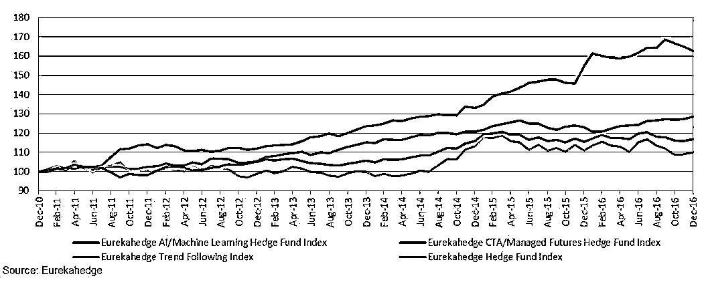
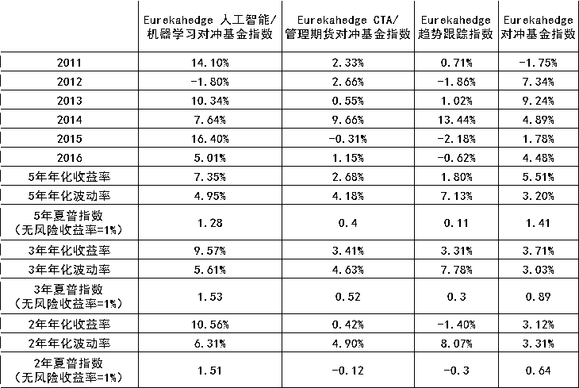
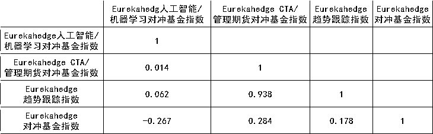
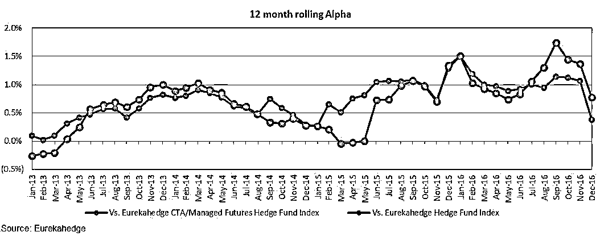
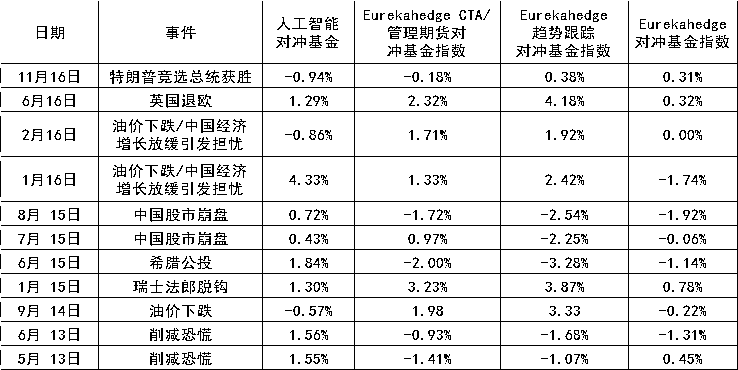

# 【精选】关于用 AI 搞金融这件事，瞎 BB 吹上天没用，听听实战的人怎么说

> 原文：[`mp.weixin.qq.com/s?__biz=MzAxNTc0Mjg0Mg==&mid=2653286001&idx=1&sn=43abeddf045ce5f9499aedf59a0f23a5&chksm=802e2c64b759a572532bf97cbdcac2406106d05bbc3808d6d19ac80bd37a42cbdb20fdd217a6&scene=27#wechat_redirect`](http://mp.weixin.qq.com/s?__biz=MzAxNTc0Mjg0Mg==&mid=2653286001&idx=1&sn=43abeddf045ce5f9499aedf59a0f23a5&chksm=802e2c64b759a572532bf97cbdcac2406106d05bbc3808d6d19ac80bd37a42cbdb20fdd217a6&scene=27#wechat_redirect)

**编辑部**

微信公众号

**关键字**全网搜索最新排名

**『量化投资』：排名第一**

**『量       化』：排名第一**

**『机器学习』：排名第四**

我们会再接再厉

成为全网**优质的**金融、技术类公众号

> 金融学理论和计算机技术的不断革新，带来了基于数据处理与数据分析的量化投资策略的蓬勃发展，量化模型成为了预测市场和指导投资的有力工具。然而证券市场是一个复杂的非线性动力系统,利用传统的时间序列预测技术存在很大的局限性。好在，近十几年发展起来的神经网络预测理论的发展，在对非线性系统的预测和建模中表现突出，那么神经网络的应用能带量化模型飞吗？利用人工智能进行投资到底靠不靠谱？
> 
> 本文为实例数据+解答，通过对 Simplex Asset Management 的经理 Yoshinori Nomura12 大追问，带你一探究竟。

过去十年间，量化对冲基金策略吸引了交易员极大的兴趣，运算能力的不断提高与大数据的广泛应用使得此类系统化交易模型可以充分利用市场无效性获得收益。

但因为隐性交易成本的存在，识别并利用市场无效性获利并非易事。更为遗憾的是，此种交易模式目前还存在两大症结：

*   **首先，在历史数据的基础上通过回溯测法构建而来的交易模型通常不具备实时性（先前已经识别出的趋势在此失效）；**

*   **其次，同质化的量化模型严重地挤压了交易空间，从而影响着此类策略的收益。**

对于后者，交易员可以通过**使用处理速度更快的计算机（高频交易的竞争）**从而在交易策略中脱颖而出，但**第一个问题才是变革量化交易的关键**，因为交易模型正在从“识别出发展趋势”（通过回溯测法）向实时“预测和适应”（通过前向检验等方法）逐渐过渡——也就是，**在对冲基金量化交易中引入人工智能（AI）和机器学习。**

人工智能在对冲基金业中的应用尚且处于初期阶段——部分对冲基金经理允许人工智能参与其交易流程的部分环节（保留对投资和风险管理的人为控制权）；与此同时，“纯人工智能对冲基金”则将交易和风控都外包给机器，基金经理极少干涉。然而，人工智能却在对冲基金资应用中表现出很大的**不确定性**，这在其他行业中也有印证，例如，交通运输业中，完全自我的自动驾驶汽车目前仍未获准上路。

如何向投资者成功地展示计算机自我意识的学习能力？如何展示其在对冲基金领域的可靠性和盈利性？

这是个很大的挑战。

在接下来的文章中，**我们会对交易流程中应用人工智能和机器学习理论的对冲基金的表现作出讨论**，并且还会附上我们对 Yoshinori Nomura 先生（Simplex Asset Management 公司的经理）的采访。在采访中，Yoshinori Nomura 不仅分享了他的纯 AI 投资策略的具体细节，还发表了他对人工智能在对冲基金领域发展前景的看法。

图 1 将 Eurekahedge 人工智能/机器学习对冲基金指数分别与传统的量化对冲基金（由 Eurekahedge CTA/管理期货基金指数和其系统化趋势跟踪交易者的子集表示）和传统对冲基金（由 Eurekahedge 对冲基金指数反映）作对比。从图中可以看出，自 2010 年起，人工智能/机器学习对冲基金的表现便一直优于传统的量化对冲基金和普通对冲基金，年收益率为 8.44%，高于 CTA（2.62%）、趋势跟踪交易者（1.62%）和普通对冲基金（4.27%）。即使是在波动非常剧烈的 2016 年，人工智能/机器学习对冲基金的年收益率仍然超过 5.01%，高于普通全球对冲基金（4.48%）以及表 1 中列出的其他基金。

图 1：人工智能/机器学习对冲基金对比量化对冲基金和传统对冲基金

<inherit style="max-width: 100%; box-sizing: border-box !important; word-wrap: break-word !important;"></inherit>

表 1 总结了人工智能/机器学习对冲基金相对于其他基金的某些关键性能数据。重要的结论包括：

*   除 2012 年之外，人工智能/机器学习对冲基金在其他年份中的表现都优于普通的全球对冲基金。

*   除 2011 年和 2014 年之外，人工智能/机器学习对冲基金在其他年份的收益率都高于传统的 CTA 基金/管理期货策略，并且只有 2014 年度的收益率低于系统化趋势跟踪策略（短线能源期货交易为该策略的收益率带来了强劲的增长）。

*   人工智能/机器学习对冲基金五年、三年和两年的年化收益率分别为 7.35%、9.57%和 10.56%，高于传统的量化对冲基金和普通的全球对冲基金。

*   与下表中列出的其他基金相比，人工智能/机器学习对冲基金过去两年和三年的风险调整后收益更高，夏普比率分别为 1.51 和 1.53。

*   与普通的对冲基金相比（对比 Eurekahedge 对冲基金指数），虽然人工智能/机器学习对冲基金的收益率更加不稳定，但是其年化波动率却要比系统化趋势跟踪策略低得多。

表 1：业绩数据——人工智能/机器学习对冲基金对比量化对冲基金和传统对冲基金

来源: Eurekahedge

表 2 给出了人工智能/机器学习对冲基金与其他几种基金的相关矩阵。依据该表，我们可以得出一个有趣的结论：人工智能/机器学习对冲基金与普通对冲基金之间为负相关关系（-0.267），而与 CTA/管理期货基金和趋势跟踪策略之间则为正相关关系，相关系数介于零和零点几之间。这表明，人工智能/机器学习对冲基金的分散投资可以使整个投资组合实现正收益。

表 2：相关矩阵

来源：Eurekahedge

图 2 给出了人工智能/机器学习对冲基金相对于 CTA/管理期货对冲基金和普通全球对冲基金的 12 个月的 rolling alpha（假设无风险收益率为 0 时的超额收益率）。Alpha 值大体上都为正数，2016 年人工智能/机器学习对冲基金相对于 CTA/管理期货对冲基金和普通全球对冲基金的 12 个月的 alpha 分别为 0.38%和 0.78%。这表明，人工智能/机器学习对冲基金可能同时拥有人工智能/机器学习模型的优势与对比策略过度拥挤（萎缩的 alpha）的特性。

图 2: 相对于量化对冲基金和传统对冲基金的 12 个月的滚动 alpha

表 3 给出了人工智能/机器学习对冲基金与其他类型的基金在近期的市场压力下的表现，并且对不同策略在市场波动期间实现正收益的能力做出了衡量。重要的结论有： 

*   在表中列出的 11 个月度风险事件中，人工智能/机器学习对冲基金仅在 3 个事件中出现了亏损的情况，在几种基金中的表现最好。相比之下，普通全球对冲基金在其中 7 个事件中都有亏损。

*   在表 3 列出的几个特殊风险事件（如特朗普竞选总统获胜和英国退欧）中，人工智能基金的表现虽然参差不齐，但仍优于其他几种基金。未来，人工智能在应用性及学习能力等方面的提升或许会让上述结果变得更好，但 2016 年 11 月（特朗普竞选总统获胜）的亏损表明，利用机器来预测未来具有明显的局限性。

表 3：人工智能/机器学习对冲基金在重要的市场风险事件中的收益率

来源：Eurekahedge

完全由人工智能来驱动基金公司到底行不行？这里有一个实例采访。采访对象是 Simplex Asset Management 有限公司经理 Yoshinori Nomura，12 大追问，详细细节透露，人工智能是如何完全取代人做投资的**。**

Simplex Asset Management 有限公司创立于 1999 年，是日本的一家独立的对冲基金和投资管理公司。截至 2016 年 9 月，该公司的资产管理规模（AMU）已达 5070 亿日元。

**1\. 您好，请向我们的读者稍微介绍一下您自己。您为什么要成立一家完全由人工智能（AI）驱动的对冲基金公司呢？您第一次产生这种想法是在什么时候？**

我曾在早稻田大学读书，主修非线性非平衡统计力学，随后获得物理学硕士学位，这为我的投资策略提供了灵感。硕士毕业后，我加入了隶属野村证券集团（Nomura Securities）的野村综合研究所(Nomura Research Institute)担任企业顾问，任职期间我处理了大量的数据挖掘项目和需求预测项目。2008 年加入 Simplex Asset Management (SAM)之前，我还曾在埃森哲(Accenture)和花旗环球金融有限公司(Citigroup Global Markets)任职。  

在 SAM 担任投资组合经理期间，我使用了日本股市的由量化基金驱动的市场中性策略，这种策略使用的是非常传统的多因素模型，它的表现并不像我预期的那样好。因此，我开始探索利用回溯测试得到的模型无法正常工作的原因以及如何才能得到可信的模拟结果。以下是我进行探索的基本前提：

（1）模型应尽可能简单；

（2）定价模型应该像物理学一样具有某些占支配地位的动力学因素；

（3）除了具备预测能力，模型还必须能够学习并适应市场环境的变化。创建新的数学模型需要具备多年的物理学理论应用经验，另外还需应用人工智能/机器学习方法论以实现学习和适应功能。

我相信，有很多人并不完全认同资本资产定价模型（CAPM）和多因素模型可以作为科学的定价模型。于是，我开始大胆地尝试构建某种替代模型，用以反映真实市场动态的不同特征。这就是我创造这个完全由人工智能驱动的策略的原因。

**2\. 推行这种处在基金管理业前沿的利基策略有多难？**

在创造出这个策略之后，我花了几年的时间才找到了一位种子投资者。我猜一半是因为之前因投资量化策略而赔钱的投资者太多了，一半是因为“人工智能”对于银行这一类的机构投资者来说太过前卫，无法在内部投资委员会获得支持。最重要的是，这种策略既没有真实的历史数据，也没有类似的人工智能策略可以作为对比。因此，正如我后文一再强调的那样，“前向检验”（Walk Forward Test）对于说服投资者相信这种策略的优点至关重要。

**3\. 我们的研究表明，业内的纯人工智能对冲基金只有少数几家，其他基金的投资模型在机器学习理论方面的应用都有所局限。那么，人工智能应用当前在对冲基金领域的性质是什么？在众多系统化策略中选择应用这种策略的主要挑战有哪些？**

当前，人工智能技术代替人类完成常规工作已经成为一种趋势，它可以快速、精确地完成任务，而且不会疲倦。例如，通过比较先例、阅读财务数据或分析报告来找出众多公司业绩数据间隐含的因果关系，以此来预估新闻公告对股票价格的影响。对推特文章进行文本挖掘以找出股票价格和某些文字之间的关系，等等。这几种实用的先进技术只是对人工智能的部分应用，不能被归为纯粹的人工智能策略。

另外，传统的系统化投资者也可以使用人工智能。这些投资者通常需要同时监测大量的指标，借此预测市场方向。他们也可能应用人工智能/机器学习方法寻找指标走势图的最佳组合，以此来作出预测。这种方法有时被称为“实证技术分析”（Evidence Based Technical Analysis）。

**人工智能可以轻易地找出模式之间的最佳关联，但是这种关联也可能是能够造成巨大损失的错误关联。原因在于：**

（1）机器无法学习指标之间因果关系的意义；

（2）人类可能无法理解机器学到的知识，也无法判断出这些知识是否有意义；

（3）可能没有原因或证据可以证明某些特定指标可以预测未来。

因此，如果完全由人工智能驱动的系统化策略无法工作也不足为奇。至少根据我的了解，还没有学术研究能解决“无意义学习”这个问题。

**4\. 由人工智能驱动的 Simplex 股票期货策略是如何克服这些挑战的？您能分享一下这种策略的某些细节信息吗？与传统的系统化策略相比，基于人工智能的投资策略相是有优势的，您能举一个由人工智能完成的交易过程来说明其优势所在吗？**

为了避开之前提及的无意义学习问题，我先用物理学的相关理论为模型答案赋予先验意义。价格运动方程是用来描述市场的支配动态，例如东证股价指数(topix)。由于物理学追求的是简单和通用性，我着重描述金融市场中简单且普遍的现象，也就是众多投资者在市场上进行交易时自然观察到的动量和均值回归。模型的输入数据为一系列按时间顺序排列的历史价格，动量指数和均值回归指数均由此得到。为了根据当前的市场环境调整运动方程，需要使用人工智能/机器学习方法。  

一般而言，CTA 通常会运用趋势跟踪策略，这种策略在市场中出现强劲动量时表现不错，但是在均值回归环境中的表现却很糟糕。反趋势跟踪策略与之恰好相反。我们的策略会同时考虑动量和均值回归，因此它能根据上述两种市场状况作出相应的调整。

至于基于人工智能的策略相较于传统系统化策略的优势，人工智能模型可以设置使模型每天自动学习和调整的函数，即使在市场环境发生改变的情况下也可以维持预测能力；传统的系统化策略通常无法如此频繁地改变模型的内部参数，因为人类分析师往往至少需要几个月的时间才能找出新的参数集，因此也就无法及时赶上快速变化的市场动态。

**5\. 什么是“前向检验”？它是如何训练模型维持预测能力的？**

 “前向检验”（WTF）是一种检验量化策略可持续预测能力的方法，可用来替代回溯检验。新型量化策略常常受困于诸如“鸡生蛋还是蛋生鸡”这样的问题，很难说服投资者相信：好的回溯检验结果不会在实时预测中失效，也不会遭遇典型的“回溯测试背叛”现象。  

前向检验可以避免“回溯测试背叛”现象，直接评估新量化模型预测能力的可持续性。由于量化分析师可以在第一时间得知市场结果并且在回溯检验期间选择最佳的交易策略组合以使结果看起来最好，因此好看的回溯检验结果可能不可靠，此种形式的“优化”通常不能赋予模型预测能力。

另外，前向检验的结果依据的仅仅是模型的预测情况，而模型在预测时不会涉及任何有关未来的信息。前向检验使用的是历史时间序列（如过去 20 年），模型首先回溯观察某段时期（例如从 19 年前回看 1 年），以学习当前（如 19 年前）的市场状况并作出相应调整。接下来，模型会预测未来的市场状况以及短期（如一周）的交易。在交易的收益/损失确定之后，模型再次回溯观察同一时期的数据以更新其预测能力，并且一直重复这个过程，直到观察完整个历史数据。如果模型没有预测能力，前向检验的结果会十分糟糕；但是如果检测的结果表明收益在一段时间内维持稳定，那么很难判定模型没有任何预测能力，因为所有的结果都是由预测得出的。

不论是何种原因，如果我们认为一个历史交易记录良好的人类交易员具备可持续的预测能力，那么拥有良好的前向检验结果的人工智能模型也是可以做到的。

**6\. 平均而言，一天可以进行多少交易？模型的投资机会有多大？您能否详细介绍一下这种策略的最大/最小总风险敞口？**

我们每天进行两次交易，分别在日本股市开市和闭市时进行。当前的策略最多可以完成 5 亿美元的交易量。最大总风险敞口为资产净值的 200%，最小为 0%，净风险敞口在资产净值的-100%至+100%之间变动。

**7\. 在进行选择和优化以得出最佳交易的过程中，机器预测正确的几率有多大？除了投资者通常会观察的基金实际表现，是否存在评估机器选择最佳交易的能力的性能指标？**

前向检验表明，月成功概率为 60%，收益率为+2%；月失败率为 40%，收益率为-1%。人工智能模型的判定评估器（conviction evaluator）可以给出每项交易的成功概率的大小。 

**8\. 您的模型在哪种市场环境下表现最佳，在哪种市场环境下表现最差？人类学习历史数据的能力很差，机器学习成功的概率是否更大些呢？机器预测受特殊事件（如日本政府年金投资基金购买国内股票 ETF、英国退欧或者特朗普竞选总统获胜）影响的程度是否和人为预测一样？**

模型学习的是价格的历史时间序列。因此，如果当下的市场环境与先前一段时间内的环境相一致，模型就应该是有效的。显然，模型无法预测到任何的特殊事件，如自然灾害、公投或政治变动等，但是这对人类来说也很难预测。人工智能的优点在于没有任何认知上的偏差，在诸如英国退欧这样的重大特殊事件中，认知偏差会使人们丧失理智，迫使人们在不理想的时间点进行交易。对于这些市场中间或发生的特殊事件，不同的人由于认知偏差会做出不同的反应。但是，无认知偏差的人工智能也许能够避开人们的主管认知只学习市场对突发性混乱的反应。

**9\. Eurekahedge 的研究表明，人工智能/机器对冲基金在英国退欧造成的市场混乱中的表现优于其他基金，但是却在特朗普获选美国总统后的 11 月出现了亏损。根据您管理的基金在这两段时间内的经历以及您对前向检验（WFT）的研究，您如何解释这两个截然不同的结果？**

英国退欧和特朗普获选总统这两个事件都使投资者乐观的预期落空了，但是投资者在两事件发生之后的反应却不同。我不知道其他对冲基金在这两个事件中的想法和采取的措施，但是我推测可能有两种原因。如果他们是趋势跟踪型人工智能，在英国退欧之前，短期趋势看起来呈下行态势，因此在英国退欧事件中持空仓是合理的做法；而在特朗普获选事件中，短期趋势则呈上升态势。 

在这两个事件中，相反的趋势可能会带来不同的结果。第二个原因更加复杂。人工智能可能学习过以前发生的消极突发事件，这种事件（包括英国退欧）发生之后通常伴有股市的再次下跌。因此在英国退欧事件中，人工智能似乎更容易成功预测市场动态。

但是在特朗普获胜事件中，股市二次下跌的情况并未发生，反而呈现出了单向上升的趋势。我认为人工智能模型以前没学过这种动态。我所在的基金的人工智能模型也有相同的问题，但是前向检验研究表明，人工智能学习了特朗普获选事件后现在已经能够更好地处理相同的状况。这就是人工智能适应市场环境变化的一个实例。

**10\. 这个策略是如何管理和降低风险的？作为基金经理，您干预模型的频率是多少？如果人工智能遇到完全出乎意料的市场环境，您是否会考虑“关掉机器”？**

人工智能模型具有风险管理功能。在无法准确确定方向时，模型会自动展开目标敞口。我们并未制定任何固定的硬性限制止损规定，但是人工智能模型可以根据市场形势自动调整目标敞口。我从未干预过人工智能模型，也不计划这样做，因为人类的判断会受到认知偏差的影响，而且在突发状况中尤为严重。人工智能技术一直在发展，未来的人工智能模型也会得到改进，我们会使其能更加灵活地应对意外的突发性市场变化。 

**11\. 投资者如何看待您的这种特殊策略？他们对这种策略有哪些共同的顾虑？**

我认为很多投资者都对我们的简化应用非常感兴趣，例如使用只有两个因素（动量和均值回归）的单一输入时间序列来预测未来，这种应用每天只进行两次交易。与此同时，我认为量化交易专家尤其对前向检验感兴趣，因为他们知道创建出能够通过前向检验的模型有多难。 

但是，我们的基金于 2016 年 4 月才开始运作，时间很短，能够记录到的数据也少，是我们所面临的最大挑战。即使前向检验显示的结果良好也无济于事，因为许多投资者都对公司的实际运作时间有所限制。

**12\. 最后，人工智能在对冲基金业有什么前景？由于机器能确保客户投资的安全，基金经理将来是不是就可以毫无压力的去度假了？**

人工智能在对冲基金领域中的作用会大幅增强——这是必然的结果。人工智能或机器会接管大部分常规工作，传统的量化策略将被人工智能所取代。同时，它还会负责完成部分自下而上的分析工作。现在，人工智能或机器已经开始取代交易员的工作了。

但是，人工智能的主管基金经理可能还不能在沙滩上享受假期，因为市场上随时都会出现更强大、更聪明的人工智能交易。

**关注者**

**从****1 到 10000+**

**我们每天都在进步**

