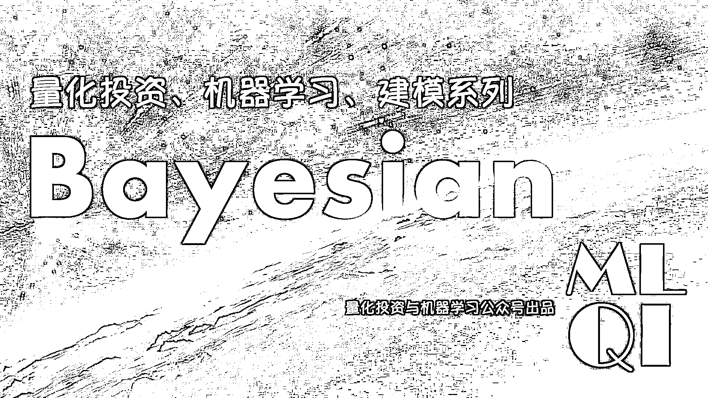
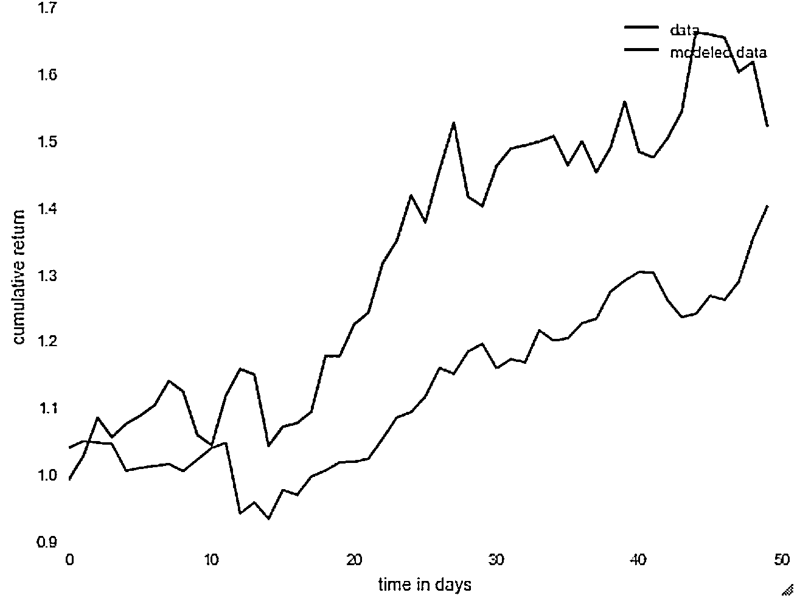

# 【贝叶斯系列】预测未来回报的交易算法基于 Bayesian cone

> 原文：[`mp.weixin.qq.com/s?__biz=MzAxNTc0Mjg0Mg==&mid=2653285993&idx=1&sn=947342ffc975d30f493e27ceef4a6696&chksm=802e2c7cb759a56a7863076145447a63efbac132849f4415f440791ac60ab40eb882f2b676a9&scene=27#wechat_redirect`](http://mp.weixin.qq.com/s?__biz=MzAxNTc0Mjg0Mg==&mid=2653285993&idx=1&sn=947342ffc975d30f493e27ceef4a6696&chksm=802e2c7cb759a56a7863076145447a63efbac132849f4415f440791ac60ab40eb882f2b676a9&scene=27#wechat_redirect)



**编辑部**

微信公众号

**关键字**全网搜索最新排名

**『量化投资』：排名第一**

**『量       化』：排名第一**

**『机器学习』：排名第四**

我们会再接再厉

成为全网**优质的**金融、技术类公众号

> 编译：watermelon、西西
> 
> 作者：Thomas Wiecki

1

**前言**

在评估交易算法时，我们通常可以使用样本外的数据，以及真实交易数据去进行评测。评测策略最大的问题是，它有可能是过度拟合的，在过去的数据上表现很好，但在样本外或者未来的真实行情数据中表现一般。今天，公众号编辑部编译了这篇来自 Q-blog 的文章，也**加进了我们自己的一些见解和对文章专业知识的解释**，来告诉大家使用贝叶斯估计预测未来可能的回报。

2

**预测模型可以得知什么**

建模计算总会带来一些风险，如估计不确定性，模型错误指定等错误。 根据这种风险因素，模型预测并不总是 100％可靠。 然而，即使预测不完美，模型预测仍然可以用于提取有用的算法信息。

例如，将交易算法应用于未知市场数据产生的实际结果，与我们已有模型生成的预测进行比较，可以让我们知道该算法是否按照预测的方式进行反演，或者是否过度依赖过去的数据。这样的算法可能具有最佳的回测结果，但它们在实际交易中可能不一定具有如此出色的表现。就好比前端时间，在很多量化平台产出的策略曲线很好看，但是有些是在特定瓶品种和参数调优下的结果，或者就是在特定市场环境中的产出，过去的业绩不能代表未来的收益，更何况用一些很复杂的算法，结果却不是很理想等等。这种算法的一个例子可以在下图中看到。


可以看出，算法的实时交易结果完全超出了我们的预测范围，算法的运行情况比我们的预测差。这些预测是通过线性拟合累积返回的值生成的。然后我们假设这种线性趋势不断前进。由于我们对将来进一步的事件有更多的不确定性，因此线性锥体正在扩大，假设返回值的属于正态分布，并从后验数据估计出方差。这肯定不是产生预测的最佳方法，因为它有一些强大的假设，如收益率的正态性，我们可以根据有限的回测数据准确地估计方差。下面我们可以看出，我们可以使用贝叶斯模型改进这些锥形来预测未来的回报。

一方面，有一些算法在过去的数据和实时交易数据上表现相同。 下面的图片可以看出这个例子。


最后，我们可以发现由于市场变化而不是由于算法本身的特征而导致的过去和实时交易期间的算法行为之间的差异。 例如，下图显示了一个算法，直到 2008 年的某个时候，这个算法相当不错，但突然之间，市场崩溃了。


3

**为什么选择贝叶斯模型**

在贝叶斯方法中，我们没有得到我们的模型参数的单个估计，就像我们用最大似然估计一样。 相反，我们为每个模型参数获得完整的后验分布，量化了该模型参数的不同值的可能性。 例如，对于很少的数据点，我们估计不确定度将被广泛的后验分布反映出来。 随着我们收集更多的数据，我们对模型参数的不确定性将会降低，我们后验分布范围将会越来越窄。 贝叶斯方法还有许多好的方法，例如将先前知识纳入范围之外的效果等等。我们简单地看一下可以用于预测的两个贝叶斯模型。 这些模型对如何分配日常收益做出了不同的假设。

**常规模式**

我们称第一个模型为常规模型。 该模型假设每日收益是从一个正态分布中抽样的，正态分布的均值和标准偏差相应地从一个正态分布和一半分布中抽样。 正常模型的统计描述及其在 PyMC3 中的实现如下所示。

```py
mu ~ Normal(0, 0.01)
sigma ~ HalfCauch(1)
returns ~ Normal(mu, sigma)
```

```py
with pm.Model():
    mu = pm.Normal('mean returns', mu=0, sd=.01)
    sigma = pm.HalfCauchy('volatility', beta=1)
    nu = pm.Exponential('nu_minus_two', 1. / 10.)

    returns = pm.T('returns', nu=nu + 2, mu=mu, sd=sigma, observed=data)    # Fit model to data
    start = pm.find_MAP(fmin=sp.optimize.fmin_powell)
    step = pm.NUTS(scaling=start)
    trace = pm.sample(samples, step, start=start)
```

**预测锥：实时交易期间预测的可视化**

在这里，我们阐述从贝叶斯模型中创建预测的步骤。 这些预测可以用我们期望从模型中看到的累积回报的锥形区域可视化。 假设我们正在使用适合交易算法的过去每日收益的正常模型。 该模型在 PyMC3 中拟合的结果是模型参数 mu（均值）和 sigma（方差）的后验分布。


现在我们从 mu 后验分布中获取一个样本，并从 sigma 后验分布中抽取一个样本，用它们构建正态分布。 这给了我们一个可能的正常分配，它对每日回报率数据有合理的适用性。

为了产生预测回报，我们从正态分布（推断的底层分布）中取随机样本。


既然可以预测每日收益，那么我们可以计算累积回报的预测时间序列**d**。



请注意，我们只有一未来实时交易结果的预测路径，因为我们每天只有一个预测。我们可以通过在实际数据之上建立多个推断的分布，并为每个推断的分布重复相同的步骤来获得更多的预测。所以我们从 sigma 后期的 mu 后期和 n 个样本取 n 个样本。对于每个后验样本，我们可以构建 n 个推断的分布。从每个推断的分布，我们可以再次生成未来的回报和可能的返回路径**e**。


我们可以通过计算每天的 5％，25％，75％和 95％百分比分数来总结我们生成的可能累积收益，而不是绘制这些收益。这使我们有 4 条线标记 5 分，25 分，75 分和 95 分的分数。我们强调浅蓝色中 5 至 95 百分位数之间的间隔和深蓝色中 25 至 75 百分位数之间的间隔，以表示我们增加的置信区间。这给了我们**f**


所示的锥体。直观地说，如果我们观察到与后验非常不同的算法的累积回报，我们期望它走出我们可信域之外。一般来说，从后方生成数据的过程称为**后验预测检验**。

**posterior predictive check**（后验预测检验）****，这个名词有几篇论文的出处。****

********

********

********

******表示的就是：******

******posterior predictive check **后验预测检验（PPC）方法，有效地评估了模型对观察数据的拟合。 该方法采用后验预测分布，根据观察到的样本值生成可观察样本值。 如果模型符合观察到的样本值，则来自后验预测分布的可观测样本值将与观察到的样本值相同。 通过将可观察样本值与观察到的样本值进行比较，我们可以检查模型对观测数据的适用性。****

****4****

******过拟合和贝叶斯一致性分数******

****现在我们已经谈到了贝叶斯锥体以及它是如何生成的，你可以问这些贝叶斯锥体是如何被使用的。只是为了表明贝叶斯锥体可以学到什么，看下面所示的锥体。右侧的圆锥显示了一个算法，其实际交易结果几乎在我们的预测区域内，即使在我们预测区域的高置信区间内也能更准确。这基本上意味着该算法的执行符合我们的预测。另一方面，左侧的锥体显示了一种算法，其实际交易结果几乎超出了我们的预测范围，这将促使我们仔细观察算法为什么根据算发执行很好，如果用于实际现金交易，可能会不能够用。实时交易中的这种表现不佳可能是由于该算法被过度使用过去的市场数据或其他原因，这些原因应由部署该算法的人员进行检查，或选择是否使用该算法进行投资。****

********

****在左边的算法中没有什么令人担忧的，而我们知道右边所示的算法是过度的，而贝叶斯锥体得到但是直线锥不是这么回事。****

********

****贝叶斯可以有用的一个方法是检测具有良好回测结果的超配算法。 为了能够通过多少策略进行数值测量，我们开发了贝叶斯一致性分数。 该分数是报告模型预测与实际交易结果一致性水平的数值测度。****

****为此，我们计算期权交易回报的平均百分位数分数到预测值并进行归一化，以产生 100（完美拟合）和 0（完全在锥体之外）的值。 见下面的例子，我们得到一个算法（右锥）的高一致性分数，它保持在贝叶斯预测区域的高置信区间（在 5 到 95 百分位数之间）和算法的低值（左边锥体），其大部分不在预测区域内。****

****5****

******估算不确定性******

****估计不确定性是风险因素之一，与建模相关，反映在预测锥的宽度上。 我们的预测越不确定，锥体越宽。 有两种方式可以从我们的模型中得出不确定的预测：1）数据很少，2）日常收益波动性很大。 首先，让我们看看线性锥由于数据量有限而处理不确定性。 为此，我们从相同交易算法的累积回报创建两个锥。 第一个只有 10 个最近的采样数据交易数据，而第二个适合 300 天的样本交易数据。****

********

****注意在我们有更多数据的情况下，锥体的宽度实际上更宽。 这是因为线锥不考虑不确定性。 现在我们来看看贝叶斯锥体如何：****

********

****正如你所看到的，顶部情节有一个更广泛的锥体，反映出我们无法真正预测基于非常有限的数据量会发生什么。****

****不考虑不确定性只是线性锥体的一个缺点，另一个是它所产生的正态性和线性假设。 没有理由相信，对应于实时交易结果的回归线的斜率应该与对应于回测结果的回归线的斜率相同，并且当有大的跳跃时，这种线周围显示正常可能是有问题的，因为我们的数据波动很大。****

****6****

******总结******

****拥有可靠的预测模型，不仅为我们提供了预测，而且还提供了这些预测中的模型不确定性，使我们能够对与部署交易算法相关的不同风险因素进行更好的评估。还有其他系统和非系统的因素，如下图所示。 我们的贝叶斯模型可以解释波动风险，尾部风险以及估计不确定性。****

********

****此外，我们可以使用预测的累积收益来得出贝叶斯风险价值（VaR）度量。 例如，下图显示了未来五天预测的累积收益分配（考虑不确定性和尾部风险）。 该行表示在接下来的 5 天内有 5％的机会损失我们的资产的 10％以上。****

********

******关注者******

******从****1 到 10000+******

******我们每天都在进步******

********