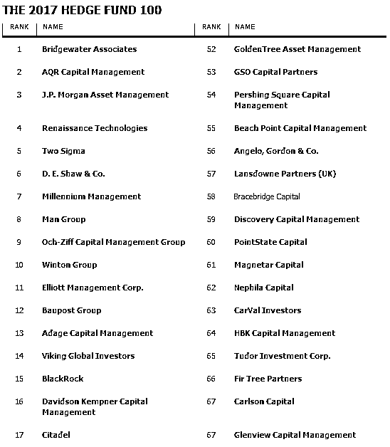
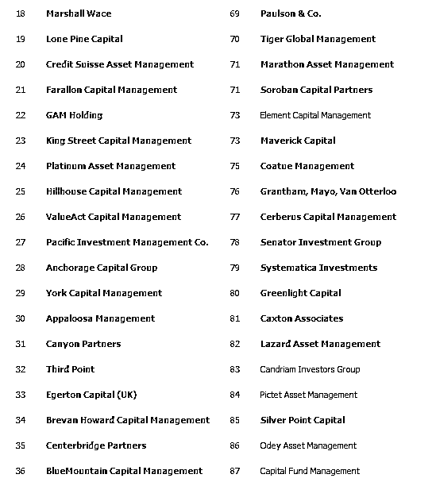
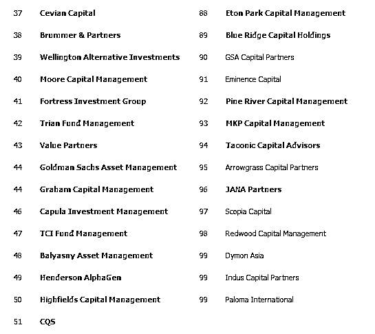
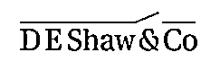
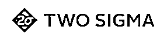
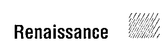
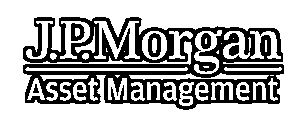
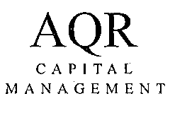
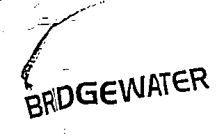

# 桥水不倒，量化王道！全球顶级对冲基金 TOP100

> 原文：[`mp.weixin.qq.com/s?__biz=MzAxNTc0Mjg0Mg==&mid=2653285958&idx=1&sn=e780f2342647904abcbab52d136d0d68&chksm=802e2c53b759a545833fb4f23186cef94cbb122ae65dd2b12b9ee2440e1b0af85f811ac1d245&scene=27#wechat_redirect`](http://mp.weixin.qq.com/s?__biz=MzAxNTc0Mjg0Mg==&mid=2653285958&idx=1&sn=e780f2342647904abcbab52d136d0d68&chksm=802e2c53b759a545833fb4f23186cef94cbb122ae65dd2b12b9ee2440e1b0af85f811ac1d245&scene=27#wechat_redirect)

**编辑部**

微信公众号

**关键字**全网搜索最新排名

**『量化投资』：排名第一**

**『量       化』：排名第一**

**『机器学习』：排名第四**

我们会再接再厉

成为全网**优质的**金融、技术类公众号

**这有一份来自美国权威机构的最新全球顶级对冲基金 TOP100 榜****单**

**2016 年对于对冲基金行业来说，注定是煎熬的一年**

去年，对冲基金的平均年收益为 5.4%，而同期的标普 500 却上涨了 11.9%。马马虎虎的表现以及高额的管理费使得投资人纷纷从对冲基金撤资，直接导致全球对冲基金总管理资产（AUM）大幅下滑，创下了 2009 年以来的最大跌幅。尽管从数字上来看，全球排名前 100 的对冲基金公司管理的总资产有所下降，但令人意外的是，数家使用量化策略的对冲基金公司却实现了资产两位数的增长。

来自美国权威机构 **Institutional Investor's Alpha** 最新出炉的 2017 年全球前百对冲基金榜单 （Hedge Fund 100）指出，尽管榜单上这些公司的管理总额与前一年相比有所下降，但几家专注于量化的对冲基金公司在却在排名中上升了好几位。

**突然惊呆～**

**Top100 名单如下（部分基金公司排名并列）**

来源：International Investor Alpha

报告称，在排名前 6 的对冲基金公司中，有 5 家在很大程度上依靠计算机与交易算法来制定投资决策，而结果显而易见，在去年整体低迷的行业形势中，这些依靠量化的公司的管理资产都有所增加。

让我们来看看排名前 6 的对冲基金公司：

**6 |****德劭集团（DE Shaw & Co）**** 347 亿美元 AUM**

德劭集团成立于 1988 年，创始人 David Shaw 是哥伦比亚计算机系的教师，还曾担任过政府的科技顾问。德劭集团可以算得上是量化基金中的代表，该基金非常重视量化交易，其高频交易常常被媒体报道。

**5 | ****Two Sigma ****389****亿美元 AUM**

Two Sigma 排名第 5，虽为对冲基金行业里的后起之秀，但在量化策略的加持之下，其表现却一点也不逊色于老牌基金。某种意义上来说，Two Sigma 也可以说得上是一个顶尖的科技公司，作为大数据技术的鼻祖，其在数据收集、使用和建模流程方面均处于世界领先水平。强大的技术支持使得 Two Sigma 在运行最复杂的投资策略时毫无障碍。公司目前管理资产为 389 亿美元，较上年同期增长近 28%。

**4 | ****文艺复兴科技 （RenaissanceTechnologies）**** 420 亿美元 AUM**

曾排在第 12 位的文艺复兴科技公司，在今年跃至第 4 位。文艺复兴科技成立于 1982 年，其创始人就是大名鼎鼎的传奇数学家西蒙斯（Simons）。公司目前管理着 420 亿美元的对冲基金资产,资产的快速增长让西蒙斯成为了“Alpha 年度收入最高的对冲基金经理排行榜“的第一名。文艺复兴是最早使用量化交易策略的公司，毫无疑问，也是最成功的公司。

**3 | ****摩根大通资产管理 (J.P.Morgan Asset Management) 450 亿美元 AUM**

作为世界上最大的资产管理公司之一，摩根大通资产管理公司近年来为个人，投资顾问以及机构提供了行业领先的资产管理服务，其对冲基金以 450 亿美元位列第 3。

**2 | ****AQR 资本管理公司 (AQRCapital Management) 697 亿美元 AUM**  

排名第 2 的 AQR 资本管理公司的资产同比猛增 48％，达到 697 亿美元，而该公司的首字母正是“应用量化研究“的缩写。AQR 资本管理公司成立于 1998 年，以多重策略为主，由前高盛投资经理 Clifford Asness、David Kabiller、John Liew、Robert Krail 等创立。

**1 |**** 桥水基金 (BridgewaterAssociates) 1600 亿美元 AUM**

排名榜首的是创始人达里奥（Ray Dalio）的桥水基金（Bridgewater Associates）。达里奥曾在 2012 年被业内评为对冲基金史上最成功的基金经理，公司旗下纯阿尔法基金 (PureAlpha Fund) 更是在 1975 至 2011 年期间为投资者净赚了 358 亿美元。2017 年初，桥水的基金总额为 1223 亿美元，比前一年增长了 17%。最新数据显示，该公司总共管理着大约 1600 亿美元的资金。

**无论相信与否**

**量化怪才们正在逐渐掌握对冲基金市场的主导权**

*没时间解释了，快上车吧！*

**关注者**

**从****1 到 10000+**

**我们每天都在进步**

