# 从 Encoder 到 Decoder 实现 Seq2Seq 模型（算法+代码）

> 原文：[`mp.weixin.qq.com/s?__biz=MzAxNTc0Mjg0Mg==&mid=2653285955&idx=1&sn=69b015ad4942db5dc1bc65773720d3b9&chksm=802e2c56b759a5409e8e1824288c74287416b9807f0acead469e8e98e68d0d55680cca0356a2&scene=27#wechat_redirect`](http://mp.weixin.qq.com/s?__biz=MzAxNTc0Mjg0Mg==&mid=2653285955&idx=1&sn=69b015ad4942db5dc1bc65773720d3b9&chksm=802e2c56b759a5409e8e1824288c74287416b9807f0acead469e8e98e68d0d55680cca0356a2&scene=27#wechat_redirect)


**编辑部**

微信公众号

**关键字**全网搜索最新排名

**『量化投资』：排名第一**

**『量       化』：排名第一**

**『机器学习』：排名第四**

我们会再接再厉

成为全网**优质的**金融、技术类公众号

知乎专栏：机器不学习

作者：天雨栗 | 蚂蚁金服 | 数据算法

已授权刊登

## **前言**

好久没有更新专栏，今天我们来看一个简单的 Seq2Seq 实现，我们将使用 TensorFlow 来实现一个基础版本的 Seq2Seq，主要帮助理解 Seq2Seq 中的基础架构。

**最基础的 Seq2Seq 模型**包含了三个部分，即 Encoder、Decoder 以及连接两者的中间状态向量，Encoder 通过学习输入，将其编码成一个固定大小的状态向量 S，继而将 S 传给 Decoder，Decoder 再通过对状态向量 S 的学习来进行输出。


图中每一个 box 代表了一个 RNN 单元，通常是 LSTM 或者 GRU。其实基础的 Seq2Seq 是有很多弊端的，首先 Encoder 将输入编码为固定大小状态向量的过程实际上是一个信息“信息有损压缩”的过程，如果信息量越大，那么这个转化向量的过程对信息的损失就越大，同时，随着 sequence length 的增加，意味着时间维度上的序列很长，RNN 模型也会出现梯度弥散。最后，基础的模型连接 Encoder 和 Decoder 模块的组件仅仅是一个固定大小的状态向量，这使得 Decoder 无法直接去关注到输入信息的更多细节。由于基础 Seq2Seq 的种种缺陷，随后引入了 Attention 的概念以及 Bi-directional encoder layer 等，由于本篇文章主要是构建一个基础的 Seq2Seq 模型，对其他改进 tricks 先不做介绍。 

总结起来说，基础的 Seq2Seq 主要包括**Encoder，Decoder，以及连接两者的固定大小的 State Vector。**

## **实战代码**

下面我们就将利用 TensorFlow 来构建一个基础的 Seq2Seq 模型，通过向我们的模型输入一个单词（字母序列），例如 hello，模型将按照字母顺序排序输出，即输出 ehllo。

**版本信息：Python 3 / TensorFlow 1.1**

**1\. 数据集**

数据集包括 source 与 target：

- source_data: 每一行是一个单词

- target_data: 每一行是经过字母排序后的“单词”，它的每一行与 source_data 中每一行一一对应

> 例如，source_data 的第一行是 hello，第二行是 what，那么 target_data 中对应的第一行是 ehllo，第二行是 ahtw。

**2\. 数据预览**

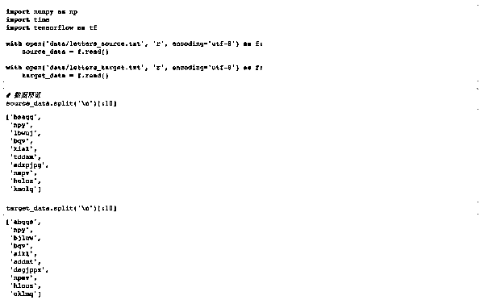

我们先把 source 和 target 数据加载进来，可以看一下前 10 行，target 的每一行是对 source 源数据中的单词进行了排序。下面我们就将基于这些数据来训练一个 Seq2Seq 模型，来帮助大家理解基础架构。

**3\. 数据预处理**

在神经网络中，对于文本的数据预处理无非是将文本转化为模型可理解的数字，这里都比较熟悉，不作过多解释。但在这里我们需要加入以下四种字符，<PAD>主要用来进行字符补全，<EOS>和<GO>都是用在 Decoder 端的序列中，告诉解码器句子的起始与结束，<UNK>则用来替代一些未出现过的词或者低频词。

*   < PAD>: 补全字符。

*   < EOS>: 解码器端的句子结束标识符。

*   < UNK>: 低频词或者一些未遇到过的词等。

*   < GO>: 解码器端的句子起始标识符。

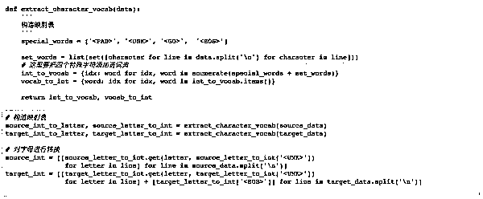

通过上面步骤，我们可以得到转换为数字后的源数据与目标数据。

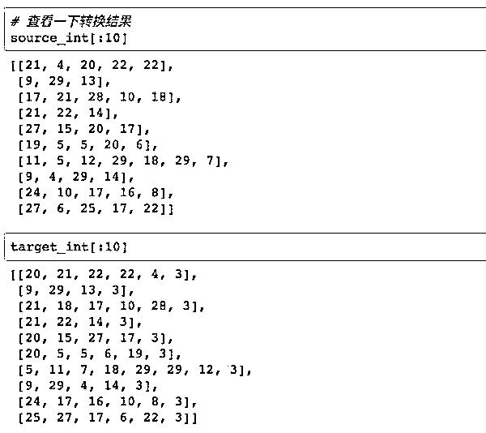

**4\. 模型构建**

**Encoder**

模型构建主要包括 Encoder 层与 Decoder 层。在 Encoder 层，我们首先需要对定义输入的 tensor，同时要对字母进行 Embedding，再输入到 RNN 层。

在这里，我们使用 TensorFlow 中的 tf.contrib.layers.embed_sequence 来对输入进行 embedding。

我们来看一个栗子，假如我们有一个 batch=2，sequence_length=5 的样本，features = [[1,2,3,4,5],[6,7,8,9,10]]，使用

```py
tf.contrib.layers.embed_sequence(features,vocab_size=n_words, embed_dim=10)
```

那么我们会得到一个 2 x 5 x 10 的输出，其中 features 中的每个数字都被 embed 成了一个 10 维向量。

> 官方关于 tf.contrib.layers.embed_sequence()的解释如下：
> 
> Maps a sequence of symbols to a sequence of embeddings.
> 
> Typical use case would be reusing embeddings between an encoder and decoder.

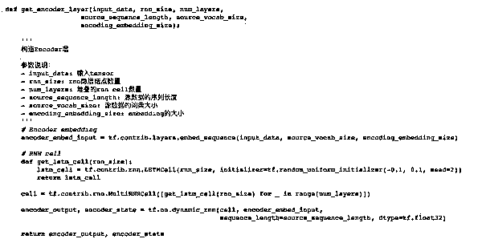

**Decoder**

在 Decoder 端，我们主要要完成以下几件事情：

*   对 target 数据进行处理

*   构造 Decoder

*   Embedding

*   构造 Decoder 层

*   构造输出层，输出层会告诉我们每个时间序列的 RNN 输出结果

*   Training Decoder

*   Predicting Decoder

下面我们会对这每个部分进行一一介绍。

**1\. target 数据处理**

我们的 target 数据有两个作用：

*   在训练过程中，我们需要将我们的 target 序列作为输入传给 Decoder 端 RNN 的每个阶段，而不是使用前一阶段预测输出，这样会使得模型更加准确。（这就是为什么我们会构建 Training 和 Predicting 两个 Decoder 的原因，下面还会有对这部分的解释）。 

*   需要用 target 数据来计算模型的 loss。 

我们首先需要对 target 端的数据进行一步预处理。在我们将 target 中的序列作为输入给 Decoder 端的 RNN 时，序列中的最后一个字母（或单词）其实是没有用的。我们来用下图解释：


我们此时只看右边的 Decoder 端，可以看到我们的 target 序列是[<go>, W, X, Y, Z, <eos>]，其中<go>，W，X，Y，Z 是每个时间序列上输入给 RNN 的内容，我们发现，<eos>并没有作为输入传递给 RNN。因此我们需要将 target 中的最后一个字符去掉，同时还需要在前面添加<go>标识，告诉模型这代表一个句子的开始。

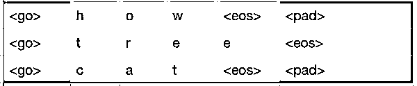

如上图，所示，红色和橙色为我们最终的保留区域，灰色是序列中的最后一个字符，我们把它删掉即可。 

我们使用 tf.strided_slice()来进行这一步处理。

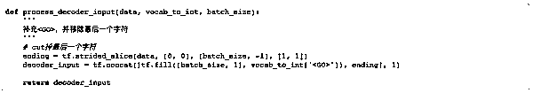

> 其中 tf.fill(dims, value)参数会生成一个 dims 形状并用 value 填充的 tensor。举个栗子：tf.fill([2,2], 7) => [[7,7], [7,7]]。tf.concat()会按照某个维度将两个 tensor 拼接起来。

**2\. 构造 Decoder**

*   对 target 数据进行 embedding。

*   构造 Decoder 端的 RNN 单元。

*   构造输出层，从而得到每个时间序列上的预测结果。

*   构造 training decoder。

*   构造 predicting decoder。

注意，我们这里将 decoder 分为了 training 和 predicting，这两个 encoder 实际上是共享参数的，也就是通过 training decoder 学得的参数，predicting 会拿来进行预测。那么为什么我们要分两个呢，这里主要考虑模型的 robust。

在 training 阶段，为了能够让模型更加准确，我们并不会把 t-1 的预测输出作为 t 阶段的输入，而是直接使用 target data 中序列的元素输入到 Encoder 中。而在 predict 阶段，我们没有 target data，有的只是 t-1 阶段的输出和隐层状态。

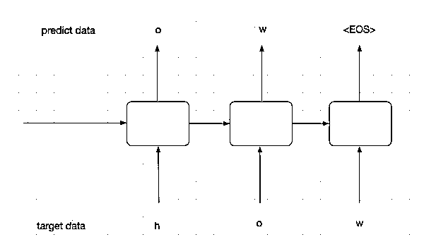

上面的图中代表的是 training 过程。在 training 过程中，我们并不会把每个阶段的预测输出作为下一阶段的输入，下一阶段的输入我们会直接使用 target data，这样能够保证模型更加准确。

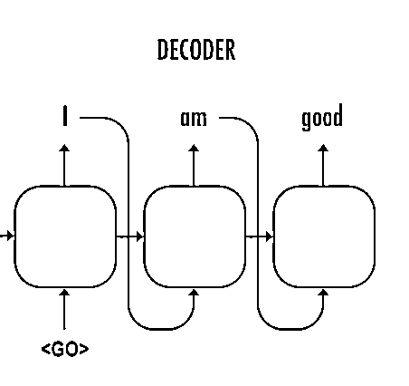

这个图代表我们的 predict 阶段，在这个阶段，我们没有 target data，这个时候前一阶段的预测结果就会作为下一阶段的输入。

当然，predicting 虽然与 training 是分开的，但他们是会共享参数的，training 训练好的参数会供 predicting 使用。

decoder 层的代码如下：

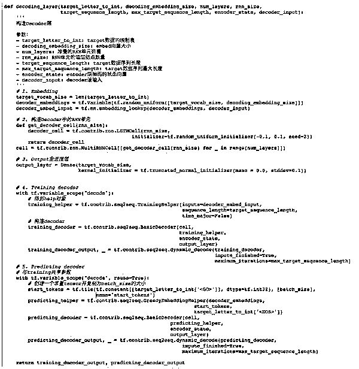

构建好了 Encoder 层与 Decoder 以后，我们需要将它们连接起来 build 我们的 Seq2Seq 模型。

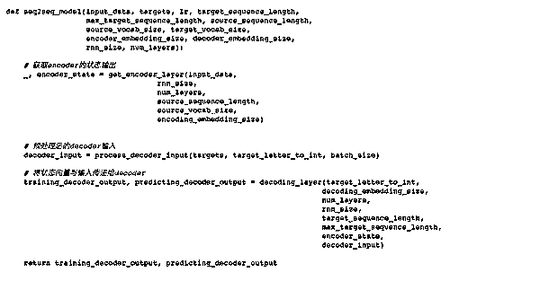

定义超参数

```py
# 超参数
# Number of Epochs
epochs = 60
# Batch Size
batch_size = 128
# RNN Size
rnn_size = 50
# Number of Layers
num_layers = 2
# Embedding Size
encoding_embedding_size = 15
decoding_embedding_size = 15
# Learning Rate
learning_rate = 0.001
```

定义 loss function、optimizer 以及 gradient clipping

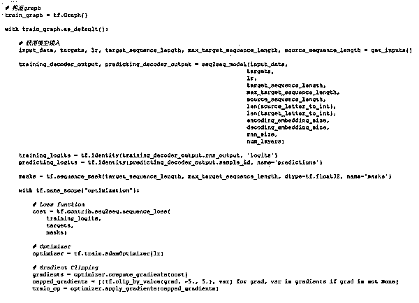

目前为止我们已经完成了整个模型的构建，但还没有构造 batch 函数，batch 函数用来每次获取一个 batch 的训练样本对模型进行训练。

在这里，我们还需要定义另一个函数对 batch 中的序列进行补全操作。这是啥意思呢？我们来看个例子，假如我们定义了 batch=2，里面的序列分别是

```py
[['h', 'e', 'l', 'l', 'o'],
 ['w', 'h', 'a', 't']]
```

那么这两个序列的长度一个是 5，一个是 4，变长的序列对于 RNN 来说是没办法训练的，所以我们这个时候要对短序列进行补全，补全以后，两个序列会变成下面的样子：

```py
[['h', 'e', 'l', 'l', 'o'],
 ['w', 'h', 'a', 't', '<PAD>']]
```

这样就保证了我们每个 batch 中的序列长度是固定的。

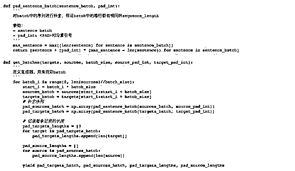

至此，我们完成了整个模型的构建与数据的处理。接下来我们对模型进行训练，我定义了 batch_size=128，epochs=60。训练 loss 如下：

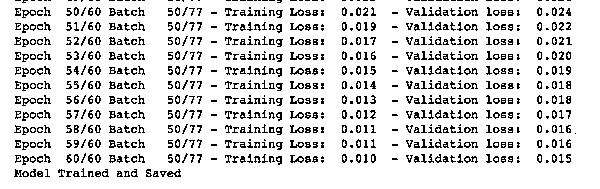

**模型预测**  

我们通过实际的例子来进行验证。

**输入“hello”：**

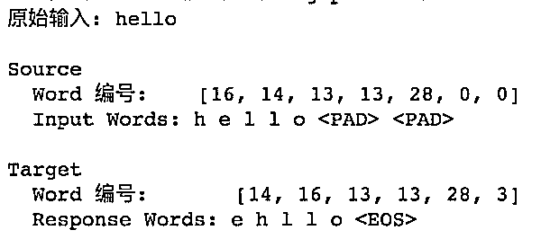

**输入“machine”：**

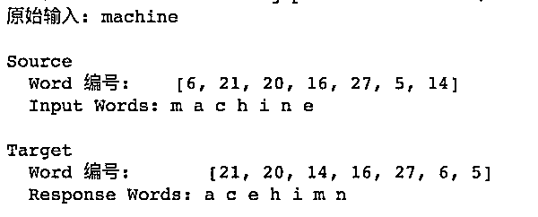

**输入“common”：**

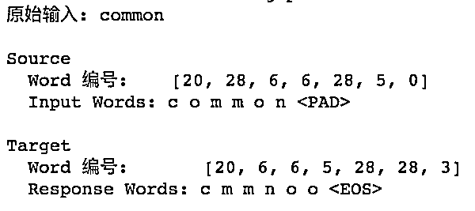

## **总结**

至此，我们实现了一个基本的序列到序列模型，Encoder 通过对输入序列的学习，将学习到的信息转化为一个状态向量传递给 Decoder，Decoder 再基于这个输入得到输出。除此之外，我们还知道要对 batch 中的单词进行补全保证一个 batch 内的样本具有相同的序列长度。

我们可以看到最终模型的训练 loss 相对已经比较低了，并且从例子看，其对短序列的输出还是比较准确的，但一旦我们的输入序列过长，比如 15 甚至 20 个字母的单词，其 Decoder 端的输出就非常的差。

**关注者**

**从****1 到 10000+**

**我们每天都在进步**

