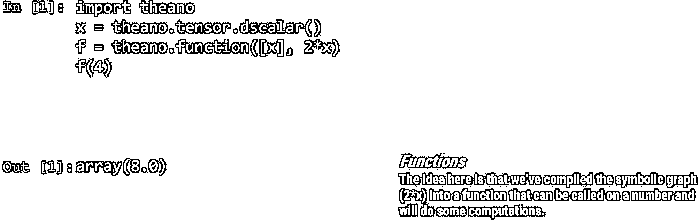
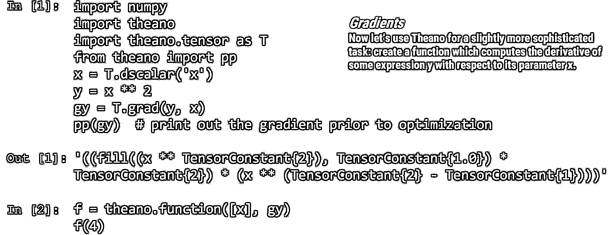

# 深度学习应用于交易

> 原文：[`mp.weixin.qq.com/s?__biz=MzAxNTc0Mjg0Mg==&mid=2653285952&idx=1&sn=ee739d592460f3e8a09a7cd03cc93c09&chksm=802e2c55b759a543bc5755302c6d70ee4993f5946346a083cb9a30686a52085ec82929b27b23&scene=27#wechat_redirect`](http://mp.weixin.qq.com/s?__biz=MzAxNTc0Mjg0Mg==&mid=2653285952&idx=1&sn=ee739d592460f3e8a09a7cd03cc93c09&chksm=802e2c55b759a543bc5755302c6d70ee4993f5946346a083cb9a30686a52085ec82929b27b23&scene=27#wechat_redirect)

**编辑部**

微信公众号

**关键字**全网搜索最新排名

**『量化投资』：排名第一**

**『量       化』：排名第一**

**『机器学习』：排名第四**

我们会再接再厉

成为全网**优质的**金融、技术类公众号

**● 我们想预测未来股票走势**

**● 监督学习**

训练数据中的每个示例是由输入向量（特征）和期望输出值（标签）组成。

监督学习算法分析训练数据和近似函数，可用于映射新的未标记的例子。

****● **财务预测案例**

******● ****线性回归**

******● ****回归**

******● 感知******

****

********● 神经网络********

****

********● 梯度模型********

********

******● 深度学习共同体结构******

****感知器它是一种线性分类器，一种分类算法，其基于将一组权重与特征向量组合的线性预测函数进行预测。 该算法允许在线学习，因为它一次处理训练集中的元素。****

********

******● 深度神经网络******

************

****************● **自编码器**************

****************

**********● 无监督训练**********

****************

**********● 深度学习硬件**********

********************

**************● 深度学习框架**************

************

************● ****深度使用 Python****************

********

************● Theano************

**********● Theano 教程**********

******************● 梯度模型******************

************************● Keras 教程************************

**关注者**

**从****1 到 10000+**

**我们每天都在进步**

