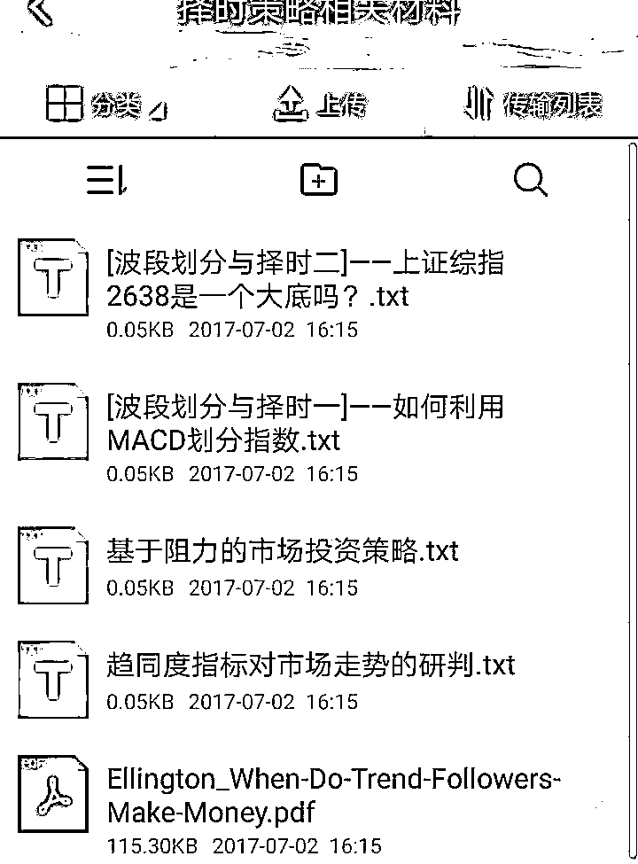

# 股票量化策略基础班开始啦！『编辑部推荐』

> 原文：[`mp.weixin.qq.com/s?__biz=MzAxNTc0Mjg0Mg==&mid=2653285891&idx=1&sn=96076fce6945393d27d0d2e5a3cf3a7d&chksm=802e2c16b759a500a1dcc8a09b141e346cbbf6512fccfeac2fdd5fbddaa50a348ce5301070c9&scene=27#wechat_redirect`](http://mp.weixin.qq.com/s?__biz=MzAxNTc0Mjg0Mg==&mid=2653285891&idx=1&sn=96076fce6945393d27d0d2e5a3cf3a7d&chksm=802e2c16b759a500a1dcc8a09b141e346cbbf6512fccfeac2fdd5fbddaa50a348ce5301070c9&scene=27#wechat_redirect)

**编辑部**

微信公众号

**关键字**全网搜索最新排名

**『量化投资』：排名第一**

**『量       化』：排名第一**

**『机器学习』：排名第四**

我们会再接再厉

成为全网**优质的**金融、技术类公众号

目前，随着国内**量化投资**产业的发展，**股票量化投资**以其资金容量大，客户群体庞大，市场有效性弱，政策市等特点，一直是量化投资领域的重点与难点。 股票量化分为量化选股和交易择时， 前者解决买什么股票，后者解决何时进出的问题， 本课程介绍利用 python 丰富的量化分析库，在浩瀚的金融数据中利用量化分析的方法寻找 ALPHA。以此课程作为股票量化的入门，**助你提高股票量化投资的水平**。**培训简介：**

Python 股票量化策略课程，介绍并实现包括**多因子**、**事件驱动**、**择时**等主流股票量化交易系统。课程不仅仅局限在实现某个策略，而是希望带领大家跳出思维框架，理解股票量化的逻辑，以及如何运用策略自身的优点与缺点进行股票投资。

**基于优矿平台哦！！！**

**后期课程还会提供股票量化实盘的对接哦！**

**培训费用：**

1200 元/人， 公司客户可以开发票。

**培训形式：**

本课程采取网络直播加官网重播的方式为学员提供服务，直播可以跟讲师互动， 假如您错过了直播，可以在优量在线(www.uquant.org)网站进行课程录像翻看。

**培训日期：**

**8 月 20 号开始**，逢周日晚上 8 点到 10 点。一共五个晚上，十个小时。具体日期为：8/20，8/27,9/3,9/10,9/17。

**课前预习：**

发送预习资料，帮助学员掌握课程内容。预习资料一共 50 个课时以上，多为视频资料。 

**课后答疑：**

创建课后答疑群， 在后续股票量化交易当中遇到各种问题可以向老师提问。

**讲师资料**

**卢威老师**

优矿的红人哈

**CFA，优矿网量化分析师**，多年股票量化策略经验。对市场主流股票量化策略多因子、事件驱动、择时等有着深入的研究，优矿事件驱动分析框架开发者，并且在优矿社区分享了多篇高质量的研究帖。熟悉股票市场中的各种数据，精通 python 在金融数据处理中的应用。

**课程表安排**

注：课程采取优矿为基础分析框架，可实现微信提醒交易,不提供程序化解决方案。

咨询/报名方式：

**扫下方二维码，添加编辑部工作人员微信**

我们会在第一时间解答您的问题

希望您能在参加课程后有所收获

