# 【高能】用 PyMC3 进行贝叶斯统计分析（代码+实例）

> 原文：[`mp.weixin.qq.com/s?__biz=MzAxNTc0Mjg0Mg==&mid=2653285887&idx=1&sn=25dbdb64fd3006766ccd2379d4de5d7b&chksm=802e2feab759a6fca621c18e10f1aaf5acbdf7d11f42fb0a7106347a7d81eefc0d239c017cc3&scene=27#wechat_redirect`](http://mp.weixin.qq.com/s?__biz=MzAxNTc0Mjg0Mg==&mid=2653285887&idx=1&sn=25dbdb64fd3006766ccd2379d4de5d7b&chksm=802e2feab759a6fca621c18e10f1aaf5acbdf7d11f42fb0a7106347a7d81eefc0d239c017cc3&scene=27#wechat_redirect)


**编辑部**

微信公众号

**关键字**全网搜索最新排名

**『量化投资』：排名第一**

**『量       化』：排名第一**

**『机器学习』：排名第四**

我们会再接再厉

成为全网**优质的**金融、技术类公众号

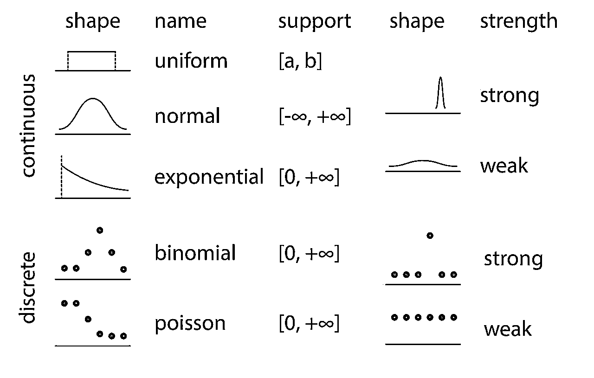


**问题类型 1：参数估计**

真实值是否等于 X？

给出数据，对于参数，可能的值的概率分布是多少？

# **例子 1：抛硬币问题**

硬币扔了<nobr>n 次，正面朝上是</nobr><nobr>h 次。</nobr>

## <nobr>**参数问题**</nobr>

<nobr>想知道 </nobr><nobr>p 的可能性。给定 </nobr><nobr>n 扔的次数和 </nobr><nobr>h 正面朝上次数，</nobr><nobr>p 的值很可能接近 </nobr><nobr>0.5，比如说在 </nobr><nobr>[0.48，0.52]？</nobr>

## <nobr>**说明**</nobr>

*   <nobr>参数的先验信念：</nobr><nobr>p∼Uniform(0,1)</nobr>

*   <nobr>似然函数：</nobr><nobr>data∼Bernoulli(p)</nobr>

<nobr>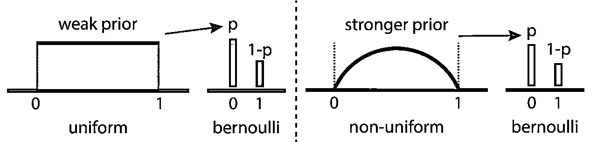</nobr>

```py
`import pymc3 as pm
import numpy.random as npr
import numpy as np
import matplotlib.pyplot as plt
import matplotlib as mpl
from collections import Counter
import seaborn as sns

sns.set_style('white')
sns.set_context('poster')

%load_ext autoreload
%autoreload 2 %matplotlib inline
%config InlineBackend.figure_format = 'retina' import warnings
warnings.filterwarnings('ignore')

from random import shuffle
total = 30 n_heads = 11 n_tails = total - n_heads
tosses = [1] * n_heads + [0] * n_tails
shuffle(tosses)`
```

<nobr>**数据**</nobr> 

```py
`def plot_coins():
    fig = plt.figure()
    ax = fig.add_subplot(1,1,1)
    ax.bar(list(Counter(tosses).keys()), list(Counter(tosses).values()))
    ax.set_xticks([0, 1])
    ax.set_xticklabels(['tails', 'heads'])
    ax.set_ylim(0, 20)
    ax.set_yticks(np.arange(0, 21, 5))    
    return fig

fig = plot_coins()
plt.show()`
```

<nobr>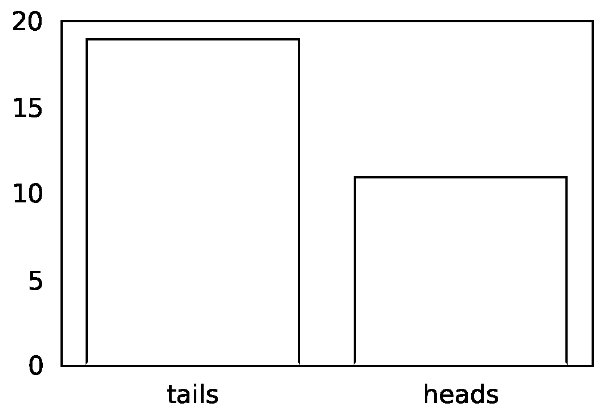</nobr>

```py
`# Context manager syntax. `coin_model` is **just** 
# a placeholder with pm.Model() as coin_model: 
    # Distributions are PyMC3 objects.
    # Specify prior using Uniform object.
    p_prior = pm.Uniform('p', 0, 1)  

    # Specify likelihood using Bernoulli object.
    like = pm.Bernoulli('likelihood', p=p_prior, observed=tosses)     # "observed=data" is key
    # for likelihood.`
```

<nobr>**MCMC Inference Button (TM)**</nobr> 

```py
`with coin_model:    
    # don't worry about this:
    step = pm.Metropolis()    

    # focus on this, the Inference Button:
    coin_trace = pm.sample(2000, step=step)`
```

<nobr>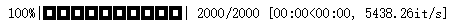</nobr>

## <nobr>**结果**</nobr>

```py
`pm.traceplot(coin_trace)
plt.show()`
```

<nobr>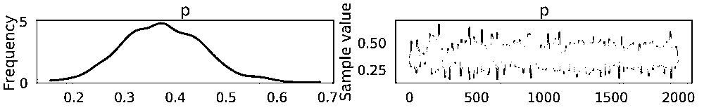</nobr>

```py
`pm.plot_posterior(coin_trace[100:], color='#87ceeb',       
rope=[0.48, 0.52], point_estimate='mean', ref_val=0.5)
plt.show()`
```

<nobr>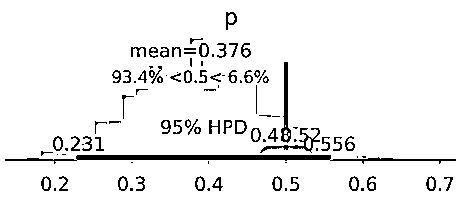</nobr>

*   <nobr>**95% 的 HPD**，**包括 ROPE**。</nobr>

*   <nobr>获取更多的数据！</nobr>

# <nobr>**模式**</nobr>

1.  <nobr>使用统计分布参数化问题</nobr>

2.  <nobr>证明我们的模型结构</nobr>

3.  <nobr>在 PyMC3 中编写模型，Inference ButtonTM</nobr>

4.  <nobr>基于后验分布进行解释</nobr>

5.  <nobr>(可选) 新增信息，修改模型结构</nobr>

# <nobr>**例子 2：化学活性问题**</nobr>

<nobr>我有一个新开发的分子 X； X 在阻止流感方面的效果有多好？</nobr>

## <nobr>**实验**</nobr>

*   <nobr>测试 X 的浓度范围，测量流感活动</nobr>

*   <nobr>计算 IC50：导致病毒复制率减半的 X 浓度。</nobr>

## <nobr>**数据**</nobr>

<nobr>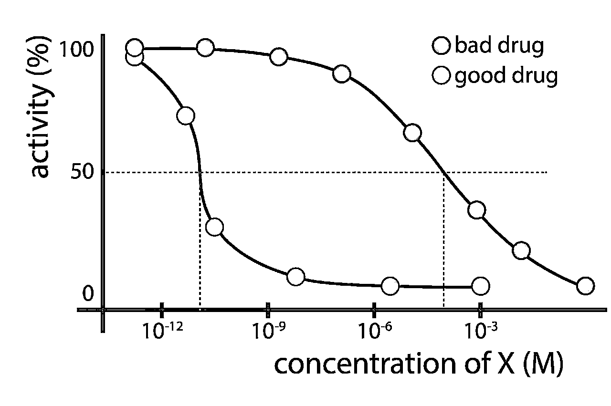</nobr>

```py
`import numpy as np
chem_data = [(0.00080, 99),
(0.00800, 91),
(0.08000, 89),
(0.40000, 89),
(0.80000, 79),
(1.60000, 61),
(4.00000, 39),
(8.00000, 25),
(80.00000, 4)]import pandas as pd

chem_df = pd.DataFrame(chem_data)
chem_df.columns = ['concentration', 'activity']
chem_df['concentration_log'] = chem_df['concentration'].apply(lambda x:np.log10(x))
# df.set_index('concentration', inplace=True)`
```

## <nobr>**参数问题**</nobr>

<nobr>给出数据，化学品的 IC50 值是多少, 以及其周围的不确定性？</nobr>

## <nobr>**说明**</nobr>

<nobr></nobr>

<nobr>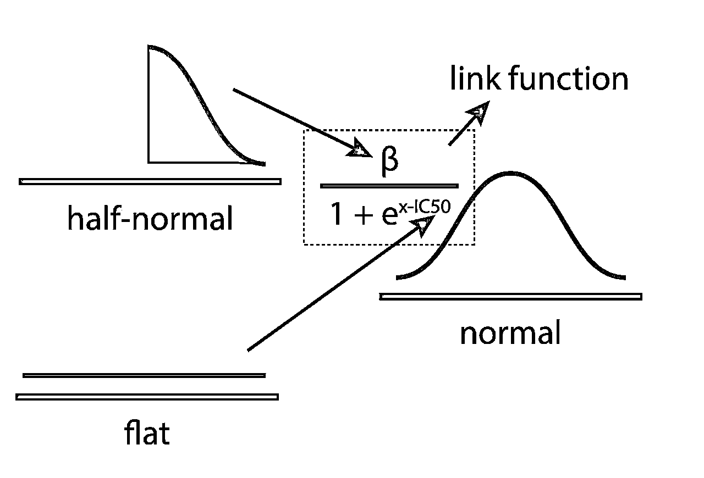</nobr>

## <nobr>**数据**</nobr>

```py
`def plot_chemical_data(log=True):
    fig = plt.figure(figsize=(10,6))
    ax = fig.add_subplot(1,1,1)   
    if log:
        ax.scatter(x=chem_df['concentration_log'], y=chem_df['activity'])
        ax.set_xlabel('log10(concentration (mM))', fontsize=20)    else:
        ax.scatter(x=chem_df['concentration'], y=chem_df['activity'])
        ax.set_xlabel('concentration (mM)', fontsize=20)
    ax.set_xticklabels([int(i) for i in ax.get_xticks()], fontsize=18)
    ax.set_yticklabels([int(i) for i in ax.get_yticks()], fontsize=18)

    plt.hlines(y=50, xmin=min(ax.get_xlim()), xmax=max(ax.get_xlim()), linestyles='--',)    return fig

fig = plot_chemical_data(log=True)
plt.show()`
```

<nobr>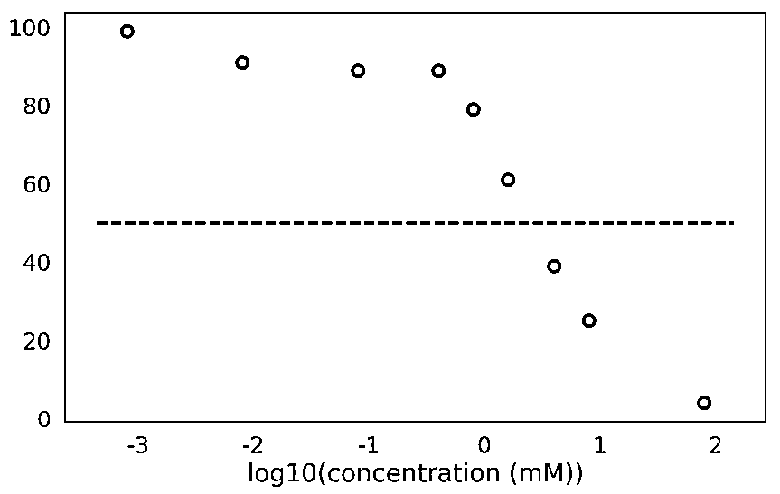</nobr>

```py
`with pm.Model() as ic50_model:
    beta = pm.HalfNormal('beta', sd=100**2)
    ic50_log10 = pm.Flat('IC50_log10')  # Flat prior
    # MATH WITH DISTRIBUTION OBJECTS!
    measurements = beta / (1 + np.exp(chem_df['concentration_log'].values - ic50_log10))

    y_like = pm.Normal('y_like', mu=measurements, observed=chem_df['activity'])    
 # Deterministic transformations.
    ic50 = pm.Deterministic('IC50', np.power(10, ic50_log10))`
```

## <nobr>**MCMC Inference Button (TM)**</nobr>

```py
`with ic50_model:
    step = pm.Metropolis()
    ic50_trace = pm.sample(10000, step=step)`
```

<nobr>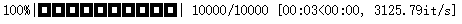</nobr>

```py
`pm.traceplot(ic50_trace[2000:], varnames=['IC50_log10', 'IC50'])  # live: sample from step 2000 onwards. plt.show()`
```

<nobr>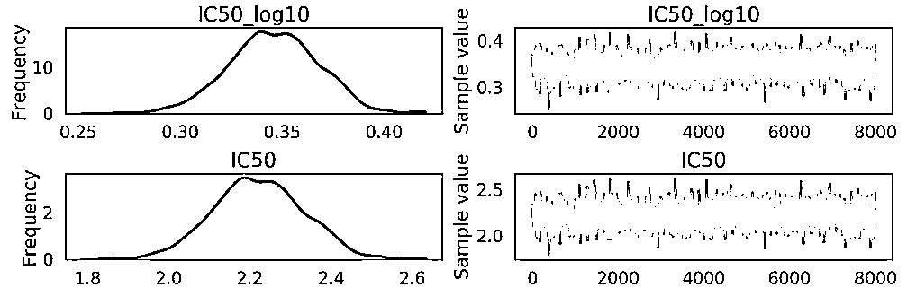</nobr>

## <nobr>**结果**</nobr>

```py
`pm.plot_posterior(ic50_trace[4000:], varnames=['IC50'], color='#87ceeb', point_estimate='mean')
plt.show()`
```

<nobr>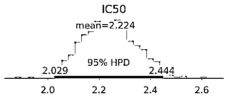</nobr>

<nobr>该化学物质的 IC50 在约 [2mM，2.4mM]（95％HPD）。 这是一种不好的化学物质。</nobr>

# <nobr>**问题类型 2：实验组之间的比较**</nobr>

<nobr>实验组和对照组的不同</nobr>

# <nobr>**例子 1：药物 IQ 问题**</nobr>

<nobr>药物治疗是否影响 IQ Scores</nobr>

```py
`drug = [  99.,  110.,  107.,  104., 省略]
placebo = [  95.,  105.,  103.,   99., 省略]
 def ECDF(data):
    x = np.sort(data)
    y = np.cumsum(x) / np.sum(x)    
    return x, y
 def plot_drug():
    fig = plt.figure()
    ax = fig.add_subplot(1,1,1)
    x_drug, y_drug = ECDF(drug)
    ax.plot(x_drug, y_drug, label='drug, n={0}'.format(len(drug)))
    x_placebo, y_placebo = ECDF(placebo)
    ax.plot(x_placebo, y_placebo, label='placebo, n={0}'.format(len(placebo)))
    ax.legend()
    ax.set_xlabel('IQ Score')
    ax.set_ylabel('Cumulative Frequency')
    ax.hlines(0.5, ax.get_xlim()[0], ax.get_xlim()[1], linestyle='--')    

    return fig`
```

```py
`from scipy.stats import ttest_ind

ttest_ind(drug, placebo)`
```

```py
Ttest_indResult(statistic=2.2806701634329549, pvalue=0.025011500508647616)
```

## <nobr>**实验**</nobr>

*   <nobr>随机将参与者分配给两个实验组：</nobr>

*   <nobr>+drug vs. -drug</nobr>

*   <nobr>测量每个参与者的 IQ Scores</nobr>

## <nobr>**说明**</nobr>

<nobr></nobr>

<nobr>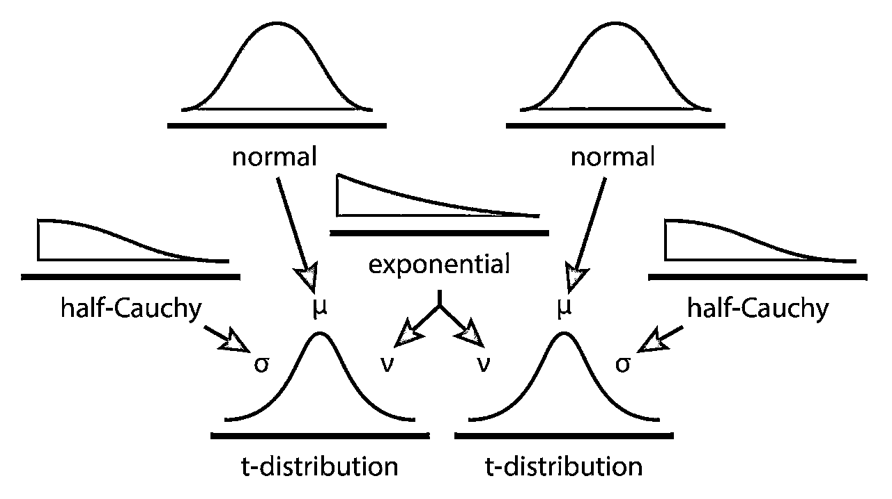</nobr>

```py
`fig = plot_drug()
plt.show()`
```

<nobr>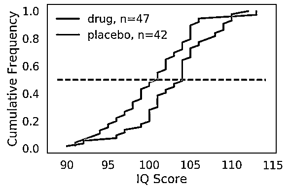</nobr>

```py
`y_vals = np.concatenate([drug, placebo])
labels = ['drug'] * len(drug) + ['placebo'] * len(placebo)

data = pd.DataFrame([y_vals, labels]).T
data.columns = ['IQ', 'treatment']

with pm.Model() as kruschke_model:    
    # Focus on the use of Distribution Objects.
    # Linking Distribution Objects together is done by 
    # passing objects into other objects' parameters.
    mu_drug = pm.Normal('mu_drug', mu=0, sd=100**2)
    mu_placebo = pm.Normal('mu_placebo', mu=0, sd=100**2)
    sigma_drug = pm.HalfCauchy('sigma_drug', beta=100)
    sigma_placebo = pm.HalfCauchy('sigma_placebo', beta=100)
    nu = pm.Exponential('nu', lam=1/29) + 1

    drug_like = pm.StudentT('drug', nu=nu, mu=mu_drug, sd=sigma_drug, observed=drug)
    placebo_like = pm.StudentT('placebo', nu=nu, mu=mu_placebo, sd=sigma_placebo, observed=placebo)
    diff_means = pm.Deterministic('diff_means', mu_drug - mu_placebo)
    pooled_sd = pm.Deterministic('pooled_sd', np.sqrt(np.power(sigma_drug, 2) + np.power(sigma_placebo, 2) / 2))
    effect_size = pm.Deterministic('effect_size', diff_means / pooled_sd)`
```

## <nobr>**MCMC Inference Button (TM)**</nobr>

```py
`with kruschke_model:
    kruschke_trace = pm.sample(10000, step=pm.Metropolis())`
```

<nobr></nobr>

## <nobr>**结果**</nobr>

```py
`pm.traceplot(kruschke_trace[2000:], varnames=['mu_drug', 'mu_placebo'])
plt.show()`
```

<nobr>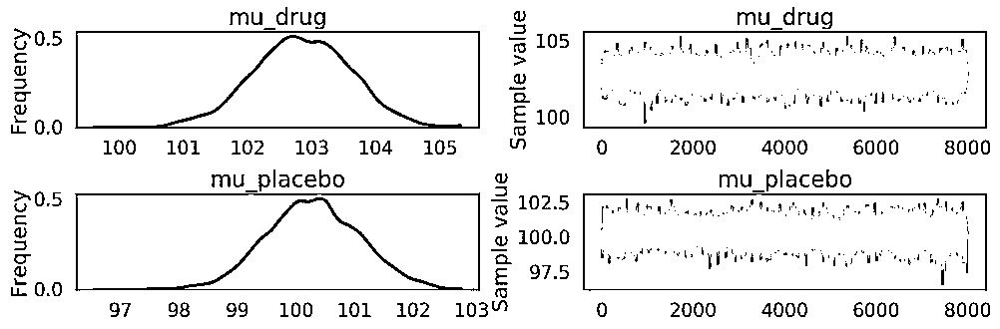</nobr>

```py
`pm.plot_posterior(kruschke_trace[2000:], color='#87ceeb',varnames=['mu_drug', 'mu_placebo', 'diff_means'])
plt.show()`
```

<nobr>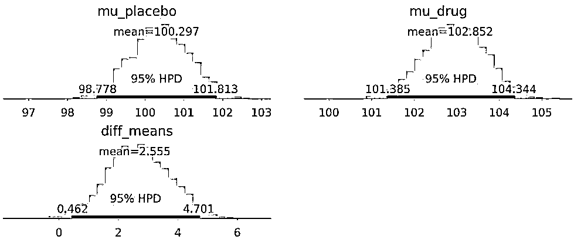</nobr>

*   <nobr>Difference in mean IQ：[0.5, 4.6]</nobr>

*   <nobr>概率 P 值：</nobr><nobr>0.02</nobr>

```py
`def get_forestplot_line(ax, kind):
    widths = {'median': 2.8, 'iqr': 2.0, 'hpd': 1.0}    
    assert kind in widths.keys(), f('line kind must be one of {widths.keys()}')
    lines = []    
    for child in ax.get_children():        
        if isinstance(child, mpl.lines.Line2D) and np.allclose(child.get_lw(), widths[kind]):
            lines.append(child)    
    return lines

def adjust_forestplot_for_slides(ax):    
    for line in get_forestplot_line(ax, kind='median'):
        line.set_markersize(10)    

    for line in get_forestplot_line(ax, kind='iqr'):
        line.set_linewidth(5)    

    for line in get_forestplot_line(ax, kind='hpd'):
        line.set_linewidth(3)    

    return ax

pm.forestplot(kruschke_trace[2000:], varnames=['mu_drug', 'mu_placebo'])
ax = plt.gca()
ax = adjust_forestplot_for_slides(ax)
plt.show()`
```

<nobr style="box-sizing: border-box; transition: none; border: 0px; max-width: none; max-height: none; min-width: 0px; min-height: 0px; vertical-align: 0px;">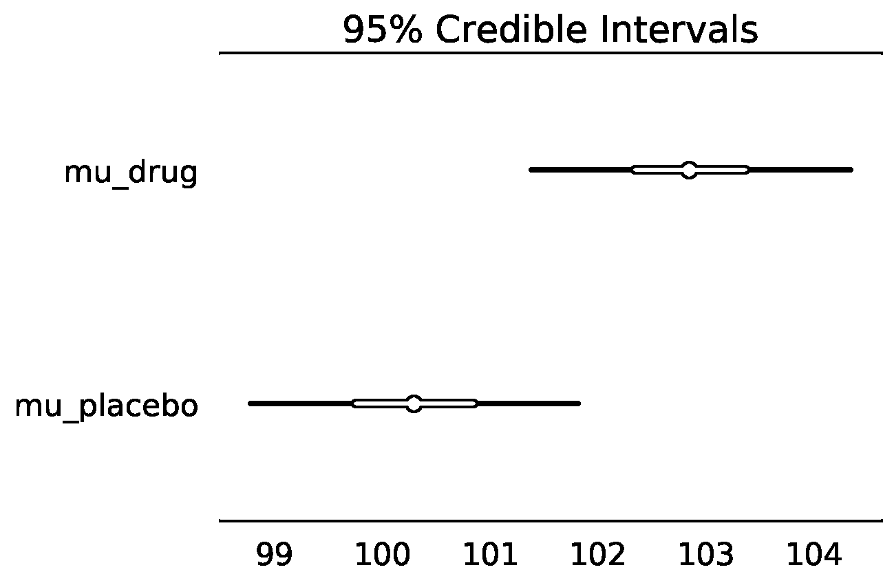</nobr>

<nobr style="box-sizing: border-box; transition: none; border: 0px; max-width: none; max-height: none; min-width: 0px; min-height: 0px; vertical-align: 0px;">**Forest plot**：相同轴上后验分布的 95％HPD（细线），IQR（较粗线）和中位数（点）。</nobr>

```py
`def overlay_effect_size(ax):
    height = ax.get_ylim()[1] * 0.5
    ax.hlines(height, 0, 0.2, 'red', lw=5)
    ax.hlines(height, 0.2, 0.8, 'blue', lw=5)
    ax.hlines(height, 0.8, ax.get_xlim()[1], 'green', lw=5)

ax = pm.plot_posterior(kruschke_trace[2000:], varnames=['effect_size'],color='#87ceeb')[0]
overlay_effect_size(ax)`
```

<nobr style="box-sizing: border-box; transition: none; border: 0px; max-width: none; max-height: none; min-width: 0px; min-height: 0px; vertical-align: 0px;">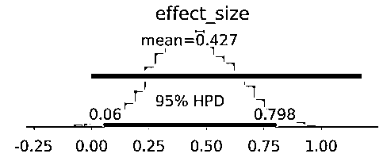</nobr>

*   <nobr style="box-sizing: border-box; transition: none; border: 0px; max-width: none; max-height: none; min-width: 0px; min-height: 0px; vertical-align: 0px;">Effect size (Cohen's d, none to small, medium, large) could be anywhere from essentially nothing to large (95% HPD [0.0, 0.77])。</nobr>

*   <nobr style="box-sizing: border-box; transition: none; border: 0px; max-width: none; max-height: none; min-width: 0px; min-height: 0px; vertical-align: 0px;">IQ 改善 0-4</nobr>

*   <nobr style="box-sizing: border-box; transition: none; border: 0px; max-width: none; max-height: none; min-width: 0px; min-height: 0px; vertical-align: 0px;">该药很可能无关紧要。</nobr>

*   <nobr style="box-sizing: border-box; transition: none; border: 0px; max-width: none; max-height: none; min-width: 0px; min-height: 0px; vertical-align: 0px;">没有生物学意义的证据。</nobr>

# <nobr style="box-sizing: border-box; transition: none; border: 0px; max-width: none; max-height: none; min-width: 0px; min-height: 0px; vertical-align: 0px;">**例子 2：手机消毒问题**</nobr>

<nobr style="box-sizing: border-box; transition: none; border: 0px; max-width: none; max-height: none; min-width: 0px; min-height: 0px; vertical-align: 0px;">两种常用的方法相比，我的“特别方法”能更好的消毒我的手机吗？</nobr>

## <nobr style="box-sizing: border-box; transition: none; border: 0px; max-width: none; max-height: none; min-width: 0px; min-height: 0px; vertical-align: 0px;">**the experiment design**</nobr>

*   <nobr style="box-sizing: border-box; transition: none; border: 0px; max-width: none; max-height: none; min-width: 0px; min-height: 0px; vertical-align: 0px;">随机将手机分配到六组之一：4“特别”方法+ 2“对照”方法。</nobr>

*   <nobr style="box-sizing: border-box; transition: none; border: 0px; max-width: none; max-height: none; min-width: 0px; min-height: 0px; vertical-align: 0px;">count 形成的细菌菌落数，比较前后的计数。</nobr>

```py
`renamed_treatments = dict()
renamed_treatments['FBM_2'] = 'FM1' renamed_treatments['bleachwipe'] = 'CTRL1' renamed_treatments['ethanol'] = 'CTRL2' renamed_treatments['kimwipe'] = 'FM2' renamed_treatments['phonesoap'] = 'FM3' renamed_treatments['quatricide'] = 'FM4' # Reload the data one more time. data = pd.read_csv('smartphone_sanitization_manuscript.csv', na_values=['#DIV/0!'])
del data['perc_reduction colonies']

# Exclude cellblaster data data = data[data['treatment'] != 'CB30']
data = data[data['treatment'] != 'cellblaster']

# Rename treatments data['treatment'] = data['treatment'].apply(lambda x: renamed_treatments[x])

# Sort the data according to the treatments. treatment_order = ['FM1', 'FM2', 'FM3', 'FM4', 'CTRL1', 'CTRL2']
data['treatment'] = data['treatment'].astype('category')
data['treatment'].cat.set_categories(treatment_order, inplace=True)
data = data.sort_values(['treatment']).reset_index(drop=True)

# Encode the treatment index. data['treatment_idx'] = data['treatment'].apply(lambda x: treatment_order.index(x))
data['perc_change_colonies'] = (data['colonies_post'] - data['colonies_pre']) / data['colonies_pre']

# # View the first 5 rows.
# data.head(5)

# # filter the data such that we have only PhoneSoap (PS-300) and Ethanol (ET)
# data_filtered = data[(data['treatment'] == 'PS-300') | (data['treatment'] == 'QA')]
# data_filtered = data_filtered[data_filtered['site'] == 'phone']
# data_filtered.sample(10)`
```

## <nobr style="box-sizing: border-box; transition: none; border: 0px; max-width: none; max-height: none; min-width: 0px; min-height: 0px; vertical-align: 0px;">**数据**</nobr>

```py
`def plot_colonies_data():
    fig = plt.figure(figsize=(10,5))
    ax1 = fig.add_subplot(2,1,1)
    sns.swarmplot(x='treatment', y='colonies_pre', data=data, ax=ax1)
    ax1.set_title('pre-treatment')
    ax1.set_xlabel('')
    ax1.set_ylabel('colonies')
    ax2 = fig.add_subplot(2,1,2)
    sns.swarmplot(x='treatment', y='colonies_post', data=data, ax=ax2)
    ax2.set_title('post-treatment')
    ax2.set_ylabel('colonies')
    ax2.set_ylim(ax1.get_ylim())
    plt.tight_layout()    
    return fig

fig = plot_colonies_data()
plt.show()`
```

<nobr style="box-sizing: border-box; transition: none; border: 0px; max-width: none; max-height: none; min-width: 0px; min-height: 0px; vertical-align: 0px;">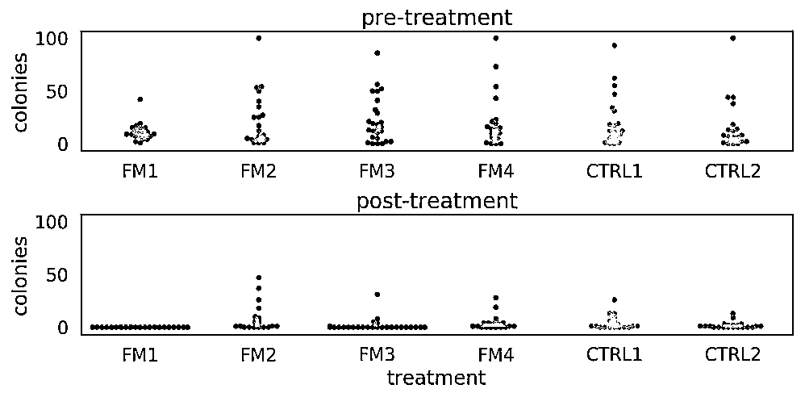</nobr>

## <nobr style="box-sizing: border-box; transition: none; border: 0px; max-width: none; max-height: none; min-width: 0px; min-height: 0px; vertical-align: 0px;">**说明**</nobr>

<nobr style="box-sizing: border-box; transition: none; border: 0px; max-width: none; max-height: none; min-width: 0px; min-height: 0px; vertical-align: 0px;">计数是泊松分布。</nobr>

<nobr style="box-sizing: border-box; transition: none; border: 0px; max-width: none; max-height: none; min-width: 0px; min-height: 0px; vertical-align: 0px;">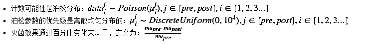</nobr>

<nobr style="box-sizing: border-box; transition: none; border: 0px; max-width: none; max-height: none; min-width: 0px; min-height: 0px; vertical-align: 0px;">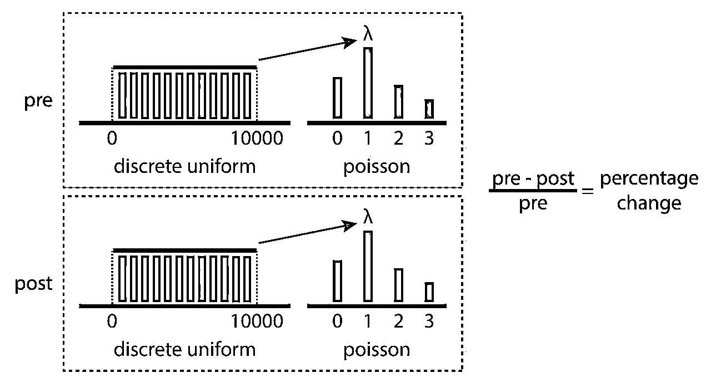</nobr> 

```py
`with pm.Model() as poisson_estimation:

    mu_pre = pm.DiscreteUniform('pre_mus', lower=0, upper=10000,shape=len(treatment_order))
    pre_mus = mu_pre[data['treatment_idx'].values]  # fancy indexing!!
    pre_counts = pm.Poisson('pre_counts', mu=pre_mus,observed=data['colonies_pre'])

    mu_post = pm.DiscreteUniform('post_mus', lower=0, upper=10000,shape=len(treatment_order))
    post_mus = mu_post[data['treatment_idx'].values]  # fancy indexing!!
    post_counts = pm.Poisson('post_counts', mu=post_mus, observed=data['colonies_post'])

    perc_change = pm.Deterministic('perc_change', 100 * (mu_pre - mu_post) / mu_pre)`
```

## <nobr style="box-sizing: border-box; transition: none; border: 0px; max-width: none; max-height: none; min-width: 0px; min-height: 0px; vertical-align: 0px;">**MCMC Inference Button (TM)**</nobr>

```py
`with poisson_estimation:
    poisson_trace = pm.sample(20000)`
```

<nobr style="box-sizing: border-box; transition: none; border: 0px; max-width: none; max-height: none; min-width: 0px; min-height: 0px; vertical-align: 0px;">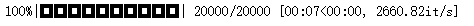</nobr>

```py
`pm.traceplot(poisson_trace, varnames=['pre_mus', 'post_mus'])
plt.show()`
```

<nobr style="box-sizing: border-box; transition: none; border: 0px; max-width: none; max-height: none; min-width: 0px; min-height: 0px; vertical-align: 0px;">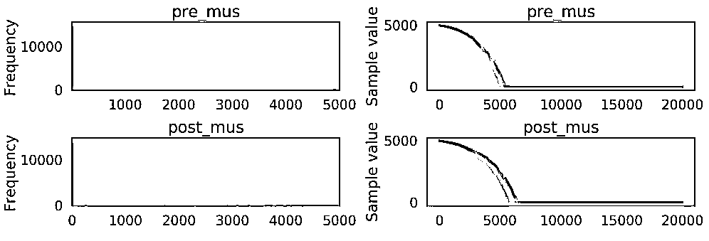</nobr>

## <nobr style="box-sizing: border-box; transition: none; border: 0px; max-width: none; max-height: none; min-width: 0px; min-height: 0px; vertical-align: 0px;">**结果**</nobr>

```py
`pm.forestplot(poisson_trace[10000:], varnames=['perc_change'], ylabels=treatment_order, xrange=[0, 110])
plt.xlabel('Percentage Reduction')

ax = plt.gca()
ax = adjust_forestplot_for_slides(ax)`
```

<nobr style="box-sizing: border-box; transition: none; border: 0px; max-width: none; max-height: none; min-width: 0px; min-height: 0px; vertical-align: 0px;">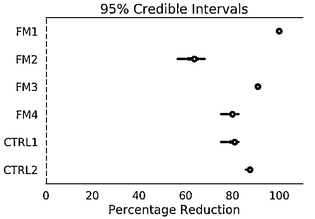</nobr>

<nobr style="box-sizing: border-box; transition: none; border: 0px; max-width: none; max-height: none; min-width: 0px; min-height: 0px; vertical-align: 0px;">**关注者**</nobr>

<nobr style="box-sizing: border-box; transition: none; border: 0px; max-width: none; max-height: none; min-width: 0px; min-height: 0px; vertical-align: 0px;">**从****1 到 10000+**</nobr>

<nobr style="box-sizing: border-box; transition: none; border: 0px; max-width: none; max-height: none; min-width: 0px; min-height: 0px; vertical-align: 0px;">**我们每天都在进步**</nobr>

<nobr style="box-sizing: border-box; transition: none; border: 0px; max-width: none; max-height: none; min-width: 0px; min-height: 0px; vertical-align: 0px;"></nobr>