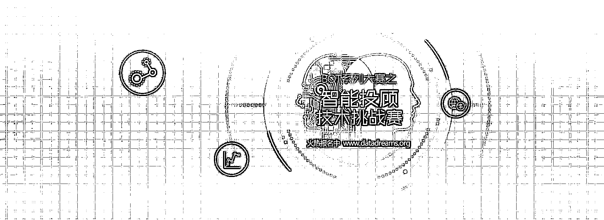
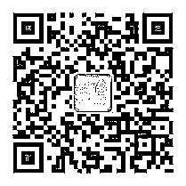

# 寻找 AI 技术硬实力，智能投顾技术挑战赛面向全球发出英雄帖！

> 原文：[`mp.weixin.qq.com/s?__biz=MzAxNTc0Mjg0Mg==&mid=2653285843&idx=1&sn=be6eb3da4d4223c617ecd8b6eb6169db&chksm=802e2fc6b759a6d0856f6f998188124fe6122224f30473cfa0022e642d53fcf609fbd4e953cc&scene=27#wechat_redirect`](http://mp.weixin.qq.com/s?__biz=MzAxNTc0Mjg0Mg==&mid=2653285843&idx=1&sn=be6eb3da4d4223c617ecd8b6eb6169db&chksm=802e2fc6b759a6d0856f6f998188124fe6122224f30473cfa0022e642d53fcf609fbd4e953cc&scene=27#wechat_redirect)

**你，敢来战吗？**

AlphaGo 一再获胜，人工智能攻克德州扑克，资本市场的人机共舞峥嵘初现，智能投顾更是成为新的风口，国内证券公司、互联网企业、第三方理财平台、商业银行纷纷抢滩市场。20 万现金大奖，丰富比赛资源，国内首推智能投顾技术创新赛制，**“2017 中国大数据人工智能创新创业大赛”·BOT 大赛系列赛之智能投顾技术挑战赛（www.datadreams.org）**面向全球火热招募中。比赛深度融合技术、人才与应用场景，试图解决金融领域痛点，致力于推动大数据与人工智能在金融领域的真正转化与实际应用！

**挑战性赛题创新设置**

大赛聚焦产业应用创新，机器视觉与自然语言理解(NLU)进一步结合，推出国内首创的智能投顾技术赛制及挑战性赛题。

**新闻的蝴蝶效应——市场消息股价（三日内）影响评估**

金融市场不只是资本的战场，也是舆论的战场。恐慌、贪婪、犹豫不决……这些人性的弱点是深度学习所没有的。投顾智能体透过机器视觉与阅读能力，察觉哪些消息面因素会影响股价变化；让人工智能协助我们客观地评估各种舆情因素对于股价的影响。参赛者需要根据新闻图文语意视觉特征来预测明天、后天、大后天三天的开盘股价涨跌幅。

**寻找 K 线之王——K 线图智能视觉特征理解**

在人类世界中解读 K 线图的流派极多，各家方法皆有巧妙不同，当机器阅读了包含各家的历史 K 线解读评论，是不是能够融会贯通，产生更有趣的见解？投顾智能体透过机器视觉，理解 K 线图上隐藏的丰富技术面特征，并转换为人类可以理解的语言，不靠原始数据、不靠人工规则，而是拿机器视觉的硬底子来实现。我们正在寻找这样的 K 线之王！

**开放海量数据资源** 标题

人工智能会首先落地在数据最大、最快产生价值的领域，而在金融行业数据完美性非常好，丰富且易标签化，所以人工智能最先颠覆的就是金融领域。为了给参赛选手提供更好的参赛体验和充足的训练需求，大赛主办方联合知名金融机构东方财富旗下金融数据服务商 Choice 数据为参赛选手**提供三年的专业股市行情数据、数据库、舆情信息等数据资源**，这给了不同背景的参赛者同台竞技的好机会。

**推动算法走向实际应用** 入标题

与其他同类型大数据人工智能赛事等相比，**本比赛优秀参赛者不仅可获取奖金、有机会获得千万技术孵化奖，优秀算法还有望在实际场景中得到应用**。大赛多方联动，提供真实金融产业应用场景，加速产业对接和落地，解决切实需求的同时，创造更大价值。

**专业分享助力夺冠** 

大赛主办方联合大数据人工智能在线知识服务平台知数学院提供线上分享，力邀来自金融机构、企业、高校等专家，提供比赛相关分享，为参赛者助力加油。 

**顶级专家团队** 

大赛专家团队可谓大咖云集，由领域知名专家、企业高管、高校教授等组成的全球顶级专家团队坐镇。智能投顾技术挑战赛更由复旦-中植大数据金融研究院加持，为参赛者保驾护航。

**全球 AI****高手过招**  

比赛面向全球开放，已吸引了来自金融领域、AI 领域的专家和技术人员，以及科研机构、创业公司、高校的众多参赛者报名。

**丰厚比赛奖励等你来**

**20 万现金****技术大奖、高额技术孵化创投基金**；知名专业媒体为大赛提供全程报道扩大影响力；更多比赛福利等你来揭秘！ 

BOT 大赛系列赛之智能投顾技术挑战赛面向全球火热报名中，如果你也想加入这场科技革命，即刻报名***www.datadreams.org***。

报名完成后，欢迎即刻关注大赛

**公众号**（***DataDreams***）

加入**官方 QQ 群**（*QQ 群**540818809***）

了解更多大赛动态和信息。

（扫描二维码，关注大赛官方微信公众号）

点击阅读原文即刻报名比赛，更多惊喜等你来

